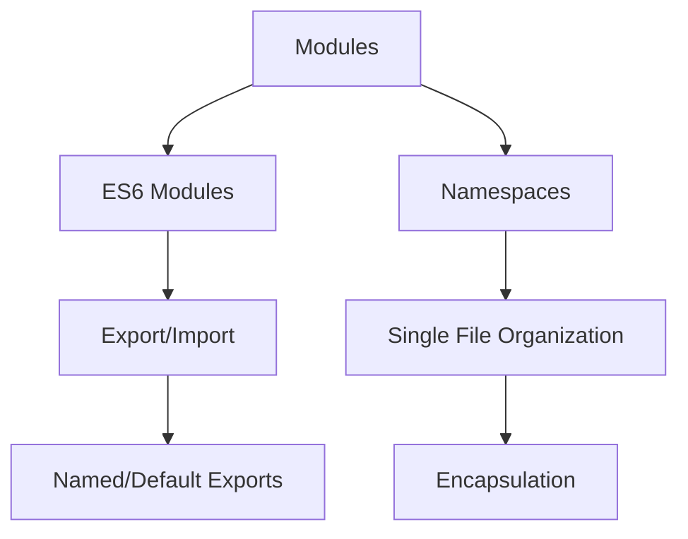

## 5.8.1 Implementing Module Pattern in TypeScript

In this section, we will delve into the Module Pattern in TypeScript, a powerful design pattern that helps in organizing and encapsulating code. The Module Pattern is crucial for maintaining clean and manageable codebases, especially in large-scale applications. We will explore how to implement this pattern using ES6 modules and TypeScript namespaces, providing you with the knowledge to effectively structure your TypeScript projects.

### Understanding ES6 Modules in TypeScript

ES6 modules are a standardized way to organize JavaScript code, and TypeScript builds on this by providing static typing and additional features. Modules in TypeScript allow you to break your code into separate files and import them when needed, promoting reusability and maintainability.

#### Key Features of ES6 Modules

- **Encapsulation**: Modules encapsulate code, exposing only what is necessary.
- **Reusability**: Modules can be reused across different parts of an application.
- **Maintainability**: Separating code into modules makes it easier to manage and update.

#### Creating a Module in TypeScript

Let's start by creating a simple module in TypeScript. We will create a module that exports a class, a function, and a variable.

```typescript
// mathUtils.ts
export class Calculator {
    add(a: number, b: number): number {
        return a + b;
    }

    subtract(a: number, b: number): number {
        return a - b;
    }
}

export function multiply(a: number, b: number): number {
    return a * b;
}

export const PI = 3.14159;
```

In the above example, we have a `Calculator` class, a `multiply` function, and a constant `PI`. Each of these is exported using the `export` keyword, making them available for import in other modules.

### Default Exports vs. Named Exports

TypeScript supports both default exports and named exports. Understanding the difference between these two is crucial for effective module management.

#### Named Exports

Named exports allow you to export multiple values from a module. You can import these values using their exact names.

```typescript
// geometry.ts
export function areaOfCircle(radius: number): number {
    return PI * radius * radius;
}

export function circumferenceOfCircle(radius: number): number {
    return 2 * PI * radius;
}
```

To import named exports:

```typescript
import { areaOfCircle, circumferenceOfCircle } from './geometry';
```

#### Default Exports

Default exports are used when a module exports a single value. This value can be imported with any name.

```typescript
// logger.ts
export default function log(message: string): void {
    console.log(message);
}
```

To import a default export:

```typescript
import log from './logger';
```

### Importing Modules

The `import` statement is used to bring modules into the current scope. You can import named exports, default exports, or both.

#### Importing Named Exports

```typescript
import { Calculator, multiply, PI } from './mathUtils';

const calculator = new Calculator();
console.log(calculator.add(2, 3)); // Output: 5
console.log(multiply(2, 3)); // Output: 6
console.log(PI); // Output: 3.14159
```

#### Importing Default Exports

```typescript
import log from './logger';

log('This is a log message.');
```

#### Importing All Exports

You can import all exports from a module using the `* as` syntax.

```typescript
import * as MathUtils from './mathUtils';

console.log(MathUtils.PI); // Output: 3.14159
```

### TypeScript Namespaces

Namespaces in TypeScript, formerly known as internal modules, are a way to organize code within a single file. They are useful for grouping related code together, especially when you want to avoid polluting the global scope.

#### Creating a Namespace

```typescript
namespace Geometry {
    export function areaOfRectangle(width: number, height: number): number {
        return width * height;
    }

    export function perimeterOfRectangle(width: number, height: number): number {
        return 2 * (width + height);
    }
}

console.log(Geometry.areaOfRectangle(5, 10)); // Output: 50
```

In this example, the `Geometry` namespace encapsulates functions related to geometric calculations.

### Modules vs. Namespaces

While both modules and namespaces help in organizing code, they serve different purposes and are used in different scenarios.

- **Modules**: Best used for separating code into different files. They are ideal for large applications where code needs to be reused across different parts of the application.
- **Namespaces**: Useful for organizing code within a single file. They are helpful when you want to group related code without creating separate files.

### When to Use Modules and Namespaces

- **Use Modules** when you need to share code across different files or projects. They are the standard way to manage code in modern TypeScript applications.
- **Use Namespaces** when you want to organize code within a single file, especially for small projects or libraries where file separation is not necessary.

### Try It Yourself

To solidify your understanding of the Module Pattern in TypeScript, try modifying the examples provided. For instance, add more functions to the `Geometry` namespace or create a new module that exports a utility class. Experiment with different ways of importing and using these modules in a TypeScript project.

### Visualizing Module Pattern

To better understand the Module Pattern, let's visualize the relationship between modules and namespaces using a diagram.



**Diagram Description**: This diagram illustrates the relationship between modules and namespaces in TypeScript. Modules can be ES6 modules, which use export/import statements, while namespaces are used for organizing code within a single file.

### Further Reading

For more information on TypeScript modules and namespaces, consider exploring the following resources:

- [MDN Web Docs on JavaScript Modules](https://developer.mozilla.org/en-US/docs/Web/JavaScript/Guide/Modules)
- [TypeScript Handbook on Modules](https://www.typescriptlang.org/docs/handbook/modules.html)
- [TypeScript Handbook on Namespaces](https://www.typescriptlang.org/docs/handbook/namespaces.html)

### Knowledge Check

Before moving on, take a moment to reflect on what you've learned. Can you explain the difference between modules and namespaces? How would you decide which one to use in a given scenario?

### Embrace the Journey

Remember, mastering the Module Pattern in TypeScript is just one step in your journey as a software engineer. As you continue to explore design patterns and TypeScript features, you'll find new ways to write clean, efficient, and maintainable code. Keep experimenting, stay curious, and enjoy the journey!

## Quiz Time!



### What is the primary purpose of using modules in TypeScript?

- [x] To encapsulate and organize code into separate files.
- [ ] To increase the execution speed of TypeScript code.
- [ ] To replace the need for classes in TypeScript.
- [ ] To eliminate the use of functions in TypeScript.

> **Explanation:** Modules in TypeScript are used to encapsulate and organize code into separate files, promoting reusability and maintainability.

### How do you export multiple values from a TypeScript module?

- [x] Using named exports.
- [ ] Using default exports.
- [ ] Using anonymous exports.
- [ ] Using inline exports.

> **Explanation:** Named exports allow you to export multiple values from a TypeScript module, which can then be imported using their exact names.

### What is the difference between named exports and default exports?

- [x] Named exports allow multiple exports, while default exports allow only one per module.
- [ ] Named exports are faster than default exports.
- [ ] Default exports require more memory than named exports.
- [ ] Named exports are only available in TypeScript, not JavaScript.

> **Explanation:** Named exports allow multiple exports from a module, whereas default exports allow only one export per module.

### How do you import all exports from a module in TypeScript?

- [x] Using the `* as` syntax.
- [ ] Using the `import all` syntax.
- [ ] Using the `import everything` syntax.
- [ ] Using the `import all from` syntax.

> **Explanation:** The `* as` syntax is used to import all exports from a module in TypeScript.

### When should you use namespaces in TypeScript?

- [x] When organizing code within a single file.
- [ ] When sharing code across multiple projects.
- [ ] When you want to increase the performance of your application.
- [ ] When you want to avoid using classes.

> **Explanation:** Namespaces are used to organize code within a single file, especially useful for small projects or libraries.

### What is a key benefit of using ES6 modules in TypeScript?

- [x] They promote code reusability and maintainability.
- [ ] They make the code run faster.
- [ ] They eliminate the need for functions.
- [ ] They allow for dynamic typing.

> **Explanation:** ES6 modules promote code reusability and maintainability by allowing developers to organize code into separate files.

### How do you import a default export in TypeScript?

- [x] Using the import statement with any name.
- [ ] Using the import statement with the exact name.
- [ ] Using the import statement with an alias.
- [ ] Using the import statement with a wildcard.

> **Explanation:** Default exports can be imported with any name using the import statement.

### What is the main difference between modules and namespaces in TypeScript?

- [x] Modules are for separating code into files, namespaces are for organizing code within a file.
- [ ] Modules are faster than namespaces.
- [ ] Namespaces are more secure than modules.
- [ ] Modules are only available in TypeScript, not JavaScript.

> **Explanation:** Modules are used for separating code into files, while namespaces are used for organizing code within a single file.

### Can you use both named and default exports in the same TypeScript module?

- [x] True
- [ ] False

> **Explanation:** You can use both named and default exports in the same TypeScript module.

### What is the purpose of the `export` keyword in TypeScript?

- [x] To make code available for import in other modules.
- [ ] To increase the performance of the code.
- [ ] To make the code run asynchronously.
- [ ] To eliminate the need for classes.

> **Explanation:** The `export` keyword in TypeScript is used to make code available for import in other modules.


