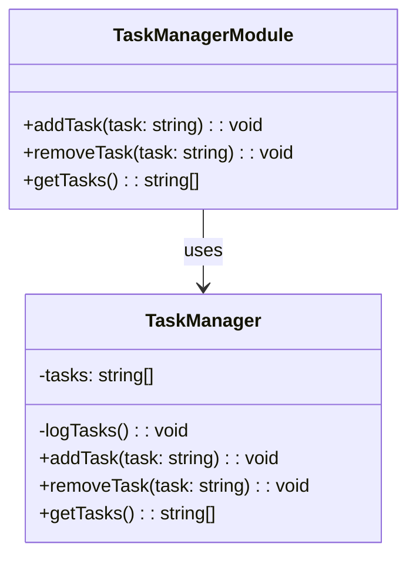

## 5.8.2 Revealing Module Pattern

The Revealing Module Pattern is a design pattern in software development that focuses on encapsulating the internal workings of a module while exposing only the intended public API. This pattern is particularly useful in TypeScript, where it can help manage namespaces and improve code maintainability. Let's delve into the intricacies of this pattern, explore its implementation in TypeScript, and understand its benefits.

### Understanding the Revealing Module Pattern

The Revealing Module Pattern is an evolution of the Module Pattern. It aims to improve the readability and maintainability of the code by clearly defining what is public and what is private within a module. In this pattern, we define all functions and variables in the private scope and return an object that maps these private members to public methods.

#### How It Works

The Revealing Module Pattern works by encapsulating the internal logic of a module and exposing only the necessary parts. This is achieved by:

1. **Defining Private Members**: All functions and variables are defined within the module's private scope.
2. **Returning a Public API**: An object is returned that maps the private members to public methods, revealing only the intended API.

This approach ensures that the internal workings of the module are hidden from the outside world, promoting encapsulation and reducing the risk of unintended interactions.

### Implementing the Revealing Module Pattern in TypeScript

Let's explore how to implement the Revealing Module Pattern in TypeScript with a practical example. We'll create a simple module that manages a list of tasks.

```typescript
// TaskManager.ts

class TaskManager {
    private tasks: string[] = [];

    // Private method to log the current tasks
    private logTasks(): void {
        console.log("Current tasks:", this.tasks);
    }

    // Public method to add a task
    public addTask(task: string): void {
        this.tasks.push(task);
        this.logTasks();
    }

    // Public method to remove a task
    public removeTask(task: string): void {
        const index = this.tasks.indexOf(task);
        if (index > -1) {
            this.tasks.splice(index, 1);
            this.logTasks();
        } else {
            console.log(`Task "${task}" not found.`);
        }
    }

    // Public method to get all tasks
    public getTasks(): string[] {
        return [...this.tasks]; // Return a copy to prevent external modification
    }
}

// Revealing the public API
const TaskManagerModule = (function() {
    const taskManager = new TaskManager();

    return {
        addTask: taskManager.addTask.bind(taskManager),
        removeTask: taskManager.removeTask.bind(taskManager),
        getTasks: taskManager.getTasks.bind(taskManager)
    };
})();

// Usage
TaskManagerModule.addTask("Learn TypeScript");
TaskManagerModule.addTask("Implement Revealing Module Pattern");
console.log(TaskManagerModule.getTasks());
TaskManagerModule.removeTask("Learn TypeScript");
```

#### Key Points in the Example

- **Encapsulation**: The `TaskManager` class encapsulates the task management logic. The `logTasks` method is private and not exposed to the outside world.
- **Public API**: The `TaskManagerModule` object exposes only the `addTask`, `removeTask`, and `getTasks` methods, keeping the internal implementation details hidden.
- **Binding Methods**: The `bind` method is used to ensure that the `this` context is correctly maintained when the methods are called from the `TaskManagerModule`.

### Promoting Encapsulation and Hiding Internal Workings

The Revealing Module Pattern is instrumental in promoting encapsulation by keeping the internal workings of a module hidden. This is achieved by:

- **Limiting Exposure**: Only the necessary methods and properties are exposed, minimizing the risk of external interference.
- **Reducing Complexity**: By hiding the implementation details, the complexity of the module is reduced, making it easier to understand and maintain.

### Benefits of the Revealing Module Pattern

The Revealing Module Pattern offers several benefits, particularly in terms of code maintainability and namespace management:

1. **Improved Readability**: By clearly defining what is public and what is private, the code becomes easier to read and understand.
2. **Enhanced Maintainability**: Encapsulation reduces the risk of unintended interactions, making the codebase easier to maintain and refactor.
3. **Namespace Management**: By encapsulating the module's logic, the pattern helps manage namespaces, preventing global scope pollution.
4. **Flexibility**: The pattern allows for easy modification of the internal implementation without affecting the public API, providing flexibility in evolving the codebase.

### Visualizing the Revealing Module Pattern

To better understand the structure and flow of the Revealing Module Pattern, let's visualize it using a class diagram.



**Diagram Description**: The `TaskManager` class encapsulates the task management logic, while the `TaskManagerModule` exposes the public API. The `TaskManagerModule` uses the `TaskManager` class internally, keeping the implementation details hidden.

### Try It Yourself

To gain a deeper understanding of the Revealing Module Pattern, try modifying the code example provided:

- **Add a New Method**: Implement a method to clear all tasks and expose it through the public API.
- **Enhance Logging**: Modify the `logTasks` method to display the total number of tasks.
- **Experiment with Error Handling**: Add error handling to the `addTask` and `removeTask` methods to handle invalid inputs gracefully.

### References and Further Reading

For more information on the Revealing Module Pattern and related concepts, consider exploring the following resources:

- [MDN Web Docs: Modules](https://developer.mozilla.org/en-US/docs/Web/JavaScript/Guide/Modules)
- [TypeScript Handbook: Modules](https://www.typescriptlang.org/docs/handbook/modules.html)
- [JavaScript Patterns by Stoyan Stefanov](https://www.oreilly.com/library/view/javascript-patterns/9781449399115/)

### Knowledge Check

To reinforce your understanding of the Revealing Module Pattern, consider the following questions:

- What are the key benefits of using the Revealing Module Pattern?
- How does the pattern promote encapsulation?
- What are some potential drawbacks of using this pattern?

### Embrace the Journey

Remember, mastering design patterns is a journey. The Revealing Module Pattern is just one of many tools in your toolkit as a software engineer. Keep experimenting, stay curious, and enjoy the process of learning and applying these patterns in your projects.

## Quiz Time!



### What is the primary purpose of the Revealing Module Pattern?

- [x] To encapsulate internal logic and expose only the intended public API
- [ ] To create a global namespace for all functions
- [ ] To enhance performance by reducing function calls
- [ ] To simplify asynchronous programming

> **Explanation:** The Revealing Module Pattern focuses on encapsulating internal logic and exposing only the necessary parts as the public API.

### In the provided TypeScript example, what is the role of the `bind` method?

- [x] To ensure the correct `this` context is maintained
- [ ] To create a new function with additional arguments
- [ ] To permanently bind a function to a specific object
- [ ] To convert a function into an asynchronous one

> **Explanation:** The `bind` method is used to ensure that the `this` context is correctly maintained when methods are called from the `TaskManagerModule`.

### How does the Revealing Module Pattern promote encapsulation?

- [x] By limiting the exposure of internal methods and properties
- [ ] By using global variables to store state
- [ ] By reducing the number of lines of code
- [ ] By using asynchronous functions

> **Explanation:** The pattern promotes encapsulation by keeping internal methods and properties hidden, exposing only the necessary parts.

### Which of the following is a benefit of using the Revealing Module Pattern?

- [x] Improved code readability
- [ ] Increased execution speed
- [ ] Reduced memory usage
- [ ] Simplified error handling

> **Explanation:** The pattern improves code readability by clearly defining what is public and what is private.

### What is a potential drawback of the Revealing Module Pattern?

- [x] It can lead to increased complexity if overused
- [ ] It always reduces performance
- [ ] It makes debugging more difficult
- [ ] It requires more memory

> **Explanation:** If overused, the pattern can lead to increased complexity by creating unnecessary layers of abstraction.

### What does the `logTasks` method in the example do?

- [x] Logs the current list of tasks to the console
- [ ] Adds a new task to the list
- [ ] Removes a task from the list
- [ ] Clears all tasks

> **Explanation:** The `logTasks` method logs the current list of tasks to the console.

### How does the Revealing Module Pattern help with namespace management?

- [x] By encapsulating logic and preventing global scope pollution
- [ ] By creating global variables for each function
- [ ] By reducing the number of modules
- [ ] By using asynchronous functions

> **Explanation:** The pattern helps manage namespaces by encapsulating logic within a module, preventing global scope pollution.

### What is the main difference between the Module Pattern and the Revealing Module Pattern?

- [x] The Revealing Module Pattern explicitly defines what is public and what is private
- [ ] The Module Pattern is only used in JavaScript
- [ ] The Revealing Module Pattern is faster
- [ ] The Module Pattern is more secure

> **Explanation:** The Revealing Module Pattern explicitly defines what is public and what is private, improving readability and maintainability.

### Which TypeScript feature is particularly useful in implementing the Revealing Module Pattern?

- [x] Classes and interfaces
- [ ] Promises and async/await
- [ ] Generics
- [ ] Decorators

> **Explanation:** Classes and interfaces are useful in implementing the pattern by defining the structure and behavior of the module.

### True or False: The Revealing Module Pattern can only be used in TypeScript.

- [ ] True
- [x] False

> **Explanation:** The Revealing Module Pattern can be used in JavaScript and other languages that support similar module concepts.


