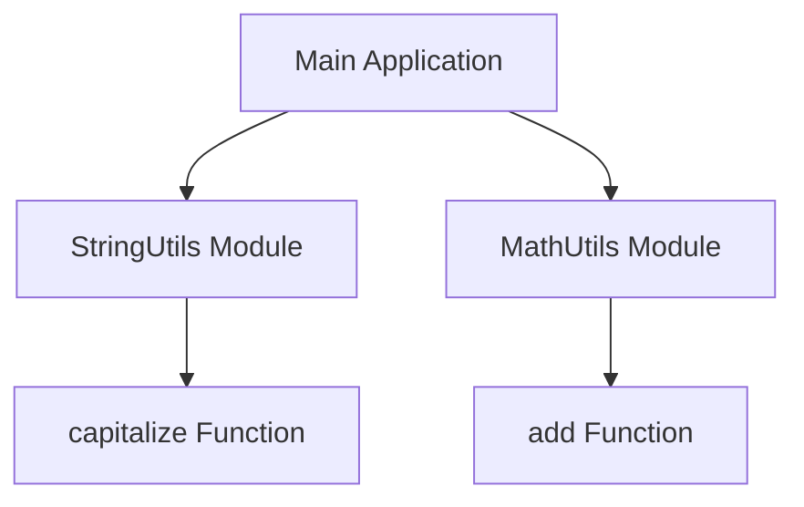

## 5.8.3 Use Cases and Examples

In the realm of software engineering, particularly when working with TypeScript, the Module Pattern stands as a cornerstone for organizing code, encapsulating functionality, and maintaining a clean global namespace. This section will delve into various use cases and examples where the Module Pattern shines, demonstrating its utility in modern TypeScript development. We'll explore how it aids in organizing utility functions, encapsulating library components, managing private and public members, and more.

### Understanding the Module Pattern

Before diving into specific use cases, let's briefly revisit what the Module Pattern entails. The Module Pattern is a design pattern used to create modules with private and public members. It encapsulates related code into a single unit, exposing only the necessary parts to the outside world. This pattern is particularly useful for maintaining a clean global namespace, preventing naming conflicts, and promoting code reuse.

### Organizing Utility Functions into Modules

One of the most common use cases for the Module Pattern is organizing utility functions. In any sizable application, utility functions are indispensable for performing common tasks. However, without proper organization, they can clutter the global namespace and lead to naming conflicts.

#### Example: Utility Module for String Operations

Consider a set of utility functions for string operations. By encapsulating these functions within a module, we can ensure they are organized and easily reusable across the application.

```typescript
// stringUtils.ts
export module StringUtils {
    export function capitalize(str: string): string {
        return str.charAt(0).toUpperCase() + str.slice(1);
    }

    export function camelCaseToSnakeCase(str: string): string {
        return str.replace(/([A-Z])/g, '_$1').toLowerCase();
    }

    export function reverseString(str: string): string {
        return str.split('').reverse().join('');
    }
}
```

In this example, the `StringUtils` module encapsulates several string manipulation functions. By exporting these functions, we make them available for use in other parts of the application while keeping the global namespace clean.

#### Try It Yourself

Experiment with adding more utility functions to the `StringUtils` module. Consider adding functions for trimming whitespace, converting strings to kebab-case, or checking if a string is a palindrome.

### Encapsulating Implementation Details of a Library Component

Another powerful use case for the Module Pattern is encapsulating the implementation details of a library or framework component. This approach hides the complexity of the implementation from the end user, exposing only the necessary interface.

#### Example: Encapsulating a Logger Component

Imagine a logging component that needs to handle different log levels and formats. By using the Module Pattern, we can encapsulate the implementation details and provide a simple interface for logging messages.

```typescript
// logger.ts
export module Logger {
    enum LogLevel {
        INFO,
        WARN,
        ERROR
    }

    function formatMessage(level: LogLevel, message: string): string {
        const timestamp = new Date().toISOString();
        return `[${timestamp}] [${LogLevel[level]}] ${message}`;
    }

    export function logInfo(message: string): void {
        console.log(formatMessage(LogLevel.INFO, message));
    }

    export function logWarn(message: string): void {
        console.warn(formatMessage(LogLevel.WARN, message));
    }

    export function logError(message: string): void {
        console.error(formatMessage(LogLevel.ERROR, message));
    }
}
```

In this example, the `Logger` module encapsulates the logic for formatting and logging messages. The internal `formatMessage` function is not exposed, keeping the implementation details hidden.

#### Try It Yourself

Extend the `Logger` module by adding support for logging to a file or sending logs to a remote server. Consider how you might handle asynchronous logging operations.

### Managing Private and Public Members

The Module Pattern is also instrumental in managing private and public members within a class or service. By encapsulating private members, we can control access and prevent unintended modifications.

#### Example: Managing a Configuration Service

Consider a configuration service that manages application settings. By using the Module Pattern, we can expose only the necessary methods for interacting with the configuration, keeping sensitive data private.

```typescript
// configService.ts
export module ConfigService {
    interface Config {
        apiEndpoint: string;
        timeout: number;
    }

    const config: Config = {
        apiEndpoint: 'https://api.example.com',
        timeout: 5000
    };

    export function getApiEndpoint(): string {
        return config.apiEndpoint;
    }

    export function setApiEndpoint(endpoint: string): void {
        config.apiEndpoint = endpoint;
    }

    export function getTimeout(): number {
        return config.timeout;
    }

    export function setTimeout(timeout: number): void {
        config.timeout = timeout;
    }
}
```

In this example, the `ConfigService` module manages application settings. The `config` object is private, and access is controlled through getter and setter functions.

#### Try It Yourself

Enhance the `ConfigService` module by adding validation logic for setting configuration values. Consider how you might handle environment-specific configurations.

### Maintaining a Clean Global Namespace

One of the key benefits of the Module Pattern is its ability to maintain a clean global namespace. By encapsulating code within modules, we prevent naming conflicts and ensure that our codebase remains organized and maintainable.

#### Example: Preventing Naming Conflicts in a Large Application

In large applications, naming conflicts can become a significant issue. By using the Module Pattern, we can encapsulate related functionality and avoid clashes.

```typescript
// mathUtils.ts
export module MathUtils {
    export function add(a: number, b: number): number {
        return a + b;
    }

    export function subtract(a: number, b: number): number {
        return a - b;
    }

    export function multiply(a: number, b: number): number {
        return a * b;
    }

    export function divide(a: number, b: number): number {
        if (b === 0) {
            throw new Error('Division by zero');
        }
        return a / b;
    }
}
```

In this example, the `MathUtils` module encapsulates basic mathematical operations. By organizing these functions within a module, we prevent potential naming conflicts with other parts of the application.

#### Try It Yourself

Expand the `MathUtils` module by adding more complex mathematical functions, such as calculating the power of a number or finding the greatest common divisor.

### Relevance in Modern TypeScript Development with ES6 Modules

With the advent of ES6 modules, the Module Pattern has become even more relevant in modern TypeScript development. ES6 modules provide a native way to encapsulate code, making it easier to manage dependencies and organize codebases.

#### Example: Using ES6 Modules in a TypeScript Project

Consider a TypeScript project that uses ES6 modules to organize code. By leveraging ES6 modules, we can take advantage of static imports and exports, improving code organization and maintainability.

```typescript
// utils/stringUtils.ts
export function capitalize(str: string): string {
    return str.charAt(0).toUpperCase() + str.slice(1);
}

// utils/mathUtils.ts
export function add(a: number, b: number): number {
    return a + b;
}

// main.ts
import { capitalize } from './utils/stringUtils';
import { add } from './utils/mathUtils';

const message = 'hello world';
console.log(capitalize(message)); // Output: Hello world

const sum = add(5, 10);
console.log(sum); // Output: 15
```

In this example, we use ES6 modules to organize utility functions into separate files. By importing only the necessary functions, we maintain a clean and organized codebase.

#### Try It Yourself

Refactor an existing TypeScript project to use ES6 modules. Consider how this change impacts code organization and dependency management.

### Encouraging the Use of Modules for Code Organization

The Module Pattern is a powerful tool for improving code organization and preventing naming conflicts. By encapsulating related functionality within modules, we can create a more maintainable and scalable codebase.

#### Example: Organizing a Complex Application with Modules

Consider a complex application with multiple features and components. By using the Module Pattern, we can organize the code into logical units, making it easier to manage and maintain.

```typescript
// services/userService.ts
export module UserService {
    export function getUser(id: number): string {
        // Simulate fetching user data
        return `User ${id}`;
    }
}

// services/productService.ts
export module ProductService {
    export function getProduct(id: number): string {
        // Simulate fetching product data
        return `Product ${id}`;
    }
}

// main.ts
import { UserService } from './services/userService';
import { ProductService } from './services/productService';

console.log(UserService.getUser(1)); // Output: User 1
console.log(ProductService.getProduct(2)); // Output: Product 2
```

In this example, we organize the application into modules for user and product services. By encapsulating related functionality within modules, we create a more organized and maintainable codebase.

#### Try It Yourself

Apply the Module Pattern to a personal project. Consider how it improves code organization and readability.

### Visualizing the Module Pattern

To better understand the Module Pattern, let's visualize how it organizes code and manages dependencies.



**Description:** This diagram illustrates how the main application interacts with the `StringUtils` and `MathUtils` modules. Each module encapsulates related functions, promoting code organization and preventing naming conflicts.

### Conclusion

The Module Pattern is an essential tool for organizing code, encapsulating functionality, and maintaining a clean global namespace in TypeScript applications. By leveraging this pattern, we can create more maintainable and scalable codebases, preventing naming conflicts and promoting code reuse. As you continue your journey in TypeScript development, remember to embrace the Module Pattern to improve code organization and readability.

## Quiz Time!



### What is the primary purpose of the Module Pattern?

- [x] To encapsulate related code and maintain a clean global namespace.
- [ ] To increase the performance of TypeScript applications.
- [ ] To replace all other design patterns.
- [ ] To make code less readable.

> **Explanation:** The Module Pattern is primarily used to encapsulate related code, maintain a clean global namespace, and promote code reuse.

### How does the Module Pattern help in preventing naming conflicts?

- [x] By encapsulating code within modules.
- [ ] By using global variables.
- [ ] By avoiding the use of functions.
- [ ] By making all variables public.

> **Explanation:** The Module Pattern encapsulates code within modules, preventing naming conflicts by keeping the global namespace clean.

### In the provided `Logger` module example, which function is not exposed to the outside world?

- [x] `formatMessage`
- [ ] `logInfo`
- [ ] `logWarn`
- [ ] `logError`

> **Explanation:** The `formatMessage` function is not exported and is used internally within the `Logger` module.

### What is a key benefit of using ES6 modules in TypeScript?

- [x] Improved code organization and maintainability.
- [ ] Faster execution of code.
- [ ] Automatic error correction.
- [ ] Elimination of all bugs.

> **Explanation:** ES6 modules improve code organization and maintainability by providing a native way to encapsulate code and manage dependencies.

### Which of the following is a common use case for the Module Pattern?

- [x] Organizing utility functions.
- [ ] Increasing the size of the codebase.
- [ ] Making code harder to read.
- [ ] Removing all functions from the codebase.

> **Explanation:** Organizing utility functions into modules is a common use case for the Module Pattern, promoting code reuse and organization.

### How can the Module Pattern aid in encapsulating library components?

- [x] By hiding implementation details and exposing a simple interface.
- [ ] By making all internal functions public.
- [ ] By removing all interfaces.
- [ ] By increasing the complexity of the code.

> **Explanation:** The Module Pattern aids in encapsulating library components by hiding implementation details and exposing a simple interface for users.

### What is the role of the `export` keyword in a TypeScript module?

- [x] To make functions or variables available outside the module.
- [ ] To delete functions or variables.
- [ ] To hide functions or variables.
- [ ] To automatically optimize code.

> **Explanation:** The `export` keyword is used to make functions or variables available outside the module, allowing them to be imported and used in other parts of the application.

### Which of the following is a benefit of maintaining a clean global namespace?

- [x] Reducing naming conflicts and improving code readability.
- [ ] Increasing the number of global variables.
- [ ] Making code harder to maintain.
- [ ] Slowing down code execution.

> **Explanation:** Maintaining a clean global namespace reduces naming conflicts and improves code readability, making the codebase easier to maintain.

### How does the Module Pattern relate to encapsulation?

- [x] It encapsulates related code within a single unit.
- [ ] It exposes all internal details to the outside world.
- [ ] It removes all encapsulation from the code.
- [ ] It makes encapsulation unnecessary.

> **Explanation:** The Module Pattern encapsulates related code within a single unit, exposing only the necessary parts to the outside world.

### True or False: The Module Pattern is only relevant in TypeScript and not in other programming languages.

- [ ] True
- [x] False

> **Explanation:** The Module Pattern is relevant in many programming languages, not just TypeScript. It is a widely used design pattern for organizing code and managing dependencies.


