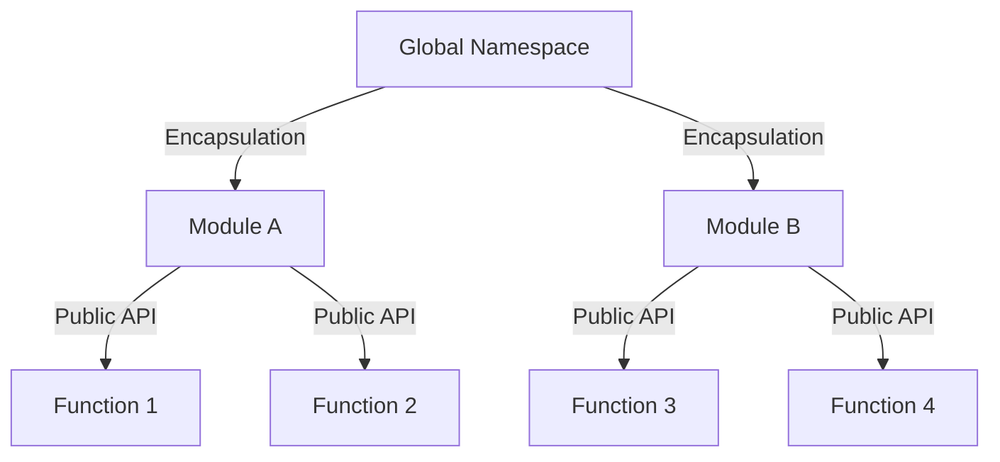

## 5.8 Module Pattern

In the world of software development, especially when dealing with large-scale applications, organizing code efficiently is paramount. The Module Pattern is a design pattern that provides a way to encapsulate code within modules, promoting better organization, maintainability, and avoiding the pollution of the global namespace. In this section, we'll delve into the Module Pattern, its intent, the problems it solves, and how it has evolved from JavaScript to TypeScript.

### Understanding the Module Pattern

The Module Pattern is a structural design pattern that allows developers to create modules with private and public members. It encapsulates private variables and functions, exposing only the parts of the module that are intended to be accessed by other parts of the application. This pattern is particularly useful for managing code dependencies and maintaining a clean global namespace.

#### Intent of the Module Pattern

The primary intent of the Module Pattern is to provide a mechanism for encapsulating code, allowing developers to:

- **Organize Code**: By grouping related functionalities together, the Module Pattern helps in organizing code logically.
- **Encapsulate Implementation Details**: It hides the internal workings of a module, exposing only a public API.
- **Avoid Namespace Pollution**: By encapsulating code, it prevents the global namespace from being cluttered with variables and functions.
- **Promote Reusability**: Modules can be reused across different parts of an application or even in different projects.

### Problems Solved by the Module Pattern

Before the advent of modern JavaScript features like ES6 modules, developers faced several challenges in organizing their code. The Module Pattern emerged as a solution to these problems:

- **Namespace Pollution**: In JavaScript, all variables and functions declared in the global scope are accessible from anywhere in the application, which can lead to conflicts and bugs. The Module Pattern helps in avoiding such issues by encapsulating code within a module.
- **Code Organization**: Large applications often have complex codebases. The Module Pattern helps in organizing code into logical units, making it easier to manage and maintain.
- **Encapsulation**: By encapsulating private variables and functions, the Module Pattern prevents unauthorized access and modification, ensuring that only the intended parts of the module are accessible.

### Implementing the Module Pattern in TypeScript

TypeScript, with its static typing and module system, provides an excellent platform for implementing the Module Pattern. Let's explore how we can implement this pattern in TypeScript.

#### Basic Module Pattern

A basic implementation of the Module Pattern in TypeScript involves using an Immediately Invoked Function Expression (IIFE) to create a module. Here's a simple example:

```typescript
const MyModule = (() => {
  // Private variables and functions
  let privateVariable = "I am private";

  function privateFunction() {
    console.log(privateVariable);
  }

  // Public API
  return {
    publicMethod: () => {
      console.log("Accessing private function:");
      privateFunction();
    }
  };
})();

// Usage
MyModule.publicMethod(); // Outputs: Accessing private function: I am private
```

In this example, `privateVariable` and `privateFunction` are encapsulated within the module, and only `publicMethod` is exposed as part of the module's public API.

#### Using TypeScript's Module System

TypeScript's module system, introduced with ES6, provides a more structured way to implement the Module Pattern. Here's how you can use TypeScript modules:

```typescript
// myModule.ts
export class MyModule {
  private privateVariable: string = "I am private";

  private privateFunction() {
    console.log(this.privateVariable);
  }

  public publicMethod() {
    console.log("Accessing private function:");
    this.privateFunction();
  }
}

// Usage in another file
import { MyModule } from './myModule';

const moduleInstance = new MyModule();
moduleInstance.publicMethod(); // Outputs: Accessing private function: I am private
```

In this example, TypeScript's `export` and `import` keywords are used to define and use modules, providing a clear separation of concerns and encapsulation.

### Evolution of the Module Pattern

The Module Pattern has evolved significantly with the introduction of modern JavaScript and TypeScript features. Let's explore this evolution:

#### From IIFE to ES6 Modules

Initially, the Module Pattern was implemented using IIFE, which allowed developers to create private scopes. However, with the introduction of ES6 modules, JavaScript now provides native support for modules, making it easier to encapsulate code and manage dependencies.

#### TypeScript's Role

TypeScript builds on top of JavaScript's module system, adding static typing and interfaces, which further enhance the Module Pattern. With TypeScript, developers can define interfaces for modules, ensuring that the public API is well-defined and type-safe.

### Visualizing the Module Pattern

To better understand the Module Pattern, let's visualize how it encapsulates code and manages dependencies.



In this diagram, the global namespace is encapsulated by Module A and Module B, each exposing a public API while keeping their internal implementation details private.

### Try It Yourself

To get a hands-on experience with the Module Pattern, try modifying the code examples provided. Here are some suggestions:

- **Add More Private Members**: Try adding more private variables and functions to the module and see how they can be accessed through the public API.
- **Create Multiple Modules**: Create multiple modules and see how they can interact with each other using TypeScript's import/export system.
- **Experiment with Interfaces**: Define interfaces for your modules to enforce a consistent public API.

### Knowledge Check

Before moving on, let's review some key concepts:

- **What is the primary intent of the Module Pattern?**
- **How does the Module Pattern help in avoiding namespace pollution?**
- **What are the benefits of using TypeScript's module system over traditional IIFE-based modules?**

### Conclusion

The Module Pattern is a powerful tool for organizing and encapsulating code in TypeScript. By leveraging TypeScript's module system, developers can create well-structured, maintainable codebases that avoid common pitfalls like namespace pollution. As you continue your journey in software development, remember to embrace the principles of encapsulation and modularity, and keep experimenting with different design patterns to find the best solutions for your projects.

## Quiz Time!



### What is the primary intent of the Module Pattern?

- [x] To encapsulate code and avoid namespace pollution
- [ ] To increase the performance of JavaScript applications
- [ ] To simplify the syntax of JavaScript
- [ ] To enable asynchronous programming

> **Explanation:** The Module Pattern is designed to encapsulate code, providing a way to organize it and avoid polluting the global namespace.

### How does the Module Pattern help in avoiding namespace pollution?

- [x] By encapsulating code within a module
- [ ] By using global variables
- [ ] By increasing the number of functions
- [ ] By using synchronous code

> **Explanation:** The Module Pattern encapsulates code within a module, preventing global variables from being exposed and thus avoiding namespace pollution.

### Which of the following is a benefit of using TypeScript's module system over traditional IIFE-based modules?

- [x] Type safety and static typing
- [ ] Faster execution time
- [ ] Smaller file size
- [ ] Easier syntax

> **Explanation:** TypeScript's module system provides type safety and static typing, which are not available in traditional IIFE-based modules.

### What is an IIFE in the context of the Module Pattern?

- [x] An Immediately Invoked Function Expression used to create a module
- [ ] A type of asynchronous function
- [ ] A global variable
- [ ] A method for optimizing performance

> **Explanation:** An IIFE, or Immediately Invoked Function Expression, is used to create a module by encapsulating code within a function scope.

### What is a key feature of the Module Pattern?

- [x] Encapsulation of private variables and functions
- [ ] Use of global variables
- [ ] Simplification of syntax
- [ ] Support for asynchronous programming

> **Explanation:** The Module Pattern encapsulates private variables and functions, exposing only the public API.

### How can TypeScript's module system enhance the Module Pattern?

- [x] By providing static typing and interfaces
- [ ] By reducing the size of the code
- [ ] By increasing the execution speed
- [ ] By simplifying the syntax

> **Explanation:** TypeScript's module system enhances the Module Pattern by providing static typing and interfaces, which help define a clear and type-safe public API.

### What is the role of the `export` keyword in TypeScript modules?

- [x] To define which parts of the module are accessible from outside
- [ ] To declare a variable
- [ ] To import another module
- [ ] To execute a function

> **Explanation:** The `export` keyword in TypeScript is used to define which parts of the module are accessible from outside, forming the public API.

### What is the advantage of using interfaces in TypeScript modules?

- [x] They enforce a consistent public API
- [ ] They increase the execution speed
- [ ] They reduce the file size
- [ ] They simplify the syntax

> **Explanation:** Interfaces in TypeScript modules enforce a consistent public API, ensuring that the module's exposed functionalities adhere to a specific contract.

### What is the purpose of encapsulating private variables in a module?

- [x] To prevent unauthorized access and modification
- [ ] To increase the execution speed
- [ ] To reduce the file size
- [ ] To simplify the syntax

> **Explanation:** Encapsulating private variables in a module prevents unauthorized access and modification, ensuring that only the intended parts of the module are accessible.

### The Module Pattern is primarily used to organize code and avoid namespace pollution.

- [x] True
- [ ] False

> **Explanation:** True. The Module Pattern is used to organize code into logical units and avoid polluting the global namespace with variables and functions.




