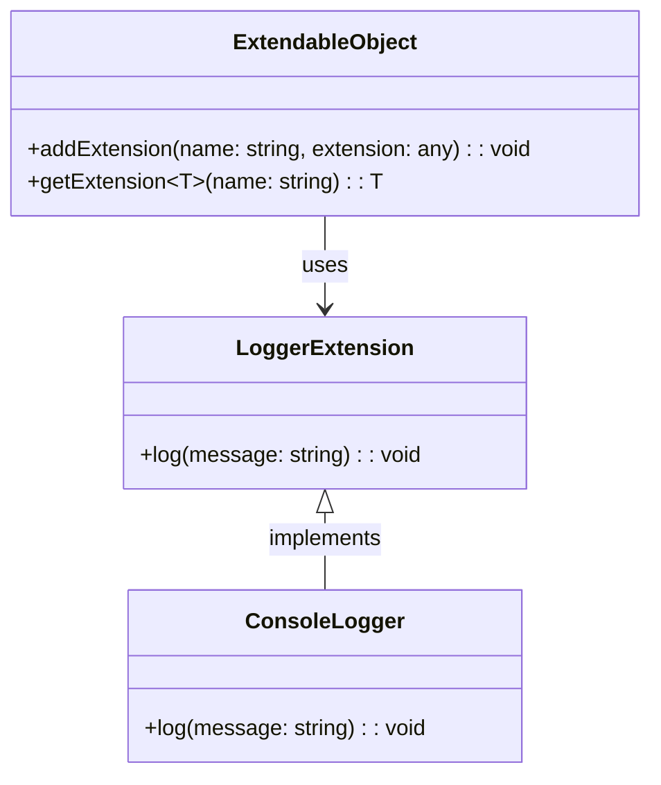

## 5.9.1 Implementing Extension Object in TypeScript

The Extension Object Pattern is a structural design pattern that allows you to add new functionality to objects dynamically. This pattern is particularly useful when you want to extend the capabilities of an object without modifying its existing structure. In this section, we will explore how to implement the Extension Object Pattern in TypeScript, focusing on maintaining type safety while allowing for dynamic extensions.

### Introduction to the Extension Object Pattern

The Extension Object Pattern is designed to address the need for flexible and dynamic object behavior. By allowing objects to be extended at runtime, this pattern provides a way to add new features or behaviors without altering the existing codebase. This is particularly beneficial in scenarios where objects need to adapt to changing requirements or when integrating with third-party systems.

#### Key Concepts

- **Dynamic Extensions**: The ability to add new properties or methods to an object at runtime.
- **Type Safety**: Ensuring that the extensions are type-safe, leveraging TypeScript's powerful type system.
- **Flexibility**: Allowing objects to be extended without modifying their original implementation.

### Implementing the Extension Object Pattern

To implement the Extension Object Pattern in TypeScript, we will follow a structured approach:

1. **Define a Base Interface or Class**: This will serve as the foundation for objects that can be extended.
2. **Create an Extensions Registry**: A mechanism to store and manage extensions.
3. **Add and Retrieve Extensions**: Methods to add new extensions and retrieve them as needed.

#### Step 1: Define a Base Interface or Class

Let's start by defining a base interface that supports extensions. This interface will include methods for adding and retrieving extensions.

```typescript
interface Extendable {
  addExtension(name: string, extension: any): void;
  getExtension<T>(name: string): T | undefined;
}
```

In this interface, `addExtension` allows us to add a new extension by name, and `getExtension` retrieves an extension by name, with the ability to specify the expected type using generics.

#### Step 2: Implement the Extensions Registry

Next, we need to implement a class that uses this interface and manages an internal registry of extensions. We'll use a `Map` to store the extensions, which provides efficient lookups and ensures unique keys.

```typescript
class ExtendableObject implements Extendable {
  private extensions: Map<string, any> = new Map();

  addExtension(name: string, extension: any): void {
    this.extensions.set(name, extension);
  }

  getExtension<T>(name: string): T | undefined {
    return this.extensions.get(name);
  }
}
```

Here, `extensions` is a `Map` that holds the extensions, allowing us to add and retrieve them by name.

#### Step 3: Add and Retrieve Extensions

With our base class in place, we can now add and retrieve extensions. Let's demonstrate this with a simple example:

```typescript
// Define an extension interface
interface LoggerExtension {
  log(message: string): void;
}

// Implement the extension
class ConsoleLogger implements LoggerExtension {
  log(message: string): void {
    console.log(`Log: ${message}`);
  }
}

// Create an extendable object
const myObject = new ExtendableObject();

// Add the logger extension
myObject.addExtension('logger', new ConsoleLogger());

// Retrieve and use the logger extension
const logger = myObject.getExtension<LoggerExtension>('logger');
logger?.log('Hello, World!');
```

In this example, we define a `LoggerExtension` interface and implement it with a `ConsoleLogger` class. We then create an `ExtendableObject`, add the logger extension, and retrieve it to log a message.

### Typing Extensions in TypeScript

One of the challenges of implementing the Extension Object Pattern is maintaining type safety. TypeScript provides several features that can help us achieve this, including generics, index signatures, and type assertions.

#### Using Generics

Generics allow us to specify the expected type of an extension when retrieving it. This ensures that we get the correct type and can use the extension safely.

```typescript
const logger = myObject.getExtension<LoggerExtension>('logger');
```

By specifying `<LoggerExtension>`, we inform TypeScript of the expected type, enabling type checking and autocompletion.

#### Index Signatures and Type Assertions

In some cases, you may need to work with dynamic properties that are not known at compile time. Index signatures and type assertions can be useful in these scenarios.

```typescript
interface DynamicExtensions {
  [key: string]: any;
}

class DynamicExtendableObject implements DynamicExtensions {
  [key: string]: any;
}

const dynamicObject = new DynamicExtendableObject();
dynamicObject['newProperty'] = 'Hello, Dynamic World!';
console.log(dynamicObject['newProperty']); // Output: Hello, Dynamic World!
```

Here, we use an index signature to allow any string key with any value type. This provides flexibility but sacrifices some type safety.

### Considerations and Challenges

While the Extension Object Pattern offers flexibility, it also introduces some challenges:

- **Type Safety**: Balancing flexibility with type safety can be tricky. Using generics and type assertions can help, but they require careful management.
- **Dependency Management**: Extensions may have dependencies on each other, which can lead to complex interdependencies. It's important to design the system to handle these gracefully.
- **Performance**: Dynamically adding and retrieving extensions can introduce overhead, especially in performance-critical applications.

### Visualizing the Extension Object Pattern

To better understand the Extension Object Pattern, let's visualize the relationship between the base object and its extensions using a class diagram.



This diagram illustrates how `ExtendableObject` interacts with `LoggerExtension` and its implementation `ConsoleLogger`.

### Try It Yourself

Experiment with the code examples provided by making the following modifications:

1. **Add More Extensions**: Implement additional extensions, such as a `FileLogger` or `DatabaseLogger`, and add them to the `ExtendableObject`.
2. **Type Safety Enhancements**: Explore ways to enhance type safety, such as using stricter types or additional type checks.
3. **Dependency Management**: Create extensions that depend on each other and implement a mechanism to manage these dependencies.

### Further Reading

For more information on the Extension Object Pattern and related concepts, consider exploring the following resources:

- [MDN Web Docs on JavaScript Objects](https://developer.mozilla.org/en-US/docs/Web/JavaScript/Guide/Working_with_Objects)
- [TypeScript Handbook on Generics](https://www.typescriptlang.org/docs/handbook/2/generics.html)
- [Design Patterns: Elements of Reusable Object-Oriented Software](https://en.wikipedia.org/wiki/Design_Patterns)

### Knowledge Check

Before moving on, take a moment to reflect on what you've learned:

- How does the Extension Object Pattern enhance flexibility in object-oriented design?
- What are the benefits and challenges of using this pattern in TypeScript?
- How can you ensure type safety when implementing dynamic extensions?

### Embrace the Journey

Remember, mastering design patterns is a journey. As you continue to explore and experiment with the Extension Object Pattern, you'll gain deeper insights into its applications and benefits. Keep experimenting, stay curious, and enjoy the journey!

## Quiz Time!



### What is the primary purpose of the Extension Object Pattern?

- [x] To add new functionality to objects dynamically without modifying their existing structure.
- [ ] To create a single instance of a class.
- [ ] To encapsulate a request as an object.
- [ ] To provide a simplified interface to a complex subsystem.

> **Explanation:** The Extension Object Pattern is designed to add new functionality to objects dynamically without altering their existing structure.

### Which TypeScript feature helps maintain type safety when retrieving extensions?

- [x] Generics
- [ ] Any type
- [ ] Type assertions
- [ ] Index signatures

> **Explanation:** Generics allow specifying the expected type when retrieving extensions, ensuring type safety.

### What is a potential challenge when using the Extension Object Pattern?

- [x] Managing dependencies between extensions
- [ ] Creating a single instance of a class
- [ ] Encapsulating a request as an object
- [ ] Providing a simplified interface to a complex subsystem

> **Explanation:** Managing dependencies between extensions can be a challenge when using the Extension Object Pattern.

### Which method is used to add an extension to an `ExtendableObject`?

- [x] addExtension
- [ ] getExtension
- [ ] setExtension
- [ ] removeExtension

> **Explanation:** The `addExtension` method is used to add an extension to an `ExtendableObject`.

### How can you enhance type safety when working with dynamic properties?

- [x] Using stricter types or additional type checks
- [ ] Using the `any` type
- [ ] Ignoring TypeScript compiler errors
- [ ] Avoiding generics

> **Explanation:** Enhancing type safety can be achieved by using stricter types or additional type checks.

### What is the role of the `getExtension` method in the Extension Object Pattern?

- [x] To retrieve an extension by name
- [ ] To add a new extension
- [ ] To remove an extension
- [ ] To modify an existing extension

> **Explanation:** The `getExtension` method retrieves an extension by name.

### What is the benefit of using a `Map` for storing extensions?

- [x] Efficient lookups and unique keys
- [ ] Dynamic property access
- [ ] Type assertions
- [ ] Index signatures

> **Explanation:** A `Map` provides efficient lookups and ensures unique keys for storing extensions.

### Which TypeScript feature allows specifying the expected type of an extension?

- [x] Generics
- [ ] Type assertions
- [ ] Index signatures
- [ ] Any type

> **Explanation:** Generics allow specifying the expected type of an extension, ensuring type safety.

### What is a key advantage of the Extension Object Pattern?

- [x] Flexibility to extend objects without modifying their original implementation
- [ ] Creating a single instance of a class
- [ ] Encapsulating a request as an object
- [ ] Providing a simplified interface to a complex subsystem

> **Explanation:** The Extension Object Pattern offers flexibility to extend objects without modifying their original implementation.

### True or False: The Extension Object Pattern sacrifices type safety for flexibility.

- [ ] True
- [x] False

> **Explanation:** While the Extension Object Pattern introduces flexibility, it can maintain type safety through the use of TypeScript features like generics and type assertions.


