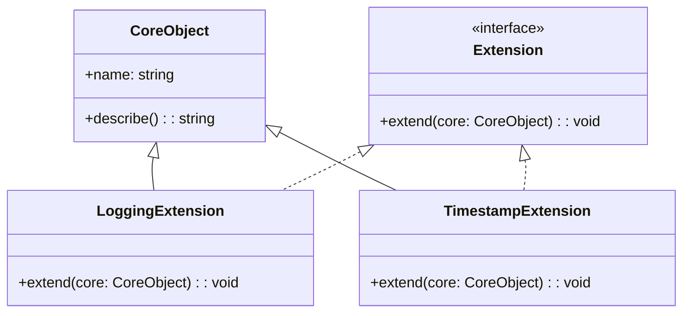

## 5.9.2 Adding Functionality at Runtime

In the ever-evolving landscape of software development, the need to adapt and extend applications dynamically is paramount. The Extension Object Pattern is a powerful tool that allows developers to add functionality to objects at runtime without altering their class definitions. This pattern is particularly useful in scenarios where the application needs to be flexible and adaptable to changing requirements or configurations.

### Understanding the Extension Object Pattern

The Extension Object Pattern is a structural design pattern that enables the addition of new functionalities to objects without modifying their existing structure. This is achieved by attaching extension objects that encapsulate the additional behavior or properties. This pattern is akin to the Decorator Pattern but focuses more on adding new interfaces to objects rather than just enhancing existing ones.

#### Key Concepts

- **Dynamic Extension**: The ability to add new capabilities to objects during runtime based on specific conditions or configurations.
- **Separation of Concerns**: By using extension objects, the core functionality of an object remains untouched, promoting clean separation between the base object and its extensions.
- **Flexibility and Adaptability**: Allows applications to be more flexible and adaptable to changes without requiring a complete overhaul of existing code.

### Scenarios for Runtime Functionality Addition

There are several scenarios where adding functionality at runtime is beneficial:

1. **Plugin Systems**: Applications like IDEs or content management systems often support plugins that can add new features or tools.
2. **Feature Toggles**: Enabling or disabling features based on user preferences or configuration settings.
3. **Conditional Logic**: Executing different logic paths based on runtime conditions, such as user roles or environmental variables.

### Implementing the Extension Object Pattern in TypeScript

Let's delve into how we can implement the Extension Object Pattern in TypeScript to add functionality at runtime.

#### Step 1: Define the Core Object

First, we define a core object that represents the base functionality. This object will be extended with additional features.

```typescript
class CoreObject {
  public name: string;

  constructor(name: string) {
    this.name = name;
  }

  public describe(): string {
    return `This is a core object named ${this.name}.`;
  }
}
```

#### Step 2: Create an Extension Interface

Next, we define an interface for the extensions. This interface will specify the methods that extension objects must implement.

```typescript
interface Extension {
  extend(core: CoreObject): void;
}
```

#### Step 3: Implement Extension Objects

Now, we create extension objects that implement the `Extension` interface. These objects will add new functionality to the core object.

```typescript
class LoggingExtension implements Extension {
  public extend(core: CoreObject): void {
    core['log'] = function(message: string): void {
      console.log(`[${this.name}] ${message}`);
    };
  }
}

class TimestampExtension implements Extension {
  public extend(core: CoreObject): void {
    core['timestamp'] = function(): string {
      return new Date().toISOString();
    };
  }
}
```

#### Step 4: Extend the Core Object at Runtime

Finally, we can extend the core object at runtime by applying the desired extensions.

```typescript
const core = new CoreObject('MyCoreObject');

const loggingExtension = new LoggingExtension();
const timestampExtension = new TimestampExtension();

loggingExtension.extend(core);
timestampExtension.extend(core);

// Now the core object has additional methods
(core as any).log('This is a log message.');
console.log(`Current timestamp: ${(core as any).timestamp()}`);
```

### Benefits of Using the Extension Object Pattern

The Extension Object Pattern offers several benefits:

- **Modularity**: Extensions are modular and can be added or removed without affecting the core object.
- **Scalability**: New features can be added as separate extensions, making the system scalable.
- **Maintainability**: By keeping extensions separate, the core codebase remains clean and maintainable.

### Visualizing the Extension Object Pattern

To better understand how the Extension Object Pattern works, let's visualize the relationship between the core object and its extensions.



In this diagram, `CoreObject` is the base class, and `LoggingExtension` and `TimestampExtension` are extensions that implement the `Extension` interface. These extensions add new methods to the `CoreObject` at runtime.

### Try It Yourself

Experiment with the code examples provided by:

- Adding a new extension that provides additional functionality, such as a method to format the object's name.
- Modifying the `CoreObject` class to include a method that lists all available extensions.
- Implementing a mechanism to remove extensions from the core object.

### Knowledge Check

To reinforce your understanding of the Extension Object Pattern, consider the following questions:

- How does the Extension Object Pattern differ from the Decorator Pattern?
- What are some potential drawbacks of dynamically adding functionality to objects?
- How can you ensure that extensions do not conflict with each other?

### Further Reading

For more information on design patterns and their implementation in TypeScript, consider exploring the following resources:

- [MDN Web Docs: JavaScript Design Patterns](https://developer.mozilla.org/en-US/docs/Web/JavaScript/Guide/Design_Patterns)
- [Refactoring Guru: Design Patterns](https://refactoring.guru/design-patterns)
- [TypeScript Handbook](https://www.typescriptlang.org/docs/)

### Embrace the Journey

Remember, mastering design patterns is a journey. The Extension Object Pattern is just one of many tools in your toolkit. As you continue to explore and experiment, you'll discover new ways to build flexible, adaptable, and maintainable applications. Keep pushing the boundaries, stay curious, and enjoy the process!

## Quiz Time!



### What is the primary benefit of the Extension Object Pattern?

- [x] It allows adding functionality to objects at runtime without altering their class definitions.
- [ ] It improves the performance of the application.
- [ ] It simplifies the code by reducing the number of classes.
- [ ] It ensures type safety in TypeScript.

> **Explanation:** The Extension Object Pattern is designed to add functionality to objects dynamically without changing their original class definitions, enhancing flexibility and adaptability.

### How does the Extension Object Pattern differ from the Decorator Pattern?

- [x] The Extension Object Pattern adds new interfaces, while the Decorator Pattern enhances existing ones.
- [ ] The Extension Object Pattern is used for performance optimization.
- [ ] The Decorator Pattern is only applicable in JavaScript, not TypeScript.
- [ ] The Extension Object Pattern requires modifying the original class.

> **Explanation:** The Extension Object Pattern focuses on adding new interfaces and capabilities, whereas the Decorator Pattern is used to enhance existing functionalities.

### Which scenario is NOT suitable for the Extension Object Pattern?

- [ ] Plugin systems
- [ ] Feature toggles
- [ ] Conditional logic
- [x] Static type checking

> **Explanation:** The Extension Object Pattern is not suitable for scenarios that require static type checking, as it involves dynamic modifications at runtime.

### What is a potential drawback of using the Extension Object Pattern?

- [x] It can lead to conflicts between extensions.
- [ ] It makes the codebase less modular.
- [ ] It reduces the flexibility of the application.
- [ ] It increases the complexity of the core object.

> **Explanation:** One potential drawback is that extensions may conflict with each other if not managed properly, leading to unexpected behavior.

### How can you ensure that extensions do not conflict with each other?

- [x] By implementing a mechanism to check for conflicts before applying extensions.
- [ ] By using only one extension at a time.
- [ ] By modifying the core object to accommodate all extensions.
- [ ] By avoiding the use of extensions altogether.

> **Explanation:** Implementing a mechanism to detect and resolve conflicts before applying extensions can help ensure they work harmoniously.

### What is the role of the `extend` method in an extension object?

- [x] To add new methods or properties to the core object.
- [ ] To remove existing methods from the core object.
- [ ] To change the class definition of the core object.
- [ ] To improve the performance of the core object.

> **Explanation:** The `extend` method is responsible for adding new functionalities to the core object, allowing it to be enhanced at runtime.

### How does the Extension Object Pattern promote separation of concerns?

- [x] By keeping extensions separate from the core object, maintaining a clean codebase.
- [ ] By merging all functionalities into a single class.
- [ ] By using global variables to store extensions.
- [ ] By requiring modifications to the core object for each extension.

> **Explanation:** The pattern promotes separation of concerns by keeping extensions independent from the core object, ensuring a clean and maintainable codebase.

### What is a common use case for the Extension Object Pattern?

- [x] Adding new features to an application without modifying existing code.
- [ ] Optimizing the performance of a web application.
- [ ] Reducing the number of classes in a codebase.
- [ ] Ensuring type safety in TypeScript applications.

> **Explanation:** A common use case is to add new features or functionalities to an application dynamically, without altering the existing code structure.

### How can you visualize the relationship between a core object and its extensions?

- [x] Using a class diagram to show the core object and its extensions.
- [ ] By writing detailed comments in the code.
- [ ] By creating a flowchart of the application's logic.
- [ ] By listing all methods in a text document.

> **Explanation:** A class diagram effectively illustrates the relationship between a core object and its extensions, showing how they interact.

### True or False: The Extension Object Pattern can be used to add functionality to objects after they have been instantiated.

- [x] True
- [ ] False

> **Explanation:** True. The Extension Object Pattern allows for the addition of new functionalities to objects even after they have been instantiated, providing runtime adaptability.


