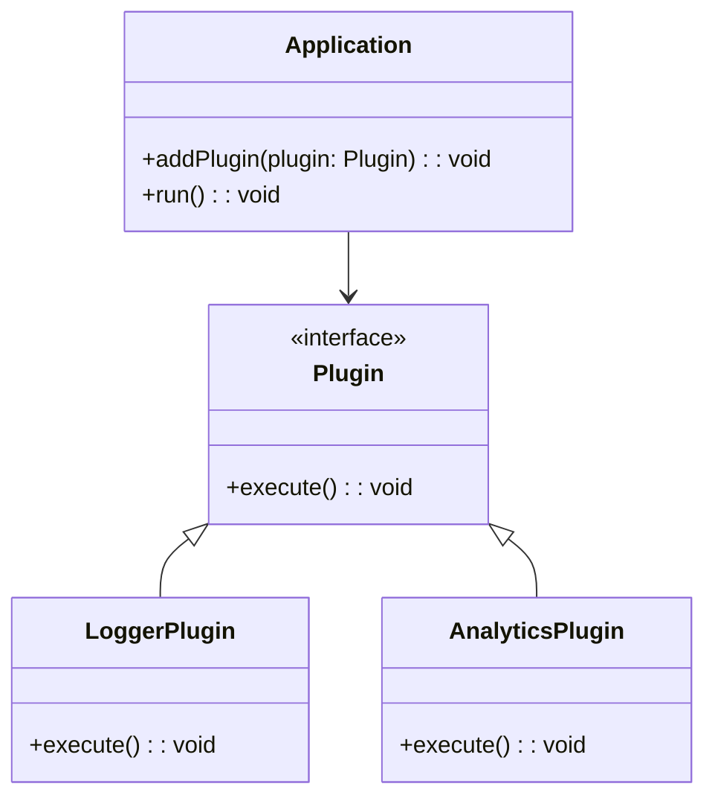

## 5.9.3 Use Cases and Examples

In this section, we delve into the practical applications of the Extension Object Pattern, a structural design pattern that allows objects to be extended with new behaviors at runtime. This pattern is particularly useful in scenarios where flexibility and extensibility are paramount, such as in plugin systems, feature toggles, and user-defined customizations. Let's explore these use cases in detail, providing code examples and discussing the benefits and trade-offs of using this pattern.

### Designing an Application with Plugin Support

One of the most common use cases for the Extension Object Pattern is in designing applications that support plugins. Plugins allow developers to add new features or modify existing behavior without altering the core application code. This is particularly useful in applications that need to be highly customizable or where third-party developers are encouraged to contribute.

#### Implementing a Plugin System

To implement a plugin system using the Extension Object Pattern, we can define a core application class and a plugin interface. Plugins can then be dynamically added to the application, extending its functionality.

```typescript
// Define a Plugin interface
interface Plugin {
  execute(): void;
}

// Core application class
class Application {
  private plugins: Plugin[] = [];

  // Method to add a plugin
  addPlugin(plugin: Plugin): void {
    this.plugins.push(plugin);
  }

  // Execute all plugins
  run(): void {
    console.log("Running core application...");
    this.plugins.forEach(plugin => plugin.execute());
  }
}

// Example plugin implementation
class LoggerPlugin implements Plugin {
  execute(): void {
    console.log("Logger Plugin: Logging data...");
  }
}

// Example plugin implementation
class AnalyticsPlugin implements Plugin {
  execute(): void {
    console.log("Analytics Plugin: Analyzing data...");
  }
}

// Usage
const app = new Application();
app.addPlugin(new LoggerPlugin());
app.addPlugin(new AnalyticsPlugin());
app.run();
```

In this example, the `Application` class can have multiple plugins added to it. Each plugin implements the `Plugin` interface, ensuring a consistent method for execution. This design allows for easy addition of new plugins without modifying the core application logic.

#### Benefits and Trade-offs

The primary benefit of using the Extension Object Pattern in a plugin system is the ability to extend functionality dynamically. This allows for a modular architecture where features can be added or removed as needed. However, this flexibility comes with trade-offs, such as increased complexity in managing plugins and potential conflicts between plugins if not properly isolated.

### Implementing Feature Toggles

Feature toggles are another practical application of the Extension Object Pattern. They allow developers to enable or disable functionality at runtime, which is useful for testing new features, rolling out updates gradually, or customizing features for different user groups.

#### Feature Toggle Implementation

Let's consider an example where we implement feature toggles to enable or disable certain features in an application.

```typescript
// Define a Feature interface
interface Feature {
  isEnabled(): boolean;
  execute(): void;
}

// Core application class
class FeatureToggleApp {
  private features: Feature[] = [];

  // Method to add a feature
  addFeature(feature: Feature): void {
    this.features.push(feature);
  }

  // Execute enabled features
  run(): void {
    console.log("Running application with feature toggles...");
    this.features.forEach(feature => {
      if (feature.isEnabled()) {
        feature.execute();
      }
    });
  }
}

// Example feature implementation
class DarkModeFeature implements Feature {
  isEnabled(): boolean {
    // Logic to determine if the feature is enabled
    return true; // For demonstration, always enabled
  }

  execute(): void {
    console.log("Dark Mode Feature: Applying dark theme...");
  }
}

// Example feature implementation
class BetaFeature implements Feature {
  isEnabled(): boolean {
    // Logic to determine if the feature is enabled
    return false; // For demonstration, always disabled
  }

  execute(): void {
    console.log("Beta Feature: Executing beta feature...");
  }
}

// Usage
const featureApp = new FeatureToggleApp();
featureApp.addFeature(new DarkModeFeature());
featureApp.addFeature(new BetaFeature());
featureApp.run();
```

In this example, the `FeatureToggleApp` class manages a list of features, each implementing the `Feature` interface. The `isEnabled` method determines whether a feature should be executed, allowing for dynamic control over which features are active.

#### Benefits and Trade-offs

Feature toggles provide a powerful mechanism for controlling application behavior without redeploying code. They enable A/B testing, gradual rollouts, and user-specific customizations. However, managing feature toggles can become complex, especially in large applications with many toggles. It's important to ensure that toggles are well-documented and that their impact on the application is thoroughly tested.

### Extending Objects with User-Defined Behaviors

The Extension Object Pattern can also be used to allow users to define custom behaviors or extensions. This is particularly useful in applications that need to be highly customizable or where user input is a key component.

#### User-Defined Extensions

Consider an application where users can define custom commands to be executed. We can use the Extension Object Pattern to allow users to add their own commands to the application.

```typescript
// Define a Command interface
interface Command {
  execute(): void;
}

// Core application class
class CommandApp {
  private commands: Command[] = [];

  // Method to add a command
  addCommand(command: Command): void {
    this.commands.push(command);
  }

  // Execute all commands
  run(): void {
    console.log("Running application with user-defined commands...");
    this.commands.forEach(command => command.execute());
  }
}

// Example user-defined command
class CustomCommand implements Command {
  private message: string;

  constructor(message: string) {
    this.message = message;
  }

  execute(): void {
    console.log(`Custom Command: ${this.message}`);
  }
}

// Usage
const commandApp = new CommandApp();
commandApp.addCommand(new CustomCommand("Hello, World!"));
commandApp.addCommand(new CustomCommand("Execute custom logic."));
commandApp.run();
```

In this example, the `CommandApp` class allows users to add custom commands, each implementing the `Command` interface. This design provides flexibility for users to extend the application with their own logic.

#### Benefits and Trade-offs

Allowing user-defined extensions can significantly enhance the flexibility and appeal of an application. Users can tailor the application to their specific needs, creating a more personalized experience. However, this approach also introduces challenges, such as ensuring the security and stability of user-defined extensions. It's important to validate and sandbox user input to prevent malicious behavior.

### Visualizing the Extension Object Pattern

To better understand how the Extension Object Pattern facilitates these use cases, let's visualize the relationships between the core application, extensions, and the interactions between them.



**Diagram Description**: This class diagram illustrates the relationship between the `Application` class and the `Plugin` interface. The `LoggerPlugin` and `AnalyticsPlugin` classes implement the `Plugin` interface, allowing them to be added to the `Application` and executed.

### Encouraging Extensibility

The Extension Object Pattern is a powerful tool for creating extensible applications. By allowing objects to be extended with new behaviors at runtime, developers can create flexible, modular systems that adapt to changing requirements. When considering this pattern, it's important to weigh the benefits of extensibility against the potential for increased complexity and conflicts between extensions.

### Try It Yourself

To deepen your understanding of the Extension Object Pattern, try modifying the examples provided:

1. **Add a New Plugin**: Create a new plugin class that implements the `Plugin` interface and add it to the `Application`. Experiment with different behaviors and see how they interact with existing plugins.

2. **Implement a New Feature Toggle**: Add a new feature to the `FeatureToggleApp` and implement logic to determine when it should be enabled. Consider how feature toggles can be used to control application behavior in real-world scenarios.

3. **Create a Custom Command**: Define a new command for the `CommandApp` and explore how user-defined logic can be integrated into the application. Think about the security implications of allowing user-defined extensions and how they can be mitigated.

### Key Takeaways

- The Extension Object Pattern is ideal for applications that require dynamic extensibility, such as plugin systems and feature toggles.
- This pattern allows for modular architecture, enabling features to be added or removed without altering core application logic.
- While the pattern provides flexibility, it also introduces complexity in managing extensions and potential conflicts.
- Consider the Extension Object Pattern when designing applications that need to adapt to changing requirements or support user-defined customizations.

## Quiz Time!



### What is a primary benefit of using the Extension Object Pattern in a plugin system?

- [x] It allows for dynamic addition of features without altering core application code.
- [ ] It simplifies the application by reducing the number of classes.
- [ ] It enforces strict type safety across all plugins.
- [ ] It automatically optimizes application performance.

> **Explanation:** The Extension Object Pattern allows for dynamic addition of features through plugins, enhancing flexibility and modularity without modifying the core application code.

### How does the Extension Object Pattern facilitate feature toggles?

- [x] By allowing features to be enabled or disabled at runtime.
- [ ] By automatically integrating new features into the application.
- [ ] By simplifying the user interface for feature management.
- [ ] By enforcing security policies on all features.

> **Explanation:** The Extension Object Pattern facilitates feature toggles by enabling features to be dynamically enabled or disabled, providing control over application behavior.

### What is a potential trade-off of using the Extension Object Pattern?

- [x] Increased complexity in managing extensions.
- [ ] Reduced flexibility in application design.
- [ ] Decreased modularity of the application.
- [ ] Limited ability to add new features.

> **Explanation:** While the Extension Object Pattern provides flexibility, it can lead to increased complexity in managing extensions and potential conflicts.

### In the provided plugin system example, what does the `execute` method in the `Plugin` interface represent?

- [x] The action that each plugin performs when executed.
- [ ] The initialization logic for the plugin.
- [ ] The method to remove the plugin from the application.
- [ ] The method to update the plugin's configuration.

> **Explanation:** The `execute` method in the `Plugin` interface represents the action that each plugin performs when it is executed by the application.

### What is a key consideration when allowing user-defined extensions in an application?

- [x] Ensuring the security and stability of user-defined extensions.
- [ ] Automatically integrating user extensions into the core application.
- [ ] Reducing the number of user-defined extensions.
- [ ] Limiting user access to extension features.

> **Explanation:** When allowing user-defined extensions, it's crucial to ensure their security and stability to prevent malicious behavior and maintain application integrity.

### Which of the following is NOT a use case for the Extension Object Pattern?

- [ ] Plugin systems
- [ ] Feature toggles
- [x] Data serialization
- [ ] User-defined customizations

> **Explanation:** The Extension Object Pattern is not typically used for data serialization; it's more suited for scenarios requiring dynamic extensibility like plugin systems and feature toggles.

### How can feature toggles be beneficial in application development?

- [x] They allow for A/B testing and gradual feature rollouts.
- [ ] They simplify the application architecture.
- [ ] They automatically improve application performance.
- [ ] They enforce strict type safety in feature management.

> **Explanation:** Feature toggles are beneficial for A/B testing and gradual rollouts, allowing developers to control which features are active without redeploying code.

### What role does the `isEnabled` method play in the feature toggle example?

- [x] It determines whether a feature should be executed.
- [ ] It initializes the feature with default settings.
- [ ] It removes the feature from the application.
- [ ] It updates the feature's configuration.

> **Explanation:** The `isEnabled` method determines whether a feature should be executed, allowing for dynamic control over which features are active.

### Why is it important to document feature toggles in an application?

- [x] To ensure developers understand the impact of each toggle on application behavior.
- [ ] To automatically generate user documentation.
- [ ] To reduce the number of feature toggles in the application.
- [ ] To enforce security policies on all features.

> **Explanation:** Documenting feature toggles helps developers understand their impact on application behavior, ensuring proper management and testing.

### True or False: The Extension Object Pattern can be used to add extensibility to applications without increasing complexity.

- [ ] True
- [x] False

> **Explanation:** While the Extension Object Pattern adds extensibility, it can also increase complexity in managing extensions and potential conflicts.



Remember, this is just the beginning. As you progress, you'll build more complex and interactive applications. Keep experimenting, stay curious, and enjoy the journey!
