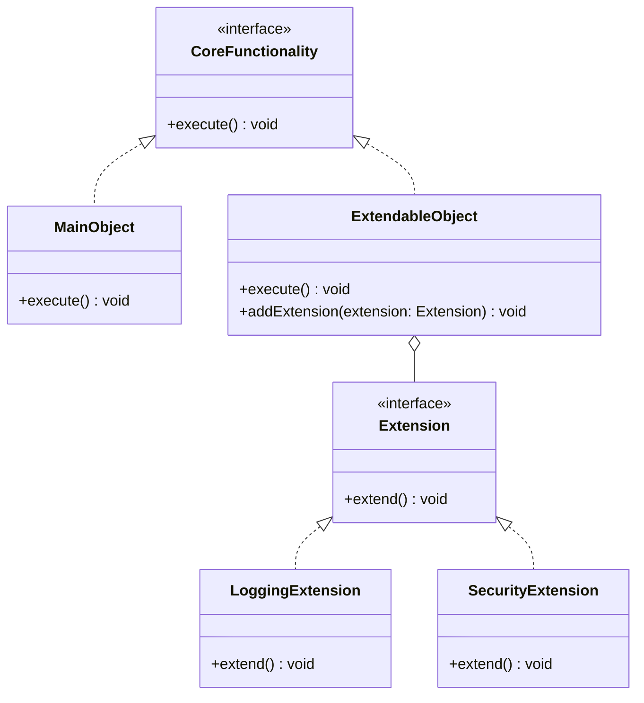

## 5.9 Extension Object Pattern

In the ever-evolving landscape of software development, flexibility and scalability are paramount. The Extension Object Pattern is a powerful design pattern that addresses these needs by allowing functionality to be added to objects dynamically. This pattern is particularly useful when you want to enhance objects with new behaviors without altering their class definitions. Let's delve into the intricacies of the Extension Object Pattern, its benefits, and how it can be implemented in TypeScript.

### Understanding the Extension Object Pattern

The Extension Object Pattern is a structural design pattern that enables the dynamic addition of new behaviors to objects. Unlike traditional methods where you might subclass or modify existing classes to add functionality, the Extension Object Pattern allows you to attach new objects, known as extensions, to existing objects. These extensions encapsulate the additional behavior, making it possible to extend objects without altering their original structure.

#### Intent of the Extension Object Pattern

The primary intent of the Extension Object Pattern is to provide a mechanism for extending the functionality of objects in a flexible and scalable manner. This pattern is particularly useful in scenarios where the set of behaviors that an object can exhibit is not known at compile time and may need to be extended at runtime.

### Problems Solved by the Extension Object Pattern

The Extension Object Pattern addresses several common challenges in software design:

1. **Dynamic Behavior Addition**: It allows new behaviors to be added to objects dynamically, without requiring changes to the object's class definition. This is particularly useful in systems where behavior needs to be extended or modified frequently.

2. **Decoupling of Functionality**: By encapsulating new behaviors in separate extension objects, the pattern promotes a clean separation of concerns. This decoupling makes the system easier to maintain and extend.

3. **Adherence to the Open/Closed Principle**: The pattern supports the Open/Closed Principle, which states that software entities should be open for extension but closed for modification. By using extensions, you can add new functionality without modifying existing code.

4. **Scalability**: The pattern facilitates scalability by allowing new behaviors to be added as needed, without impacting existing functionality.

### Differentiating from Other Patterns

The Extension Object Pattern shares similarities with other design patterns, such as the Decorator and Proxy patterns. However, it has distinct characteristics that set it apart:

- **Decorator Pattern**: The Decorator Pattern also allows for the dynamic addition of behavior, but it does so by wrapping objects with new functionality. In contrast, the Extension Object Pattern attaches new objects to the original object, allowing for more granular control over behavior.

- **Proxy Pattern**: The Proxy Pattern provides a surrogate or placeholder for another object to control access to it. While it can also add behavior, its primary focus is on controlling access rather than extending functionality.

### Implementing the Extension Object Pattern in TypeScript

To implement the Extension Object Pattern in TypeScript, we need to define a base interface or class that represents the core functionality of the object. We then create extension interfaces or classes that encapsulate additional behaviors. Let's walk through a practical example to illustrate this pattern.

#### Step-by-Step Implementation

1. **Define the Core Interface**

   Start by defining an interface that represents the core functionality of the object. This interface will be implemented by the main object and any extensions.

   ```typescript
   interface CoreFunctionality {
       execute(): void;
   }
   ```

2. **Create the Main Object**

   Implement the core interface in a class that represents the main object. This class will serve as the base to which extensions can be added.

   ```typescript
   class MainObject implements CoreFunctionality {
       execute(): void {
           console.log("Executing core functionality.");
       }
   }
   ```

3. **Define Extension Interfaces**

   Create interfaces for the extensions. These interfaces will define the additional behaviors that can be added to the main object.

   ```typescript
   interface Extension {
       extend(): void;
   }
   ```

4. **Implement Extension Classes**

   Implement the extension interfaces in classes that encapsulate the new behaviors. These classes will be attached to the main object.

   ```typescript
   class LoggingExtension implements Extension {
       extend(): void {
           console.log("Logging extension activated.");
       }
   }

   class SecurityExtension implements Extension {
       extend(): void {
           console.log("Security checks performed.");
       }
   }
   ```

5. **Attach Extensions to the Main Object**

   Create a mechanism to attach extensions to the main object. This can be done using a collection to store the extensions and a method to execute them.

   ```typescript
   class ExtendableObject implements CoreFunctionality {
       private extensions: Extension[] = [];

       execute(): void {
           console.log("Executing core functionality.");
           this.extensions.forEach(extension => extension.extend());
       }

       addExtension(extension: Extension): void {
           this.extensions.push(extension);
       }
   }
   ```

6. **Demonstrate Usage**

   Instantiate the main object, add extensions, and execute the functionality to see the pattern in action.

   ```typescript
   const extendableObject = new ExtendableObject();
   extendableObject.addExtension(new LoggingExtension());
   extendableObject.addExtension(new SecurityExtension());

   extendableObject.execute();
   // Output:
   // Executing core functionality.
   // Logging extension activated.
   // Security checks performed.
   ```

### Visualizing the Extension Object Pattern

To better understand the structure and flow of the Extension Object Pattern, let's visualize it using a class diagram.



**Diagram Description**: This class diagram illustrates the relationship between the core functionality, extensions, and the extendable object. The `ExtendableObject` class implements the `CoreFunctionality` interface and holds a collection of `Extension` objects, which can be dynamically added and executed.

### Promoting the Open/Closed Principle

The Extension Object Pattern exemplifies the Open/Closed Principle by allowing new behaviors to be added without modifying existing code. This is achieved by encapsulating new functionality in separate extension objects, which can be attached to the main object as needed. This approach not only enhances flexibility but also reduces the risk of introducing bugs when extending functionality.

### Enhancing Flexibility and Scalability

The ability to dynamically add new behaviors makes the Extension Object Pattern an excellent choice for applications that require high flexibility and scalability. By decoupling the core functionality from the extensions, the pattern allows developers to introduce new features or modify existing ones without impacting the overall system architecture.

### Try It Yourself

To gain a deeper understanding of the Extension Object Pattern, try modifying the code examples provided above. Here are a few suggestions:

- **Add a New Extension**: Create a new extension class that adds a different behavior, such as caching or validation, and attach it to the main object.

- **Modify Execution Order**: Experiment with changing the order in which extensions are executed to see how it affects the overall behavior.

- **Implement Conditional Extensions**: Add logic to conditionally execute certain extensions based on specific criteria or states.

### Knowledge Check

Before we conclude, let's reinforce what we've learned with a few questions:

1. What is the primary intent of the Extension Object Pattern?
2. How does the Extension Object Pattern differ from the Decorator Pattern?
3. Explain how the Extension Object Pattern promotes the Open/Closed Principle.
4. What are some potential use cases for the Extension Object Pattern?

### Conclusion

The Extension Object Pattern is a versatile and powerful design pattern that facilitates the dynamic addition of functionality to objects. By promoting flexibility, scalability, and adherence to the Open/Closed Principle, it provides a robust solution for extending software systems. As you continue your journey in software development, consider incorporating the Extension Object Pattern into your toolkit to build more adaptable and maintainable applications.

## Quiz Time!



### What is the primary intent of the Extension Object Pattern?

- [x] To allow dynamic addition of new behaviors to objects without modifying their class definitions.
- [ ] To provide a surrogate or placeholder for another object to control access.
- [ ] To wrap objects with new functionality.
- [ ] To manage object creation responsibilities.

> **Explanation:** The Extension Object Pattern is designed to add new behaviors to objects dynamically, enhancing flexibility and scalability without altering the original class definitions.

### How does the Extension Object Pattern differ from the Decorator Pattern?

- [x] The Extension Object Pattern attaches new objects to the original object, while the Decorator Pattern wraps objects with new functionality.
- [ ] The Extension Object Pattern focuses on controlling access, while the Decorator Pattern focuses on adding behavior.
- [ ] The Extension Object Pattern is used for object creation, while the Decorator Pattern is used for object extension.
- [ ] The Extension Object Pattern and Decorator Pattern are identical in their approach.

> **Explanation:** The Extension Object Pattern attaches new objects as extensions, allowing more granular control over behavior, whereas the Decorator Pattern wraps objects to add functionality.

### Which principle does the Extension Object Pattern exemplify?

- [x] Open/Closed Principle
- [ ] Single Responsibility Principle
- [ ] Dependency Inversion Principle
- [ ] Interface Segregation Principle

> **Explanation:** The Extension Object Pattern exemplifies the Open/Closed Principle by allowing new functionality to be added without modifying existing code.

### What is a key benefit of using the Extension Object Pattern?

- [x] It enhances flexibility and scalability by allowing dynamic behavior addition.
- [ ] It simplifies object creation by providing a factory interface.
- [ ] It reduces memory usage by sharing common state among objects.
- [ ] It controls access to sensitive resources.

> **Explanation:** The Extension Object Pattern enhances flexibility and scalability by allowing behaviors to be added dynamically, without altering the original object structure.

### In the provided TypeScript example, what is the role of the `ExtendableObject` class?

- [x] To serve as the main object that can have extensions attached and executed.
- [ ] To wrap the main object with additional functionality.
- [ ] To control access to the main object.
- [ ] To create instances of extension objects.

> **Explanation:** The `ExtendableObject` class acts as the main object that can have extensions attached, allowing for dynamic behavior execution.

### What is a potential use case for the Extension Object Pattern?

- [x] Adding new features to a software system without impacting existing functionality.
- [ ] Creating a single instance of a class with global access.
- [ ] Providing a simplified interface to a complex subsystem.
- [ ] Managing a pool of reusable objects.

> **Explanation:** The Extension Object Pattern is ideal for adding new features or behaviors to a system without affecting existing functionality, promoting scalability.

### How can the execution order of extensions affect the overall behavior?

- [x] Changing the execution order can lead to different outcomes, as each extension may depend on the results of others.
- [ ] The execution order has no impact on the overall behavior.
- [ ] Extensions are executed in parallel, so order is irrelevant.
- [ ] Extensions are always executed in alphabetical order.

> **Explanation:** The execution order of extensions can affect the overall behavior, as some extensions may rely on the outcomes of others, leading to different results.

### What is a common challenge addressed by the Extension Object Pattern?

- [x] The need to add new behavior to objects without modifying their class definitions.
- [ ] The need to provide a global access point for a single instance.
- [ ] The need to control access to a complex subsystem.
- [ ] The need to manage a large number of fine-grained objects efficiently.

> **Explanation:** The Extension Object Pattern addresses the challenge of adding new behaviors to objects dynamically, without modifying their class definitions.

### True or False: The Extension Object Pattern is primarily used for controlling access to objects.

- [ ] True
- [x] False

> **Explanation:** False. The Extension Object Pattern is primarily used for dynamically adding new behaviors to objects, not for controlling access.

### Which of the following is NOT a characteristic of the Extension Object Pattern?

- [ ] Promotes flexibility and scalability.
- [ ] Supports dynamic behavior addition.
- [ ] Adheres to the Open/Closed Principle.
- [x] Provides a simplified interface to a complex subsystem.

> **Explanation:** Providing a simplified interface to a complex subsystem is a characteristic of the Facade Pattern, not the Extension Object Pattern.



Remember, this is just the beginning. As you progress, you'll build more complex and interactive systems using the Extension Object Pattern. Keep experimenting, stay curious, and enjoy the journey!
