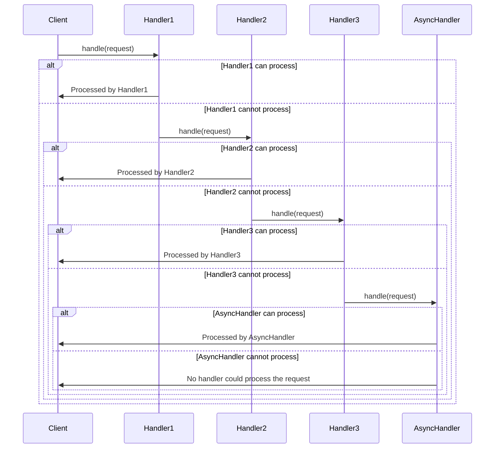

## 6.1.1 Implementing Chain of Responsibility in TypeScript

The Chain of Responsibility pattern is a behavioral design pattern that allows an object to pass a request along a chain of potential handlers until one of them handles the request. This pattern decouples the sender of a request from its receiver, providing flexibility in assigning responsibilities to different objects.

In this section, we will explore how to implement the Chain of Responsibility pattern in TypeScript, leveraging its features like classes, interfaces, and optional chaining. We'll provide a step-by-step guide, complete with code examples, to help you understand and apply this pattern effectively.

### Understanding the Chain of Responsibility Pattern

Before diving into the implementation, let's briefly understand the key concepts of the Chain of Responsibility pattern:

- **Handler**: An interface or abstract class that defines a method for handling requests and a reference to the next handler in the chain.
- **ConcreteHandler**: A class that implements the handler interface and decides whether to process the request or pass it to the next handler.
- **Chain Setup**: The process of linking handler instances to form a chain.
- **Request Passing**: The mechanism of passing a request through the chain, allowing handlers to choose whether to handle or skip it.

### Step-by-Step Guide to Implementing the Chain of Responsibility in TypeScript

Let's go through the process of implementing the Chain of Responsibility pattern in TypeScript step by step.

#### Step 1: Define the Handler Interface

The first step is to define a `Handler` interface that declares a method for handling requests and a reference to the next handler. This interface will be implemented by all concrete handlers.

```typescript
// Define the Handler interface
interface Handler {
  setNext(handler: Handler): Handler;
  handle(request: string): void;
}
```

- **`setNext(handler: Handler): Handler`**: This method sets the next handler in the chain and returns the handler to allow method chaining.
- **`handle(request: string): void`**: This method processes the request or passes it to the next handler.

#### Step 2: Implement ConcreteHandler Classes

Next, we implement concrete handler classes that decide whether to process the request or pass it to the next handler. Each handler holds a reference to the next handler in the chain.

```typescript
// ConcreteHandler1 class
class ConcreteHandler1 implements Handler {
  private nextHandler: Handler | null = null;

  public setNext(handler: Handler): Handler {
    this.nextHandler = handler;
    return handler;
  }

  public handle(request: string): void {
    if (request === 'Request1') {
      console.log('ConcreteHandler1 handled the request.');
    } else if (this.nextHandler) {
      this.nextHandler.handle(request);
    }
  }
}

// ConcreteHandler2 class
class ConcreteHandler2 implements Handler {
  private nextHandler: Handler | null = null;

  public setNext(handler: Handler): Handler {
    this.nextHandler = handler;
    return handler;
  }

  public handle(request: string): void {
    if (request === 'Request2') {
      console.log('ConcreteHandler2 handled the request.');
    } else if (this.nextHandler) {
      this.nextHandler.handle(request);
    }
  }
}
```

- **ConcreteHandler1** and **ConcreteHandler2**: These classes implement the `Handler` interface and decide whether to handle the request based on its content. If they cannot handle the request, they pass it to the next handler in the chain.

#### Step 3: Set Up the Chain

With the handlers defined, the next step is to set up the chain by linking handler instances.

```typescript
// Set up the chain of responsibility
const handler1 = new ConcreteHandler1();
const handler2 = new ConcreteHandler2();

handler1.setNext(handler2);
```

- **Chain Setup**: We create instances of `ConcreteHandler1` and `ConcreteHandler2` and link them using the `setNext` method.

#### Step 4: Pass a Request Through the Chain

Once the chain is set up, we can pass a request through it. Each handler will decide whether to handle the request or pass it to the next handler.

```typescript
// Pass requests through the chain
handler1.handle('Request1'); // Output: ConcreteHandler1 handled the request.
handler1.handle('Request2'); // Output: ConcreteHandler2 handled the request.
handler1.handle('Request3'); // No output, as no handler can process this request.
```

- **Request Handling**: The request is passed to the first handler in the chain. If a handler can process the request, it does so; otherwise, it passes the request to the next handler.

#### Handling Unprocessed Requests

In some cases, no handler in the chain may be able to process a request. It's important to handle such scenarios gracefully.

```typescript
// ConcreteHandler3 class
class ConcreteHandler3 implements Handler {
  private nextHandler: Handler | null = null;

  public setNext(handler: Handler): Handler {
    this.nextHandler = handler;
    return handler;
  }

  public handle(request: string): void {
    if (request === 'Request3') {
      console.log('ConcreteHandler3 handled the request.');
    } else if (this.nextHandler) {
      this.nextHandler.handle(request);
    } else {
      console.log('No handler could process the request.');
    }
  }
}

// Add ConcreteHandler3 to the chain
const handler3 = new ConcreteHandler3();
handler2.setNext(handler3);
```

- **Handling Unprocessed Requests**: By adding a final handler that logs a message if no handler can process the request, we ensure that unhandled requests are acknowledged.

### Leveraging TypeScript Features

TypeScript provides several features that facilitate the implementation of the Chain of Responsibility pattern:

- **Interfaces**: Allow us to define a contract for handlers, ensuring consistency across implementations.
- **Optional Chaining**: Simplifies the code by safely accessing properties of potentially `null` or `undefined` objects.
- **Classes**: Enable us to encapsulate behavior and state within handler objects.

### Asynchronous Request Handling

In modern applications, requests may need to be handled asynchronously. TypeScript's support for Promises and `async/await` makes it easy to implement asynchronous request handling.

#### Asynchronous Handler Implementation

Let's modify our handler implementation to handle requests asynchronously.

```typescript
// AsynchronousHandler class
class AsynchronousHandler implements Handler {
  private nextHandler: Handler | null = null;

  public setNext(handler: Handler): Handler {
    this.nextHandler = handler;
    return handler;
  }

  public async handle(request: string): Promise<void> {
    if (request === 'AsyncRequest') {
      console.log('AsynchronousHandler is processing the request...');
      await this.processRequest();
      console.log('AsynchronousHandler completed processing.');
    } else if (this.nextHandler) {
      await this.nextHandler.handle(request);
    } else {
      console.log('No handler could process the request.');
    }
  }

  private async processRequest(): Promise<void> {
    return new Promise((resolve) => setTimeout(resolve, 2000));
  }
}

// Add AsynchronousHandler to the chain
const asyncHandler = new AsynchronousHandler();
handler3.setNext(asyncHandler);
```

- **Asynchronous Handling**: The `handle` method is now asynchronous, using `async/await` to process requests. The `processRequest` method simulates an asynchronous operation with a delay.

### Try It Yourself

To deepen your understanding, try modifying the code examples:

- **Add New Handlers**: Implement additional concrete handlers that handle different types of requests.
- **Modify the Chain**: Change the order of handlers in the chain and observe the effects on request processing.
- **Experiment with Asynchronous Requests**: Introduce more complex asynchronous operations in the `AsynchronousHandler`.

### Visualizing the Chain of Responsibility

To better understand the flow of requests through the chain, let's visualize the Chain of Responsibility pattern using a sequence diagram.



- **Sequence Diagram**: This diagram illustrates the flow of a request through the chain, showing how each handler decides whether to process the request or pass it to the next handler.

### Key Takeaways

- The Chain of Responsibility pattern allows for flexible request handling by decoupling the sender and receiver.
- TypeScript's features, such as interfaces and optional chaining, facilitate the implementation of this pattern.
- Asynchronous request handling can be achieved using Promises and `async/await`.
- Visualizing the pattern helps in understanding the flow of requests through the chain.

### Further Reading

For more information on the Chain of Responsibility pattern and its applications, consider exploring the following resources:

- [MDN Web Docs: JavaScript Classes](https://developer.mozilla.org/en-US/docs/Web/JavaScript/Reference/Classes)
- [TypeScript Handbook: Interfaces](https://www.typescriptlang.org/docs/handbook/interfaces.html)
- [Design Patterns: Elements of Reusable Object-Oriented Software](https://en.wikipedia.org/wiki/Design_Patterns) by Erich Gamma, Richard Helm, Ralph Johnson, and John Vlissides

## Quiz Time!



### What is the primary purpose of the Chain of Responsibility pattern?

- [x] To decouple the sender of a request from its receiver.
- [ ] To ensure a single handler processes all requests.
- [ ] To allow multiple handlers to process the same request simultaneously.
- [ ] To handle requests in a random order.

> **Explanation:** The Chain of Responsibility pattern is designed to decouple the sender of a request from its receiver, allowing multiple handlers to process the request in sequence.

### Which TypeScript feature is particularly useful for implementing the Chain of Responsibility pattern?

- [x] Interfaces
- [ ] Enums
- [ ] Decorators
- [ ] Type Aliases

> **Explanation:** Interfaces in TypeScript are useful for defining a contract for handlers, ensuring consistency across implementations.

### How does a handler in the Chain of Responsibility decide whether to process a request?

- [x] It checks if it can handle the request based on its logic.
- [ ] It always processes the request.
- [ ] It randomly decides whether to process the request.
- [ ] It waits for user input to decide.

> **Explanation:** A handler checks if it can handle the request based on its internal logic. If it can't, it passes the request to the next handler in the chain.

### What happens if no handler in the chain can process a request?

- [x] The request is not processed, and an appropriate action should be taken.
- [ ] The request is automatically processed by the first handler.
- [ ] The request is discarded without any action.
- [ ] The request is sent back to the sender.

> **Explanation:** If no handler can process the request, it remains unprocessed, and the application should handle this scenario appropriately.

### What is the benefit of using `async/await` in the Chain of Responsibility pattern?

- [x] It allows handlers to process requests asynchronously.
- [ ] It ensures all requests are processed synchronously.
- [ ] It eliminates the need for error handling.
- [ ] It simplifies the implementation of synchronous handlers.

> **Explanation:** `async/await` allows handlers to process requests asynchronously, making it suitable for handling operations that involve I/O or other asynchronous tasks.

### In the Chain of Responsibility pattern, what is the role of the `setNext` method?

- [x] To link handlers together in a chain.
- [ ] To process the request.
- [ ] To terminate the chain.
- [ ] To log the request.

> **Explanation:** The `setNext` method is used to link handlers together, forming a chain through which requests can be passed.

### How can you ensure that unprocessed requests are acknowledged in the Chain of Responsibility pattern?

- [x] By adding a final handler that logs a message if no handler can process the request.
- [ ] By ensuring all handlers process every request.
- [ ] By discarding requests that cannot be processed.
- [ ] By sending unprocessed requests back to the sender.

> **Explanation:** Adding a final handler that logs a message if no handler can process the request ensures that unprocessed requests are acknowledged.

### What is the advantage of using optional chaining in the Chain of Responsibility pattern?

- [x] It simplifies accessing properties of potentially `null` or `undefined` objects.
- [ ] It ensures all handlers are executed.
- [ ] It eliminates the need for error handling.
- [ ] It allows handlers to process requests in parallel.

> **Explanation:** Optional chaining simplifies accessing properties of objects that may be `null` or `undefined`, reducing the need for explicit null checks.

### Which of the following is a key benefit of the Chain of Responsibility pattern?

- [x] It provides flexibility in assigning responsibilities to different objects.
- [ ] It guarantees that every request is processed.
- [ ] It allows for parallel processing of requests.
- [ ] It simplifies error handling.

> **Explanation:** The Chain of Responsibility pattern provides flexibility in assigning responsibilities to different objects, allowing for dynamic request handling.

### True or False: The Chain of Responsibility pattern is suitable for scenarios where multiple handlers need to process the same request simultaneously.

- [ ] True
- [x] False

> **Explanation:** False. The Chain of Responsibility pattern is designed for scenarios where a request is passed along a chain of handlers, with each handler having the opportunity to process the request or pass it to the next handler.


