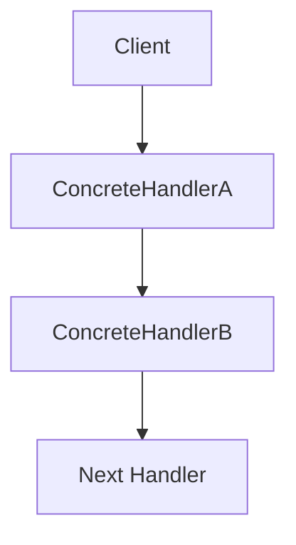

## 6.1 Chain of Responsibility Pattern

The Chain of Responsibility Pattern is a behavioral design pattern that allows an incoming request to be passed along a chain of handler objects until one of them handles it. This pattern promotes loose coupling and flexibility in assigning responsibilities, making it an essential tool in the software engineer's toolkit.

### Understanding the Chain of Responsibility Pattern

#### Definition and Intent

The Chain of Responsibility Pattern's primary intent is to decouple the sender of a request from its receiver by giving more than one object a chance to handle the request. This is achieved by chaining the receiving objects and passing the request along the chain until an object handles it.

#### Problems Solved

By implementing the Chain of Responsibility Pattern, we solve several key problems:

- **Avoiding Tight Coupling**: The sender of a request is not coupled to a specific receiver, allowing for greater flexibility and easier maintenance.
- **Dynamic Handler Assignment**: Handlers can be added or removed dynamically without affecting the client code.
- **Responsibility Sharing**: Multiple handlers can participate in processing a request, distributing the workload.

### Key Components of the Chain of Responsibility Pattern

Let's delve into the core components that make up the Chain of Responsibility Pattern:

#### 1. Handler

The `Handler` is an interface or abstract class that defines a method to handle the request and a reference to the next handler in the chain. It serves as the blueprint for all concrete handlers.

```typescript
// Handler.ts
abstract class Handler {
  protected nextHandler: Handler | null = null;

  public setNext(handler: Handler): Handler {
    this.nextHandler = handler;
    return handler;
  }

  public abstract handleRequest(request: string): void;
}
```

#### 2. ConcreteHandler

`ConcreteHandler` classes implement the `Handler` interface or extend the abstract class. Each concrete handler decides whether to process the request or pass it along the chain.

```typescript
// ConcreteHandlerA.ts
class ConcreteHandlerA extends Handler {
  public handleRequest(request: string): void {
    if (request === "A") {
      console.log("ConcreteHandlerA handled the request.");
    } else if (this.nextHandler) {
      this.nextHandler.handleRequest(request);
    }
  }
}

// ConcreteHandlerB.ts
class ConcreteHandlerB extends Handler {
  public handleRequest(request: string): void {
    if (request === "B") {
      console.log("ConcreteHandlerB handled the request.");
    } else if (this.nextHandler) {
      this.nextHandler.handleRequest(request);
    }
  }
}
```

#### 3. Client

The `Client` initiates the request and doesn't need to know which handler will process it. This abstraction allows the client to remain unaware of the chain's structure.

```typescript
// Client.ts
const handlerA = new ConcreteHandlerA();
const handlerB = new ConcreteHandlerB();

handlerA.setNext(handlerB);

const requests = ["A", "B", "C"];

requests.forEach((request) => {
  handlerA.handleRequest(request);
});
```

### Visualizing the Chain Architecture

To better understand how the Chain of Responsibility Pattern operates, let's visualize the chain architecture using a diagram.



**Diagram Description**: The diagram illustrates a simple chain where the `Client` sends a request to `ConcreteHandlerA`. If `ConcreteHandlerA` cannot handle the request, it passes it to `ConcreteHandlerB`, and so on, until a handler processes the request or the chain ends.

### How the Pattern Promotes Flexibility

The Chain of Responsibility Pattern enhances flexibility in processing requests by allowing handlers to be dynamically added, removed, or reordered without altering the client code. This flexibility is achieved through the following mechanisms:

- **Open/Closed Principle**: The pattern adheres to the Open/Closed Principle by allowing new handlers to be introduced without modifying existing code. This is crucial for maintaining and scaling complex systems.
- **Dynamic Configuration**: Handlers can be configured at runtime, enabling systems to adapt to changing requirements without redeployment.

### Advanced Implementation Details in TypeScript

For expert-level TypeScript professionals, let's explore some advanced implementation details and optimizations:

#### TypeScript-Specific Features

- **Type Safety**: Leverage TypeScript's type system to ensure that handlers are correctly chained and requests are appropriately typed.
- **Generics**: Use generics to create a more flexible handler interface that can process different types of requests.

```typescript
// GenericHandler.ts
abstract class GenericHandler<T> {
  protected nextHandler: GenericHandler<T> | null = null;

  public setNext(handler: GenericHandler<T>): GenericHandler<T> {
    this.nextHandler = handler;
    return handler;
  }

  public abstract handleRequest(request: T): void;
}
```

#### Error Handling and Logging

Incorporate error handling and logging mechanisms to enhance the robustness of the chain:

```typescript
// EnhancedConcreteHandler.ts
class EnhancedConcreteHandler extends GenericHandler<string> {
  public handleRequest(request: string): void {
    try {
      if (request === "Enhanced") {
        console.log("EnhancedConcreteHandler processed the request.");
      } else if (this.nextHandler) {
        this.nextHandler.handleRequest(request);
      }
    } catch (error) {
      console.error("An error occurred:", error);
    }
  }
}
```

### Try It Yourself

Experiment with the Chain of Responsibility Pattern by modifying the code examples:

- **Add New Handlers**: Create additional `ConcreteHandler` classes to handle different types of requests.
- **Reorder Handlers**: Change the order of handlers in the chain and observe how it affects request processing.
- **Implement Logging**: Add logging statements to track the flow of requests through the chain.

### References and Further Reading

- [MDN Web Docs: Design Patterns](https://developer.mozilla.org/en-US/docs/Web/JavaScript/Guide/Design_Patterns)
- [Refactoring Guru: Chain of Responsibility](https://refactoring.guru/design-patterns/chain-of-responsibility)
- [TypeScript Handbook](https://www.typescriptlang.org/docs/handbook/intro.html)

### Knowledge Check

Before we conclude, let's reinforce our understanding with a few questions:

- How does the Chain of Responsibility Pattern promote loose coupling?
- What are the benefits of using generics in the handler interface?
- How can error handling be integrated into the chain?

### Embrace the Journey

Remember, mastering design patterns like the Chain of Responsibility is just the beginning. As you progress, you'll build more complex and adaptable systems. Keep experimenting, stay curious, and enjoy the journey!

## Quiz Time!



### What is the primary intent of the Chain of Responsibility Pattern?

- [x] To decouple the sender of a request from its receiver by allowing multiple objects to handle the request.
- [ ] To ensure a single object handles all requests.
- [ ] To tightly couple the sender and receiver of a request.
- [ ] To eliminate the need for handlers.

> **Explanation:** The Chain of Responsibility Pattern aims to decouple the sender from the receiver by passing the request along a chain of handlers.

### Which component in the Chain of Responsibility Pattern initiates the request?

- [x] Client
- [ ] Handler
- [ ] ConcreteHandler
- [ ] Request

> **Explanation:** The Client initiates the request and is unaware of which handler will process it.

### How does the Chain of Responsibility Pattern adhere to the Open/Closed Principle?

- [x] By allowing new handlers to be added without modifying existing code.
- [ ] By requiring all handlers to be modified for new requests.
- [ ] By tightly coupling handlers to the client.
- [ ] By preventing any changes to the chain.

> **Explanation:** The pattern allows new handlers to be introduced without altering existing code, adhering to the Open/Closed Principle.

### What is the role of the ConcreteHandler in the Chain of Responsibility Pattern?

- [x] To implement the handler interface and decide whether to process the request or pass it along.
- [ ] To initiate the request.
- [ ] To define the method for handling requests.
- [ ] To eliminate the need for a client.

> **Explanation:** ConcreteHandlers implement the handler interface and decide on request processing or passing.

### Which TypeScript feature can enhance flexibility in the Chain of Responsibility Pattern?

- [x] Generics
- [ ] Any type
- [ ] Hard coding
- [ ] Magic numbers

> **Explanation:** Generics allow for flexible handler interfaces that can process different request types.

### What is a potential benefit of using logging in the Chain of Responsibility Pattern?

- [x] Tracking the flow of requests through the chain.
- [ ] Eliminating the need for error handling.
- [ ] Tightening the coupling between handlers.
- [ ] Reducing the number of handlers.

> **Explanation:** Logging helps track how requests are processed through the chain, aiding in debugging and analysis.

### How can error handling be integrated into the Chain of Responsibility Pattern?

- [x] By incorporating try/catch blocks within handlers.
- [ ] By eliminating all handlers.
- [ ] By tightly coupling handlers to the client.
- [ ] By ignoring errors.

> **Explanation:** Error handling can be integrated using try/catch blocks within each handler.

### What is a key advantage of dynamic handler configuration in the Chain of Responsibility Pattern?

- [x] Adapting to changing requirements without redeployment.
- [ ] Eliminating the need for a client.
- [ ] Tightening the coupling between handlers.
- [ ] Reducing the number of requests.

> **Explanation:** Dynamic configuration allows systems to adapt to changes without needing redeployment.

### True or False: The Chain of Responsibility Pattern requires the client to know the structure of the handler chain.

- [ ] True
- [x] False

> **Explanation:** The client does not need to know the structure of the handler chain, promoting loose coupling.

### Which of the following is NOT a problem solved by the Chain of Responsibility Pattern?

- [ ] Avoiding tight coupling between sender and receiver.
- [ ] Dynamic handler assignment.
- [ ] Responsibility sharing.
- [x] Ensuring a single object handles all requests.

> **Explanation:** The pattern allows multiple objects to handle requests, not just a single one.


