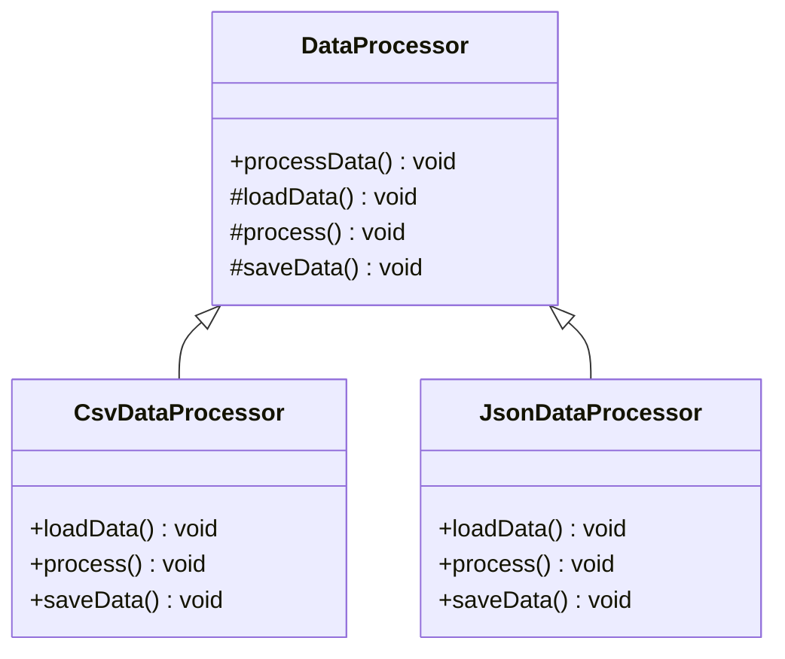

## 6.10.1 Implementing Template Method in TypeScript

The Template Method Pattern is a behavioral design pattern that defines the skeleton of an algorithm in a method, deferring some steps to subclasses. It allows subclasses to redefine certain steps of an algorithm without changing its structure. This pattern is particularly useful when you have a series of steps that are common across multiple implementations, but some of the steps need to be customized.

### Understanding the Template Method Pattern

The Template Method Pattern is based on the idea of defining a method that outlines the steps of an algorithm. This method is called the **template method**. The template method itself is often declared in an abstract class and calls other methods, some of which are abstract and must be implemented by subclasses. This allows subclasses to provide specific behavior for certain steps of the algorithm while keeping the overall structure intact.

#### Key Components

1. **Abstract Class**: This class defines the template method and declares abstract methods for steps that need customization.
2. **Template Method**: A method that defines the algorithm's structure by calling other methods, some of which are abstract.
3. **Abstract Methods**: Methods declared in the abstract class that must be implemented by subclasses.
4. **Concrete Class**: Subclasses that implement the abstract methods and provide specific behavior for the algorithm's steps.

### Implementing the Template Method Pattern in TypeScript

Let's dive into an example to understand how to implement the Template Method Pattern in TypeScript.

#### Step 1: Define the Abstract Class

The abstract class will contain the template method and abstract methods. In TypeScript, we use the `abstract` keyword to define abstract classes and methods.

```typescript
abstract class DataProcessor {
  // The template method defines the skeleton of the algorithm
  public processData(): void {
    this.loadData();
    this.process();
    this.saveData();
  }

  // Abstract methods to be implemented by subclasses
  protected abstract loadData(): void;
  protected abstract process(): void;
  protected abstract saveData(): void;
}
```

**Explanation**: 
- The `processData` method is the template method that outlines the steps of the algorithm.
- The `loadData`, `process`, and `saveData` methods are abstract and must be implemented by subclasses. They represent the customizable steps of the algorithm.

#### Step 2: Implement Concrete Classes

Concrete classes extend the abstract class and provide specific implementations for the abstract methods.

```typescript
class CsvDataProcessor extends DataProcessor {
  protected loadData(): void {
    console.log("Loading data from CSV file...");
  }

  protected process(): void {
    console.log("Processing CSV data...");
  }

  protected saveData(): void {
    console.log("Saving processed CSV data...");
  }
}

class JsonDataProcessor extends DataProcessor {
  protected loadData(): void {
    console.log("Loading data from JSON file...");
  }

  protected process(): void {
    console.log("Processing JSON data...");
  }

  protected saveData(): void {
    console.log("Saving processed JSON data...");
  }
}
```

**Explanation**:
- `CsvDataProcessor` and `JsonDataProcessor` are concrete classes that implement the abstract methods from `DataProcessor`.
- Each class provides its own implementation for loading, processing, and saving data.

#### Step 3: Use the Template Method

Now, let's see how the template method can be used to process data.

```typescript
const csvProcessor = new CsvDataProcessor();
csvProcessor.processData();

const jsonProcessor = new JsonDataProcessor();
jsonProcessor.processData();
```

**Output**:
```
Loading data from CSV file...
Processing CSV data...
Saving processed CSV data...
Loading data from JSON file...
Processing JSON data...
Saving processed JSON data...
```

**Explanation**:
- The `processData` method is called on instances of `CsvDataProcessor` and `JsonDataProcessor`.
- The template method ensures that the algorithm's steps are executed in the correct order, while the concrete classes provide specific behavior for each step.

### Access Modifiers in TypeScript

TypeScript provides access modifiers to control the visibility of class members. In the Template Method Pattern, we often use `protected` and `abstract` modifiers.

- **`protected`**: Members marked as `protected` can be accessed within the class and by subclasses. This is useful for methods that should only be used as part of the algorithm's steps.
- **`abstract`**: The `abstract` modifier is used to declare methods that must be implemented by subclasses. Abstract methods cannot have an implementation in the abstract class.

### Best Practices for the Template Method Pattern

1. **Avoid Overriding the Template Method**: The template method should define the algorithm's structure and should not be overridden by subclasses. This ensures that the algorithm's steps are executed in the correct order.

2. **Use Hook Methods**: If you need to allow subclasses to modify the algorithm's behavior, consider using hook methods. These are optional methods that can be overridden by subclasses to add additional behavior.

3. **Keep the Template Method Simple**: The template method should be simple and only outline the steps of the algorithm. Complex logic should be handled in the abstract methods.

4. **Document the Algorithm**: Clearly document the algorithm's steps and the purpose of each abstract method. This helps maintainers understand the intended behavior and customization points.

### Visualizing the Template Method Pattern

To better understand the Template Method Pattern, let's visualize the relationship between the abstract class and concrete classes using a class diagram.



**Diagram Explanation**:
- `DataProcessor` is the abstract class with the template method `processData` and abstract methods `loadData`, `process`, and `saveData`.
- `CsvDataProcessor` and `JsonDataProcessor` are concrete classes that implement the abstract methods.

### Try It Yourself

To reinforce your understanding of the Template Method Pattern, try modifying the example code:

1. **Add a New Concrete Class**: Create a new class `XmlDataProcessor` that processes XML data. Implement the `loadData`, `process`, and `saveData` methods with appropriate console messages.

2. **Introduce a Hook Method**: Add a hook method `validateData` to the `DataProcessor` class. This method should be optional and can be overridden by subclasses to perform data validation.

3. **Experiment with Access Modifiers**: Change the access modifiers of the abstract methods and observe the impact on the code. Try making them `public` and see if it affects encapsulation.

### Knowledge Check

Before we wrap up, let's test your understanding of the Template Method Pattern with a few questions:

1. What is the purpose of the template method in the Template Method Pattern?
2. How do abstract methods contribute to the Template Method Pattern?
3. Why should the template method not be overridden by subclasses?
4. What role do hook methods play in the Template Method Pattern?
5. How do access modifiers like `protected` and `abstract` enhance the implementation of the Template Method Pattern?

### Summary

In this section, we explored the Template Method Pattern and its implementation in TypeScript. We learned how to define an abstract class with a template method and abstract methods, and how to create concrete classes that provide specific implementations for these methods. We also discussed best practices for designing template methods and the importance of access modifiers in enforcing the intended usage.

Remember, the Template Method Pattern is a powerful tool for defining algorithms with customizable steps. By following best practices and leveraging TypeScript's features, you can create flexible and maintainable code that adheres to this pattern.

### Further Reading

For more information on the Template Method Pattern and other design patterns, consider exploring the following resources:

- [Design Patterns: Elements of Reusable Object-Oriented Software](https://en.wikipedia.org/wiki/Design_Patterns)
- [TypeScript Documentation](https://www.typescriptlang.org/docs/)
- [MDN Web Docs: Classes](https://developer.mozilla.org/en-US/docs/Web/JavaScript/Reference/Classes)

## Quiz Time!



### What is the primary purpose of the template method in the Template Method Pattern?

- [x] To define the skeleton of an algorithm
- [ ] To provide specific implementations for algorithm steps
- [ ] To override the behavior of subclasses
- [ ] To handle complex logic within the abstract class

> **Explanation:** The template method defines the skeleton of an algorithm, outlining the steps to be performed, while allowing subclasses to customize specific steps.

### Which keyword is used to declare a method that must be implemented by subclasses in TypeScript?

- [ ] public
- [ ] private
- [x] abstract
- [ ] static

> **Explanation:** The `abstract` keyword is used to declare methods that must be implemented by subclasses, ensuring that they provide specific behavior for those methods.

### Why should the template method not be overridden by subclasses?

- [x] To maintain the algorithm's structure
- [ ] To allow subclasses to customize behavior
- [ ] To simplify the abstract class
- [ ] To improve performance

> **Explanation:** The template method should not be overridden by subclasses to maintain the algorithm's structure and ensure that the steps are executed in the correct order.

### What is the role of hook methods in the Template Method Pattern?

- [ ] To define the algorithm's structure
- [x] To provide optional customization points
- [ ] To enforce strict behavior
- [ ] To replace abstract methods

> **Explanation:** Hook methods provide optional customization points for subclasses, allowing them to modify the algorithm's behavior without altering the template method.

### Which access modifier allows a method to be accessed within the class and by subclasses?

- [ ] public
- [x] protected
- [ ] private
- [ ] static

> **Explanation:** The `protected` access modifier allows a method to be accessed within the class and by subclasses, making it suitable for methods used in the algorithm's steps.

### How can you ensure that subclasses provide specific behavior for certain steps in the Template Method Pattern?

- [ ] By using public methods
- [x] By declaring abstract methods
- [ ] By overriding the template method
- [ ] By using static methods

> **Explanation:** Abstract methods ensure that subclasses provide specific behavior for certain steps, as they must be implemented by the subclasses.

### What is a best practice for designing template methods?

- [x] Keep the template method simple
- [ ] Include complex logic in the template method
- [ ] Allow subclasses to override the template method
- [ ] Avoid using abstract methods

> **Explanation:** Keeping the template method simple ensures that it only outlines the steps of the algorithm, while complex logic is handled in the abstract methods.

### What should you do if you need to allow subclasses to modify the algorithm's behavior?

- [ ] Override the template method
- [x] Use hook methods
- [ ] Use static methods
- [ ] Make all methods public

> **Explanation:** Hook methods allow subclasses to modify the algorithm's behavior without altering the template method, providing flexibility and customization.

### Which of the following is NOT a component of the Template Method Pattern?

- [ ] Abstract Class
- [ ] Template Method
- [ ] Concrete Class
- [x] Singleton Class

> **Explanation:** The Singleton Class is not a component of the Template Method Pattern. The pattern involves an abstract class, a template method, and concrete classes.

### True or False: The Template Method Pattern allows subclasses to redefine the entire algorithm.

- [ ] True
- [x] False

> **Explanation:** False. The Template Method Pattern allows subclasses to customize specific steps of the algorithm, but the overall structure is defined by the template method and should not be redefined.



Remember, this is just the beginning. As you progress, you'll build more complex and interactive applications using the Template Method Pattern. Keep experimenting, stay curious, and enjoy the journey!
