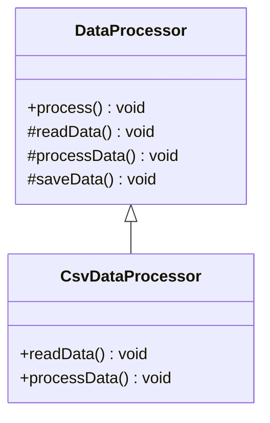

## 6.10.2 Defining Algorithm Steps

In this section, we delve into the intricacies of defining algorithm steps within the Template Method Pattern using TypeScript. This pattern is a powerful tool in the software engineer's toolkit, allowing for the creation of flexible and reusable code structures. By understanding how to define both mandatory and optional algorithm steps, you can leverage the Template Method Pattern to enforce consistent algorithm structures across subclasses while allowing for customization where necessary.

### Understanding the Template Method Pattern

The Template Method Pattern is a behavioral design pattern that defines the skeleton of an algorithm in a base class, allowing subclasses to override specific steps of the algorithm without changing its structure. This pattern is particularly useful when you want to ensure that the overall process remains consistent, but certain parts of the process can vary.

#### Key Components

1. **Abstract Methods**: These are mandatory steps in the algorithm that subclasses must implement. They define the essential parts of the algorithm that need to be customized for each subclass.

2. **Concrete Methods**: These are steps that have a default implementation in the base class. Subclasses can choose to override these methods to change their behavior.

3. **Template Method**: This is the method in the base class that defines the sequence of steps in the algorithm. It calls both abstract and concrete methods to execute the algorithm.

### Defining Algorithm Steps

#### Abstract Methods: Mandatory Steps

Abstract methods are the backbone of the Template Method Pattern. They represent the steps in the algorithm that are essential and must be implemented by subclasses. By defining these methods as abstract, you enforce a contract that any subclass must fulfill.

##### Example: Abstract Method in TypeScript

```typescript
abstract class DataProcessor {
  // Template method
  public process(): void {
    this.readData();
    this.processData();
    this.saveData();
  }

  // Abstract method: must be implemented by subclasses
  protected abstract readData(): void;

  // Abstract method: must be implemented by subclasses
  protected abstract processData(): void;

  // Concrete method with default implementation
  protected saveData(): void {
    console.log("Data saved to database.");
  }
}

class CsvDataProcessor extends DataProcessor {
  protected readData(): void {
    console.log("Reading data from CSV file.");
  }

  protected processData(): void {
    console.log("Processing CSV data.");
  }
}
```

In this example, `readData` and `processData` are abstract methods that subclasses like `CsvDataProcessor` must implement. This ensures that every subclass provides its own way of reading and processing data, while the overall process remains consistent.

#### Concrete Methods: Optional Hooks

Concrete methods in the Template Method Pattern serve as optional hooks. These methods have a default implementation in the base class, but subclasses can override them to provide specific behavior. This flexibility allows for customization without altering the algorithm's structure.

##### Example: Concrete Method with Default Implementation

```typescript
abstract class ReportGenerator {
  public generateReport(): void {
    this.fetchData();
    this.formatReport();
    this.printReport();
  }

  protected fetchData(): void {
    console.log("Fetching data from default source.");
  }

  protected abstract formatReport(): void;

  protected printReport(): void {
    console.log("Printing report.");
  }
}

class PdfReportGenerator extends ReportGenerator {
  protected formatReport(): void {
    console.log("Formatting report as PDF.");
  }

  // Optional override of fetchData
  protected fetchData(): void {
    console.log("Fetching data from PDF-specific source.");
  }
}
```

Here, `fetchData` is a concrete method with a default implementation. The `PdfReportGenerator` subclass can override this method to fetch data from a specific source, demonstrating the flexibility of optional hooks.

### Extending and Modifying Behavior

Subclasses can extend or modify behavior by overriding abstract methods and optional hooks. This capability allows developers to tailor the algorithm's steps to meet specific requirements while maintaining the overall structure defined by the template method.

#### Benefits of the Template Method Pattern

1. **Code Reuse**: By defining the algorithm's structure in a base class, you can reuse this structure across multiple subclasses, reducing code duplication.

2. **Consistency**: The template method ensures that the algorithm's structure remains consistent, even as subclasses provide different implementations for specific steps.

3. **Flexibility**: Optional hooks allow subclasses to customize behavior without altering the core algorithm, providing flexibility where needed.

### Considerations for Subclass Implementation

When implementing subclasses, it's crucial to ensure that they do not violate the intended flow of the algorithm. Here are some considerations to keep in mind:

1. **Adherence to the Template**: Subclasses should adhere to the sequence of steps defined by the template method. Avoid altering the order of method calls in the template method.

2. **Override with Caution**: While overriding concrete methods is allowed, it should be done with caution to ensure that the algorithm's integrity is maintained.

3. **Avoiding Side Effects**: Ensure that overridden methods do not introduce side effects that could disrupt the algorithm's flow or produce inconsistent results.

### Visualizing the Template Method Pattern

To better understand the Template Method Pattern, let's visualize the relationship between the base class and its subclasses using a class diagram.



This diagram illustrates how `CsvDataProcessor` inherits from `DataProcessor` and implements the abstract methods `readData` and `processData`.

### Try It Yourself

To deepen your understanding of the Template Method Pattern, try modifying the provided examples:

1. **Add a New Subclass**: Create a new subclass of `DataProcessor` that reads and processes data from a JSON file. Implement the `readData` and `processData` methods accordingly.

2. **Override a Concrete Method**: In the `PdfReportGenerator` example, try overriding the `printReport` method to send the report to a network printer instead of printing it locally.

3. **Experiment with Hooks**: Add a new optional hook method to the `ReportGenerator` class, such as `validateData`, and provide a default implementation. Override this method in a subclass to perform specific validation checks.

### References and Further Reading

- [MDN Web Docs: Inheritance and the prototype chain](https://developer.mozilla.org/en-US/docs/Web/JavaScript/Inheritance_and_the_prototype_chain)
- [Refactoring Guru: Template Method Pattern](https://refactoring.guru/design-patterns/template-method)
- [TypeScript Handbook: Classes](https://www.typescriptlang.org/docs/handbook/classes.html)

### Knowledge Check

To reinforce your understanding, consider the following questions:

1. What is the primary purpose of the Template Method Pattern?
2. How do abstract methods differ from concrete methods in the context of this pattern?
3. Why is it important to maintain the sequence of steps in the template method?
4. What are the potential risks of overriding concrete methods in subclasses?

### Embrace the Journey

Remember, mastering design patterns is a journey. As you continue to explore and apply these patterns, you'll gain a deeper understanding of how to create robust and maintainable software. Keep experimenting, stay curious, and enjoy the process!

## Quiz Time!



### What is the primary purpose of the Template Method Pattern?

- [x] To define the skeleton of an algorithm in a base class and allow subclasses to override specific steps.
- [ ] To encapsulate a request as an object, allowing parameterization and queuing.
- [ ] To provide a way to access elements of a collection sequentially.
- [ ] To define a one-to-many dependency between objects.

> **Explanation:** The Template Method Pattern is designed to define the skeleton of an algorithm in a base class, allowing subclasses to override specific steps without changing the algorithm's structure.

### How do abstract methods differ from concrete methods in the Template Method Pattern?

- [x] Abstract methods must be implemented by subclasses, while concrete methods have default implementations.
- [ ] Abstract methods have default implementations, while concrete methods must be implemented by subclasses.
- [ ] Both abstract and concrete methods must be implemented by subclasses.
- [ ] Neither abstract nor concrete methods can be overridden by subclasses.

> **Explanation:** Abstract methods are mandatory steps that subclasses must implement, whereas concrete methods have default implementations that can be optionally overridden by subclasses.

### Why is it important to maintain the sequence of steps in the template method?

- [x] To ensure the algorithm's structure and flow remain consistent across subclasses.
- [ ] To allow subclasses to change the order of method calls as needed.
- [ ] To prevent subclasses from overriding any methods.
- [ ] To ensure that all methods are implemented in the base class.

> **Explanation:** Maintaining the sequence of steps in the template method ensures that the algorithm's structure and flow remain consistent, even as subclasses provide different implementations for specific steps.

### What are the potential risks of overriding concrete methods in subclasses?

- [x] Introducing side effects that disrupt the algorithm's flow.
- [ ] Making the algorithm more efficient.
- [ ] Ensuring that all methods are implemented in the base class.
- [ ] Preventing subclasses from implementing abstract methods.

> **Explanation:** Overriding concrete methods can introduce side effects that disrupt the algorithm's flow or produce inconsistent results, so it should be done with caution.

### What is an optional hook in the Template Method Pattern?

- [x] A concrete method with a default implementation that can be overridden by subclasses.
- [ ] An abstract method that must be implemented by subclasses.
- [ ] A method that cannot be overridden by subclasses.
- [ ] A method that defines the sequence of steps in the algorithm.

> **Explanation:** An optional hook is a concrete method with a default implementation that subclasses can choose to override to customize behavior.

### How can subclasses extend or modify behavior in the Template Method Pattern?

- [x] By overriding abstract methods and optional hooks.
- [ ] By changing the template method's sequence of steps.
- [ ] By implementing new methods in the base class.
- [ ] By preventing other subclasses from overriding methods.

> **Explanation:** Subclasses can extend or modify behavior by overriding abstract methods and optional hooks, allowing them to tailor specific steps of the algorithm.

### What is the role of the template method in the Template Method Pattern?

- [x] To define the sequence of steps in the algorithm.
- [ ] To implement all methods in the base class.
- [ ] To allow subclasses to change the order of method calls.
- [ ] To encapsulate a request as an object.

> **Explanation:** The template method defines the sequence of steps in the algorithm, calling both abstract and concrete methods to execute the process.

### What is the benefit of using the Template Method Pattern?

- [x] It promotes code reuse and consistency while allowing for customization.
- [ ] It allows for complete freedom in changing the algorithm's structure.
- [ ] It prevents subclasses from implementing any methods.
- [ ] It ensures that all methods are implemented in the base class.

> **Explanation:** The Template Method Pattern promotes code reuse and consistency by defining the algorithm's structure in a base class while allowing subclasses to customize specific steps.

### What should subclasses avoid when implementing the Template Method Pattern?

- [x] Violating the intended flow of the algorithm.
- [ ] Implementing abstract methods.
- [ ] Overriding optional hooks.
- [ ] Using the template method.

> **Explanation:** Subclasses should avoid violating the intended flow of the algorithm to ensure that the overall process remains consistent and produces expected results.

### True or False: The Template Method Pattern allows subclasses to override the sequence of steps in the template method.

- [ ] True
- [x] False

> **Explanation:** False. The Template Method Pattern does not allow subclasses to override the sequence of steps in the template method; it ensures that the sequence remains consistent while allowing customization of specific steps.


