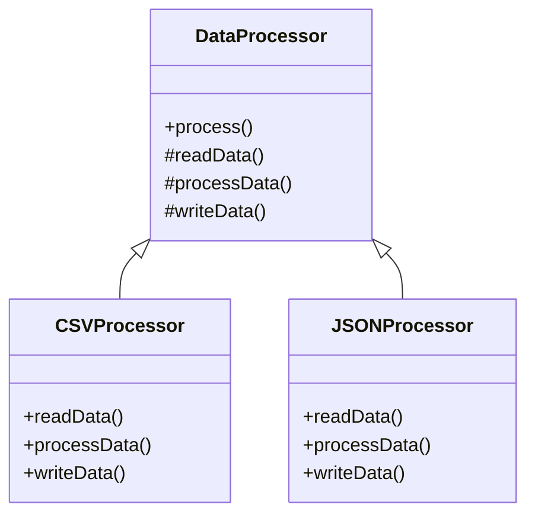

## 6.10.3 Use Cases and Examples

The Template Method Pattern is a powerful behavioral design pattern that defines the skeleton of an algorithm in a method, deferring some steps to subclasses. This pattern allows subclasses to redefine certain steps of an algorithm without changing its structure. In this section, we will explore practical scenarios where the Template Method Pattern can be effectively applied, such as data processing pipelines, game AI, and testing frameworks. We will also discuss how this pattern promotes consistency and code reuse, along with potential challenges and considerations.

### Understanding the Template Method Pattern

Before diving into specific use cases, let's briefly recap the Template Method Pattern. The pattern involves a base class that defines the template method, which outlines the algorithm's structure. This method calls other methods, some of which are abstract and meant to be implemented by subclasses. This structure allows for the invariant parts of the algorithm to be maintained in the base class while allowing subclasses to customize specific steps.

```typescript
abstract class DataProcessor {
  // Template method
  public process(): void {
    this.readData();
    this.processData();
    this.writeData();
  }

  protected abstract readData(): void;
  protected abstract processData(): void;
  protected abstract writeData(): void;
}
```

In this example, `process` is the template method that defines the algorithm's structure. The methods `readData`, `processData`, and `writeData` are abstract and must be implemented by subclasses.

### Use Case 1: Data Processing Pipelines

Data processing often involves handling different file formats, each requiring specific parsing logic. The Template Method Pattern is ideal for this scenario, as it allows us to define a common workflow for processing data while enabling format-specific parsing in subclasses.

#### Example: Parsing Different File Formats

Consider a scenario where we need to process CSV, JSON, and XML files. We can define a base class `FileProcessor` with a template method `processFile`, which outlines the steps for reading, parsing, and saving data. Subclasses like `CSVProcessor`, `JSONProcessor`, and `XMLProcessor` implement format-specific parsing logic.

```typescript
abstract class FileProcessor {
  public processFile(filePath: string): void {
    const data = this.readFile(filePath);
    const parsedData = this.parseData(data);
    this.saveData(parsedData);
  }

  protected abstract readFile(filePath: string): string;
  protected abstract parseData(data: string): any;
  protected abstract saveData(data: any): void;
}

class CSVProcessor extends FileProcessor {
  protected readFile(filePath: string): string {
    // Read CSV file
    return "CSV data";
  }

  protected parseData(data: string): any {
    // Parse CSV data
    return { parsed: "CSV" };
  }

  protected saveData(data: any): void {
    // Save parsed CSV data
    console.log("Saving CSV data:", data);
  }
}

class JSONProcessor extends FileProcessor {
  protected readFile(filePath: string): string {
    // Read JSON file
    return '{"key": "value"}';
  }

  protected parseData(data: string): any {
    // Parse JSON data
    return JSON.parse(data);
  }

  protected saveData(data: any): void {
    // Save parsed JSON data
    console.log("Saving JSON data:", data);
  }
}
```

#### Benefits

- **Consistency**: The template method ensures that all file types are processed using the same workflow.
- **Code Reuse**: Common steps like reading and saving data are implemented once in the base class.
- **Flexibility**: New file formats can be added easily by creating new subclasses.

#### Challenges

- **Subclass Alignment**: Ensuring that subclasses correctly implement the abstract methods and align with the intended algorithm can be challenging.
- **Complexity**: Overuse of inheritance can lead to complex class hierarchies.

### Use Case 2: Game AI Behavior

In game development, AI behaviors often follow a high-level strategy with specific actions that vary based on the game context. The Template Method Pattern allows us to define a general strategy in the base class while enabling specific actions in subclasses.

#### Example: Implementing Game AI

Imagine a game where different types of enemies have distinct attack strategies. We can define a base class `EnemyAI` with a template method `executeStrategy`, which outlines the steps for detecting the player, deciding on an action, and executing the attack. Subclasses like `MeleeEnemyAI` and `RangedEnemyAI` implement specific attack logic.

```typescript
abstract class EnemyAI {
  public executeStrategy(): void {
    this.detectPlayer();
    this.decideAction();
    this.executeAttack();
  }

  protected abstract detectPlayer(): void;
  protected abstract decideAction(): void;
  protected abstract executeAttack(): void;
}

class MeleeEnemyAI extends EnemyAI {
  protected detectPlayer(): void {
    console.log("Detecting player for melee attack.");
  }

  protected decideAction(): void {
    console.log("Deciding melee attack action.");
  }

  protected executeAttack(): void {
    console.log("Executing melee attack.");
  }
}

class RangedEnemyAI extends EnemyAI {
  protected detectPlayer(): void {
    console.log("Detecting player for ranged attack.");
  }

  protected decideAction(): void {
    console.log("Deciding ranged attack action.");
  }

  protected executeAttack(): void {
    console.log("Executing ranged attack.");
  }
}
```

#### Benefits

- **Consistency**: The template method ensures a consistent strategy execution flow for all enemy types.
- **Code Reuse**: Common steps like detecting the player are implemented once in the base class.
- **Extensibility**: New enemy types can be added by creating new subclasses.

#### Challenges

- **Subclass Complexity**: As the number of enemy types grows, managing subclass complexity can become challenging.
- **Behavior Alignment**: Ensuring that specific behaviors align with the overall strategy requires careful design.

### Use Case 3: Testing Framework

Testing frameworks often require a consistent setup and teardown process, with specific test cases varying based on the application. The Template Method Pattern allows us to define common setup and teardown logic in the base class while enabling specific test cases in subclasses.

#### Example: Building a Testing Framework

Consider a testing framework where each test requires setup, execution, and teardown. We can define a base class `TestCase` with a template method `runTest`, which outlines these steps. Subclasses implement specific test logic.

```typescript
abstract class TestCase {
  public runTest(): void {
    this.setUp();
    this.executeTest();
    this.tearDown();
  }

  protected abstract setUp(): void;
  protected abstract executeTest(): void;
  protected abstract tearDown(): void;
}

class DatabaseTest extends TestCase {
  protected setUp(): void {
    console.log("Setting up database connection.");
  }

  protected executeTest(): void {
    console.log("Executing database test.");
  }

  protected tearDown(): void {
    console.log("Tearing down database connection.");
  }
}

class APITest extends TestCase {
  protected setUp(): void {
    console.log("Setting up API environment.");
  }

  protected executeTest(): void {
    console.log("Executing API test.");
  }

  protected tearDown(): void {
    console.log("Tearing down API environment.");
  }
}
```

#### Benefits

- **Consistency**: The template method ensures a consistent testing process for all test cases.
- **Code Reuse**: Common setup and teardown logic are implemented once in the base class.
- **Flexibility**: New test cases can be added by creating new subclasses.

#### Challenges

- **Test Case Alignment**: Ensuring that test cases align with the intended testing process requires careful design.
- **Subclass Management**: As the number of test cases grows, managing subclass complexity can become challenging.

### Visualizing the Template Method Pattern

To better understand the Template Method Pattern, let's visualize the relationship between the base class and its subclasses using a class diagram.



**Diagram Description**: This class diagram illustrates the Template Method Pattern. The `DataProcessor` class defines the `process` template method and abstract methods `readData`, `processData`, and `writeData`. The `CSVProcessor` and `JSONProcessor` subclasses implement these abstract methods.

### Try It Yourself

To deepen your understanding of the Template Method Pattern, try modifying the provided code examples:

- **Add a new file format**: Implement a new subclass for a different file format, such as XML, and integrate it into the data processing pipeline.
- **Create a new enemy type**: Implement a new subclass for a different enemy type in the game AI example, and define its specific behavior.
- **Develop a new test case**: Implement a new subclass for a different type of test case in the testing framework example, and define its specific setup, execution, and teardown logic.

### Knowledge Check

- **What is the primary benefit of using the Template Method Pattern?**
- **How does the Template Method Pattern promote code reuse?**
- **What are some potential challenges when using the Template Method Pattern?**

### Conclusion

The Template Method Pattern is a versatile design pattern that promotes consistency and code reuse by defining the skeleton of an algorithm in a base class and allowing subclasses to implement specific steps. It is particularly useful in scenarios where algorithms have invariant steps and varying behaviors, such as data processing pipelines, game AI, and testing frameworks. By understanding and applying this pattern, developers can create flexible and maintainable codebases.

## Quiz Time!



### What is the primary benefit of using the Template Method Pattern?

- [x] Promotes consistency and code reuse
- [ ] Simplifies complex algorithms
- [ ] Enhances performance
- [ ] Reduces memory usage

> **Explanation:** The Template Method Pattern promotes consistency and code reuse by defining the skeleton of an algorithm in a base class and allowing subclasses to implement specific steps.

### How does the Template Method Pattern promote code reuse?

- [x] By implementing common steps in the base class
- [ ] By duplicating code across subclasses
- [ ] By using global variables
- [ ] By avoiding inheritance

> **Explanation:** The Template Method Pattern promotes code reuse by implementing common steps in the base class, allowing subclasses to focus on specific steps.

### What is a potential challenge when using the Template Method Pattern?

- [x] Ensuring subclass alignment with the intended algorithm
- [ ] Reducing code duplication
- [ ] Improving performance
- [ ] Simplifying class hierarchies

> **Explanation:** A potential challenge is ensuring that subclasses correctly implement the abstract methods and align with the intended algorithm.

### In the data processing pipeline example, what does the `processFile` method represent?

- [x] The template method
- [ ] An abstract method
- [ ] A concrete method
- [ ] A utility function

> **Explanation:** The `processFile` method represents the template method, which outlines the steps for processing a file.

### What is the role of the `executeStrategy` method in the game AI example?

- [x] Defines the high-level strategy for enemy behavior
- [ ] Implements specific attack logic
- [ ] Detects the player
- [ ] Saves game data

> **Explanation:** The `executeStrategy` method defines the high-level strategy for enemy behavior, with specific actions implemented in subclasses.

### In the testing framework example, what is the purpose of the `runTest` method?

- [x] Outlines the steps for running a test case
- [ ] Executes the test logic
- [ ] Sets up the test environment
- [ ] Tears down the test environment

> **Explanation:** The `runTest` method outlines the steps for running a test case, including setup, execution, and teardown.

### How can the Template Method Pattern be extended to support new behaviors?

- [x] By creating new subclasses
- [ ] By modifying the base class
- [ ] By using global variables
- [ ] By avoiding inheritance

> **Explanation:** The Template Method Pattern can be extended by creating new subclasses that implement specific behaviors.

### What is a potential drawback of using the Template Method Pattern?

- [x] Complexity in managing subclass hierarchies
- [ ] Increased code duplication
- [ ] Reduced flexibility
- [ ] Poor performance

> **Explanation:** A potential drawback is the complexity in managing subclass hierarchies as the number of subclasses grows.

### What is the primary focus of the Template Method Pattern?

- [x] Defining the skeleton of an algorithm
- [ ] Optimizing performance
- [ ] Reducing memory usage
- [ ] Simplifying code

> **Explanation:** The primary focus of the Template Method Pattern is defining the skeleton of an algorithm in a base class.

### True or False: The Template Method Pattern allows subclasses to redefine the entire algorithm.

- [ ] True
- [x] False

> **Explanation:** False. The Template Method Pattern allows subclasses to redefine specific steps of an algorithm, not the entire algorithm.


