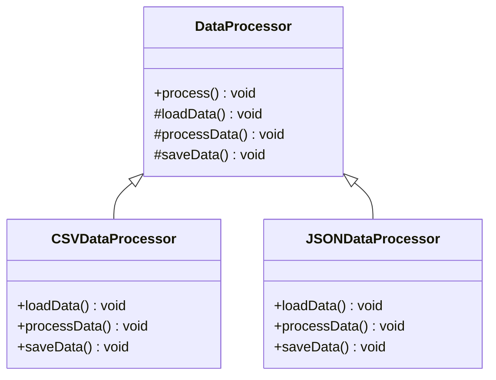

## 6.10 Template Method Pattern

### Introduction

The Template Method Pattern is a behavioral design pattern that defines the skeleton of an algorithm in a method, deferring some steps to subclasses. This pattern allows subclasses to redefine certain steps of an algorithm without changing its structure. It is a powerful tool for promoting code reuse and consistency while allowing customization where necessary.

### Understanding the Template Method Pattern

#### Definition and Intent

The Template Method Pattern is used to define the basic steps of an algorithm in a method, known as the template method, while allowing subclasses to provide specific implementations for one or more of these steps. This pattern is particularly useful when you have a set of related algorithms that share a common structure but differ in some details.

**Intent**: The primary intent of the Template Method Pattern is to promote code reuse and consistency by defining a common algorithm structure while allowing subclasses to customize specific steps.

#### Problems Solved

The Template Method Pattern addresses several common software design problems:

- **Code Reuse**: By defining the common structure of an algorithm in a base class, you can reuse this structure across multiple subclasses, reducing code duplication.
- **Consistency**: The pattern ensures that the overall structure of the algorithm remains consistent across subclasses, even if specific steps vary.
- **Customization**: Subclasses can customize specific steps of the algorithm without affecting the overall structure, allowing for flexible and adaptable code.

### Key Components

The Template Method Pattern involves two main components:

1. **AbstractClass**: This class defines the template method and any abstract methods that subclasses must implement. The template method outlines the algorithm's structure, calling abstract methods at appropriate points.

2. **ConcreteClass**: This class implements the abstract methods defined in the AbstractClass, providing specific behavior for the steps of the algorithm.

#### AbstractClass

The AbstractClass is the core of the Template Method Pattern. It defines the template method, which outlines the algorithm's structure, and any abstract methods that subclasses must implement. The template method typically consists of a series of method calls, some of which are abstract and must be implemented by subclasses.

```typescript
abstract class DataProcessor {
    // Template method
    public process(): void {
        this.loadData();
        this.processData();
        this.saveData();
    }

    // Abstract methods to be implemented by subclasses
    protected abstract loadData(): void;
    protected abstract processData(): void;
    protected abstract saveData(): void;
}
```

In this example, the `DataProcessor` class defines a template method `process()` that outlines the steps of a data processing algorithm. The `loadData()`, `processData()`, and `saveData()` methods are abstract and must be implemented by subclasses.

#### ConcreteClass

The ConcreteClass implements the abstract methods defined in the AbstractClass, providing specific behavior for the steps of the algorithm. Each ConcreteClass can provide a different implementation for these methods, allowing for customization of the algorithm's behavior.

```typescript
class CSVDataProcessor extends DataProcessor {
    protected loadData(): void {
        console.log("Loading CSV data...");
        // Load CSV data
    }

    protected processData(): void {
        console.log("Processing CSV data...");
        // Process CSV data
    }

    protected saveData(): void {
        console.log("Saving CSV data...");
        // Save processed data
    }
}

class JSONDataProcessor extends DataProcessor {
    protected loadData(): void {
        console.log("Loading JSON data...");
        // Load JSON data
    }

    protected processData(): void {
        console.log("Processing JSON data...");
        // Process JSON data
    }

    protected saveData(): void {
        console.log("Saving JSON data...");
        // Save processed data
    }
}
```

In this example, `CSVDataProcessor` and `JSONDataProcessor` are ConcreteClasses that implement the abstract methods defined in `DataProcessor`. Each class provides specific behavior for loading, processing, and saving data.

### Visualizing the Template Method Pattern

To better understand the Template Method Pattern, let's visualize the inheritance relationships between the AbstractClass and ConcreteClasses using a class diagram.



**Diagram Description**: This class diagram illustrates the Template Method Pattern. The `DataProcessor` class defines the template method `process()` and abstract methods `loadData()`, `processData()`, and `saveData()`. The `CSVDataProcessor` and `JSONDataProcessor` classes extend `DataProcessor` and implement the abstract methods, providing specific behavior for each step of the algorithm.

### The Hollywood Principle

The Template Method Pattern promotes the Hollywood Principle: "Don't call us; we'll call you." This principle emphasizes the inversion of control, where the framework or base class controls the flow of the program and calls specific methods implemented by subclasses.

In the Template Method Pattern, the template method in the AbstractClass controls the algorithm's flow, calling abstract methods implemented by subclasses at appropriate points. This approach ensures that the overall structure of the algorithm remains consistent while allowing for customization.

### TypeScript-Specific Features

TypeScript provides several features that enhance the implementation of the Template Method Pattern:

- **Abstract Classes and Methods**: TypeScript's support for abstract classes and methods allows you to define the template method and abstract methods in the AbstractClass, ensuring that subclasses implement the necessary methods.
- **Access Modifiers**: TypeScript's access modifiers (e.g., `protected`, `private`) allow you to control the visibility of methods and properties, ensuring that the template method and abstract methods are only accessible within the class hierarchy.
- **Type Annotations**: TypeScript's type annotations provide additional type safety, ensuring that methods are implemented with the correct signatures.

### Try It Yourself

Let's encourage experimentation by suggesting modifications to the code examples. Try implementing a new `XMLDataProcessor` class that extends `DataProcessor` and provides specific behavior for loading, processing, and saving XML data.

```typescript
class XMLDataProcessor extends DataProcessor {
    protected loadData(): void {
        console.log("Loading XML data...");
        // Load XML data
    }

    protected processData(): void {
        console.log("Processing XML data...");
        // Process XML data
    }

    protected saveData(): void {
        console.log("Saving XML data...");
        // Save processed data
    }
}

// Test the XMLDataProcessor
const xmlProcessor = new XMLDataProcessor();
xmlProcessor.process();
```

### Knowledge Check

- **Question**: What is the primary intent of the Template Method Pattern?
- **Answer**: The primary intent is to define the skeleton of an algorithm in a method, allowing subclasses to customize specific steps without changing the algorithm's structure.

- **Question**: How does the Template Method Pattern promote the Hollywood Principle?
- **Answer**: The pattern promotes the Hollywood Principle by allowing the base class to control the flow of the algorithm, calling specific methods implemented by subclasses.

### Exercises

1. Implement a `PDFDataProcessor` class that extends `DataProcessor` and provides specific behavior for loading, processing, and saving PDF data.
2. Modify the `DataProcessor` class to include a new abstract method `validateData()` and update the ConcreteClasses to implement this method.

### Summary

The Template Method Pattern is a powerful tool for promoting code reuse and consistency while allowing customization. By defining the skeleton of an algorithm in a method and deferring specific steps to subclasses, you can create flexible and adaptable code that adheres to the Hollywood Principle. TypeScript's support for abstract classes, access modifiers, and type annotations enhances the implementation of this pattern, providing additional type safety and control.

### Further Reading

- [MDN Web Docs: Inheritance in JavaScript](https://developer.mozilla.org/en-US/docs/Web/JavaScript/Inheritance_and_the_prototype_chain)
- [TypeScript Handbook: Classes](https://www.typescriptlang.org/docs/handbook/classes.html)

### Embrace the Journey

Remember, this is just the beginning. As you progress, you'll build more complex and interactive applications using the Template Method Pattern. Keep experimenting, stay curious, and enjoy the journey!

## Quiz Time!



### What is the primary intent of the Template Method Pattern?

- [x] To define the skeleton of an algorithm in a method, allowing subclasses to customize specific steps without changing the algorithm's structure.
- [ ] To create a single instance of a class.
- [ ] To provide a way to access elements of a collection sequentially.
- [ ] To encapsulate a request as an object.

> **Explanation:** The Template Method Pattern is designed to define the skeleton of an algorithm in a method, allowing subclasses to customize specific steps without altering the overall structure.

### Which class defines the template method in the Template Method Pattern?

- [x] AbstractClass
- [ ] ConcreteClass
- [ ] Interface
- [ ] Singleton

> **Explanation:** The AbstractClass defines the template method, which outlines the algorithm's structure and calls abstract methods that subclasses must implement.

### How does the Template Method Pattern promote code reuse?

- [x] By defining a common algorithm structure in a base class that can be reused across multiple subclasses.
- [ ] By allowing multiple instances of a class to share the same state.
- [ ] By providing a way to access elements of a collection sequentially.
- [ ] By encapsulating a request as an object.

> **Explanation:** The Template Method Pattern promotes code reuse by defining a common algorithm structure in a base class, which can be reused across multiple subclasses.

### What principle does the Template Method Pattern promote?

- [x] Hollywood Principle
- [ ] Single Responsibility Principle
- [ ] Open/Closed Principle
- [ ] Dependency Inversion Principle

> **Explanation:** The Template Method Pattern promotes the Hollywood Principle: "Don't call us; we'll call you," by allowing the base class to control the flow of the algorithm.

### Which TypeScript feature enhances the implementation of the Template Method Pattern?

- [x] Abstract classes and methods
- [ ] Interfaces
- [ ] Enums
- [ ] Generics

> **Explanation:** TypeScript's support for abstract classes and methods enhances the implementation of the Template Method Pattern by allowing you to define the template method and abstract methods in the AbstractClass.

### What is the role of the ConcreteClass in the Template Method Pattern?

- [x] To implement the abstract methods defined in the AbstractClass, providing specific behavior for the steps of the algorithm.
- [ ] To define the template method and abstract methods.
- [ ] To create a single instance of a class.
- [ ] To provide a way to access elements of a collection sequentially.

> **Explanation:** The ConcreteClass implements the abstract methods defined in the AbstractClass, providing specific behavior for the steps of the algorithm.

### How does the Template Method Pattern ensure consistency?

- [x] By defining the overall structure of the algorithm in a base class, ensuring it remains consistent across subclasses.
- [ ] By allowing multiple instances of a class to share the same state.
- [ ] By providing a way to access elements of a collection sequentially.
- [ ] By encapsulating a request as an object.

> **Explanation:** The Template Method Pattern ensures consistency by defining the overall structure of the algorithm in a base class, ensuring it remains consistent across subclasses.

### What is the Hollywood Principle?

- [x] "Don't call us; we'll call you."
- [ ] "Keep it simple, stupid."
- [ ] "You aren't gonna need it."
- [ ] "Composition over inheritance."

> **Explanation:** The Hollywood Principle is "Don't call us; we'll call you," emphasizing the inversion of control, where the framework or base class controls the flow of the program.

### Which of the following is a benefit of using the Template Method Pattern?

- [x] It allows for customization of specific steps in an algorithm without changing its overall structure.
- [ ] It creates a single instance of a class.
- [ ] It provides a way to access elements of a collection sequentially.
- [ ] It encapsulates a request as an object.

> **Explanation:** The Template Method Pattern allows for customization of specific steps in an algorithm without changing its overall structure, promoting flexibility and adaptability.

### True or False: The Template Method Pattern is a structural design pattern.

- [ ] True
- [x] False

> **Explanation:** The Template Method Pattern is a behavioral design pattern, not a structural design pattern.


