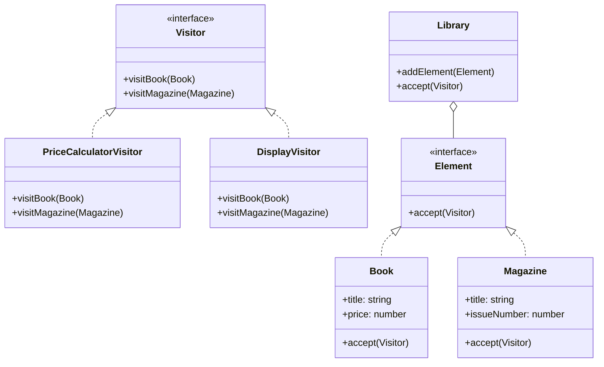

## 6.11.1 Implementing Visitor in TypeScript

The Visitor Pattern is a behavioral design pattern that allows you to separate algorithms from the objects on which they operate. This separation provides a way to add new operations to existing object structures without modifying those structures. In this section, we will explore how to implement the Visitor Pattern in TypeScript, leveraging its type system to create flexible and maintainable code.

### Understanding the Visitor Pattern

The Visitor Pattern involves several key components:

1. **Visitor Interface**: Defines a `visit` method for each `ConcreteElement` type.
2. **ConcreteVisitor**: Implements the `Visitor` interface and provides specific operations for each element type.
3. **Element Interface**: Declares an `accept` method that takes a visitor as an argument.
4. **ConcreteElement**: Implements the `Element` interface and calls the visitor's `visit` method in `accept`.
5. **ObjectStructure**: Holds elements and allows the visitor to traverse them.

Let's delve into each component with TypeScript code examples.

### Defining the Visitor Interface

The `Visitor` interface declares a `visit` method for each `ConcreteElement` type. This interface allows visitors to perform operations on elements without knowing their concrete classes.

```typescript
// Visitor.ts
interface Visitor {
  visitBook(book: Book): void;
  visitMagazine(magazine: Magazine): void;
}
```

### Implementing ConcreteVisitor Classes

Concrete visitors implement the `Visitor` interface and provide specific operations for each element type. This is where the actual logic for processing elements resides.

```typescript
// ConcreteVisitor.ts
class PriceCalculatorVisitor implements Visitor {
  visitBook(book: Book): void {
    console.log(`Calculating price for book: ${book.title}`);
    // Implement price calculation logic for books
  }

  visitMagazine(magazine: Magazine): void {
    console.log(`Calculating price for magazine: ${magazine.title}`);
    // Implement price calculation logic for magazines
  }
}

class DisplayVisitor implements Visitor {
  visitBook(book: Book): void {
    console.log(`Displaying book: ${book.title}`);
    // Implement display logic for books
  }

  visitMagazine(magazine: Magazine): void {
    console.log(`Displaying magazine: ${magazine.title}`);
    // Implement display logic for magazines
  }
}
```

### Defining the Element Interface

The `Element` interface declares an `accept` method that takes a visitor as an argument. This method allows elements to accept visitors and delegate the processing to them.

```typescript
// Element.ts
interface Element {
  accept(visitor: Visitor): void;
}
```

### Implementing ConcreteElement Classes

Concrete elements implement the `Element` interface and call the visitor's `visit` method in `accept`. This is where double dispatch comes into play, allowing the correct method to be selected based on both the element and visitor types.

```typescript
// ConcreteElement.ts
class Book implements Element {
  constructor(public title: string, public price: number) {}

  accept(visitor: Visitor): void {
    visitor.visitBook(this);
  }
}

class Magazine implements Element {
  constructor(public title: string, public issueNumber: number) {}

  accept(visitor: Visitor): void {
    visitor.visitMagazine(this);
  }
}
```

### Creating an ObjectStructure

The `ObjectStructure` holds elements and allows the visitor to traverse them. It can be a simple collection of elements or a more complex structure.

```typescript
// ObjectStructure.ts
class Library {
  private elements: Element[] = [];

  addElement(element: Element): void {
    this.elements.push(element);
  }

  accept(visitor: Visitor): void {
    for (const element of this.elements) {
      element.accept(visitor);
    }
  }
}
```

### How Double Dispatch Works

Double dispatch is a technique used in the Visitor Pattern to select the correct method based on both the visitor and element types. In TypeScript, this is achieved through the `accept` method in `ConcreteElement` classes, which calls the appropriate `visit` method on the visitor.

### Handling Elements of Different Types

TypeScript's type system aids in handling elements of different types by ensuring that each `ConcreteElement` implements the `accept` method, which enforces type safety. This allows us to define operations specific to each element type without casting or type checking.

### Considerations and Potential Tight Coupling

While the Visitor Pattern provides flexibility in adding new operations, it can lead to tight coupling between visitors and element classes. Each time a new element type is added, all visitor classes must be updated to handle the new type. This trade-off should be considered when deciding to use the Visitor Pattern.

### Try It Yourself

To experiment with the Visitor Pattern, try modifying the `PriceCalculatorVisitor` to apply discounts based on the element type or add a new `ConcreteVisitor` that collects statistics about the elements.

### Visualizing the Visitor Pattern

Below is a class diagram illustrating the relationships between the components of the Visitor Pattern:



### Key Takeaways

- The Visitor Pattern allows you to separate algorithms from the objects on which they operate, facilitating the addition of new operations.
- Double dispatch is used to select the correct method based on both the visitor and element types.
- TypeScript's type system aids in handling elements of different types, ensuring type safety.
- While the pattern provides flexibility, it can lead to tight coupling between visitors and element classes.

### Further Reading

For more information on the Visitor Pattern, consider exploring the following resources:

- [Visitor Pattern on Wikipedia](https://en.wikipedia.org/wiki/Visitor_pattern)
- [TypeScript Handbook](https://www.typescriptlang.org/docs/handbook/intro.html)
- [Design Patterns: Elements of Reusable Object-Oriented Software](https://en.wikipedia.org/wiki/Design_Patterns)

## Quiz Time!



### What is the primary purpose of the Visitor Pattern?

- [x] To separate algorithms from the objects on which they operate
- [ ] To encapsulate object creation
- [ ] To provide a simplified interface to a complex subsystem
- [ ] To allow incompatible interfaces to work together

> **Explanation:** The Visitor Pattern is designed to separate algorithms from the objects on which they operate, allowing new operations to be added without modifying the objects.

### How does double dispatch work in the Visitor Pattern?

- [x] It selects the correct method based on both the visitor and element types
- [ ] It allows objects to change their behavior when their internal state changes
- [ ] It provides a way to access elements of a collection sequentially
- [ ] It defines a one-to-many dependency between objects

> **Explanation:** Double dispatch in the Visitor Pattern involves selecting the correct method based on both the visitor and element types, enabling the appropriate operation to be executed.

### Which method do `ConcreteElement` classes implement in the Visitor Pattern?

- [x] `accept`
- [ ] `visit`
- [ ] `execute`
- [ ] `handle`

> **Explanation:** `ConcreteElement` classes implement the `accept` method, which takes a visitor as an argument and calls the visitor's `visit` method.

### What is a potential downside of using the Visitor Pattern?

- [x] Tight coupling between visitors and element classes
- [ ] Difficulty in adding new operations
- [ ] Increased complexity in object creation
- [ ] Reduced flexibility in object interactions

> **Explanation:** A potential downside of the Visitor Pattern is the tight coupling between visitors and element classes, as all visitors must be updated to handle new element types.

### How does TypeScript's type system aid in implementing the Visitor Pattern?

- [x] By ensuring type safety and handling elements of different types
- [ ] By simplifying object creation
- [ ] By providing a simplified interface to complex subsystems
- [ ] By allowing incompatible interfaces to work together

> **Explanation:** TypeScript's type system aids in implementing the Visitor Pattern by ensuring type safety and handling elements of different types without casting or type checking.

### What is the role of the `Visitor` interface in the Visitor Pattern?

- [x] To define a `visit` method for each `ConcreteElement` type
- [ ] To encapsulate object creation
- [ ] To provide a simplified interface to a complex subsystem
- [ ] To allow incompatible interfaces to work together

> **Explanation:** The `Visitor` interface defines a `visit` method for each `ConcreteElement` type, allowing visitors to perform operations on elements without knowing their concrete classes.

### What is the main advantage of using the Visitor Pattern?

- [x] It allows new operations to be added without modifying existing object structures
- [ ] It simplifies object creation
- [ ] It reduces the complexity of object interactions
- [ ] It provides a simplified interface to complex subsystems

> **Explanation:** The main advantage of the Visitor Pattern is that it allows new operations to be added without modifying existing object structures, enhancing flexibility and maintainability.

### Which component of the Visitor Pattern holds elements and allows the visitor to traverse them?

- [x] ObjectStructure
- [ ] Visitor
- [ ] ConcreteElement
- [ ] Element

> **Explanation:** The `ObjectStructure` holds elements and allows the visitor to traverse them, facilitating the application of operations to each element.

### True or False: The Visitor Pattern is a creational design pattern.

- [ ] True
- [x] False

> **Explanation:** False. The Visitor Pattern is a behavioral design pattern, not a creational one.

### What is the role of `ConcreteVisitor` classes in the Visitor Pattern?

- [x] To implement the `Visitor` interface and provide specific operations for each element type
- [ ] To encapsulate object creation
- [ ] To provide a simplified interface to a complex subsystem
- [ ] To allow incompatible interfaces to work together

> **Explanation:** `ConcreteVisitor` classes implement the `Visitor` interface and provide specific operations for each element type, containing the logic for processing elements.



Remember, this is just the beginning. As you progress, you'll build more complex and interactive applications using the Visitor Pattern. Keep experimenting, stay curious, and enjoy the journey!
