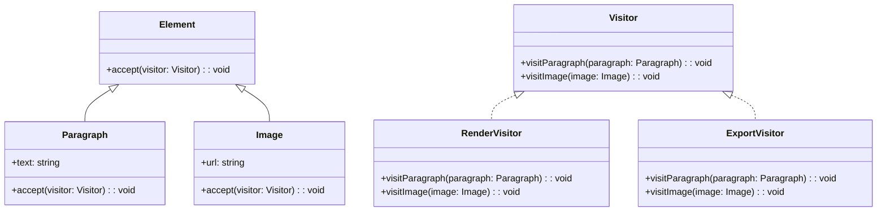

## 6.11.2 Operations on Object Structures

The Visitor Pattern is a powerful design pattern that allows you to add new operations to object structures without modifying the classes of the elements on which it operates. This pattern is particularly useful when you have a complex object structure and you need to perform various operations on it, such as rendering, exporting, or analysis. In this section, we will delve into how the Visitor Pattern can be implemented in TypeScript, its benefits, and the trade-offs involved.

### Understanding the Visitor Pattern

The Visitor Pattern involves two main components: the visitor and the elements it visits. The elements are part of an object structure, and the visitor is an object that implements an operation to be performed on the elements. The key idea is to separate the algorithm from the object structure, allowing new operations to be added without altering the existing structure.

#### Key Concepts

- **Visitor**: An interface or abstract class that declares a visit method for each type of element in the object structure.
- **Concrete Visitor**: A class that implements the visitor interface and defines the operations to be performed on the elements.
- **Element**: An interface or abstract class that declares an accept method, which takes a visitor as an argument.
- **Concrete Element**: A class that implements the element interface and defines the accept method to call the appropriate visit method on the visitor.

### Implementing the Visitor Pattern in TypeScript

Let's explore how to implement the Visitor Pattern in TypeScript with a practical example. Suppose we have a simple document structure with different types of elements: `Paragraph` and `Image`. We want to perform operations like rendering and exporting on these elements.

#### Step 1: Define the Element Interface

First, we define an interface for the elements in our object structure. This interface will declare the `accept` method that takes a visitor as an argument.

```typescript
// Element.ts
export interface Element {
  accept(visitor: Visitor): void;
}
```

#### Step 2: Define the Visitor Interface

Next, we define an interface for the visitor. This interface will declare a visit method for each type of element.

```typescript
// Visitor.ts
import { Paragraph } from './Paragraph';
import { Image } from './Image';

export interface Visitor {
  visitParagraph(paragraph: Paragraph): void;
  visitImage(image: Image): void;
}
```

#### Step 3: Implement Concrete Elements

Now, let's implement the concrete elements. Each element will implement the `accept` method to call the appropriate visit method on the visitor.

```typescript
// Paragraph.ts
import { Element } from './Element';
import { Visitor } from './Visitor';

export class Paragraph implements Element {
  constructor(public text: string) {}

  accept(visitor: Visitor): void {
    visitor.visitParagraph(this);
  }
}

// Image.ts
import { Element } from './Element';
import { Visitor } from './Visitor';

export class Image implements Element {
  constructor(public url: string) {}

  accept(visitor: Visitor): void {
    visitor.visitImage(this);
  }
}
```

#### Step 4: Implement Concrete Visitors

Finally, we implement concrete visitors that define the operations to be performed on the elements.

```typescript
// RenderVisitor.ts
import { Visitor } from './Visitor';
import { Paragraph } from './Paragraph';
import { Image } from './Image';

export class RenderVisitor implements Visitor {
  visitParagraph(paragraph: Paragraph): void {
    console.log(`Rendering paragraph: ${paragraph.text}`);
  }

  visitImage(image: Image): void {
    console.log(`Rendering image from URL: ${image.url}`);
  }
}

// ExportVisitor.ts
import { Visitor } from './Visitor';
import { Paragraph } from './Paragraph';
import { Image } from './Image';

export class ExportVisitor implements Visitor {
  visitParagraph(paragraph: Paragraph): void {
    console.log(`Exporting paragraph: ${paragraph.text}`);
  }

  visitImage(image: Image): void {
    console.log(`Exporting image from URL: ${image.url}`);
  }
}
```

#### Step 5: Using the Visitor Pattern

To use the Visitor Pattern, we create instances of the elements and visitors and call the `accept` method on each element.

```typescript
// Main.ts
import { Paragraph } from './Paragraph';
import { Image } from './Image';
import { RenderVisitor } from './RenderVisitor';
import { ExportVisitor } from './ExportVisitor';

const elements = [
  new Paragraph('Hello, world!'),
  new Image('https://example.com/image.png')
];

const renderVisitor = new RenderVisitor();
const exportVisitor = new ExportVisitor();

elements.forEach(element => {
  element.accept(renderVisitor);
  element.accept(exportVisitor);
});
```

### Benefits of the Visitor Pattern

The Visitor Pattern provides several benefits, particularly in adhering to the Open/Closed Principle, which states that software entities should be open for extension but closed for modification. By using the Visitor Pattern, you can add new operations to existing object structures without modifying the classes of the elements.

#### Adding New Operations

One of the main advantages of the Visitor Pattern is the ease with which you can add new operations. For example, if you want to add a new operation for serialization, you can simply create a new visitor class without changing the existing element classes.

```typescript
// SerializeVisitor.ts
import { Visitor } from './Visitor';
import { Paragraph } from './Paragraph';
import { Image } from './Image';

export class SerializeVisitor implements Visitor {
  visitParagraph(paragraph: Paragraph): void {
    console.log(`Serializing paragraph: ${JSON.stringify(paragraph)}`);
  }

  visitImage(image: Image): void {
    console.log(`Serializing image: ${JSON.stringify(image)}`);
  }
}
```

#### Supporting Multiple Operations

The Visitor Pattern allows you to support multiple operations on the same object structure. This can be particularly useful in scenarios where you need to perform different types of processing on the same data, such as rendering, exporting, serialization, validation, or code generation.

### Trade-offs and Considerations

While the Visitor Pattern offers significant advantages, it also comes with trade-offs. One of the main drawbacks is that adding new element classes requires updating all existing visitors. This can be cumbersome if the object structure changes frequently.

#### Managing Changes

To manage the impact of changes, consider the following strategies:

- **Interface Segregation**: Use smaller, more focused visitor interfaces to reduce the number of methods that need to be implemented in each visitor.
- **Default Implementations**: Provide default implementations for visitor methods to minimize the impact of adding new element classes.
- **Documentation and Communication**: Clearly document the responsibilities of each visitor and communicate changes to the team to ensure consistency.

### Visualizing the Visitor Pattern

To better understand the Visitor Pattern, let's visualize the relationships between the elements and visitors using a class diagram.



### Try It Yourself

To deepen your understanding of the Visitor Pattern, try modifying the code examples provided:

1. **Add a New Element**: Create a new element class, such as `Table`, and update the visitors to handle this new element.
2. **Create a New Visitor**: Implement a new visitor class that performs a different operation, such as validation or code generation.
3. **Experiment with Default Implementations**: Modify the visitor interface to include default implementations for some methods and observe how this affects the concrete visitors.

### References and Further Reading

For more information on the Visitor Pattern and its applications, consider exploring the following resources:

- [Design Patterns: Elements of Reusable Object-Oriented Software](https://en.wikipedia.org/wiki/Design_Patterns) by Erich Gamma, Richard Helm, Ralph Johnson, and John Vlissides
- [Refactoring Guru: Visitor Pattern](https://refactoring.guru/design-patterns/visitor)
- [MDN Web Docs: TypeScript](https://developer.mozilla.org/en-US/docs/Web/JavaScript/Reference/Global_Objects/TypeScript)

### Knowledge Check

Before moving on, take a moment to review the key concepts covered in this section:

- The Visitor Pattern allows adding new operations to object structures without modifying the element classes.
- New visitors can be created to perform different operations, such as rendering, exporting, or analysis.
- The pattern adheres to the Open/Closed Principle for operations but requires updating visitors when new element classes are added.
- Strategies for managing changes include interface segregation, default implementations, and clear documentation.

Remember, mastering design patterns is a journey. Keep experimenting, stay curious, and enjoy the process of learning and applying these powerful tools in your software development projects.

## Quiz Time!



### What is the main advantage of using the Visitor Pattern?

- [x] It allows adding new operations without modifying existing element classes.
- [ ] It simplifies the addition of new element classes.
- [ ] It reduces the number of classes in the system.
- [ ] It eliminates the need for interfaces.

> **Explanation:** The Visitor Pattern allows adding new operations to existing object structures without modifying the classes of the elements, adhering to the Open/Closed Principle.

### Which method must each element class implement in the Visitor Pattern?

- [x] accept
- [ ] visit
- [ ] execute
- [ ] process

> **Explanation:** Each element class must implement the `accept` method, which takes a visitor as an argument and calls the appropriate visit method on the visitor.

### What is a trade-off of the Visitor Pattern?

- [x] Adding new element classes requires updating all existing visitors.
- [ ] It increases the complexity of the object structure.
- [ ] It limits the number of operations that can be performed.
- [ ] It makes the code less readable.

> **Explanation:** One of the trade-offs of the Visitor Pattern is that adding new element classes requires updating all existing visitors, which can be cumbersome if the object structure changes frequently.

### How can you manage the impact of changes when using the Visitor Pattern?

- [x] Use interface segregation and default implementations.
- [ ] Avoid adding new element classes.
- [ ] Use a single visitor for all operations.
- [ ] Eliminate the use of interfaces.

> **Explanation:** To manage the impact of changes, you can use interface segregation to reduce the number of methods in each visitor and provide default implementations for visitor methods.

### What is the role of the visitor in the Visitor Pattern?

- [x] To define operations to be performed on elements.
- [ ] To create new element classes.
- [ ] To manage the lifecycle of elements.
- [ ] To store data for elements.

> **Explanation:** The visitor defines operations to be performed on elements, allowing new operations to be added without modifying the element classes.

### Which of the following is NOT a benefit of the Visitor Pattern?

- [ ] Adheres to the Open/Closed Principle.
- [ ] Supports multiple operations on the same object structure.
- [ ] Simplifies the addition of new element classes.
- [x] Reduces the number of classes in the system.

> **Explanation:** While the Visitor Pattern adheres to the Open/Closed Principle and supports multiple operations, it does not simplify the addition of new element classes or reduce the number of classes in the system.

### What is the purpose of the `accept` method in the Visitor Pattern?

- [x] To allow a visitor to perform an operation on an element.
- [ ] To create a new visitor.
- [ ] To initialize an element.
- [ ] To store data in an element.

> **Explanation:** The `accept` method allows a visitor to perform an operation on an element by calling the appropriate visit method on the visitor.

### How does the Visitor Pattern adhere to the Open/Closed Principle?

- [x] By allowing new operations to be added without modifying existing element classes.
- [ ] By reducing the number of classes in the system.
- [ ] By simplifying the addition of new element classes.
- [ ] By eliminating the need for interfaces.

> **Explanation:** The Visitor Pattern adheres to the Open/Closed Principle by allowing new operations to be added without modifying existing element classes.

### What is a common use case for the Visitor Pattern?

- [x] Performing multiple operations on a complex object structure.
- [ ] Simplifying the addition of new element classes.
- [ ] Reducing the number of classes in the system.
- [ ] Eliminating the need for interfaces.

> **Explanation:** A common use case for the Visitor Pattern is performing multiple operations on a complex object structure, such as rendering, exporting, or analysis.

### True or False: The Visitor Pattern makes it easy to add new element classes.

- [ ] True
- [x] False

> **Explanation:** False. While the Visitor Pattern makes it easy to add new operations, adding new element classes requires updating all existing visitors, which can be cumbersome.


