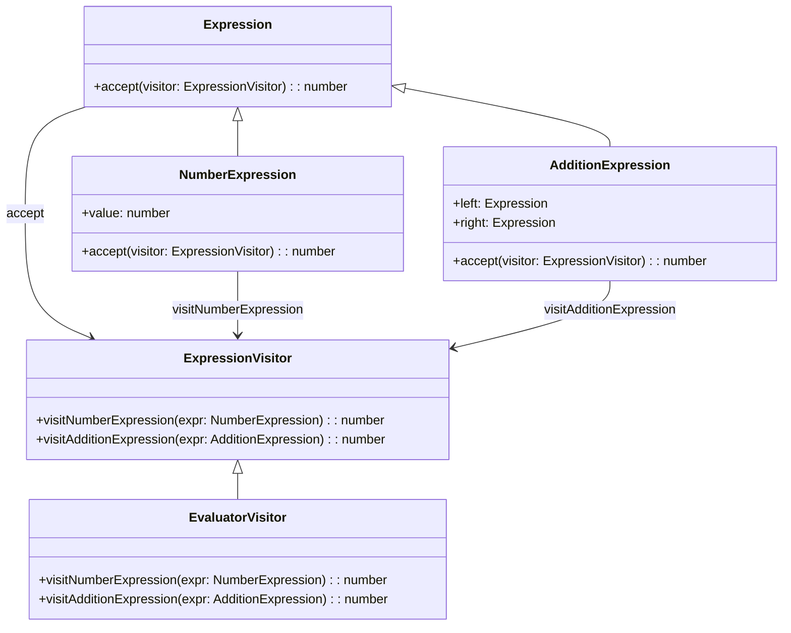

## 6.11.3 Use Cases and Examples

The Visitor Pattern is a powerful design pattern that allows you to add new operations to existing object structures without modifying the structures themselves. This is particularly useful in scenarios where you need to perform various unrelated operations across a set of objects, such as traversing an Abstract Syntax Tree (AST), implementing rendering engines, or analyzing object structures. In this section, we will explore practical use cases of the Visitor Pattern and provide detailed examples in TypeScript.

### Traversing an Abstract Syntax Tree (AST)

An Abstract Syntax Tree (AST) is a tree representation of the abstract syntactic structure of source code. Each node in the tree denotes a construct occurring in the source code. The Visitor Pattern is particularly useful for traversing ASTs in compilers or interpreters, where you might need to perform operations like interpreting, compiling, or optimizing code.

#### Example: AST Traversal for Code Interpretation

Let's consider a simple interpreter for arithmetic expressions. We'll use the Visitor Pattern to evaluate expressions represented as an AST.

```typescript
// Define the Element interface
interface Expression {
  accept(visitor: ExpressionVisitor): number;
}

// Concrete Element classes
class NumberExpression implements Expression {
  constructor(public value: number) {}

  accept(visitor: ExpressionVisitor): number {
    return visitor.visitNumberExpression(this);
  }
}

class AdditionExpression implements Expression {
  constructor(public left: Expression, public right: Expression) {}

  accept(visitor: ExpressionVisitor): number {
    return visitor.visitAdditionExpression(this);
  }
}

// Visitor interface
interface ExpressionVisitor {
  visitNumberExpression(expr: NumberExpression): number;
  visitAdditionExpression(expr: AdditionExpression): number;
}

// Concrete Visitor class
class EvaluatorVisitor implements ExpressionVisitor {
  visitNumberExpression(expr: NumberExpression): number {
    return expr.value;
  }

  visitAdditionExpression(expr: AdditionExpression): number {
    return expr.left.accept(this) + expr.right.accept(this);
  }
}

// Usage
const expr = new AdditionExpression(
  new NumberExpression(5),
  new AdditionExpression(new NumberExpression(3), new NumberExpression(2))
);

const evaluator = new EvaluatorVisitor();
console.log(`Result: ${expr.accept(evaluator)}`); // Output: Result: 10
```

In this example, we define an `Expression` interface with concrete classes `NumberExpression` and `AdditionExpression`. The `EvaluatorVisitor` class implements the `ExpressionVisitor` interface and provides the logic for evaluating each type of expression.

### Implementing Formatting or Rendering Engines

The Visitor Pattern can also be applied to formatting or rendering engines, where you need to traverse a document object model (DOM) and apply specific formatting rules or rendering logic.

#### Example: HTML Rendering Engine

Consider a simple HTML rendering engine that converts a DOM-like structure into an HTML string.

```typescript
// Define the Element interface
interface HTMLElement {
  accept(visitor: HTMLVisitor): string;
}

// Concrete Element classes
class ParagraphElement implements HTMLElement {
  constructor(public text: string) {}

  accept(visitor: HTMLVisitor): string {
    return visitor.visitParagraphElement(this);
  }
}

class BoldElement implements HTMLElement {
  constructor(public content: HTMLElement) {}

  accept(visitor: HTMLVisitor): string {
    return visitor.visitBoldElement(this);
  }
}

// Visitor interface
interface HTMLVisitor {
  visitParagraphElement(element: ParagraphElement): string;
  visitBoldElement(element: BoldElement): string;
}

// Concrete Visitor class
class HTMLRenderer implements HTMLVisitor {
  visitParagraphElement(element: ParagraphElement): string {
    return `<p>${element.text}</p>`;
  }

  visitBoldElement(element: BoldElement): string {
    return `<b>${element.content.accept(this)}</b>`;
  }
}

// Usage
const paragraph = new ParagraphElement("Hello, World!");
const boldParagraph = new BoldElement(paragraph);

const renderer = new HTMLRenderer();
console.log(renderer.visitBoldElement(boldParagraph)); // Output: <b><p>Hello, World!</p></b>
```

In this example, we define an `HTMLElement` interface with concrete classes `ParagraphElement` and `BoldElement`. The `HTMLRenderer` class implements the `HTMLVisitor` interface and provides the logic for rendering each type of element.

### Analyzing Object Structures for Code Metrics or Testing

The Visitor Pattern is also useful for analyzing object structures, such as calculating code metrics or performing testing operations. By separating the analysis logic from the object structure, you can easily add new analysis operations without modifying the existing classes.

#### Example: Code Metrics Calculation

Let's consider a simple example where we calculate the number of lines of code (LOC) in a program represented as an AST.

```typescript
// Define the Element interface
interface CodeElement {
  accept(visitor: CodeMetricsVisitor): number;
}

// Concrete Element classes
class CodeLine implements CodeElement {
  constructor(public content: string) {}

  accept(visitor: CodeMetricsVisitor): number {
    return visitor.visitCodeLine(this);
  }
}

class CodeBlock implements CodeElement {
  constructor(public lines: CodeElement[]) {}

  accept(visitor: CodeMetricsVisitor): number {
    return visitor.visitCodeBlock(this);
  }
}

// Visitor interface
interface CodeMetricsVisitor {
  visitCodeLine(line: CodeLine): number;
  visitCodeBlock(block: CodeBlock): number;
}

// Concrete Visitor class
class LOCVisitor implements CodeMetricsVisitor {
  visitCodeLine(line: CodeLine): number {
    return 1;
  }

  visitCodeBlock(block: CodeBlock): number {
    return block.lines.reduce((acc, line) => acc + line.accept(this), 0);
  }
}

// Usage
const code = new CodeBlock([
  new CodeLine("let x = 10;"),
  new CodeLine("x += 5;"),
  new CodeBlock([
    new CodeLine("if (x > 10) {"),
    new CodeLine("  console.log(x);"),
    new CodeLine("}")
  ])
]);

const locVisitor = new LOCVisitor();
console.log(`Lines of Code: ${code.accept(locVisitor)}`); // Output: Lines of Code: 5
```

In this example, we define a `CodeElement` interface with concrete classes `CodeLine` and `CodeBlock`. The `LOCVisitor` class implements the `CodeMetricsVisitor` interface and provides the logic for calculating the number of lines of code.

### Challenges and Considerations

While the Visitor Pattern offers many advantages, it also comes with certain challenges:

1. **Complexity in Managing Multiple Visitors**: As the number of visitors increases, managing them can become complex. Each visitor may have its own logic, and coordinating them can be challenging.

2. **Handling New Element Types**: Adding new element types requires updating all existing visitors to handle the new types. This can be cumbersome if there are many visitors.

3. **Performance Overhead**: The Visitor Pattern can introduce performance overhead due to the additional method calls and object traversals.

Despite these challenges, the Visitor Pattern remains a valuable tool for scenarios where you need to perform operations across complex object structures. By separating the operations from the object structure, you gain flexibility and maintainability.

### Encouragement to Use the Visitor Pattern

When faced with the need to perform multiple operations across a complex object structure, consider the Visitor Pattern. It provides a clean separation of concerns, allowing you to add new operations without modifying the existing structure. This can lead to more maintainable and extensible code.

### Try It Yourself

To gain a deeper understanding of the Visitor Pattern, try modifying the examples provided:

- **Extend the AST Traversal Example**: Add support for subtraction and multiplication expressions. Implement the necessary classes and update the `EvaluatorVisitor` to handle these new expressions.

- **Enhance the HTML Rendering Engine**: Add support for additional HTML elements, such as `div` and `span`. Implement the necessary classes and update the `HTMLRenderer` to render these elements.

- **Expand the Code Metrics Calculation**: Add support for calculating additional metrics, such as the number of functions or classes in the code. Implement the necessary classes and update the `LOCVisitor` to calculate these metrics.

By experimenting with these examples, you'll gain a deeper understanding of the Visitor Pattern and its applications.

### Visualizing the Visitor Pattern

To better understand the Visitor Pattern, let's visualize the interaction between the elements and the visitor.



This diagram illustrates the relationship between the `Expression` elements and the `ExpressionVisitor`. Each element class implements the `accept` method, which calls the corresponding `visit` method on the visitor.

### References and Links

For further reading on the Visitor Pattern and its applications, consider the following resources:

- [Visitor Pattern on Wikipedia](https://en.wikipedia.org/wiki/Visitor_pattern)
- [Design Patterns: Elements of Reusable Object-Oriented Software](https://en.wikipedia.org/wiki/Design_Patterns) by Erich Gamma, Richard Helm, Ralph Johnson, and John Vlissides
- [TypeScript Handbook](https://www.typescriptlang.org/docs/handbook/intro.html)

### Knowledge Check

Before we conclude, let's test your understanding of the Visitor Pattern with a few questions:

- **What is the primary benefit of using the Visitor Pattern?**
- **How does the Visitor Pattern enable operations on complex object structures?**
- **What are some challenges associated with the Visitor Pattern?**

### Embrace the Journey

Remember, mastering design patterns is a journey. As you continue to explore and apply the Visitor Pattern, you'll discover new ways to enhance your code's flexibility and maintainability. Keep experimenting, stay curious, and enjoy the journey!

## Quiz Time!



### What is the primary benefit of using the Visitor Pattern?

- [x] It allows adding new operations without modifying existing classes.
- [ ] It simplifies the class hierarchy.
- [ ] It reduces the number of classes needed.
- [ ] It improves the performance of the application.

> **Explanation:** The Visitor Pattern allows adding new operations to existing class structures without modifying the classes themselves, enhancing flexibility and maintainability.

### How does the Visitor Pattern enable operations on complex object structures?

- [x] By separating operations from the object structure.
- [ ] By embedding operations within the object classes.
- [ ] By reducing the number of operations needed.
- [ ] By simplifying the object structure.

> **Explanation:** The Visitor Pattern separates operations from the object structure, allowing new operations to be added without altering the existing classes.

### What is a potential challenge of using the Visitor Pattern?

- [x] Managing multiple visitors can become complex.
- [ ] It reduces code readability.
- [ ] It increases the number of classes needed.
- [ ] It simplifies the class hierarchy.

> **Explanation:** Managing multiple visitors can become complex, especially when there are many operations to perform on the object structure.

### In the AST Traversal example, what does the `EvaluatorVisitor` do?

- [x] Evaluates arithmetic expressions.
- [ ] Parses the source code.
- [ ] Optimizes the code.
- [ ] Compiles the code.

> **Explanation:** The `EvaluatorVisitor` evaluates arithmetic expressions represented as an AST.

### What is a common use case for the Visitor Pattern?

- [x] Traversing an Abstract Syntax Tree (AST).
- [ ] Implementing a singleton class.
- [ ] Managing application state.
- [ ] Handling user input.

> **Explanation:** A common use case for the Visitor Pattern is traversing an Abstract Syntax Tree (AST) to perform operations like interpreting or compiling code.

### How can the Visitor Pattern be used in a rendering engine?

- [x] By applying specific formatting rules to elements.
- [ ] By reducing the number of elements in the DOM.
- [ ] By simplifying the rendering logic.
- [ ] By embedding rendering logic within the elements.

> **Explanation:** The Visitor Pattern can be used in a rendering engine to apply specific formatting rules to elements without modifying the elements themselves.

### What is a benefit of using the Visitor Pattern for code metrics calculation?

- [x] It allows adding new metrics without modifying existing classes.
- [ ] It reduces the number of lines of code.
- [ ] It simplifies the code structure.
- [ ] It improves the performance of the calculation.

> **Explanation:** The Visitor Pattern allows adding new metrics calculations without modifying the existing classes, enhancing flexibility.

### What is a potential drawback of the Visitor Pattern?

- [x] Performance overhead due to additional method calls.
- [ ] It reduces code readability.
- [ ] It simplifies the class hierarchy.
- [ ] It increases the number of classes needed.

> **Explanation:** The Visitor Pattern can introduce performance overhead due to additional method calls and object traversals.

### How does the Visitor Pattern enhance maintainability?

- [x] By separating operations from the object structure.
- [ ] By embedding operations within the object classes.
- [ ] By reducing the number of operations needed.
- [ ] By simplifying the object structure.

> **Explanation:** The Visitor Pattern enhances maintainability by separating operations from the object structure, allowing new operations to be added without altering the existing classes.

### True or False: The Visitor Pattern is only useful for AST traversal.

- [ ] True
- [x] False

> **Explanation:** False. The Visitor Pattern is useful for various scenarios, including AST traversal, rendering engines, and code metrics calculation.


