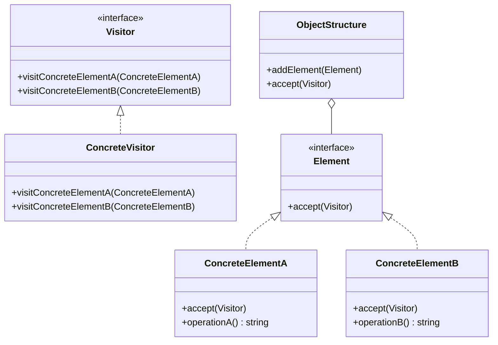

## 6.11 Visitor Pattern

The Visitor Pattern is a powerful behavioral design pattern that allows you to add new operations to existing object structures without altering their classes. This pattern is particularly useful when you need to perform various operations across a set of objects with different interfaces or classes. By separating the operations from the objects, the Visitor Pattern promotes the Open/Closed Principle, enabling your code to be open for extension but closed for modification.

### Understanding the Visitor Pattern

#### Intent

The primary intent of the Visitor Pattern is to define a new operation on a set of objects without changing the objects themselves. It achieves this by allowing you to create a visitor class that implements the desired operation. This visitor class can then be applied to the objects, which "accept" the visitor and allow it to perform its operation.

#### Problem Solved

In object-oriented programming, adding new functionality often requires modifying existing classes. This can lead to code that is difficult to maintain and extend. The Visitor Pattern solves this problem by decoupling the operations from the object structure, allowing you to add new operations without modifying the existing codebase.

### Key Components of the Visitor Pattern

1. **Visitor**: An interface declaring visit methods for each concrete element type.
2. **ConcreteVisitor**: Implements each visit method with specific operations.
3. **Element**: An interface or abstract class that accepts a visitor.
4. **ConcreteElement**: Implements the accept method to call the visitor's corresponding method.
5. **ObjectStructure**: A collection of elements to traverse.

Let's explore each component in detail.

#### Visitor

The `Visitor` interface declares a `visit` method for each type of element in the object structure. This allows the visitor to perform different operations depending on the element type.

```typescript
interface Visitor {
  visitConcreteElementA(element: ConcreteElementA): void;
  visitConcreteElementB(element: ConcreteElementB): void;
}
```

#### ConcreteVisitor

The `ConcreteVisitor` class implements the `Visitor` interface and defines the specific operations to be performed on each element type.

```typescript
class ConcreteVisitor implements Visitor {
  visitConcreteElementA(element: ConcreteElementA): void {
    console.log(`Processing ConcreteElementA with value: ${element.operationA()}`);
  }

  visitConcreteElementB(element: ConcreteElementB): void {
    console.log(`Processing ConcreteElementB with value: ${element.operationB()}`);
  }
}
```

#### Element

The `Element` interface or abstract class declares an `accept` method that takes a visitor as an argument. This method allows the visitor to perform its operation on the element.

```typescript
interface Element {
  accept(visitor: Visitor): void;
}
```

#### ConcreteElement

The `ConcreteElement` classes implement the `Element` interface and define the `accept` method. This method calls the visitor's corresponding visit method, passing itself as an argument.

```typescript
class ConcreteElementA implements Element {
  accept(visitor: Visitor): void {
    visitor.visitConcreteElementA(this);
  }

  operationA(): string {
    return "ElementA";
  }
}

class ConcreteElementB implements Element {
  accept(visitor: Visitor): void {
    visitor.visitConcreteElementB(this);
  }

  operationB(): string {
    return "ElementB";
  }
}
```

#### ObjectStructure

The `ObjectStructure` is a collection of elements that can be traversed. It provides a method to accept a visitor, which will be applied to each element in the collection.

```typescript
class ObjectStructure {
  private elements: Element[] = [];

  addElement(element: Element): void {
    this.elements.push(element);
  }

  accept(visitor: Visitor): void {
    for (const element of this.elements) {
      element.accept(visitor);
    }
  }
}
```

### Visualizing the Visitor Pattern

To better understand the relationships between these components, let's visualize the Visitor Pattern using a class diagram.



### Implementing the Visitor Pattern in TypeScript

Now that we have a conceptual understanding of the Visitor Pattern, let's implement it in TypeScript with a practical example.

#### Example: File System Visitor

Consider a file system where we have different types of files and directories. We want to perform various operations, such as calculating the total size or listing all files, without modifying the existing file and directory classes.

```typescript
// Visitor interface
interface FileSystemVisitor {
  visitFile(file: File): void;
  visitDirectory(directory: Directory): void;
}

// ConcreteVisitor for calculating total size
class SizeCalculatorVisitor implements FileSystemVisitor {
  private totalSize: number = 0;

  visitFile(file: File): void {
    this.totalSize += file.getSize();
  }

  visitDirectory(directory: Directory): void {
    // Directories themselves don't have a size, but we can traverse them
  }

  getTotalSize(): number {
    return this.totalSize;
  }
}

// Element interface
interface FileSystemElement {
  accept(visitor: FileSystemVisitor): void;
}

// ConcreteElement for File
class File implements FileSystemElement {
  constructor(private name: string, private size: number) {}

  accept(visitor: FileSystemVisitor): void {
    visitor.visitFile(this);
  }

  getSize(): number {
    return this.size;
  }
}

// ConcreteElement for Directory
class Directory implements FileSystemElement {
  private elements: FileSystemElement[] = [];

  constructor(private name: string) {}

  accept(visitor: FileSystemVisitor): void {
    visitor.visitDirectory(this);
    for (const element of this.elements) {
      element.accept(visitor);
    }
  }

  addElement(element: FileSystemElement): void {
    this.elements.push(element);
  }
}

// ObjectStructure
class FileSystem {
  private elements: FileSystemElement[] = [];

  addElement(element: FileSystemElement): void {
    this.elements.push(element);
  }

  accept(visitor: FileSystemVisitor): void {
    for (const element of this.elements) {
      element.accept(visitor);
    }
  }
}

// Usage
const file1 = new File("file1.txt", 100);
const file2 = new File("file2.txt", 200);
const directory = new Directory("documents");
directory.addElement(file1);
directory.addElement(file2);

const fileSystem = new FileSystem();
fileSystem.addElement(directory);

const sizeCalculator = new SizeCalculatorVisitor();
fileSystem.accept(sizeCalculator);
console.log(`Total size: ${sizeCalculator.getTotalSize()} bytes`);
```

### Promoting the Open/Closed Principle

The Visitor Pattern promotes the Open/Closed Principle by allowing you to add new operations to existing object structures without modifying the classes themselves. This is achieved by defining new visitor classes that implement the desired operations. As a result, your codebase remains stable and easy to extend.

### TypeScript-Specific Considerations

When implementing the Visitor Pattern in TypeScript, consider the following:

- **Type Safety**: TypeScript's static typing ensures that the visitor methods are called with the correct element types, reducing runtime errors.
- **Interfaces and Abstract Classes**: Use interfaces and abstract classes to define the `Visitor` and `Element` components, providing flexibility and extensibility.
- **Generics**: Consider using generics to create more flexible visitor interfaces that can work with different element types.

### Try It Yourself

To deepen your understanding of the Visitor Pattern, try modifying the example code to add a new operation, such as counting the number of files in the file system. Implement a new visitor class that performs this operation and test it with the existing file and directory structure.

### Knowledge Check

- What is the primary intent of the Visitor Pattern?
- How does the Visitor Pattern promote the Open/Closed Principle?
- What are the key components of the Visitor Pattern?
- How can TypeScript's features enhance the implementation of the Visitor Pattern?

### Embrace the Journey

Remember, mastering design patterns is a journey. As you continue to explore and implement the Visitor Pattern, you'll gain a deeper understanding of how to apply it effectively in your projects. Keep experimenting, stay curious, and enjoy the process!

## Quiz Time!



### What is the primary intent of the Visitor Pattern?

- [x] To define a new operation on a set of objects without changing the objects themselves.
- [ ] To modify existing classes to add new functionality.
- [ ] To encapsulate a request as an object.
- [ ] To provide a simplified interface to a complex subsystem.

> **Explanation:** The Visitor Pattern allows adding new operations to existing object structures without altering the objects themselves.

### Which principle does the Visitor Pattern promote?

- [x] Open/Closed Principle
- [ ] Single Responsibility Principle
- [ ] Dependency Inversion Principle
- [ ] Interface Segregation Principle

> **Explanation:** The Visitor Pattern promotes the Open/Closed Principle by allowing new operations to be added without modifying existing code.

### What is the role of the `ConcreteVisitor` in the Visitor Pattern?

- [x] It implements specific operations for each element type.
- [ ] It declares visit methods for each element type.
- [ ] It accepts a visitor to perform operations.
- [ ] It is a collection of elements to traverse.

> **Explanation:** The `ConcreteVisitor` implements the `Visitor` interface and defines specific operations for each element type.

### How does the `Element` interface contribute to the Visitor Pattern?

- [x] It declares an `accept` method that takes a visitor as an argument.
- [ ] It implements specific operations for each element type.
- [ ] It is a collection of elements to traverse.
- [ ] It defines the specific operations to be performed on each element type.

> **Explanation:** The `Element` interface declares an `accept` method, allowing a visitor to perform its operation on the element.

### What is the purpose of the `ObjectStructure` in the Visitor Pattern?

- [x] It is a collection of elements that can be traversed.
- [ ] It declares visit methods for each element type.
- [ ] It implements specific operations for each element type.
- [ ] It accepts a visitor to perform operations.

> **Explanation:** The `ObjectStructure` is a collection of elements that can be traversed, allowing visitors to be applied to each element.

### How can TypeScript's static typing benefit the Visitor Pattern?

- [x] It ensures that visitor methods are called with the correct element types.
- [ ] It allows for dynamic typing of visitor methods.
- [ ] It eliminates the need for interfaces in the pattern.
- [ ] It simplifies the implementation by removing type checks.

> **Explanation:** TypeScript's static typing ensures that visitor methods are called with the correct element types, reducing runtime errors.

### What is a potential drawback of the Visitor Pattern?

- [x] Adding a new element type requires changes to all visitor classes.
- [ ] It makes the code less modular and harder to maintain.
- [ ] It tightly couples the visitor to the elements.
- [ ] It violates the Single Responsibility Principle.

> **Explanation:** A drawback of the Visitor Pattern is that adding a new element type requires changes to all visitor classes.

### Which TypeScript feature can enhance the flexibility of the Visitor Pattern?

- [x] Generics
- [ ] Decorators
- [ ] Mixins
- [ ] Type Aliases

> **Explanation:** Generics can enhance the flexibility of the Visitor Pattern by allowing visitor interfaces to work with different element types.

### True or False: The Visitor Pattern allows modifying existing classes to add new operations.

- [ ] True
- [x] False

> **Explanation:** The Visitor Pattern allows adding new operations without modifying existing classes, adhering to the Open/Closed Principle.

### What is a practical use case for the Visitor Pattern?

- [x] Performing various operations on a file system without modifying file and directory classes.
- [ ] Encapsulating a request as an object.
- [ ] Providing a simplified interface to a complex subsystem.
- [ ] Managing object creation responsibilities.

> **Explanation:** The Visitor Pattern is useful for performing various operations on a file system without modifying the file and directory classes.


