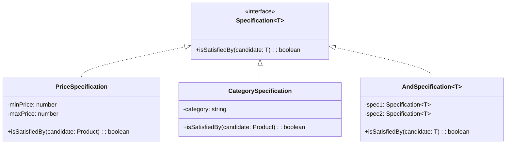

## 6.12.1 Implementing Specification in TypeScript

The Specification Pattern is a powerful tool in the arsenal of a software engineer, especially when dealing with complex business rules. It allows us to encapsulate these rules within classes, promoting reusability, flexibility, and clarity. In this section, we will explore how to implement the Specification Pattern in TypeScript, leveraging its powerful type system and object-oriented features.

### Understanding the Specification Pattern

The Specification Pattern is a behavioral design pattern that allows us to encapsulate business logic into reusable and combinable components. This pattern is particularly useful when we have complex conditional logic that can be reused across different parts of an application.

#### Key Concepts

- **Specification Interface**: Defines a method `isSatisfiedBy(candidate: T): boolean` that checks whether a candidate object satisfies the specification.
- **Concrete Specifications**: Implementations of the Specification interface that encapsulate specific business rules.
- **Composite Specifications**: Specifications that combine other specifications using logical operators like AND, OR, and NOT.

### Defining the Specification Interface

Let's start by defining a generic `Specification` interface in TypeScript. This interface will use generics to ensure type safety.

```typescript
// Specification.ts
export interface Specification<T> {
    isSatisfiedBy(candidate: T): boolean;
}
```

This simple interface lays the groundwork for our specifications. The `isSatisfiedBy` method takes a candidate of type `T` and returns a boolean indicating whether the candidate satisfies the specification.

### Implementing Concrete Specifications

Concrete specifications are classes that implement the `Specification` interface. Each class encapsulates a specific business rule.

#### Example: Product Specifications

Consider a scenario where we have a list of products, and we want to filter them based on certain criteria. Let's create specifications for filtering products by price and category.

```typescript
// Product.ts
export interface Product {
    name: string;
    price: number;
    category: string;
}

// PriceSpecification.ts
import { Specification } from './Specification';
import { Product } from './Product';

export class PriceSpecification implements Specification<Product> {
    constructor(private minPrice: number, private maxPrice: number) {}

    isSatisfiedBy(product: Product): boolean {
        return product.price >= this.minPrice && product.price <= this.maxPrice;
    }
}

// CategorySpecification.ts
import { Specification } from './Specification';
import { Product } from './Product';

export class CategorySpecification implements Specification<Product> {
    constructor(private category: string) {}

    isSatisfiedBy(product: Product): boolean {
        return product.category === this.category;
    }
}
```

In these examples, `PriceSpecification` checks if a product's price falls within a specified range, while `CategorySpecification` checks if a product belongs to a specific category.

### Creating Composite Specifications

Composite specifications allow us to combine multiple specifications using logical operators. This is where the Specification Pattern truly shines, as it enables us to build complex conditions from simple, reusable components.

#### Logical Combinators

Let's implement `AndSpecification`, `OrSpecification`, and `NotSpecification` to combine specifications.

```typescript
// AndSpecification.ts
import { Specification } from './Specification';

export class AndSpecification<T> implements Specification<T> {
    constructor(private spec1: Specification<T>, private spec2: Specification<T>) {}

    isSatisfiedBy(candidate: T): boolean {
        return this.spec1.isSatisfiedBy(candidate) && this.spec2.isSatisfiedBy(candidate);
    }
}

// OrSpecification.ts
import { Specification } from './Specification';

export class OrSpecification<T> implements Specification<T> {
    constructor(private spec1: Specification<T>, private spec2: Specification<T>) {}

    isSatisfiedBy(candidate: T): boolean {
        return this.spec1.isSatisfiedBy(candidate) || this.spec2.isSatisfiedBy(candidate);
    }
}

// NotSpecification.ts
import { Specification } from './Specification';

export class NotSpecification<T> implements Specification<T> {
    constructor(private spec: Specification<T>) {}

    isSatisfiedBy(candidate: T): boolean {
        return !this.spec.isSatisfiedBy(candidate);
    }
}
```

These combinators allow us to create complex specifications by combining simpler ones. For example, we can use `AndSpecification` to filter products that satisfy both price and category specifications.

### Using Specifications to Filter Objects

Now that we have our specifications and combinators, let's see how we can use them to filter a list of products.

```typescript
// main.ts
import { Product } from './Product';
import { PriceSpecification } from './PriceSpecification';
import { CategorySpecification } from './CategorySpecification';
import { AndSpecification } from './AndSpecification';

const products: Product[] = [
    { name: 'Laptop', price: 1500, category: 'Electronics' },
    { name: 'Phone', price: 800, category: 'Electronics' },
    { name: 'Shirt', price: 50, category: 'Clothing' },
    { name: 'Shoes', price: 100, category: 'Clothing' }
];

const priceSpec = new PriceSpecification(100, 1000);
const categorySpec = new CategorySpecification('Electronics');
const combinedSpec = new AndSpecification(priceSpec, categorySpec);

const filteredProducts = products.filter(product => combinedSpec.isSatisfiedBy(product));
console.log(filteredProducts);
```

In this example, `filteredProducts` will contain only the products that are in the 'Electronics' category and have a price between 100 and 1000.

### Promoting Reusability with Specifications

The Specification Pattern promotes reusability by allowing us to define business rules in a modular way. We can easily combine and reuse specifications across different parts of an application, reducing duplication and improving maintainability.

### Performance Considerations

When dealing with a large number of specifications or candidates, performance can become a concern. Here are some strategies to manage performance:

- **Lazy Evaluation**: Evaluate specifications only when necessary.
- **Caching Results**: Cache the results of expensive operations to avoid redundant calculations.
- **Batch Processing**: Process candidates in batches to reduce overhead.

### Try It Yourself

Experiment with the Specification Pattern by modifying the code examples:

- Add a new specification for filtering products by name.
- Create a composite specification that combines three or more specifications.
- Implement a caching mechanism to improve performance.

### Visualizing the Specification Pattern

To better understand the Specification Pattern, let's visualize how specifications and combinators interact.



This diagram illustrates the relationships between the `Specification` interface, concrete specifications, and combinators.

### References and Links

For further reading on the Specification Pattern and TypeScript, consider the following resources:

- [MDN Web Docs: TypeScript](https://developer.mozilla.org/en-US/docs/Web/JavaScript/Reference/Global_Objects/TypeScript)
- [TypeScript Handbook](https://www.typescriptlang.org/docs/handbook/intro.html)
- [Design Patterns: Elements of Reusable Object-Oriented Software](https://en.wikipedia.org/wiki/Design_Patterns)

### Knowledge Check

- What are the benefits of using the Specification Pattern?
- How do composite specifications enhance flexibility?
- What strategies can be used to improve performance when using the Specification Pattern?

### Embrace the Journey

Remember, the Specification Pattern is just one tool in your toolkit. As you continue to explore design patterns, you'll discover new ways to write clean, maintainable, and efficient code. Keep experimenting, stay curious, and enjoy the journey!

## Quiz Time!



### What is the primary purpose of the Specification Pattern?

- [x] To encapsulate business rules within classes
- [ ] To manage object creation
- [ ] To handle object interactions
- [ ] To simplify code structure

> **Explanation:** The Specification Pattern is used to encapsulate business rules within classes, allowing for reusable and combinable logic.

### Which method is defined in the Specification interface?

- [x] isSatisfiedBy(candidate: T): boolean
- [ ] evaluate(candidate: T): boolean
- [ ] check(candidate: T): boolean
- [ ] validate(candidate: T): boolean

> **Explanation:** The `isSatisfiedBy` method checks if a candidate satisfies the specification.

### What is a composite specification?

- [x] A specification that combines other specifications using logical operators
- [ ] A specification that is more complex than others
- [ ] A specification that is used only once
- [ ] A specification that cannot be reused

> **Explanation:** Composite specifications combine other specifications using logical operators like AND, OR, and NOT.

### How can performance be improved when using the Specification Pattern?

- [x] By using lazy evaluation and caching results
- [ ] By increasing the number of specifications
- [ ] By avoiding the use of generics
- [ ] By using only one specification at a time

> **Explanation:** Lazy evaluation and caching results can help improve performance by reducing unnecessary calculations.

### What is the role of logical combinators in the Specification Pattern?

- [x] They allow combining multiple specifications into a single, complex specification
- [ ] They simplify the creation of specifications
- [ ] They replace the need for concrete specifications
- [ ] They are used to manage object creation

> **Explanation:** Logical combinators like `AndSpecification`, `OrSpecification`, and `NotSpecification` allow combining multiple specifications into a single, complex specification.

### Which of the following is a benefit of using the Specification Pattern?

- [x] Reusability of business rules
- [ ] Simplification of object creation
- [ ] Reduction of class dependencies
- [ ] Elimination of all conditional logic

> **Explanation:** The Specification Pattern promotes the reusability of business rules by encapsulating them in modular components.

### What is the advantage of using generics in the Specification Pattern?

- [x] Type safety and flexibility
- [ ] Simplification of code
- [ ] Reduction of performance overhead
- [ ] Elimination of all runtime errors

> **Explanation:** Generics provide type safety and flexibility, allowing specifications to be used with different types.

### How does the Specification Pattern promote maintainability?

- [x] By encapsulating business rules in reusable components
- [ ] By reducing the number of classes
- [ ] By eliminating all dependencies
- [ ] By simplifying object interactions

> **Explanation:** The Specification Pattern promotes maintainability by encapsulating business rules in reusable components, making it easier to manage and update logic.

### What is the purpose of the `NotSpecification` class?

- [x] To negate the result of another specification
- [ ] To combine two specifications
- [ ] To simplify a complex specification
- [ ] To create a new specification from scratch

> **Explanation:** The `NotSpecification` class negates the result of another specification, allowing for the creation of complementary logic.

### True or False: The Specification Pattern can only be used with objects of the same type.

- [x] False
- [ ] True

> **Explanation:** The Specification Pattern can be used with different types by leveraging TypeScript's generics, allowing for flexible and type-safe specifications.


