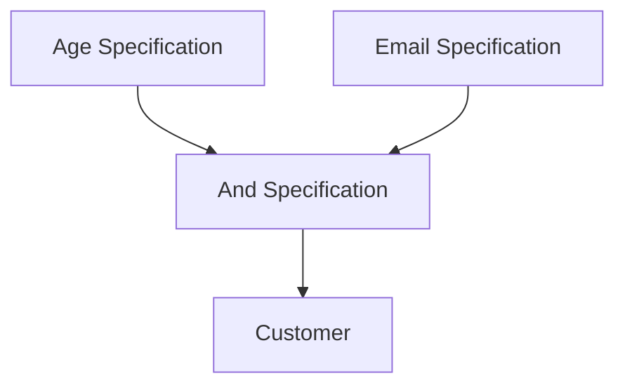

## 6.12.2 Combining Business Rules with the Specification Pattern in TypeScript

In the realm of software engineering, especially when dealing with complex business logic, the ability to express and manage rules efficiently is paramount. The Specification Pattern is a powerful tool in this regard, allowing developers to encapsulate business rules in a reusable and combinable manner. This section delves into how the Specification Pattern can be utilized in TypeScript to combine business rules, enhancing code readability and maintainability.

### Understanding the Specification Pattern

The Specification Pattern is a design pattern that allows you to encapsulate business rules in objects, enabling the combination of these rules using logical operations. This pattern is particularly useful when you need to evaluate whether an object meets certain criteria, and it provides a way to build complex conditions without resorting to intricate conditional statements.

#### Key Concepts

- **Specification**: An interface or abstract class that defines a method for checking if an object satisfies a particular condition.
- **Composite Specification**: A specification that combines multiple specifications using logical operations such as AND, OR, and NOT.
- **Reusability**: Specifications can be reused across different parts of an application, promoting DRY (Don't Repeat Yourself) principles.

### Implementing the Specification Pattern in TypeScript

Let's start by defining a simple `Specification` interface in TypeScript. This interface will have a method `isSatisfiedBy` that takes an object and returns a boolean indicating whether the object satisfies the specification.

```typescript
// Specification.ts
export interface Specification<T> {
    isSatisfiedBy(candidate: T): boolean;
}
```

#### Creating Basic Specifications

We can create concrete specifications by implementing the `Specification` interface. For example, let's define specifications to check if a customer is an adult and if they have a valid email address.

```typescript
// AgeSpecification.ts
import { Specification } from './Specification';

export class AgeSpecification implements Specification<Customer> {
    private readonly minimumAge: number;

    constructor(minimumAge: number) {
        this.minimumAge = minimumAge;
    }

    isSatisfiedBy(candidate: Customer): boolean {
        return candidate.age >= this.minimumAge;
    }
}

// EmailSpecification.ts
import { Specification } from './Specification';

export class EmailSpecification implements Specification<Customer> {
    isSatisfiedBy(candidate: Customer): boolean {
        const emailRegex = /^[^\s@]+@[^\s@]+\.[^\s@]+$/;
        return emailRegex.test(candidate.email);
    }
}
```

#### Combining Specifications

The true power of the Specification Pattern lies in its ability to combine specifications. We can create composite specifications using logical operations.

```typescript
// CompositeSpecification.ts
import { Specification } from './Specification';

export class AndSpecification<T> implements Specification<T> {
    private readonly left: Specification<T>;
    private readonly right: Specification<T>;

    constructor(left: Specification<T>, right: Specification<T>) {
        this.left = left;
        this.right = right;
    }

    isSatisfiedBy(candidate: T): boolean {
        return this.left.isSatisfiedBy(candidate) && this.right.isSatisfiedBy(candidate);
    }
}

export class OrSpecification<T> implements Specification<T> {
    private readonly left: Specification<T>;
    private readonly right: Specification<T>;

    constructor(left: Specification<T>, right: Specification<T>) {
        this.left = left;
        this.right = right;
    }

    isSatisfiedBy(candidate: T): boolean {
        return this.left.isSatisfiedBy(candidate) || this.right.isSatisfiedBy(candidate);
    }
}

export class NotSpecification<T> implements Specification<T> {
    private readonly specification: Specification<T>;

    constructor(specification: Specification<T>) {
        this.specification = specification;
    }

    isSatisfiedBy(candidate: T): boolean {
        return !this.specification.isSatisfiedBy(candidate);
    }
}
```

#### Example: Combining Business Rules

Let's combine the `AgeSpecification` and `EmailSpecification` to create a rule that checks if a customer is an adult and has a valid email address.

```typescript
// Customer.ts
interface Customer {
    age: number;
    email: string;
}

// Main.ts
import { AgeSpecification } from './AgeSpecification';
import { EmailSpecification } from './EmailSpecification';
import { AndSpecification } from './CompositeSpecification';

const adultSpecification = new AgeSpecification(18);
const validEmailSpecification = new EmailSpecification();

const adultWithValidEmailSpecification = new AndSpecification<Customer>(
    adultSpecification,
    validEmailSpecification
);

const customer: Customer = { age: 20, email: 'example@example.com' };

if (adultWithValidEmailSpecification.isSatisfiedBy(customer)) {
    console.log('Customer is an adult with a valid email.');
} else {
    console.log('Customer does not meet the criteria.');
}
```

### Benefits of Using the Specification Pattern

#### Improved Readability

By encapsulating business rules in specifications, we can avoid complex conditional logic scattered throughout the codebase. This makes the code easier to read and understand.

#### Enhanced Maintainability

Specifications can be updated independently without affecting other parts of the application. This modularity simplifies maintenance and reduces the risk of introducing bugs when changing business rules.

#### Flexibility and Reusability

Specifications can be reused and combined in different ways to address various business requirements. This flexibility allows developers to adapt to changing requirements more easily.

### Visualizing the Specification Pattern

To better understand how specifications can be combined, let's visualize the process using a diagram.



**Diagram Description**: This diagram illustrates how the `AgeSpecification` and `EmailSpecification` are combined using an `AndSpecification` to evaluate a `Customer` object.

### Try It Yourself

To deepen your understanding, try modifying the code examples:

- **Add a new specification**: Create a `CountrySpecification` that checks if a customer is from a specific country and combine it with existing specifications.
- **Experiment with OR logic**: Use the `OrSpecification` to create a rule that checks if a customer is either an adult or has a valid email.
- **Implement a NOT logic**: Use the `NotSpecification` to negate an existing specification.

### References and Further Reading

- [Specification Pattern on Wikipedia](https://en.wikipedia.org/wiki/Specification_pattern)
- [TypeScript Handbook](https://www.typescriptlang.org/docs/handbook/intro.html)
- [MDN Web Docs: Regular Expressions](https://developer.mozilla.org/en-US/docs/Web/JavaScript/Guide/Regular_Expressions)

### Knowledge Check

- How does the Specification Pattern improve code readability?
- What are the benefits of using composite specifications?
- How can you extend the Specification Pattern to include new business rules?

### Embrace the Journey

Remember, mastering design patterns like the Specification Pattern is a journey. As you continue to explore and experiment, you'll find new ways to apply these concepts to solve complex problems. Stay curious, keep learning, and enjoy the process!

## Quiz Time!



### What is the primary purpose of the Specification Pattern?

- [x] To encapsulate business rules in reusable objects.
- [ ] To optimize performance in TypeScript applications.
- [ ] To manage application state efficiently.
- [ ] To simplify UI design.

> **Explanation:** The Specification Pattern is used to encapsulate business rules in reusable objects, allowing for flexible and maintainable code.

### How does the Specification Pattern improve code maintainability?

- [x] By allowing business rules to be updated independently.
- [ ] By reducing the number of classes in an application.
- [ ] By improving the performance of the application.
- [ ] By simplifying the user interface design.

> **Explanation:** The Specification Pattern improves maintainability by allowing business rules to be encapsulated and updated independently, reducing the risk of bugs.

### Which logical operation is NOT typically used in the Specification Pattern?

- [ ] AND
- [ ] OR
- [ ] NOT
- [x] XOR

> **Explanation:** The Specification Pattern commonly uses AND, OR, and NOT operations, but XOR is not typically used.

### What does the `isSatisfiedBy` method do in the Specification Pattern?

- [x] It checks if an object meets the criteria defined by the specification.
- [ ] It modifies the object to meet the specification.
- [ ] It deletes objects that do not meet the specification.
- [ ] It logs the details of the object.

> **Explanation:** The `isSatisfiedBy` method checks if an object meets the criteria defined by the specification.

### How can you combine multiple specifications in the Specification Pattern?

- [x] By using composite specifications like `AndSpecification` and `OrSpecification`.
- [ ] By writing complex conditional statements.
- [ ] By creating a single large specification.
- [ ] By using a database query.

> **Explanation:** Multiple specifications can be combined using composite specifications like `AndSpecification` and `OrSpecification`.

### What is a benefit of using composite specifications?

- [x] They allow for complex conditions without intricate conditional statements.
- [ ] They increase the number of classes in an application.
- [ ] They improve the user interface design.
- [ ] They reduce the need for documentation.

> **Explanation:** Composite specifications allow for complex conditions to be expressed without intricate conditional statements, improving code readability.

### How does the Specification Pattern enhance flexibility?

- [x] By allowing specifications to be reused and recombined easily.
- [ ] By reducing the number of lines of code.
- [ ] By simplifying the database schema.
- [ ] By improving the graphical user interface.

> **Explanation:** The Specification Pattern enhances flexibility by allowing specifications to be reused and recombined easily.

### What is a potential modification you can try with the provided code examples?

- [x] Create a `CountrySpecification` and combine it with existing specifications.
- [ ] Remove all specifications and use simple conditional statements.
- [ ] Convert all specifications to use database queries.
- [ ] Implement a graphical user interface.

> **Explanation:** A potential modification is to create a `CountrySpecification` and combine it with existing specifications to explore the flexibility of the pattern.

### What is the role of the `AndSpecification` class?

- [x] To combine two specifications using logical AND.
- [ ] To combine two specifications using logical OR.
- [ ] To negate a specification.
- [ ] To delete specifications.

> **Explanation:** The `AndSpecification` class combines two specifications using logical AND.

### True or False: The Specification Pattern can only be used in TypeScript.

- [ ] True
- [x] False

> **Explanation:** False. The Specification Pattern is a general design pattern and can be used in various programming languages, not just TypeScript.


