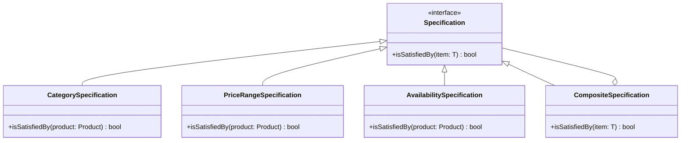

## 6.12.3 Use Cases and Examples

The Specification Pattern is a powerful tool in the software engineer's toolkit, particularly when working with TypeScript. It allows developers to encapsulate business rules and criteria into reusable and combinable specifications. This pattern is particularly useful in scenarios such as filtering collections of objects, validating complex user input, and defining access control rules. In this section, we will explore these use cases in depth, providing practical examples and discussing the benefits and challenges associated with using the Specification Pattern.

### Filtering Collections of Objects

One of the most common applications of the Specification Pattern is filtering collections of objects based on dynamic criteria. This is particularly useful in data repositories where the criteria for filtering can change based on user input or other runtime conditions.

#### Example: Filtering Products in an E-commerce Application

Imagine an e-commerce application where users can filter products based on various criteria such as category, price range, and availability. Using the Specification Pattern, we can encapsulate each of these criteria into separate specifications and combine them as needed.

```typescript
// Define a Product interface
interface Product {
  id: number;
  name: string;
  category: string;
  price: number;
  isAvailable: boolean;
}

// Specification interface
interface Specification<T> {
  isSatisfiedBy(item: T): boolean;
}

// CategorySpecification class
class CategorySpecification implements Specification<Product> {
  constructor(private category: string) {}

  isSatisfiedBy(product: Product): boolean {
    return product.category === this.category;
  }
}

// PriceRangeSpecification class
class PriceRangeSpecification implements Specification<Product> {
  constructor(private minPrice: number, private maxPrice: number) {}

  isSatisfiedBy(product: Product): boolean {
    return product.price >= this.minPrice && product.price <= this.maxPrice;
  }
}

// AvailabilitySpecification class
class AvailabilitySpecification implements Specification<Product> {
  isSatisfiedBy(product: Product): boolean {
    return product.isAvailable;
  }
}

// CompositeSpecification class for combining specifications
class CompositeSpecification<T> implements Specification<T> {
  constructor(private specs: Specification<T>[]) {}

  isSatisfiedBy(item: T): boolean {
    return this.specs.every(spec => spec.isSatisfiedBy(item));
  }
}

// Sample products
const products: Product[] = [
  { id: 1, name: 'Laptop', category: 'Electronics', price: 999, isAvailable: true },
  { id: 2, name: 'Shirt', category: 'Clothing', price: 49, isAvailable: false },
  { id: 3, name: 'Coffee Maker', category: 'Home Appliances', price: 79, isAvailable: true },
];

// Create specifications
const electronicsSpec = new CategorySpecification('Electronics');
const affordableSpec = new PriceRangeSpecification(50, 1000);
const availableSpec = new AvailabilitySpecification();

// Combine specifications
const combinedSpec = new CompositeSpecification<Product>([electronicsSpec, affordableSpec, availableSpec]);

// Filter products
const filteredProducts = products.filter(product => combinedSpec.isSatisfiedBy(product));
console.log(filteredProducts); // Output: [{ id: 1, name: 'Laptop', category: 'Electronics', price: 999, isAvailable: true }]
```

In this example, we define specifications for category, price range, and availability. We then combine these specifications using a `CompositeSpecification` to filter the products. This approach makes it easy to add new criteria or modify existing ones without changing the filtering logic.

### Validating User Input

Another common use case for the Specification Pattern is validating user input against complex business rules. This is especially useful in form handling, where the validation logic can become complex and difficult to manage.

#### Example: Validating User Registration Form

Consider a user registration form where we need to validate the user's age, email format, and password strength. We can use the Specification Pattern to encapsulate each validation rule into separate specifications.

```typescript
// User interface
interface User {
  age: number;
  email: string;
  password: string;
}

// AgeSpecification class
class AgeSpecification implements Specification<User> {
  constructor(private minAge: number) {}

  isSatisfiedBy(user: User): boolean {
    return user.age >= this.minAge;
  }
}

// EmailSpecification class
class EmailSpecification implements Specification<User> {
  private emailRegex = /^[^\s@]+@[^\s@]+\.[^\s@]+$/;

  isSatisfiedBy(user: User): boolean {
    return this.emailRegex.test(user.email);
  }
}

// PasswordSpecification class
class PasswordSpecification implements Specification<User> {
  isSatisfiedBy(user: User): boolean {
    return user.password.length >= 8;
  }
}

// CompositeSpecification class for combining specifications
class CompositeSpecification<T> implements Specification<T> {
  constructor(private specs: Specification<T>[]) {}

  isSatisfiedBy(item: T): boolean {
    return this.specs.every(spec => spec.isSatisfiedBy(item));
  }
}

// Sample user
const user: User = {
  age: 25,
  email: 'john.doe@example.com',
  password: 'securePassword123'
};

// Create specifications
const ageSpec = new AgeSpecification(18);
const emailSpec = new EmailSpecification();
const passwordSpec = new PasswordSpecification();

// Combine specifications
const registrationSpec = new CompositeSpecification<User>([ageSpec, emailSpec, passwordSpec]);

// Validate user
const isValidUser = registrationSpec.isSatisfiedBy(user);
console.log(isValidUser); // Output: true
```

In this example, we define specifications for age, email format, and password strength. We then combine these specifications to validate the user input. This approach allows us to easily modify or add new validation rules without affecting the existing logic.

### Defining Access Control Rules

The Specification Pattern is also useful for defining access control rules or feature toggles based on user attributes. This allows for flexible and dynamic access control mechanisms.

#### Example: Access Control Based on User Roles

Imagine a system where users have different roles, and access to certain features is based on these roles. We can use the Specification Pattern to encapsulate the access control logic.

```typescript
// User interface
interface User {
  roles: string[];
}

// RoleSpecification class
class RoleSpecification implements Specification<User> {
  constructor(private requiredRole: string) {}

  isSatisfiedBy(user: User): boolean {
    return user.roles.includes(this.requiredRole);
  }
}

// CompositeSpecification class for combining specifications
class CompositeSpecification<T> implements Specification<T> {
  constructor(private specs: Specification<T>[]) {}

  isSatisfiedBy(item: T): boolean {
    return this.specs.every(spec => spec.isSatisfiedBy(item));
  }
}

// Sample user
const user: User = {
  roles: ['admin', 'editor']
};

// Create specifications
const adminRoleSpec = new RoleSpecification('admin');
const editorRoleSpec = new RoleSpecification('editor');

// Combine specifications
const accessSpec = new CompositeSpecification<User>([adminRoleSpec, editorRoleSpec]);

// Check access
const hasAccess = accessSpec.isSatisfiedBy(user);
console.log(hasAccess); // Output: true
```

In this example, we define specifications for user roles and combine them to check access control. This approach allows us to easily modify or add new roles and access rules without affecting the existing logic.

### Challenges and Considerations

While the Specification Pattern provides a flexible and reusable way to define and combine business rules, it also comes with some challenges. One potential challenge is managing numerous specifications, which can become complex and difficult to understand. It's important to keep the specifications organized and well-documented to avoid confusion.

Another challenge is understanding complex combinations of specifications. When combining multiple specifications, it's important to ensure that the logic is clear and easy to follow. This may require additional documentation or comments to explain the logic.

### Encouragement to Use the Specification Pattern

The Specification Pattern is a powerful tool for defining and combining business rules in a flexible and reusable way. It simplifies tasks such as filtering, validation, and access control by encapsulating conditions into separate specifications. This approach makes it easy to modify or add new rules without affecting the existing logic.

We encourage readers to consider the Specification Pattern when they need a flexible and reusable way to define and combine business rules. By using this pattern, you can create more maintainable and scalable code that is easier to understand and modify.

### Visualizing the Specification Pattern

To further enhance understanding, let's visualize how the Specification Pattern works using a class diagram. This diagram shows the relationships between the different specifications and how they are combined.



This diagram illustrates the interface `Specification` and its implementations: `CategorySpecification`, `PriceRangeSpecification`, and `AvailabilitySpecification`. The `CompositeSpecification` class is used to combine multiple specifications, allowing for complex filtering logic.

### Try It Yourself

To truly grasp the power of the Specification Pattern, try modifying the code examples provided. Here are some suggestions:

- Add a new specification for filtering products based on a rating or review score.
- Modify the user validation example to include a specification for checking if the username is unique.
- Create a new access control specification that checks if a user has a specific permission.

By experimenting with these modifications, you'll gain a deeper understanding of how the Specification Pattern can be applied in different scenarios.

### Key Takeaways

- The Specification Pattern is a powerful tool for encapsulating business rules and criteria into reusable and combinable specifications.
- It is particularly useful for filtering collections of objects, validating user input, and defining access control rules.
- While the pattern provides flexibility and reusability, it can also introduce complexity if not managed properly.
- Visualizing the pattern with diagrams can help clarify the relationships between different specifications.
- Experimenting with the pattern in different scenarios will deepen your understanding and help you apply it effectively in your projects.

Remember, the Specification Pattern is just one of many design patterns available to you as a software engineer. By understanding and applying this pattern, you'll be better equipped to create maintainable and scalable code that meets the needs of your users.

## Quiz Time!



### What is the primary purpose of the Specification Pattern?

- [x] To encapsulate business rules and criteria into reusable and combinable specifications.
- [ ] To manage database connections efficiently.
- [ ] To handle asynchronous operations.
- [ ] To optimize memory usage.

> **Explanation:** The Specification Pattern is used to encapsulate business rules and criteria into reusable and combinable specifications, making it easier to manage complex logic.

### Which of the following is a common use case for the Specification Pattern?

- [x] Filtering collections of objects based on dynamic criteria.
- [ ] Managing network requests.
- [ ] Handling user authentication.
- [ ] Optimizing database queries.

> **Explanation:** The Specification Pattern is commonly used for filtering collections of objects based on dynamic criteria, as it allows for flexible and reusable filtering logic.

### How does the CompositeSpecification class work in the Specification Pattern?

- [x] It combines multiple specifications into a single specification.
- [ ] It manages database transactions.
- [ ] It handles user input validation.
- [ ] It optimizes memory usage.

> **Explanation:** The CompositeSpecification class combines multiple specifications into a single specification, allowing for complex filtering logic.

### What is a potential challenge when using the Specification Pattern?

- [x] Managing numerous specifications can become complex and difficult to understand.
- [ ] Handling network requests efficiently.
- [ ] Managing user authentication securely.
- [ ] Optimizing database queries.

> **Explanation:** One potential challenge when using the Specification Pattern is managing numerous specifications, which can become complex and difficult to understand.

### In the provided example, what does the CategorySpecification class do?

- [x] It checks if a product belongs to a specific category.
- [ ] It validates user input.
- [ ] It manages database connections.
- [ ] It handles network requests.

> **Explanation:** The CategorySpecification class checks if a product belongs to a specific category, encapsulating this logic into a reusable specification.

### How can the Specification Pattern simplify access control rules?

- [x] By encapsulating access control logic into separate specifications that can be combined.
- [ ] By managing network requests efficiently.
- [ ] By optimizing database queries.
- [ ] By handling asynchronous operations.

> **Explanation:** The Specification Pattern simplifies access control rules by encapsulating access control logic into separate specifications that can be combined, allowing for flexible and reusable access control mechanisms.

### What is a benefit of using the Specification Pattern for user input validation?

- [x] It allows for easy modification or addition of validation rules without affecting existing logic.
- [ ] It optimizes memory usage.
- [ ] It handles network requests efficiently.
- [ ] It manages database transactions securely.

> **Explanation:** A benefit of using the Specification Pattern for user input validation is that it allows for easy modification or addition of validation rules without affecting existing logic.

### How does the Specification Pattern help in filtering collections of objects?

- [x] By encapsulating filtering criteria into reusable specifications that can be combined.
- [ ] By managing database connections efficiently.
- [ ] By handling asynchronous operations.
- [ ] By optimizing memory usage.

> **Explanation:** The Specification Pattern helps in filtering collections of objects by encapsulating filtering criteria into reusable specifications that can be combined, allowing for flexible and dynamic filtering logic.

### What is the role of the Specification interface in the Specification Pattern?

- [x] It defines a method for checking if an item satisfies a specification.
- [ ] It manages database transactions.
- [ ] It handles network requests.
- [ ] It optimizes memory usage.

> **Explanation:** The Specification interface defines a method for checking if an item satisfies a specification, providing a common interface for all specifications.

### True or False: The Specification Pattern can be used for defining feature toggles based on user attributes.

- [x] True
- [ ] False

> **Explanation:** True. The Specification Pattern can be used for defining feature toggles based on user attributes, allowing for flexible and dynamic feature management.


