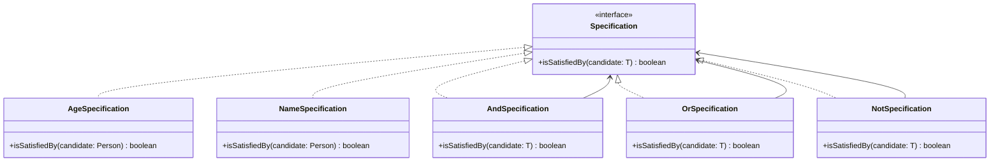

## 6.12 Specification Pattern

The Specification Pattern is a powerful tool in the software engineer's toolkit, offering a way to encapsulate business rules and logic in a reusable and flexible manner. This pattern is particularly useful in scenarios where complex conditional logic is scattered throughout the codebase, leading to maintenance challenges and reduced readability. By employing the Specification Pattern, developers can achieve a cleaner separation of concerns and enhance the reusability of their code.

### Understanding the Specification Pattern

The Specification Pattern is a behavioral design pattern that allows you to encapsulate business rules or criteria in a separate class, called a specification. This specification can then be used to evaluate objects against these criteria. The key intent of the Specification Pattern is to promote the reusability of business logic and facilitate the combination of different specifications using logical operations such as AND, OR, and NOT.

#### Intent of the Specification Pattern

The primary intent of the Specification Pattern is to:

- **Encapsulate Business Rules**: By defining business rules in separate specification classes, you can isolate the logic from the rest of the application code.
- **Promote Reusability**: Specifications can be reused across different parts of the application, reducing code duplication.
- **Enhance Flexibility**: Specifications can be combined using logical operators, allowing for complex criteria to be constructed in a flexible manner.
- **Improve Readability**: By moving complex conditional logic into specification classes, the main application code becomes more readable and maintainable.

### Problems Solved by the Specification Pattern

In many applications, business rules are often implemented using conditional statements scattered throughout the codebase. This approach can lead to several problems:

- **Code Duplication**: The same business logic may be repeated in multiple places, making it difficult to update or modify.
- **Reduced Readability**: Complex conditional logic can make the code hard to read and understand.
- **Tight Coupling**: Business rules are often tightly coupled with the application logic, making it difficult to change one without affecting the other.
- **Limited Reusability**: Business logic implemented as inline conditions is not easily reusable across different parts of the application.

The Specification Pattern addresses these issues by encapsulating business rules in separate specification classes, which can be reused, combined, and modified independently of the application logic.

### Implementing the Specification Pattern in TypeScript

Let's explore how to implement the Specification Pattern in TypeScript. We'll start by defining a basic specification interface and then create concrete specifications for different business rules. Finally, we'll demonstrate how to combine these specifications using logical operations.

#### Defining the Specification Interface

The first step in implementing the Specification Pattern is to define a specification interface. This interface will declare a method for evaluating an object against the specification's criteria.

```typescript
// Specification.ts
export interface Specification<T> {
  isSatisfiedBy(candidate: T): boolean;
}
```

In this example, the `Specification` interface declares a single method, `isSatisfiedBy`, which takes a candidate object of type `T` and returns a boolean indicating whether the candidate satisfies the specification.

#### Creating Concrete Specifications

Next, we'll create concrete specifications that implement the `Specification` interface. Each concrete specification will encapsulate a specific business rule or criterion.

```typescript
// AgeSpecification.ts
import { Specification } from './Specification';

export class AgeSpecification implements Specification<Person> {
  constructor(private minAge: number) {}

  isSatisfiedBy(candidate: Person): boolean {
    return candidate.age >= this.minAge;
  }
}

// NameSpecification.ts
import { Specification } from './Specification';

export class NameSpecification implements Specification<Person> {
  constructor(private name: string) {}

  isSatisfiedBy(candidate: Person): boolean {
    return candidate.name === this.name;
  }
}
```

In these examples, we define two concrete specifications: `AgeSpecification` and `NameSpecification`. The `AgeSpecification` checks if a person's age is greater than or equal to a specified minimum age, while the `NameSpecification` checks if a person's name matches a specified name.

#### Combining Specifications with Logical Operations

One of the key features of the Specification Pattern is the ability to combine specifications using logical operations. We'll define composite specifications for AND, OR, and NOT operations.

```typescript
// AndSpecification.ts
import { Specification } from './Specification';

export class AndSpecification<T> implements Specification<T> {
  constructor(private spec1: Specification<T>, private spec2: Specification<T>) {}

  isSatisfiedBy(candidate: T): boolean {
    return this.spec1.isSatisfiedBy(candidate) && this.spec2.isSatisfiedBy(candidate);
  }
}

// OrSpecification.ts
import { Specification } from './Specification';

export class OrSpecification<T> implements Specification<T> {
  constructor(private spec1: Specification<T>, private spec2: Specification<T>) {}

  isSatisfiedBy(candidate: T): boolean {
    return this.spec1.isSatisfiedBy(candidate) || this.spec2.isSatisfiedBy(candidate);
  }
}

// NotSpecification.ts
import { Specification } from './Specification';

export class NotSpecification<T> implements Specification<T> {
  constructor(private spec: Specification<T>) {}

  isSatisfiedBy(candidate: T): boolean {
    return !this.spec.isSatisfiedBy(candidate);
  }
}
```

In these examples, the `AndSpecification`, `OrSpecification`, and `NotSpecification` classes allow us to combine existing specifications using logical AND, OR, and NOT operations, respectively.

#### Using the Specification Pattern

Let's see how we can use the Specification Pattern to evaluate objects against complex criteria.

```typescript
// Person.ts
export interface Person {
  name: string;
  age: number;
}

// Main.ts
import { AgeSpecification } from './AgeSpecification';
import { NameSpecification } from './NameSpecification';
import { AndSpecification } from './AndSpecification';

const person: Person = { name: 'Alice', age: 30 };

const ageSpec = new AgeSpecification(18);
const nameSpec = new NameSpecification('Alice');

const adultNamedAliceSpec = new AndSpecification(ageSpec, nameSpec);

console.log(adultNamedAliceSpec.isSatisfiedBy(person)); // Output: true
```

In this example, we define a `Person` interface and create a `Person` object named Alice who is 30 years old. We then create an `AgeSpecification` to check if a person is at least 18 years old and a `NameSpecification` to check if a person's name is Alice. Finally, we combine these specifications using an `AndSpecification` to check if Alice is an adult named Alice.

### Visualizing the Specification Pattern

To better understand how the Specification Pattern works, let's visualize the relationships between specifications and how they are combined.



**Diagram Description**: This class diagram illustrates the Specification Pattern. The `Specification` interface is implemented by concrete specifications such as `AgeSpecification` and `NameSpecification`. Composite specifications like `AndSpecification`, `OrSpecification`, and `NotSpecification` combine existing specifications using logical operations.

### Benefits of the Specification Pattern

The Specification Pattern offers several benefits that make it a valuable tool for software engineers:

- **Separation of Concerns**: By encapsulating business rules in separate specification classes, the pattern promotes a clear separation of concerns between business logic and application logic.
- **Reusability**: Specifications can be reused across different parts of the application, reducing code duplication and improving maintainability.
- **Flexibility**: The ability to combine specifications using logical operations allows for flexible and dynamic construction of complex criteria.
- **Readability**: By moving complex conditional logic into specification classes, the main application code becomes more readable and easier to understand.

### Try It Yourself

To deepen your understanding of the Specification Pattern, try modifying the code examples provided:

1. **Add a New Specification**: Create a new specification class, such as `LocationSpecification`, that checks if a person's location matches a specified value.
2. **Combine Specifications**: Use the new specification in combination with existing specifications using logical operations.
3. **Test Different Scenarios**: Create different `Person` objects and test them against various combinations of specifications to see how the pattern handles different criteria.

### References and Further Reading

- [Specification Pattern on Wikipedia](https://en.wikipedia.org/wiki/Specification_pattern)
- [Martin Fowler's Article on Specification Pattern](https://martinfowler.com/apsupp/spec.pdf)
- [TypeScript Documentation](https://www.typescriptlang.org/docs/)

### Knowledge Check

To reinforce your understanding of the Specification Pattern, consider the following questions:

- How does the Specification Pattern promote separation of concerns?
- What are the benefits of combining specifications using logical operations?
- How can the Specification Pattern improve code readability and maintainability?

### Embrace the Journey

Remember, mastering design patterns like the Specification Pattern is a journey. As you continue to explore and apply these patterns in your projects, you'll gain a deeper understanding of their benefits and how they can enhance your codebase. Keep experimenting, stay curious, and enjoy the journey!

## Quiz Time!



### What is the primary intent of the Specification Pattern?

- [x] To encapsulate business rules in separate classes for reusability and flexibility
- [ ] To optimize performance by reducing code execution time
- [ ] To simplify user interface design
- [ ] To enhance database query performance

> **Explanation:** The Specification Pattern is designed to encapsulate business rules in separate classes, promoting reusability and flexibility in defining conditions.

### How does the Specification Pattern help with code readability?

- [x] By moving complex conditional logic into specification classes
- [ ] By reducing the number of classes in the codebase
- [ ] By using shorter variable names
- [ ] By eliminating the need for comments

> **Explanation:** By encapsulating complex conditional logic in specification classes, the Specification Pattern improves code readability and maintainability.

### Which logical operations can be used to combine specifications?

- [x] AND, OR, NOT
- [ ] XOR, NAND, NOR
- [ ] ADD, SUBTRACT, MULTIPLY
- [ ] EQUALS, GREATER THAN, LESS THAN

> **Explanation:** The Specification Pattern allows specifications to be combined using logical operations such as AND, OR, and NOT.

### What problem does the Specification Pattern solve?

- [x] Complex conditional logic scattered throughout the code
- [ ] Slow database queries
- [ ] Inconsistent user interface design
- [ ] High memory usage

> **Explanation:** The Specification Pattern addresses the problem of complex conditional logic scattered throughout the code by encapsulating it in separate specification classes.

### How does the Specification Pattern promote reusability?

- [x] By allowing specifications to be reused across different parts of the application
- [ ] By reducing the number of lines of code
- [ ] By using global variables
- [ ] By minimizing the use of functions

> **Explanation:** The Specification Pattern promotes reusability by allowing specifications to be reused across different parts of the application, reducing code duplication.

### What is a key benefit of using the Specification Pattern?

- [x] Enhanced flexibility in constructing complex criteria
- [ ] Increased execution speed
- [ ] Simplified user interface design
- [ ] Reduced memory usage

> **Explanation:** A key benefit of the Specification Pattern is the enhanced flexibility it provides in constructing complex criteria through the combination of specifications.

### Which of the following is a composite specification?

- [x] AndSpecification
- [ ] AgeSpecification
- [ ] NameSpecification
- [ ] LocationSpecification

> **Explanation:** The `AndSpecification` is a composite specification that combines other specifications using the logical AND operation.

### What is the role of the `isSatisfiedBy` method in the Specification Pattern?

- [x] To evaluate whether a candidate object satisfies the specification's criteria
- [ ] To calculate the performance of the application
- [ ] To render the user interface
- [ ] To manage database connections

> **Explanation:** The `isSatisfiedBy` method evaluates whether a candidate object satisfies the criteria defined by the specification.

### True or False: The Specification Pattern can only be used for evaluating objects in a database.

- [ ] True
- [x] False

> **Explanation:** False. The Specification Pattern can be used for evaluating any objects against defined criteria, not just those in a database.

### Which of the following is NOT a benefit of the Specification Pattern?

- [ ] Separation of concerns
- [ ] Reusability
- [ ] Flexibility
- [x] Increased memory usage

> **Explanation:** Increased memory usage is not a benefit of the Specification Pattern. The pattern is designed to enhance separation of concerns, reusability, and flexibility.


