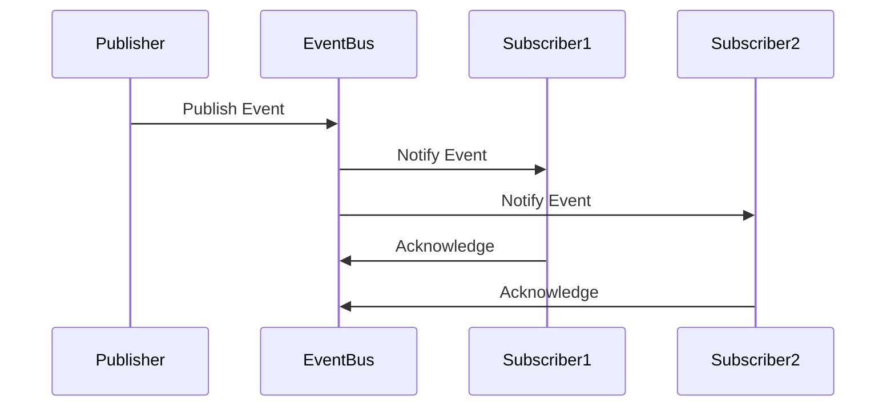

## 6.13.1 Implementing Pub/Sub in TypeScript

The Publish/Subscribe (Pub/Sub) pattern is a powerful messaging paradigm that decouples the sender of a message (the publisher) from its recipients (the subscribers). This pattern is widely used in scenarios where multiple components need to react to events or changes in state without being tightly coupled to the source of those events. In this section, we'll explore how to implement the Pub/Sub pattern in TypeScript, leveraging both Node.js's built-in `EventEmitter` and custom implementations.

### Understanding the Publish/Subscribe Pattern

The Pub/Sub pattern involves three main components:

1. **Publisher**: This component emits events or messages. It doesn't know who will receive these messages.
2. **Subscriber**: This component registers to receive specific events or messages. It defines handlers or callbacks to process the received data.
3. **Event Bus/Broker**: This intermediary facilitates communication between publishers and subscribers. It manages the registration of subscribers and the distribution of messages.

The Pub/Sub pattern is particularly useful for:

- **Decoupling components**: Publishers and subscribers can evolve independently.
- **Scalability**: New subscribers can be added without modifying existing publishers.
- **Flexibility**: Subscribers can choose which events to listen to.

### Implementing Pub/Sub with Node.js `EventEmitter`

Node.js provides a built-in `EventEmitter` class that makes it easy to implement the Pub/Sub pattern. Let's start by creating a simple event bus using `EventEmitter`.

```typescript
import { EventEmitter } from 'events';

// Create an instance of EventEmitter
const eventBus = new EventEmitter();

// Define a publisher function
function publishEvent(eventType: string, data: any) {
  console.log(`Publishing event: ${eventType}`);
  eventBus.emit(eventType, data);
}

// Define a subscriber function
function subscribeToEvent(eventType: string, handler: (data: any) => void) {
  console.log(`Subscribing to event: ${eventType}`);
  eventBus.on(eventType, handler);
}

// Example usage
subscribeToEvent('userLoggedIn', (data) => {
  console.log(`User logged in: ${data.username}`);
});

publishEvent('userLoggedIn', { username: 'john_doe' });
```

#### Key Points

- **EventEmitter**: This class provides methods like `emit`, `on`, and `off` to manage events.
- **Publish/Subscribe**: The `publishEvent` function emits an event, and the `subscribeToEvent` function registers a handler for a specific event type.
- **Decoupling**: The publisher and subscriber are decoupled, allowing them to evolve independently.

### Building a Custom Pub/Sub System

While `EventEmitter` is convenient, sometimes you need more control over the Pub/Sub system. Let's build a custom implementation.

```typescript
type EventHandler = (data: any) => void;

class EventBus {
  private events: Map<string, EventHandler[]> = new Map();

  subscribe(eventType: string, handler: EventHandler) {
    if (!this.events.has(eventType)) {
      this.events.set(eventType, []);
    }
    this.events.get(eventType)!.push(handler);
  }

  publish(eventType: string, data: any) {
    const handlers = this.events.get(eventType);
    if (handlers) {
      handlers.forEach(handler => handler(data));
    }
  }

  unsubscribe(eventType: string, handler: EventHandler) {
    const handlers = this.events.get(eventType);
    if (handlers) {
      this.events.set(eventType, handlers.filter(h => h !== handler));
    }
  }
}

// Example usage
const customEventBus = new EventBus();

customEventBus.subscribe('orderCreated', (data) => {
  console.log(`Order created: ${data.orderId}`);
});

customEventBus.publish('orderCreated', { orderId: '12345' });
```

#### Key Points

- **Custom Event Bus**: We created a simple event bus with methods to subscribe, publish, and unsubscribe.
- **Flexibility**: This implementation allows for more control, such as managing multiple subscribers and filtering events.

### Managing Multiple Subscribers and Event Filtering

In a real-world application, you may have multiple subscribers for a single event type. It's important to manage these subscriptions efficiently and provide mechanisms for filtering events.

#### Handling Multiple Subscribers

Our custom event bus already supports multiple subscribers for a single event type. Each subscriber's handler is called when the event is published.

#### Event Filtering

You can extend the event bus to support filtering, allowing subscribers to receive only specific events based on custom criteria.

```typescript
class FilteredEventBus extends EventBus {
  subscribeWithFilter(eventType: string, handler: EventHandler, filter: (data: any) => boolean) {
    const filteredHandler = (data: any) => {
      if (filter(data)) {
        handler(data);
      }
    };
    this.subscribe(eventType, filteredHandler);
  }
}

// Example usage
const filteredEventBus = new FilteredEventBus();

filteredEventBus.subscribeWithFilter('orderCreated', (data) => {
  console.log(`High-value order created: ${data.orderId}`);
}, (data) => data.value > 1000);

filteredEventBus.publish('orderCreated', { orderId: '12345', value: 1500 });
```

#### Key Points

- **Filtered Subscriptions**: Subscribers can register handlers with filters to receive only relevant events.
- **Efficiency**: Filtering reduces unnecessary processing for subscribers.

### Error Handling in Pub/Sub Systems

Error handling is crucial in a Pub/Sub system to ensure that failures in one subscriber do not affect others. Let's discuss some strategies for managing errors.

#### Isolating Subscriber Errors

Ensure that errors in one subscriber do not propagate to others by using try-catch blocks within handlers.

```typescript
customEventBus.subscribe('orderCreated', (data) => {
  try {
    // Process the event
    console.log(`Processing order: ${data.orderId}`);
    if (!data.orderId) {
      throw new Error('Invalid order ID');
    }
  } catch (error) {
    console.error(`Error processing order: ${error.message}`);
  }
});
```

#### Logging and Monitoring

Implement logging and monitoring to track errors and system health. This can be done using logging libraries or external monitoring tools.

### Handling Asynchronous Events and Race Conditions

In modern applications, events are often processed asynchronously. This introduces challenges such as race conditions, where the order of event processing affects the outcome.

#### Asynchronous Event Handling

Use asynchronous functions and promises to handle events asynchronously.

```typescript
customEventBus.subscribe('orderCreated', async (data) => {
  console.log(`Processing order asynchronously: ${data.orderId}`);
  await processOrder(data);
});

async function processOrder(data: any) {
  // Simulate asynchronous processing
  return new Promise((resolve) => setTimeout(() => {
    console.log(`Order processed: ${data.orderId}`);
    resolve(true);
  }, 1000));
}
```

#### Avoiding Race Conditions

Implement mechanisms to ensure that events are processed in the correct order or that shared resources are accessed safely.

- **Locks and Semaphores**: Use locks to control access to shared resources.
- **Event Queues**: Use queues to ensure that events are processed in the order they are received.

### Visualizing the Pub/Sub Architecture

To better understand the flow of events in a Pub/Sub system, let's visualize the architecture using a sequence diagram.



#### Diagram Explanation

- **Publisher**: Emits an event to the `EventBus`.
- **EventBus**: Distributes the event to all registered subscribers.
- **Subscribers**: Process the event and acknowledge receipt.

### Try It Yourself

Experiment with the provided code examples by modifying them to suit your needs:

- **Add More Events**: Create additional event types and handlers.
- **Implement Advanced Filtering**: Extend the filtering logic to handle more complex criteria.
- **Simulate Errors**: Introduce errors in handlers and observe how they are managed.
- **Test Asynchronous Processing**: Modify the asynchronous example to include multiple steps or dependencies.

### References and Further Reading

- [Node.js EventEmitter Documentation](https://nodejs.org/api/events.html)
- [MDN Web Docs: Asynchronous JavaScript](https://developer.mozilla.org/en-US/docs/Learn/JavaScript/Asynchronous)
- [Design Patterns: Elements of Reusable Object-Oriented Software](https://en.wikipedia.org/wiki/Design_Patterns)

### Knowledge Check

- **What are the main components of the Pub/Sub pattern?**
- **How does the `EventEmitter` class facilitate Pub/Sub in Node.js?**
- **What are some strategies for handling errors in a Pub/Sub system?**
- **How can you manage asynchronous events and avoid race conditions?**

### Embrace the Journey

Remember, implementing the Pub/Sub pattern is just the beginning. As you continue to explore design patterns, you'll discover more ways to build scalable and maintainable systems. Keep experimenting, stay curious, and enjoy the journey!

## Quiz Time!



### What is the primary purpose of the Publish/Subscribe pattern?

- [x] To decouple the sender of a message from its recipients
- [ ] To tightly couple components for faster communication
- [ ] To ensure that all messages are processed synchronously
- [ ] To replace the need for direct function calls

> **Explanation:** The Publish/Subscribe pattern is designed to decouple the sender of a message from its recipients, allowing for more flexible and scalable systems.

### Which Node.js class is commonly used to implement the Pub/Sub pattern?

- [x] EventEmitter
- [ ] Buffer
- [ ] Stream
- [ ] FileSystem

> **Explanation:** The `EventEmitter` class in Node.js provides methods to facilitate the Publish/Subscribe pattern by emitting and listening for events.

### In a custom Pub/Sub system, what is the role of the `EventBus`?

- [x] To manage the registration of subscribers and distribution of messages
- [ ] To directly call each subscriber's function
- [ ] To store all published events indefinitely
- [ ] To ensure messages are encrypted

> **Explanation:** The `EventBus` acts as an intermediary that manages the registration of subscribers and the distribution of messages to them.

### How can you handle errors in a subscriber's event handler?

- [x] Use try-catch blocks within the handler
- [ ] Ignore the errors and continue processing
- [ ] Log the errors and stop the event bus
- [ ] Use synchronous code to avoid errors

> **Explanation:** Using try-catch blocks within the handler ensures that errors in one subscriber do not affect others and allows for proper error handling.

### What is a potential issue when handling asynchronous events in a Pub/Sub system?

- [x] Race conditions
- [ ] Event duplication
- [ ] Lack of scalability
- [ ] Synchronous processing

> **Explanation:** Race conditions can occur when handling asynchronous events, as the order of event processing can affect the outcome.

### What technique can be used to ensure events are processed in the correct order?

- [x] Event Queues
- [ ] Randomized processing
- [ ] Direct function calls
- [ ] Ignoring event order

> **Explanation:** Event queues can be used to ensure that events are processed in the order they are received, avoiding race conditions.

### How can you extend a custom event bus to support event filtering?

- [x] By allowing subscribers to register handlers with filters
- [ ] By hardcoding event types in the event bus
- [ ] By using only synchronous events
- [ ] By limiting the number of subscribers

> **Explanation:** Allowing subscribers to register handlers with filters enables event filtering, so subscribers receive only relevant events.

### What is a benefit of using the Pub/Sub pattern?

- [x] Scalability and flexibility
- [ ] Tight coupling of components
- [ ] Synchronous processing of all events
- [ ] Direct communication between components

> **Explanation:** The Pub/Sub pattern provides scalability and flexibility by decoupling components, allowing them to evolve independently.

### Which of the following is a method provided by the `EventEmitter` class?

- [x] emit
- [ ] start
- [ ] connect
- [ ] execute

> **Explanation:** The `emit` method is used to trigger an event, which is then handled by any registered listeners.

### True or False: The Pub/Sub pattern requires synchronous processing of events.

- [ ] True
- [x] False

> **Explanation:** The Pub/Sub pattern does not require synchronous processing; it can handle both synchronous and asynchronous events, providing flexibility in how events are managed.


