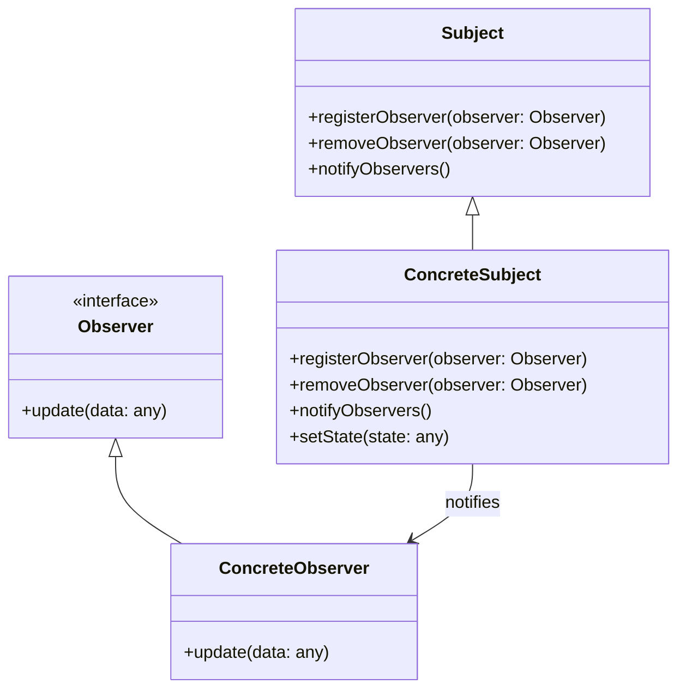
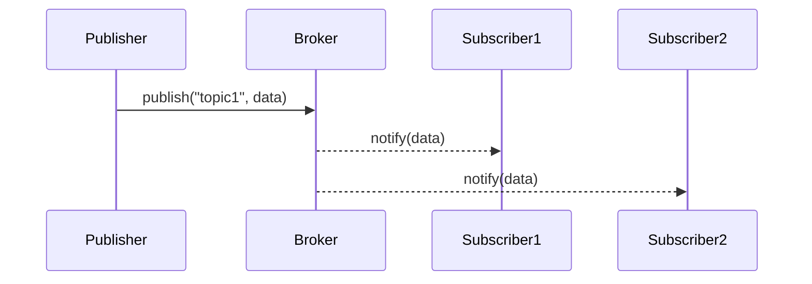

## 6.13.2 Observer vs. Pub/Sub

In the realm of software design patterns, the Observer and Publish/Subscribe (Pub/Sub) patterns are often discussed together due to their similar goals of facilitating communication between components. However, they differ significantly in their implementation, coupling, and scalability. Understanding these differences is crucial for expert software engineers when deciding which pattern to apply in a given context. In this section, we will explore these two patterns, compare their characteristics, and provide guidance on when to use each.

### Understanding the Observer Pattern

The Observer Pattern is a behavioral design pattern where an object, known as the subject, maintains a list of dependents, called observers, and notifies them automatically of any state changes. This pattern is useful for implementing distributed event-handling systems.

#### Key Characteristics of the Observer Pattern

- **Direct Notification**: Observers are directly notified by the subject whenever a change occurs.
- **Tight Coupling**: There is a direct relationship between the subject and its observers, which can lead to tight coupling.
- **Simplicity**: The pattern is relatively simple to implement and understand.
- **Use Cases**: Suitable for scenarios where the number of observers is relatively small and the system is not highly distributed.

#### Implementing the Observer Pattern in TypeScript

Let's look at a basic implementation of the Observer Pattern in TypeScript:

```typescript
// Subject interface
interface Subject {
    registerObserver(observer: Observer): void;
    removeObserver(observer: Observer): void;
    notifyObservers(): void;
}

// Observer interface
interface Observer {
    update(data: any): void;
}

// Concrete Subject
class ConcreteSubject implements Subject {
    private observers: Observer[] = [];
    private state: any;

    registerObserver(observer: Observer): void {
        this.observers.push(observer);
    }

    removeObserver(observer: Observer): void {
        this.observers = this.observers.filter(obs => obs !== observer);
    }

    notifyObservers(): void {
        for (const observer of this.observers) {
            observer.update(this.state);
        }
    }

    setState(state: any): void {
        this.state = state;
        this.notifyObservers();
    }
}

// Concrete Observer
class ConcreteObserver implements Observer {
    update(data: any): void {
        console.log(`Observer received data: ${data}`);
    }
}

// Usage
const subject = new ConcreteSubject();
const observer1 = new ConcreteObserver();
const observer2 = new ConcreteObserver();

subject.registerObserver(observer1);
subject.registerObserver(observer2);

subject.setState("New State");
```

In this example, `ConcreteSubject` maintains a list of observers and notifies them of any state changes. The `ConcreteObserver` implements the `Observer` interface and reacts to updates from the subject.

### Understanding the Publish/Subscribe Pattern

The Publish/Subscribe Pattern, often abbreviated as Pub/Sub, is a messaging pattern where senders (publishers) do not send messages directly to receivers (subscribers). Instead, messages are sent to an intermediary component known as a broker, which handles the distribution of messages to subscribers.

#### Key Characteristics of the Publish/Subscribe Pattern

- **Decoupling**: Publishers and subscribers are unaware of each other, reducing coupling.
- **Scalability**: The pattern is highly scalable and suitable for distributed systems.
- **Flexibility**: Allows dynamic subscription and unsubscription to topics.
- **Use Cases**: Ideal for large-scale systems where components need to communicate without tight coupling.

#### Implementing the Publish/Subscribe Pattern in TypeScript

Below is an example of implementing the Pub/Sub pattern in TypeScript:

```typescript
// Broker class
class Broker {
    private topics: { [key: string]: Function[] } = {};

    subscribe(topic: string, listener: Function): void {
        if (!this.topics[topic]) {
            this.topics[topic] = [];
        }
        this.topics[topic].push(listener);
    }

    unsubscribe(topic: string, listener: Function): void {
        if (!this.topics[topic]) return;
        this.topics[topic] = this.topics[topic].filter(l => l !== listener);
    }

    publish(topic: string, data: any): void {
        if (!this.topics[topic]) return;
        this.topics[topic].forEach(listener => listener(data));
    }
}

// Usage
const broker = new Broker();

const subscriber1 = (data: any) => console.log(`Subscriber 1 received: ${data}`);
const subscriber2 = (data: any) => console.log(`Subscriber 2 received: ${data}`);

broker.subscribe('topic1', subscriber1);
broker.subscribe('topic1', subscriber2);

broker.publish('topic1', 'Hello, World!');
```

In this example, the `Broker` class manages subscriptions and publications. Subscribers register their interest in specific topics, and publishers send messages to these topics without knowing who the subscribers are.

### Comparing Observer and Publish/Subscribe Patterns

#### Coupling

- **Observer Pattern**: Involves tight coupling between the subject and observers. The subject maintains a direct reference to its observers, which can lead to dependencies that are difficult to manage in large systems.
- **Publish/Subscribe Pattern**: Decouples publishers and subscribers through a broker, allowing for more flexible and maintainable systems. This decoupling is particularly beneficial in distributed systems where components may be added or removed dynamically.

#### Scalability

- **Observer Pattern**: Best suited for smaller systems where the number of observers is limited. As the number of observers grows, the complexity and overhead of managing direct references increase.
- **Publish/Subscribe Pattern**: Highly scalable and designed for systems with many components. The broker can efficiently manage numerous subscribers and publishers, making it ideal for large-scale, distributed applications.

#### Use Cases

- **Observer Pattern**: Appropriate for applications with a limited number of observers, such as GUI frameworks where UI components need to react to changes in model data.
- **Publish/Subscribe Pattern**: Suitable for event-driven architectures, microservices, and systems requiring loose coupling and high scalability, such as real-time data feeds or notification systems.

### Visualizing the Differences

To better understand the differences between these two patterns, let's visualize their structures using Mermaid.js diagrams.

#### Observer Pattern Diagram



#### Publish/Subscribe Pattern Diagram



### Choosing the Right Pattern

When deciding between the Observer and Publish/Subscribe patterns, consider the following factors:

- **System Size and Complexity**: For small, tightly-knit systems, the Observer Pattern may suffice. For larger, distributed systems, the Publish/Subscribe Pattern offers better scalability and flexibility.
- **Coupling Requirements**: If you need to minimize dependencies between components, the Publish/Subscribe Pattern is preferable due to its decoupled nature.
- **Dynamic Component Management**: In systems where components frequently change, the Publish/Subscribe Pattern allows for easier management of dynamic subscriptions.

### Try It Yourself

To deepen your understanding, try modifying the provided code examples:

- **Observer Pattern**: Add more observers and experiment with different state changes to see how the system reacts.
- **Publish/Subscribe Pattern**: Implement additional topics and subscribers, and observe how the broker manages multiple messages.

### Further Reading

For more information on these patterns, consider exploring the following resources:

- [Observer Pattern on Refactoring.Guru](https://refactoring.guru/design-patterns/observer)
- [Publish/Subscribe Pattern on Wikipedia](https://en.wikipedia.org/wiki/Publish%E2%80%93subscribe_pattern)

### Knowledge Check

Before moving on, reflect on the key differences between the Observer and Publish/Subscribe patterns. Consider how each pattern impacts system design, coupling, and scalability.

### Conclusion

Both the Observer and Publish/Subscribe patterns play crucial roles in software design, each offering unique benefits and trade-offs. By understanding their differences and use cases, you can make informed decisions when architecting your TypeScript applications. Remember, the right pattern depends on the specific needs and constraints of your system.

## Quiz Time!



### Which pattern involves direct notification from the subject to the observers?

- [x] Observer Pattern
- [ ] Publish/Subscribe Pattern
- [ ] Singleton Pattern
- [ ] Factory Pattern

> **Explanation:** In the Observer Pattern, the subject directly notifies its observers of any state changes.

### Which pattern uses a broker to manage communication between publishers and subscribers?

- [ ] Observer Pattern
- [x] Publish/Subscribe Pattern
- [ ] Strategy Pattern
- [ ] Decorator Pattern

> **Explanation:** The Publish/Subscribe Pattern uses a broker to decouple publishers and subscribers, managing communication between them.

### What is a key benefit of the Publish/Subscribe Pattern over the Observer Pattern?

- [ ] Tight Coupling
- [x] Decoupling
- [ ] Simplicity
- [ ] Direct Notification

> **Explanation:** The Publish/Subscribe Pattern offers decoupling between components, which is a significant advantage over the Observer Pattern.

### In which pattern do publishers and subscribers remain unaware of each other?

- [ ] Observer Pattern
- [x] Publish/Subscribe Pattern
- [ ] Command Pattern
- [ ] Adapter Pattern

> **Explanation:** In the Publish/Subscribe Pattern, publishers and subscribers are unaware of each other, as communication is handled by a broker.

### Which pattern is more suitable for large-scale distributed systems?

- [ ] Observer Pattern
- [x] Publish/Subscribe Pattern
- [ ] Singleton Pattern
- [ ] Prototype Pattern

> **Explanation:** The Publish/Subscribe Pattern is more suitable for large-scale distributed systems due to its scalability and decoupling.

### What is a primary drawback of the Observer Pattern?

- [x] Tight Coupling
- [ ] Scalability
- [ ] Flexibility
- [ ] Decoupling

> **Explanation:** A primary drawback of the Observer Pattern is the tight coupling between the subject and its observers.

### Which pattern allows for dynamic subscription and unsubscription?

- [ ] Observer Pattern
- [x] Publish/Subscribe Pattern
- [ ] Factory Method Pattern
- [ ] Builder Pattern

> **Explanation:** The Publish/Subscribe Pattern allows for dynamic subscription and unsubscription to topics.

### Which pattern is simpler to implement in small systems?

- [x] Observer Pattern
- [ ] Publish/Subscribe Pattern
- [ ] Composite Pattern
- [ ] Flyweight Pattern

> **Explanation:** The Observer Pattern is simpler to implement in small systems due to its direct notification mechanism.

### Which pattern is ideal for event-driven architectures?

- [ ] Observer Pattern
- [x] Publish/Subscribe Pattern
- [ ] Template Method Pattern
- [ ] Chain of Responsibility Pattern

> **Explanation:** The Publish/Subscribe Pattern is ideal for event-driven architectures because it efficiently manages communication between components.

### True or False: The Observer Pattern is more scalable than the Publish/Subscribe Pattern.

- [ ] True
- [x] False

> **Explanation:** False. The Publish/Subscribe Pattern is more scalable than the Observer Pattern, making it suitable for larger systems.


