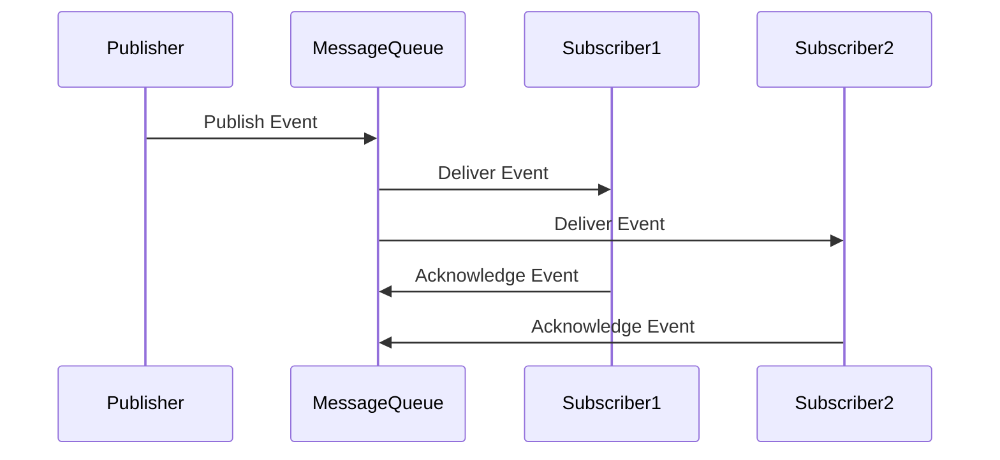

## 6.13.3 Use Cases and Examples

The Publish/Subscribe Pattern, often abbreviated as Pub/Sub, is a messaging pattern that allows for the decoupling of components in a system. It is particularly useful in scenarios where components need to communicate asynchronously without being tightly bound to each other. This pattern is widely used in various applications, from real-time web applications to complex microservices architectures. In this section, we will explore several practical use cases and examples of the Publish/Subscribe Pattern in TypeScript, highlighting its benefits and addressing potential challenges.

### Real-Time Notification Systems Using WebSockets

Real-time notification systems are a common requirement in modern web applications. Whether it's a chat application, a stock trading platform, or a collaborative tool, users expect instantaneous updates. The Publish/Subscribe Pattern, combined with WebSockets, provides an efficient way to implement such systems.

#### Implementing Real-Time Notifications

WebSockets enable full-duplex communication channels over a single TCP connection, making them ideal for real-time applications. In a Pub/Sub model, the server acts as the publisher, broadcasting messages to all connected clients (subscribers).

**Example: Real-Time Chat Application**

Let's explore a simple chat application using TypeScript and WebSockets. We'll use the Pub/Sub pattern to broadcast messages to all connected clients.

```typescript
// Import necessary modules
import * as WebSocket from 'ws';

// Create a WebSocket server
const wss = new WebSocket.Server({ port: 8080 });

// Set up a message handler
wss.on('connection', (ws) => {
    ws.on('message', (message) => {
        // Broadcast the message to all connected clients
        wss.clients.forEach((client) => {
            if (client.readyState === WebSocket.OPEN) {
                client.send(message);
            }
        });
    });
});

console.log('WebSocket server is running on ws://localhost:8080');
```

In this example, every time a client sends a message, the server broadcasts it to all connected clients. This is a straightforward implementation of the Pub/Sub pattern, where the server is the publisher and the clients are the subscribers.

#### Benefits and Challenges

**Benefits:**
- **Loose Coupling:** Clients are not aware of each other; they only interact with the server.
- **Scalability:** New clients can easily join the system without affecting existing ones.
- **Real-Time Updates:** WebSockets provide low-latency communication.

**Challenges:**
- **Message Delivery Guarantees:** Ensuring that messages are delivered in order and without loss can be challenging.
- **Handling Overload:** The server must efficiently manage a large number of connections.

### Modular Applications with Event Bus

In large applications, maintaining a modular architecture is crucial for scalability and maintainability. The Publish/Subscribe Pattern can be implemented using an event bus to facilitate communication between different modules.

#### Building Modular Applications

An event bus is a central hub through which different parts of an application can communicate. It allows modules to publish events and subscribe to them without direct dependencies.

**Example: Event Bus in a Modular Application**

Consider an application with separate modules for user authentication, notifications, and logging. We can use an event bus to decouple these modules.

```typescript
// Define an EventBus class
class EventBus {
    private listeners: { [event: string]: Function[] } = {};

    subscribe(event: string, listener: Function) {
        if (!this.listeners[event]) {
            this.listeners[event] = [];
        }
        this.listeners[event].push(listener);
    }

    publish(event: string, data: any) {
        if (this.listeners[event]) {
            this.listeners[event].forEach(listener => listener(data));
        }
    }
}

// Create an instance of EventBus
const eventBus = new EventBus();

// Subscribe to events
eventBus.subscribe('userLoggedIn', (user) => {
    console.log(`User logged in: ${user.name}`);
});

eventBus.subscribe('notification', (message) => {
    console.log(`Notification: ${message}`);
});

// Publish events
eventBus.publish('userLoggedIn', { name: 'Alice' });
eventBus.publish('notification', 'You have a new message');
```

In this example, the `EventBus` class manages event subscriptions and publications. Modules can subscribe to specific events and react accordingly when those events are published.

#### Benefits and Challenges

**Benefits:**
- **Decoupled Architecture:** Modules can be developed and tested independently.
- **Flexibility:** New modules can be added without modifying existing ones.

**Challenges:**
- **Event Management:** Keeping track of all events and their listeners can become complex.
- **Debugging:** Tracing the flow of events can be difficult in large systems.

### Microservices Architecture with Message Queues

Microservices architectures benefit greatly from the Publish/Subscribe Pattern, especially when services need to communicate asynchronously. Message queues, such as RabbitMQ or Apache Kafka, are often used to implement this pattern.

#### Designing Microservices with Pub/Sub

In a microservices architecture, services can publish events to a message queue, and other services can subscribe to those events. This allows for asynchronous communication and loose coupling between services.

**Example: Order Processing System**

Let's consider an order processing system where different services handle order creation, payment, and shipping. We'll use a message queue to facilitate communication.

```typescript
// Simulate a message queue
class MessageQueue {
    private subscribers: { [event: string]: Function[] } = {};

    subscribe(event: string, callback: Function) {
        if (!this.subscribers[event]) {
            this.subscribers[event] = [];
        }
        this.subscribers[event].push(callback);
    }

    publish(event: string, data: any) {
        if (this.subscribers[event]) {
            this.subscribers[event].forEach(callback => callback(data));
        }
    }
}

// Create a message queue instance
const messageQueue = new MessageQueue();

// Order service publishes an event
function orderService() {
    const order = { id: 1, item: 'Laptop' };
    console.log('Order created:', order);
    messageQueue.publish('orderCreated', order);
}

// Payment service subscribes to the orderCreated event
messageQueue.subscribe('orderCreated', (order) => {
    console.log('Processing payment for order:', order.id);
    // Simulate payment processing
    setTimeout(() => {
        console.log('Payment processed for order:', order.id);
        messageQueue.publish('paymentProcessed', order);
    }, 1000);
});

// Shipping service subscribes to the paymentProcessed event
messageQueue.subscribe('paymentProcessed', (order) => {
    console.log('Shipping order:', order.id);
    // Simulate shipping
    setTimeout(() => {
        console.log('Order shipped:', order.id);
    }, 1000);
});

// Start the order processing
orderService();
```

In this example, the `MessageQueue` class simulates a message queue. The order service publishes an `orderCreated` event, which the payment service subscribes to. Once the payment is processed, the payment service publishes a `paymentProcessed` event, which the shipping service subscribes to.

#### Benefits and Challenges

**Benefits:**
- **Scalability:** Services can be scaled independently based on load.
- **Resilience:** Services can continue to operate even if some components are down.

**Challenges:**
- **Message Delivery Guarantees:** Ensuring reliable message delivery can be complex.
- **Latency:** Asynchronous communication can introduce latency.

### Handling Message Delivery and Overload

While the Publish/Subscribe Pattern offers many benefits, it also presents challenges related to message delivery and overload. Let's explore these challenges and potential solutions.

#### Message Delivery Guarantees

In a Pub/Sub system, ensuring that messages are delivered reliably and in order is crucial. This can be challenging, especially in distributed systems.

**Solutions:**
- **Acknowledgments:** Require subscribers to acknowledge receipt of messages to ensure delivery.
- **Retries:** Implement retry mechanisms for failed message deliveries.
- **Ordering:** Use sequence numbers or timestamps to maintain message order.

#### Handling Message Overload

In systems with high message throughput, managing overload is essential to prevent bottlenecks.

**Solutions:**
- **Throttling:** Limit the rate of message publication or subscription to prevent overload.
- **Load Balancing:** Distribute messages across multiple subscribers to balance the load.
- **Backpressure:** Implement backpressure mechanisms to slow down message production when the system is overloaded.

### Encouraging the Use of Publish/Subscribe Pattern

The Publish/Subscribe Pattern is a powerful tool for designing systems that require decoupled communication between components. By enabling loose coupling and scalability, it allows developers to build flexible and maintainable architectures.

#### Considerations for Using Pub/Sub

When designing a system, consider the following factors to determine if the Publish/Subscribe Pattern is appropriate:

- **Decoupling Needs:** If components need to communicate without direct dependencies, Pub/Sub is a good fit.
- **Scalability Requirements:** If the system needs to scale easily, Pub/Sub can facilitate this by allowing components to be added or removed without affecting others.
- **Asynchronous Communication:** If components need to communicate asynchronously, Pub/Sub provides a natural solution.

### Try It Yourself

To gain a deeper understanding of the Publish/Subscribe Pattern, try modifying the examples provided:

- **Extend the Chat Application:** Add features such as private messaging or message history.
- **Enhance the Event Bus:** Implement additional events and subscribers to simulate a more complex application.
- **Expand the Order Processing System:** Add new services, such as inventory management or customer notifications.

By experimenting with these examples, you'll gain hands-on experience with the Publish/Subscribe Pattern and its applications in TypeScript.

### Visualizing the Publish/Subscribe Pattern

To better understand the flow of messages in a Publish/Subscribe system, let's visualize the architecture using a sequence diagram.



**Diagram Description:** This sequence diagram illustrates the flow of messages in a Publish/Subscribe system. The publisher sends an event to the message queue, which then delivers the event to all subscribers. Each subscriber acknowledges receipt of the event.

### Conclusion

The Publish/Subscribe Pattern is a versatile and powerful design pattern that facilitates decoupled communication in various applications. From real-time notifications to modular applications and microservices architectures, it provides a robust solution for managing asynchronous communication. By understanding its benefits and challenges, developers can effectively leverage this pattern to build scalable and maintainable systems.

## Quiz Time!



### What is a key benefit of using the Publish/Subscribe Pattern in real-time notification systems?

- [x] Loose coupling between components
- [ ] Tight integration of components
- [ ] Synchronous communication
- [ ] Direct dependencies between components

> **Explanation:** The Publish/Subscribe Pattern allows for loose coupling between components, enabling them to communicate without direct dependencies.

### In a modular application, what role does an event bus play?

- [x] It acts as a central hub for communication between modules.
- [ ] It directly connects all modules to each other.
- [ ] It stores data for the application.
- [ ] It handles user authentication.

> **Explanation:** An event bus acts as a central hub for communication, allowing modules to publish and subscribe to events without direct dependencies.

### Which of the following is a challenge when using the Publish/Subscribe Pattern in microservices?

- [x] Ensuring message delivery guarantees
- [ ] Enforcing synchronous communication
- [ ] Directly connecting services
- [ ] Reducing system scalability

> **Explanation:** Ensuring message delivery guarantees can be challenging in a distributed system using the Publish/Subscribe Pattern.

### What is a common solution for handling message overload in a Pub/Sub system?

- [x] Throttling message publication
- [ ] Increasing message size
- [ ] Reducing the number of subscribers
- [ ] Enforcing synchronous communication

> **Explanation:** Throttling message publication helps prevent overload by limiting the rate at which messages are published.

### How can message order be maintained in a Publish/Subscribe system?

- [x] Use sequence numbers or timestamps
- [ ] Use random identifiers
- [ ] Ignore message order
- [ ] Use direct connections between components

> **Explanation:** Sequence numbers or timestamps can be used to maintain message order in a Publish/Subscribe system.

### What is a benefit of using WebSockets in a real-time notification system?

- [x] Low-latency communication
- [ ] High-latency communication
- [ ] Synchronous communication
- [ ] Direct dependencies between clients

> **Explanation:** WebSockets provide low-latency communication, making them ideal for real-time applications.

### In a microservices architecture, what is a benefit of using message queues with the Publish/Subscribe Pattern?

- [x] Asynchronous communication between services
- [ ] Synchronous communication between services
- [ ] Direct dependencies between services
- [ ] Reduced scalability

> **Explanation:** Message queues enable asynchronous communication, allowing services to operate independently.

### What is a potential challenge when using the Publish/Subscribe Pattern in large systems?

- [x] Debugging event flow
- [ ] Directly connecting components
- [ ] Reducing system flexibility
- [ ] Increasing system complexity

> **Explanation:** Debugging event flow can be challenging in large systems using the Publish/Subscribe Pattern.

### What is a common use case for the Publish/Subscribe Pattern?

- [x] Real-time notifications
- [ ] Direct database access
- [ ] Synchronous file processing
- [ ] Static web pages

> **Explanation:** Real-time notifications are a common use case for the Publish/Subscribe Pattern, as it allows for asynchronous communication.

### True or False: The Publish/Subscribe Pattern requires components to have direct dependencies on each other.

- [ ] True
- [x] False

> **Explanation:** The Publish/Subscribe Pattern enables components to communicate without direct dependencies, promoting loose coupling.


