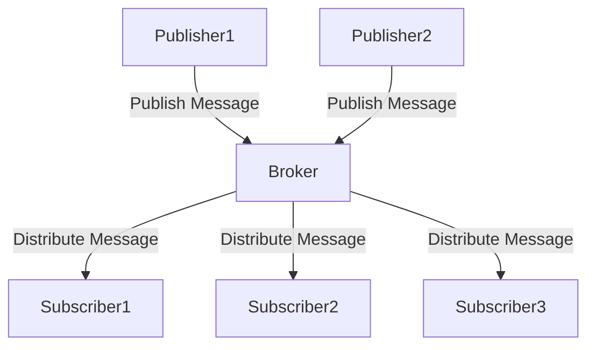

## 6.13 Publish/Subscribe Pattern

The Publish/Subscribe (Pub/Sub) pattern is a powerful design pattern that facilitates communication between components in a software system. It achieves this by decoupling the components that produce information (publishers) from those that consume it (subscribers) through an intermediary known as a broker or event bus. This pattern is particularly useful in event-driven architectures, where it promotes scalability, flexibility, and maintainability.

### Understanding the Publish/Subscribe Pattern

#### Intent and Definition

The primary intent of the Publish/Subscribe pattern is to allow components to communicate with each other without being directly connected. This is achieved by introducing a broker or event bus that manages the distribution of messages between publishers and subscribers. Publishers emit messages without needing to know who will receive them, while subscribers listen for messages without needing to know who sent them.

#### Problems Solved

The Publish/Subscribe pattern addresses several key problems in software design:

- **Decoupling Components**: By using a broker, the pattern reduces dependencies between components, allowing them to evolve independently.
- **Scalability**: The pattern supports the addition of new publishers and subscribers without impacting existing components.
- **Flexibility**: Subscribers can dynamically register or unregister for messages, making the system adaptable to changing requirements.
- **Maintainability**: With decoupled components, the system becomes easier to maintain and extend.

### Key Components of the Publish/Subscribe Pattern

Let's delve into the core components of the Publish/Subscribe pattern:

#### Publisher

A publisher is responsible for sending messages or events to the broker. It does not need to know the details of the subscribers or how many there are. The publisher's role is to focus on producing messages and delegating the distribution to the broker.

#### Subscriber

A subscriber registers interest in certain types of messages or events. It listens for messages from the broker and processes them accordingly. Subscribers can dynamically subscribe or unsubscribe from messages, allowing for flexible system behavior.

#### Broker/Event Bus

The broker, also known as the event bus, is the intermediary that manages the distribution of messages between publishers and subscribers. It ensures that messages are delivered to all interested subscribers. The broker abstracts the communication details, allowing publishers and subscribers to remain unaware of each other's existence.

### Visualizing the Publish/Subscribe Pattern

To better understand the relationships between these components, let's visualize the Publish/Subscribe pattern:



**Diagram Description**: This diagram illustrates the flow of messages in the Publish/Subscribe pattern. Publishers send messages to the broker, which then distributes them to all registered subscribers.

### Implementing the Publish/Subscribe Pattern in TypeScript

Let's explore how to implement the Publish/Subscribe pattern in TypeScript. We'll create a simple event bus that allows publishers to emit events and subscribers to listen for them.

#### Step 1: Define the Event Bus

First, we'll define an `EventBus` class that will act as the broker. This class will manage the registration of subscribers and the distribution of events.

```typescript
type Callback = (data: any) => void;

class EventBus {
    private subscribers: Map<string, Callback[]> = new Map();

    // Register a subscriber for a specific event
    subscribe(eventType: string, callback: Callback): void {
        if (!this.subscribers.has(eventType)) {
            this.subscribers.set(eventType, []);
        }
        this.subscribers.get(eventType)!.push(callback);
    }

    // Unregister a subscriber for a specific event
    unsubscribe(eventType: string, callback: Callback): void {
        const callbacks = this.subscribers.get(eventType);
        if (callbacks) {
            this.subscribers.set(eventType, callbacks.filter(cb => cb !== callback));
        }
    }

    // Publish an event to all subscribers
    publish(eventType: string, data: any): void {
        const callbacks = this.subscribers.get(eventType);
        if (callbacks) {
            callbacks.forEach(callback => callback(data));
        }
    }
}
```

**Code Explanation**:
- The `EventBus` class maintains a map of event types to arrays of callbacks.
- The `subscribe` method allows subscribers to register for specific events.
- The `unsubscribe` method allows subscribers to unregister from events.
- The `publish` method sends data to all subscribers of a given event type.

#### Step 2: Implement Publishers and Subscribers

Next, we'll implement a simple publisher and subscriber to demonstrate how they interact with the `EventBus`.

```typescript
// Publisher
class Publisher {
    constructor(private eventBus: EventBus) {}

    publishEvent(eventType: string, data: any): void {
        console.log(`Publishing event: ${eventType}`);
        this.eventBus.publish(eventType, data);
    }
}

// Subscriber
class Subscriber {
    constructor(private eventBus: EventBus, private name: string) {}

    subscribeToEvent(eventType: string): void {
        this.eventBus.subscribe(eventType, this.handleEvent.bind(this));
    }

    handleEvent(data: any): void {
        console.log(`${this.name} received event data:`, data);
    }
}

// Usage
const eventBus = new EventBus();
const publisher = new Publisher(eventBus);
const subscriber1 = new Subscriber(eventBus, 'Subscriber 1');
const subscriber2 = new Subscriber(eventBus, 'Subscriber 2');

subscriber1.subscribeToEvent('testEvent');
subscriber2.subscribeToEvent('testEvent');

publisher.publishEvent('testEvent', { message: 'Hello, World!' });
```

**Code Explanation**:
- The `Publisher` class uses the `EventBus` to publish events.
- The `Subscriber` class registers for events and handles them when they occur.
- In the usage example, two subscribers register for a `testEvent`, and the publisher emits this event with a message.

### Promoting Scalability and Loose Coupling

The Publish/Subscribe pattern inherently promotes scalability and loose coupling:

- **Scalability**: New publishers and subscribers can be added without affecting existing components. The broker handles the distribution of messages, allowing the system to grow organically.
- **Loose Coupling**: Publishers and subscribers are decoupled, meaning they do not need to know about each other's existence. This reduces dependencies and makes the system more flexible and maintainable.

### Advanced Topics in Publish/Subscribe

#### Handling Complex Event Flows

In more complex systems, events may need to be processed in a specific order or require additional context. This can be achieved by enhancing the `EventBus` to support features like event prioritization, filtering, or transformation.

#### Integrating with External Systems

The Publish/Subscribe pattern can be extended to integrate with external systems, such as message queues or cloud-based event services. This allows for distributed event processing and further scalability.

### Try It Yourself

To deepen your understanding of the Publish/Subscribe pattern, try modifying the code examples:

- **Add a New Event Type**: Create a new event type and have the publisher emit it. Add a new subscriber to listen for this event.
- **Implement Unsubscribe Logic**: Enhance the `Subscriber` class to allow unsubscribing from events.
- **Integrate with a Message Queue**: Explore integrating the `EventBus` with a message queue like RabbitMQ or Kafka for distributed event processing.

### Conclusion

The Publish/Subscribe pattern is a versatile and powerful design pattern that enhances the scalability, flexibility, and maintainability of software systems. By decoupling components through a broker, it allows for dynamic and adaptable architectures that can evolve with changing requirements.

## Quiz Time!



### What is the primary intent of the Publish/Subscribe pattern?

- [x] To decouple components by using a broker for message distribution.
- [ ] To tightly couple components for faster communication.
- [ ] To eliminate the need for communication between components.
- [ ] To replace all direct method calls with event-based communication.

> **Explanation:** The Publish/Subscribe pattern aims to decouple components by using a broker to manage message distribution, allowing components to communicate without direct dependencies.

### Which component in the Publish/Subscribe pattern is responsible for distributing messages?

- [ ] Publisher
- [ ] Subscriber
- [x] Broker/Event Bus
- [ ] Middleware

> **Explanation:** The Broker/Event Bus is responsible for managing the distribution of messages between publishers and subscribers.

### How does the Publish/Subscribe pattern promote scalability?

- [x] By allowing new publishers and subscribers to be added without affecting existing components.
- [ ] By requiring all components to be tightly coupled.
- [ ] By limiting the number of subscribers to a fixed number.
- [ ] By using synchronous communication only.

> **Explanation:** The Publish/Subscribe pattern promotes scalability by allowing new publishers and subscribers to be added independently, without impacting existing components.

### What is a key benefit of using the Publish/Subscribe pattern?

- [x] Loose coupling between components.
- [ ] Increased complexity in communication.
- [ ] Direct dependencies between publishers and subscribers.
- [ ] Reduced flexibility in system design.

> **Explanation:** A key benefit of the Publish/Subscribe pattern is loose coupling, which reduces dependencies between components and enhances flexibility.

### In the provided TypeScript example, what does the `publish` method do?

- [x] Sends data to all subscribers of a given event type.
- [ ] Registers a new subscriber for an event.
- [ ] Removes a subscriber from an event.
- [ ] Logs event data to the console.

> **Explanation:** The `publish` method sends data to all subscribers of a given event type, allowing them to process the event.

### What is the role of a subscriber in the Publish/Subscribe pattern?

- [ ] To send messages to the broker.
- [x] To register interest in certain messages or events.
- [ ] To manage the distribution of messages.
- [ ] To act as a mediator between publishers and the broker.

> **Explanation:** A subscriber registers interest in certain messages or events and listens for them, processing the data when received.

### How can the Publish/Subscribe pattern be extended for distributed event processing?

- [x] By integrating with external message queues or cloud-based event services.
- [ ] By using only local in-memory event buses.
- [ ] By limiting the number of publishers and subscribers.
- [ ] By requiring synchronous communication between components.

> **Explanation:** The pattern can be extended for distributed event processing by integrating with external message queues or cloud-based event services.

### What is a potential challenge when implementing the Publish/Subscribe pattern?

- [x] Managing complex event flows and dependencies.
- [ ] Ensuring direct communication between all components.
- [ ] Reducing the number of subscribers.
- [ ] Eliminating the need for a broker.

> **Explanation:** Managing complex event flows and dependencies can be a challenge, as events may need to be processed in specific orders or require additional context.

### True or False: The Publish/Subscribe pattern eliminates the need for a broker.

- [ ] True
- [x] False

> **Explanation:** False. The Publish/Subscribe pattern relies on a broker to manage the distribution of messages between publishers and subscribers.

### What is a common use case for the Publish/Subscribe pattern?

- [x] Event-driven architectures.
- [ ] Direct method calls between components.
- [ ] Synchronous communication only.
- [ ] Hardcoding communication paths.

> **Explanation:** The Publish/Subscribe pattern is commonly used in event-driven architectures to facilitate communication between decoupled components.


