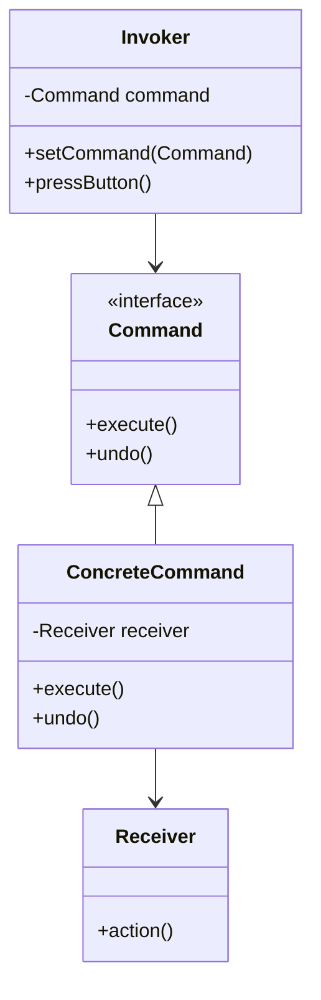

## 6.2.1 Implementing Command in TypeScript

The Command Pattern is a behavioral design pattern that turns a request into a stand-alone object that contains all information about the request. This transformation allows you to parameterize methods with different requests, delay or queue a request's execution, and support undoable operations.

### Understanding the Command Pattern

The Command Pattern is particularly useful in scenarios where you need to issue requests to objects without knowing anything about the operation being requested or the receiver of the request. This decoupling is achieved by encapsulating the request as an object, thereby allowing for parameterization and queuing of requests.

#### Key Components of the Command Pattern

1. **Command Interface**: Declares the `execute` method, which is implemented by all concrete commands.
2. **ConcreteCommand**: Implements the `execute` method by invoking operations on the `Receiver`.
3. **Receiver**: Contains the business logic for performing the action.
4. **Invoker**: Stores and invokes commands.
5. **Client**: Creates and configures the command objects.

### Step-by-Step Implementation in TypeScript

Let's walk through the implementation of the Command Pattern in TypeScript with a practical example.

#### Step 1: Defining the Command Interface

First, we define a `Command` interface with an `execute` method. Optionally, we can include an `undo` method for commands that need to be reversible.

```typescript
// Command.ts
export interface Command {
    execute(): void;
    undo?(): void;
}
```

#### Step 2: Implementing ConcreteCommand Classes

Concrete commands implement the `Command` interface. They hold a reference to a `Receiver` object and implement the `execute` method to invoke operations on the `Receiver`.

```typescript
// Light.ts
export class Light {
    on(): void {
        console.log("The light is on.");
    }

    off(): void {
        console.log("The light is off.");
    }
}

// LightOnCommand.ts
import { Command } from './Command';
import { Light } from './Light';

export class LightOnCommand implements Command {
    private light: Light;

    constructor(light: Light) {
        this.light = light;
    }

    execute(): void {
        this.light.on();
    }

    undo(): void {
        this.light.off();
    }
}

// LightOffCommand.ts
import { Command } from './Command';
import { Light } from './Light';

export class LightOffCommand implements Command {
    private light: Light;

    constructor(light: Light) {
        this.light = light;
    }

    execute(): void {
        this.light.off();
    }

    undo(): void {
        this.light.on();
    }
}
```

#### Step 3: Defining the Receiver Class

The `Receiver` class contains the actual business logic to perform the work. In our example, the `Light` class is the receiver.

```typescript
// Light.ts
export class Light {
    on(): void {
        console.log("The light is on.");
    }

    off(): void {
        console.log("The light is off.");
    }
}
```

#### Step 4: Creating the Invoker Class

The `Invoker` class is responsible for storing and invoking commands. It doesn't know anything about the command's implementation.

```typescript
// RemoteControl.ts
import { Command } from './Command';

export class RemoteControl {
    private command: Command;

    setCommand(command: Command): void {
        this.command = command;
    }

    pressButton(): void {
        this.command.execute();
    }

    pressUndo(): void {
        if (this.command.undo) {
            this.command.undo();
        }
    }
}
```

#### Step 5: Putting It All Together

Now, let's see how we can use these components together.

```typescript
// Client.ts
import { Light } from './Light';
import { LightOnCommand } from './LightOnCommand';
import { LightOffCommand } from './LightOffCommand';
import { RemoteControl } from './RemoteControl';

const livingRoomLight = new Light();
const lightOn = new LightOnCommand(livingRoomLight);
const lightOff = new LightOffCommand(livingRoomLight);

const remote = new RemoteControl();

remote.setCommand(lightOn);
remote.pressButton(); // Output: The light is on.

remote.setCommand(lightOff);
remote.pressButton(); // Output: The light is off.

remote.pressUndo(); // Output: The light is on.
```

### Parameterizing Commands with Data

Commands can be parameterized with data to perform specific actions. For instance, if we want to adjust the brightness of the light, we can pass the brightness level as a parameter.

```typescript
// LightDimCommand.ts
import { Command } from './Command';
import { Light } from './Light';

export class LightDimCommand implements Command {
    private light: Light;
    private level: number;

    constructor(light: Light, level: number) {
        this.light = light;
        this.level = level;
    }

    execute(): void {
        console.log(`The light is dimmed to ${this.level}%.`);
    }

    undo(): void {
        console.log("Undo dimming.");
    }
}
```

### Creating a Queue of Commands

We can create a list or queue of commands to execute them in sequence. This is particularly useful for batch processing or macro commands.

```typescript
// MacroCommand.ts
import { Command } from './Command';

export class MacroCommand implements Command {
    private commands: Command[];

    constructor(commands: Command[]) {
        this.commands = commands;
    }

    execute(): void {
        this.commands.forEach(command => command.execute());
    }

    undo(): void {
        this.commands.reverse().forEach(command => {
            if (command.undo) {
                command.undo();
            }
        });
    }
}
```

### Decoupling Invoker and Receiver

The Command Pattern decouples the invoker from the receiver, allowing for more flexible and maintainable code. The invoker knows only about the command interface, not the specific implementation or the receiver.

### Enhancing Implementation with TypeScript Features

TypeScript's features, such as classes, interfaces, and generics, enhance the implementation of the Command Pattern by providing strong typing and better code organization.

#### Using Generics

Generics can be used to create more flexible command implementations that can work with different types of receivers.

```typescript
// GenericCommand.ts
export interface GenericCommand<T> {
    execute(receiver: T): void;
    undo?(receiver: T): void;
}
```

### Asynchronous Commands

In modern applications, commands often need to perform asynchronous operations. TypeScript's Promises and async/await syntax can be used to handle these scenarios.

```typescript
// AsyncCommand.ts
import { Command } from './Command';

export class AsyncCommand implements Command {
    async execute(): Promise<void> {
        console.log("Starting async operation...");
        await new Promise(resolve => setTimeout(resolve, 1000));
        console.log("Async operation completed.");
    }

    async undo(): Promise<void> {
        console.log("Undoing async operation...");
        await new Promise(resolve => setTimeout(resolve, 1000));
        console.log("Async operation undone.");
    }
}
```

### Visualizing the Command Pattern

To better understand the relationships between the components in the Command Pattern, let's visualize it using a class diagram.



### Try It Yourself

Experiment with the Command Pattern by modifying the code examples:

- **Add New Commands**: Create additional command classes for different actions.
- **Implement Undo Functionality**: Enhance existing commands with undo capabilities.
- **Create a Command Queue**: Implement a queue to execute multiple commands in sequence.
- **Use Async Commands**: Modify commands to perform asynchronous operations using async/await.

### Key Takeaways

- The Command Pattern encapsulates a request as an object, allowing for parameterization, queuing, and undoable operations.
- It decouples the invoker from the receiver, promoting flexibility and maintainability.
- TypeScript's features, such as classes, interfaces, and generics, enhance the implementation of the Command Pattern.
- Asynchronous commands can be handled using Promises and async/await.

### Further Reading

- [MDN Web Docs: Classes](https://developer.mozilla.org/en-US/docs/Web/JavaScript/Reference/Classes)
- [TypeScript Handbook: Interfaces](https://www.typescriptlang.org/docs/handbook/interfaces.html)
- [TypeScript Handbook: Generics](https://www.typescriptlang.org/docs/handbook/generics.html)

Remember, this is just the beginning. As you progress, you'll build more complex and interactive applications. Keep experimenting, stay curious, and enjoy the journey!

## Quiz Time!



### What is the main purpose of the Command Pattern?

- [x] To encapsulate a request as an object
- [ ] To create a single instance of a class
- [ ] To provide a simplified interface to a complex subsystem
- [ ] To allow incompatible interfaces to work together

> **Explanation:** The Command Pattern encapsulates a request as an object, allowing for parameterization and queuing of requests.

### Which component in the Command Pattern is responsible for executing the command?

- [ ] Invoker
- [x] ConcreteCommand
- [ ] Receiver
- [ ] Client

> **Explanation:** The ConcreteCommand implements the execute method, which invokes operations on the Receiver.

### What is the role of the Invoker in the Command Pattern?

- [x] To store and invoke commands
- [ ] To perform the actual work
- [ ] To define the command interface
- [ ] To hold a reference to the receiver

> **Explanation:** The Invoker stores and invokes commands but does not perform the actual work.

### How can TypeScript's generics enhance the Command Pattern?

- [x] By creating flexible command implementations that can work with different types of receivers
- [ ] By allowing multiple inheritance
- [ ] By providing runtime type checking
- [ ] By simplifying asynchronous operations

> **Explanation:** Generics allow for flexible command implementations that can work with different types of receivers.

### What is the benefit of decoupling the invoker from the receiver?

- [x] It promotes flexibility and maintainability
- [ ] It increases the complexity of the code
- [ ] It reduces the number of classes needed
- [ ] It allows for multiple inheritance

> **Explanation:** Decoupling the invoker from the receiver promotes flexibility and maintainability by allowing changes to be made independently.

### How can asynchronous commands be handled in TypeScript?

- [x] Using Promises and async/await
- [ ] Using multiple inheritance
- [ ] Using decorators
- [ ] Using interfaces

> **Explanation:** Asynchronous commands can be handled using Promises and async/await in TypeScript.

### What method is commonly used in the Command interface?

- [x] execute
- [ ] run
- [ ] start
- [ ] invoke

> **Explanation:** The execute method is commonly used in the Command interface to perform the action.

### Which component contains the business logic for performing the action?

- [ ] Invoker
- [ ] ConcreteCommand
- [x] Receiver
- [ ] Client

> **Explanation:** The Receiver contains the business logic for performing the action.

### What is the optional method in the Command interface for reversible commands?

- [x] undo
- [ ] redo
- [ ] cancel
- [ ] stop

> **Explanation:** The undo method is optional in the Command interface for reversible commands.

### The Command Pattern allows for parameterization of methods with different requests.

- [x] True
- [ ] False

> **Explanation:** The Command Pattern allows for parameterization of methods with different requests, enhancing flexibility and reusability.


