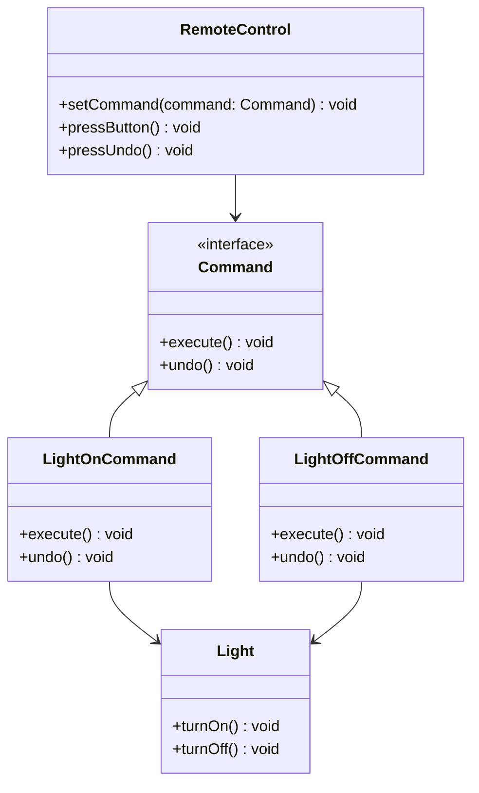

## 6.2.2 Encapsulating Actions

In the realm of software design patterns, the Command Pattern stands out as a powerful tool for encapsulating actions as objects. This approach not only decouples the sender of a request from its receiver but also promotes flexibility in executing operations. Let's delve into how the Command Pattern achieves this, and explore its benefits and applications in TypeScript.

### Understanding the Command Pattern

The Command Pattern is a behavioral design pattern that turns a request into a stand-alone object containing all the information about the request. This transformation allows for parameterization of clients with queues, requests, and operations. The pattern is composed of four main components:

1. **Command**: An interface or abstract class defining the execute method.
2. **Concrete Command**: A class that implements the Command interface and defines the binding between the receiver and an action.
3. **Invoker**: A class that invokes the command.
4. **Receiver**: A class that performs the actual work when the command is executed.

By encapsulating actions in this manner, the Command Pattern allows for a high degree of flexibility and decoupling between the invoker and receiver.

### Encapsulating Actions in TypeScript

In TypeScript, encapsulating actions as objects involves defining a command interface and implementing concrete command classes. This separation of concerns allows for commands to be passed as arguments, stored, or even logged for later execution.

#### Command Interface

Let's start by defining a simple `Command` interface in TypeScript:

```typescript
// Command interface with an execute method
interface Command {
    execute(): void;
}
```

This interface serves as a contract for all concrete command classes, ensuring they implement the `execute` method.

#### Concrete Command

Next, we implement a concrete command class. Suppose we have a `Light` class with methods to turn the light on and off. We can create command classes to encapsulate these actions:

```typescript
// Receiver class
class Light {
    turnOn() {
        console.log("The light is on.");
    }

    turnOff() {
        console.log("The light is off.");
    }
}

// Concrete Command for turning the light on
class LightOnCommand implements Command {
    private light: Light;

    constructor(light: Light) {
        this.light = light;
    }

    execute() {
        this.light.turnOn();
    }
}

// Concrete Command for turning the light off
class LightOffCommand implements Command {
    private light: Light;

    constructor(light: Light) {
        this.light = light;
    }

    execute() {
        this.light.turnOff();
    }
}
```

Here, `LightOnCommand` and `LightOffCommand` encapsulate the actions of turning the light on and off, respectively. Each command holds a reference to the `Light` receiver and calls the appropriate method in its `execute` implementation.

#### Invoker

The invoker is responsible for triggering the command. It doesn't know the details of the command or the receiver, only that it can call `execute` on the command:

```typescript
// Invoker class
class RemoteControl {
    private command: Command;

    setCommand(command: Command) {
        this.command = command;
    }

    pressButton() {
        this.command.execute();
    }
}
```

The `RemoteControl` class acts as the invoker. It can be configured with any command implementing the `Command` interface, allowing it to execute different actions without knowing their specifics.

### Benefits of Encapsulating Actions

Encapsulating actions as objects brings several advantages:

1. **Decoupling**: The invoker and receiver are decoupled, allowing them to vary independently. The invoker doesn't need to know the specifics of the receiver's implementation.

2. **Parameterization**: Commands can be parameterized with different receivers and actions, enabling dynamic behavior.

3. **Queuing and Logging**: Commands can be stored in queues or logs for later execution, enabling features like undo/redo and transactional operations.

4. **Extensibility**: New commands can be added without modifying existing code, enhancing the system's extensibility.

5. **Reusability**: Commands can be reused across different invokers and receivers, promoting code reuse.

### Implementing Undo/Redo Functionality

One of the powerful features of the Command Pattern is its ability to support undo/redo operations. This is achieved by maintaining a history of executed commands and providing a mechanism to reverse their effects.

#### Adding Undo Capability

To implement undo functionality, we extend the `Command` interface to include an `undo` method:

```typescript
// Extended Command interface with undo method
interface Command {
    execute(): void;
    undo(): void;
}

// Concrete Command with undo capability
class LightOnCommand implements Command {
    private light: Light;

    constructor(light: Light) {
        this.light = light;
    }

    execute() {
        this.light.turnOn();
    }

    undo() {
        this.light.turnOff();
    }
}

class LightOffCommand implements Command {
    private light: Light;

    constructor(light: Light) {
        this.light = light;
    }

    execute() {
        this.light.turnOff();
    }

    undo() {
        this.light.turnOn();
    }
}
```

Each command now implements the `undo` method, reversing the action performed in `execute`.

#### Invoker with Undo/Redo

The invoker can maintain a history of executed commands to support undo/redo operations:

```typescript
// Invoker class with undo/redo functionality
class RemoteControl {
    private commandHistory: Command[] = [];
    private command: Command;

    setCommand(command: Command) {
        this.command = command;
    }

    pressButton() {
        this.command.execute();
        this.commandHistory.push(this.command);
    }

    pressUndo() {
        const command = this.commandHistory.pop();
        if (command) {
            command.undo();
        }
    }
}
```

The `RemoteControl` class now maintains a `commandHistory` array to track executed commands. The `pressUndo` method retrieves the last executed command and calls its `undo` method.

### Storing, Queuing, and Logging Commands

Encapsulating actions as commands allows them to be stored, queued, or logged for later execution. This capability is particularly useful in scenarios requiring deferred execution or transaction management.

#### Storing Commands

Commands can be stored in a collection for batch execution or deferred processing:

```typescript
// Batch command execution
class CommandQueue {
    private commands: Command[] = [];

    addCommand(command: Command) {
        this.commands.push(command);
    }

    executeAll() {
        for (const command of this.commands) {
            command.execute();
        }
        this.commands = [];
    }
}

// Usage
const light = new Light();
const lightOnCommand = new LightOnCommand(light);
const lightOffCommand = new LightOffCommand(light);

const commandQueue = new CommandQueue();
commandQueue.addCommand(lightOnCommand);
commandQueue.addCommand(lightOffCommand);

commandQueue.executeAll();
```

The `CommandQueue` class accumulates commands and executes them in sequence when `executeAll` is called.

#### Logging Commands

Commands can also be logged for auditing or debugging purposes:

```typescript
// Logging command execution
class CommandLogger {
    private log: string[] = [];

    logCommand(command: Command) {
        this.log.push(`Executed command: ${command.constructor.name}`);
    }

    showLog() {
        console.log(this.log.join('\n'));
    }
}

// Usage
const logger = new CommandLogger();
logger.logCommand(lightOnCommand);
logger.logCommand(lightOffCommand);
logger.showLog();
```

The `CommandLogger` class records the execution of commands, providing a history of operations.

### Extensibility and Reusability

The Command Pattern's encapsulation of actions promotes extensibility and reusability. New commands can be added without altering existing code, and commands can be reused across different contexts.

#### Adding New Commands

To add a new command, simply implement the `Command` interface and define the desired behavior:

```typescript
// New command to dim the light
class LightDimCommand implements Command {
    private light: Light;

    constructor(light: Light) {
        this.light = light;
    }

    execute() {
        console.log("The light is dimmed.");
    }

    undo() {
        console.log("The light is brightened.");
    }
}

// Usage
const lightDimCommand = new LightDimCommand(light);
remoteControl.setCommand(lightDimCommand);
remoteControl.pressButton();
remoteControl.pressUndo();
```

The `LightDimCommand` class adds new functionality without affecting existing commands or invokers.

### Facilitating Transactional Operations

The Command Pattern is well-suited for implementing transactional operations, where a series of actions must be executed atomically. If any action fails, the entire transaction can be rolled back using the `undo` method.

#### Implementing Transactions

Consider a banking application where multiple account operations must be executed as a single transaction:

```typescript
// Receiver class for bank account
class BankAccount {
    private balance: number = 0;

    deposit(amount: number) {
        this.balance += amount;
        console.log(`Deposited: $${amount}, Balance: $${this.balance}`);
    }

    withdraw(amount: number) {
        if (this.balance >= amount) {
            this.balance -= amount;
            console.log(`Withdrew: $${amount}, Balance: $${this.balance}`);
        } else {
            console.log("Insufficient funds.");
        }
    }

    getBalance() {
        return this.balance;
    }
}

// Command for depositing money
class DepositCommand implements Command {
    private account: BankAccount;
    private amount: number;

    constructor(account: BankAccount, amount: number) {
        this.account = account;
        this.amount = amount;
    }

    execute() {
        this.account.deposit(this.amount);
    }

    undo() {
        this.account.withdraw(this.amount);
    }
}

// Command for withdrawing money
class WithdrawCommand implements Command {
    private account: BankAccount;
    private amount: number;

    constructor(account: BankAccount, amount: number) {
        this.account = account;
        this.amount = amount;
    }

    execute() {
        this.account.withdraw(this.amount);
    }

    undo() {
        this.account.deposit(this.amount);
    }
}

// Transaction manager
class TransactionManager {
    private commands: Command[] = [];

    addCommand(command: Command) {
        this.commands.push(command);
    }

    executeTransaction() {
        for (const command of this.commands) {
            command.execute();
        }
    }

    rollbackTransaction() {
        for (const command of this.commands.reverse()) {
            command.undo();
        }
    }
}

// Usage
const account = new BankAccount();
const depositCommand = new DepositCommand(account, 100);
const withdrawCommand = new WithdrawCommand(account, 50);

const transactionManager = new TransactionManager();
transactionManager.addCommand(depositCommand);
transactionManager.addCommand(withdrawCommand);

transactionManager.executeTransaction();
transactionManager.rollbackTransaction();
```

The `TransactionManager` class manages a series of commands, executing them as a transaction and providing rollback capabilities.

### Try It Yourself

Experiment with the Command Pattern by modifying the examples provided. Here are a few suggestions:

- **Add New Commands**: Implement additional commands for different actions, such as adjusting volume or changing channels.
- **Enhance Undo/Redo**: Extend the undo/redo functionality to support multiple levels of undo and redo.
- **Implement Logging**: Enhance the logging mechanism to include timestamps or additional details about each command.
- **Create a GUI**: Design a simple graphical user interface (GUI) to interact with the commands, such as a remote control with buttons for each command.

### Visualizing the Command Pattern

To better understand the relationships between the components of the Command Pattern, let's visualize them using a class diagram:



This diagram illustrates the relationships between the `Command` interface, concrete command classes, the `Light` receiver, and the `RemoteControl` invoker.

### Key Takeaways

- **Encapsulation**: The Command Pattern encapsulates actions as objects, decoupling the invoker from the receiver.
- **Flexibility**: Commands can be parameterized, stored, queued, or logged, enhancing flexibility and reusability.
- **Undo/Redo**: The pattern supports undo/redo functionality by maintaining a history of executed commands.
- **Transactional Operations**: Commands can be executed as transactions, with rollback capabilities.
- **Extensibility**: New commands can be added without modifying existing code, promoting extensibility.

### Further Reading

For more information on the Command Pattern and other design patterns, consider exploring the following resources:

- [MDN Web Docs: Command Pattern](https://developer.mozilla.org/en-US/docs/Web/JavaScript/Guide/Design_Patterns#command_pattern)
- [Refactoring Guru: Command Pattern](https://refactoring.guru/design-patterns/command)
- [Design Patterns: Elements of Reusable Object-Oriented Software](https://en.wikipedia.org/wiki/Design_Patterns) by Erich Gamma, Richard Helm, Ralph Johnson, and John Vlissides

## Quiz Time!



### What is the primary purpose of the Command Pattern?

- [x] To encapsulate actions as objects, decoupling the sender from the receiver.
- [ ] To enhance performance by reducing the number of objects created.
- [ ] To simplify the user interface design.
- [ ] To provide a way to access elements of a collection sequentially.

> **Explanation:** The Command Pattern encapsulates actions as objects, decoupling the sender from the receiver and allowing for flexible execution of operations.

### Which component of the Command Pattern is responsible for executing the command?

- [ ] Invoker
- [x] Receiver
- [ ] Client
- [ ] Command

> **Explanation:** The receiver is the component that performs the actual work when the command is executed.

### How does the Command Pattern facilitate undo/redo functionality?

- [ ] By using a singleton pattern to manage state.
- [x] By maintaining a history of executed commands and providing an undo method.
- [ ] By implementing a complex algorithm to reverse actions.
- [ ] By storing all actions in a database.

> **Explanation:** The Command Pattern supports undo/redo functionality by maintaining a history of executed commands and providing an undo method to reverse their effects.

### What is a key benefit of encapsulating actions as objects?

- [x] It allows for parameterization and passing commands as arguments.
- [ ] It reduces the need for error handling.
- [ ] It simplifies the code by removing all conditional statements.
- [ ] It ensures that all actions are executed in parallel.

> **Explanation:** Encapsulating actions as objects allows for parameterization and passing commands as arguments, enhancing flexibility.

### In the Command Pattern, what role does the invoker play?

- [x] It triggers the command execution.
- [ ] It performs the actual work of the command.
- [ ] It logs the command execution.
- [ ] It stores the command history.

> **Explanation:** The invoker is responsible for triggering the command execution, without knowing the details of the command or the receiver.

### How can commands be stored for later execution?

- [ ] By using a database to save command objects.
- [x] By storing them in a queue or collection.
- [ ] By writing them to a log file.
- [ ] By sending them to a remote server.

> **Explanation:** Commands can be stored in a queue or collection for later execution, enabling deferred processing or batch operations.

### What is a common use case for the Command Pattern?

- [x] Implementing a remote control system.
- [ ] Designing a high-performance graphics engine.
- [ ] Creating a real-time chat application.
- [ ] Building a static website.

> **Explanation:** A common use case for the Command Pattern is implementing a remote control system, where different commands can be executed dynamically.

### How does the Command Pattern promote reusability?

- [ ] By reducing the number of classes needed.
- [x] By allowing commands to be reused across different invokers and receivers.
- [ ] By eliminating the need for interfaces.
- [ ] By using global variables to share state.

> **Explanation:** The Command Pattern promotes reusability by allowing commands to be reused across different invokers and receivers, enhancing code reuse.

### What is the role of the `execute` method in the Command Pattern?

- [x] It defines the action to be performed by the command.
- [ ] It initializes the command object.
- [ ] It logs the command execution.
- [ ] It validates the command parameters.

> **Explanation:** The `execute` method defines the action to be performed by the command, encapsulating the behavior.

### True or False: The Command Pattern can only be used for simple actions.

- [ ] True
- [x] False

> **Explanation:** False. The Command Pattern can be used for both simple and complex actions, including transactional operations and undo/redo functionality.


