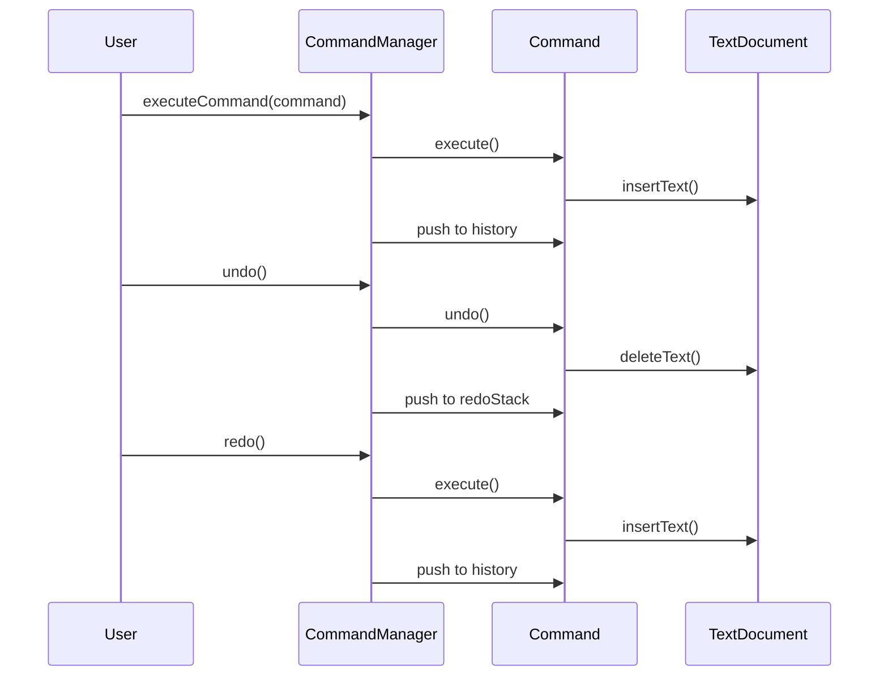

## 6.2.3 Undo and Redo Mechanisms

In the world of software development, providing users with the ability to undo and redo actions is a powerful feature that enhances user experience and productivity. This capability is often implemented using the Command Pattern, which allows for encapsulating requests as objects, thereby enabling parameterization of clients with queues, requests, and operations. In this section, we will delve into the concept of reversible commands, explore how to implement undo and redo mechanisms using the Command Pattern in TypeScript, and discuss strategies and challenges associated with these implementations.

### Understanding Reversible Commands

Reversible commands are actions that can be undone or reversed, allowing the system to return to a previous state. This is particularly useful in applications such as text editors, graphic design software, and any other system where users need to experiment and backtrack without losing progress. The Command Pattern provides a structured way to encapsulate these actions and their reversals.

#### Key Concepts

- **Command Interface**: At the heart of the Command Pattern is the `Command` interface, which typically includes methods like `execute()` and `undo()`. The `undo()` method is crucial for reversible commands as it defines how to revert the action performed by `execute()`.

- **Command History**: To support undo and redo operations, a history of executed commands is maintained. This history allows the application to track which commands have been executed and in what order, enabling it to reverse or reapply them as needed.

- **State Management**: Implementing undo and redo functionality requires careful management of the application's state. Each command must be able to restore the state to what it was before the command was executed.

### Implementing Undoable Commands in TypeScript

Let's explore how to implement undoable commands in TypeScript using the Command Pattern. We'll start by defining a simple command interface and then build upon it to include undo functionality.

#### Defining the Command Interface

First, we define a basic `Command` interface with `execute()` and `undo()` methods:

```typescript
interface Command {
    execute(): void;
    undo(): void;
}
```

This interface serves as a blueprint for all commands in our application. Each command will implement these methods to perform and reverse specific actions.

#### Creating Concrete Commands

Let's create a simple example of a command that modifies a text document. We'll define a `TextDocument` class and a `InsertTextCommand` that adds text to the document:

```typescript
class TextDocument {
    private content: string = '';

    public insertText(text: string, position: number): void {
        this.content = this.content.slice(0, position) + text + this.content.slice(position);
    }

    public deleteText(position: number, length: number): void {
        this.content = this.content.slice(0, position) + this.content.slice(position + length);
    }

    public getContent(): string {
        return this.content;
    }
}

class InsertTextCommand implements Command {
    private document: TextDocument;
    private text: string;
    private position: number;

    constructor(document: TextDocument, text: string, position: number) {
        this.document = document;
        this.text = text;
        this.position = position;
    }

    execute(): void {
        this.document.insertText(this.text, this.position);
    }

    undo(): void {
        this.document.deleteText(this.position, this.text.length);
    }
}
```

In this example, the `InsertTextCommand` class implements the `Command` interface. The `execute()` method inserts text at a specified position, while the `undo()` method removes the inserted text, effectively reversing the operation.

#### Managing Command History

To enable undo and redo functionality, we need to maintain a history of executed commands. We'll use a `CommandManager` class to manage this history:

```typescript
class CommandManager {
    private history: Command[] = [];
    private redoStack: Command[] = [];

    public executeCommand(command: Command): void {
        command.execute();
        this.history.push(command);
        this.redoStack = []; // Clear redo stack on new command
    }

    public undo(): void {
        const command = this.history.pop();
        if (command) {
            command.undo();
            this.redoStack.push(command);
        }
    }

    public redo(): void {
        const command = this.redoStack.pop();
        if (command) {
            command.execute();
            this.history.push(command);
        }
    }
}
```

The `CommandManager` class maintains two stacks: `history` for executed commands and `redoStack` for commands that have been undone. When a command is executed, it is added to the `history` stack, and the `redoStack` is cleared. The `undo()` method pops the last command from the `history` stack, calls its `undo()` method, and pushes it onto the `redoStack`. The `redo()` method performs the opposite operation.

### Considerations for Implementing Undo and Redo

While the basic implementation of undo and redo functionality is straightforward, there are several considerations and challenges to address:

#### Managing State Changes

Each command must be capable of restoring the application's state to what it was before the command was executed. This requires careful design to ensure that state changes are reversible and that commands have access to the necessary information to perform the undo operation.

#### Handling Dependencies Between Commands

Commands may have dependencies on one another, such as when one command relies on the results of a previous command. In such cases, undoing a command may require undoing dependent commands as well. This can complicate the implementation and requires careful management of command dependencies.

#### Ensuring Consistency

The application must ensure that the state remains consistent after undo and redo operations. This includes handling edge cases, such as attempting to undo when there are no commands in the history or redo when there are no commands in the redo stack.

#### Memory Consumption

Storing a history of commands can consume significant memory, especially in applications with complex commands or long histories. Strategies such as limiting the size of the command history or using more memory-efficient data structures may be necessary to manage memory consumption.

### Advanced Techniques and Strategies

For more complex applications, additional techniques and strategies can enhance the undo and redo functionality:

#### Command Grouping

In some cases, multiple commands may need to be treated as a single unit for undo and redo purposes. This can be achieved by grouping commands into a composite command that encapsulates multiple individual commands.

#### Snapshotting

Instead of storing individual commands, the application can periodically capture snapshots of the application's state. This can simplify the undo and redo process by allowing the application to revert to a previous snapshot rather than executing a series of undo operations.

#### Handling Asynchronous Commands

In modern applications, commands may involve asynchronous operations, such as network requests. Implementing undo and redo for asynchronous commands requires additional considerations, such as managing promises and ensuring that the application remains responsive during the undo and redo process.

### Try It Yourself

To better understand the implementation of undo and redo mechanisms, try modifying the code examples provided. Experiment with different types of commands, such as those that modify other aspects of the `TextDocument` or involve more complex state changes. Consider implementing additional features, such as command grouping or snapshotting, to enhance the functionality.

### Visualizing Command History

To help visualize the flow of commands and their execution, let's use a sequence diagram to illustrate the interactions between the `CommandManager`, `Command`, and `TextDocument`.



This diagram illustrates the sequence of interactions that occur during the execution, undo, and redo of a command. It highlights the flow of control between the user, `CommandManager`, `Command`, and `TextDocument`.

### Conclusion

Implementing undo and redo mechanisms using the Command Pattern in TypeScript provides a robust and flexible way to enhance user experience in applications. By encapsulating actions as commands and maintaining a history of executed commands, developers can provide users with the ability to experiment and backtrack without losing progress. While there are challenges to address, such as managing state changes and memory consumption, the benefits of undo and redo functionality make it a valuable addition to many applications.

Remember, this is just the beginning. As you progress, you'll build more complex and interactive applications. Keep experimenting, stay curious, and enjoy the journey!

## Quiz Time!



### What is the primary purpose of the Command Pattern in implementing undo and redo functionality?

- [x] To encapsulate actions as objects and manage their execution and reversal.
- [ ] To directly manipulate the application's state without encapsulation.
- [ ] To store the entire application state after each action.
- [ ] To execute commands in parallel for performance improvement.

> **Explanation:** The Command Pattern encapsulates actions as objects, allowing for their execution and reversal, which is essential for implementing undo and redo functionality.

### Which method is essential for a command to be reversible?

- [x] undo()
- [ ] redo()
- [ ] execute()
- [ ] initialize()

> **Explanation:** The `undo()` method is crucial for reversing the action performed by the `execute()` method, making the command reversible.

### How does the CommandManager class manage redo operations?

- [x] By using a redoStack to store commands that have been undone.
- [ ] By executing all commands in reverse order.
- [ ] By storing the entire application state for each command.
- [ ] By directly modifying the application's state without commands.

> **Explanation:** The `CommandManager` uses a `redoStack` to store commands that have been undone, allowing them to be re-executed during a redo operation.

### What is a potential challenge when implementing undo and redo functionality?

- [x] Managing memory consumption due to command history storage.
- [ ] Ensuring commands execute in parallel for performance.
- [ ] Avoiding the use of the Command Pattern altogether.
- [ ] Directly modifying the application's state without encapsulation.

> **Explanation:** Storing a history of commands can consume significant memory, especially in applications with complex commands or long histories.

### What is one strategy to handle dependencies between commands?

- [x] Grouping commands into a composite command.
- [ ] Ignoring dependencies and executing commands independently.
- [ ] Storing the entire application state after each command.
- [ ] Using asynchronous execution for all commands.

> **Explanation:** Grouping commands into a composite command allows multiple commands to be treated as a single unit, handling dependencies effectively.

### How can snapshotting simplify the undo and redo process?

- [x] By allowing the application to revert to a previous snapshot rather than executing a series of undo operations.
- [ ] By storing individual commands without any state information.
- [ ] By executing all commands in parallel for performance.
- [ ] By directly modifying the application's state without encapsulation.

> **Explanation:** Snapshotting captures the application's state at specific points, allowing the application to revert to a previous state without executing a series of undo operations.

### What is a consideration when implementing undo and redo for asynchronous commands?

- [x] Managing promises and ensuring the application remains responsive.
- [ ] Ignoring asynchronous operations in the command history.
- [ ] Storing the entire application state after each command.
- [ ] Using synchronous execution for all commands.

> **Explanation:** Implementing undo and redo for asynchronous commands requires managing promises and ensuring that the application remains responsive during the process.

### Which diagram can help visualize the flow of commands and their execution?

- [x] Sequence diagram
- [ ] Class diagram
- [ ] Entity-relationship diagram
- [ ] Use case diagram

> **Explanation:** A sequence diagram illustrates the interactions between objects over time, making it useful for visualizing the flow of commands and their execution.

### What is the role of the redoStack in the CommandManager class?

- [x] To store commands that have been undone and can be re-executed.
- [ ] To store all executed commands for future reference.
- [ ] To execute commands in parallel for performance improvement.
- [ ] To directly modify the application's state without encapsulation.

> **Explanation:** The `redoStack` stores commands that have been undone, allowing them to be re-executed during a redo operation.

### True or False: The Command Pattern is only useful for implementing undo and redo functionality.

- [ ] True
- [x] False

> **Explanation:** False. The Command Pattern is versatile and can be used for various purposes, such as parameterizing objects with operations, queuing requests, and logging changes, in addition to implementing undo and redo functionality.


