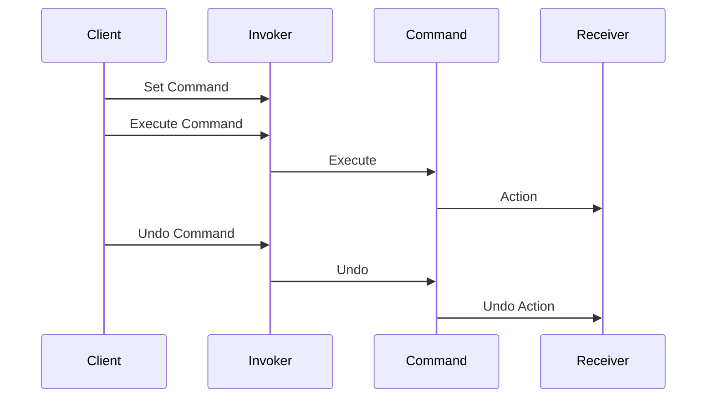

## 6.2.4 Use Cases and Examples

The Command Pattern is a behavioral design pattern that turns a request into a stand-alone object containing all the information about the request. This transformation allows for parameterizing methods with different requests, delaying or queuing a request's execution, and supporting undoable operations. In this section, we will explore practical scenarios where the Command Pattern is effectively applied, such as GUI actions, macro recording systems, and transactional operations.

### Implementing GUI Actions with the Command Pattern

In graphical user interfaces (GUIs), actions such as button clicks, menu selections, or keyboard shortcuts often need to be encapsulated into a command. This approach allows for a flexible and decoupled design where the user interface elements are not directly tied to the business logic.

#### Example: Button Clicks in a GUI Application

Consider a simple text editor application where users can perform actions like "Copy," "Paste," and "Undo." Each of these actions can be encapsulated as a command.

```typescript
// Command Interface
interface Command {
  execute(): void;
  undo(): void;
}

// Receiver Class
class TextEditor {
  private text: string = '';

  copy(): string {
    console.log('Text copied to clipboard.');
    return this.text;
  }

  paste(text: string): void {
    this.text += text;
    console.log(`Text pasted: ${this.text}`);
  }

  undo(): void {
    console.log('Undo last action.');
  }
}

// Concrete Command for Copy
class CopyCommand implements Command {
  private editor: TextEditor;

  constructor(editor: TextEditor) {
    this.editor = editor;
  }

  execute(): void {
    this.editor.copy();
  }

  undo(): void {
    this.editor.undo();
  }
}

// Concrete Command for Paste
class PasteCommand implements Command {
  private editor: TextEditor;
  private clipboard: string;

  constructor(editor: TextEditor, clipboard: string) {
    this.editor = editor;
    this.clipboard = clipboard;
  }

  execute(): void {
    this.editor.paste(this.clipboard);
  }

  undo(): void {
    this.editor.undo();
  }
}

// Invoker Class
class Button {
  private command: Command;

  constructor(command: Command) {
    this.command = command;
  }

  click(): void {
    this.command.execute();
  }

  undo(): void {
    this.command.undo();
  }
}

// Client Code
const editor = new TextEditor();
const copyCommand = new CopyCommand(editor);
const pasteCommand = new PasteCommand(editor, 'Hello, World!');

const copyButton = new Button(copyCommand);
const pasteButton = new Button(pasteCommand);

copyButton.click(); // Output: Text copied to clipboard.
pasteButton.click(); // Output: Text pasted: Hello, World!
pasteButton.undo();  // Output: Undo last action.
```

In this example, the `Button` class acts as the invoker, executing commands when clicked. The `TextEditor` class is the receiver, performing the actual operations. By using the Command Pattern, we achieve a decoupled architecture where the GUI elements do not need to know the details of the operations they trigger.

### Creating a Macro Recording System

A macro recording system captures user actions as commands, allowing them to be replayed later. This is particularly useful in applications where repetitive tasks can be automated.

#### Example: Macro Recorder

Let's implement a simple macro recorder that records and replays commands.

```typescript
// Macro Command to store a sequence of commands
class MacroCommand implements Command {
  private commands: Command[] = [];

  add(command: Command): void {
    this.commands.push(command);
  }

  execute(): void {
    for (const command of this.commands) {
      command.execute();
    }
  }

  undo(): void {
    for (const command of this.commands.reverse()) {
      command.undo();
    }
  }
}

// Client Code for Macro Recorder
const macro = new MacroCommand();
macro.add(copyCommand);
macro.add(pasteCommand);

console.log('Executing Macro:');
macro.execute(); // Executes all commands in sequence

console.log('Undoing Macro:');
macro.undo(); // Undoes all commands in reverse order
```

The `MacroCommand` class aggregates multiple commands and executes them in sequence. This approach allows for recording complex sequences of actions and replaying them with a single command.

### Managing Database Transactions

In database operations, transactions often require a series of operations that must be executed atomically. The Command Pattern can encapsulate these operations, allowing them to be committed or rolled back as needed.

#### Example: Database Transaction Management

Consider a banking application where a transfer operation involves debiting one account and crediting another. These operations need to be executed as a single transaction.

```typescript
// Receiver Class for Database Operations
class BankAccount {
  private balance: number;

  constructor(balance: number) {
    this.balance = balance;
  }

  debit(amount: number): void {
    this.balance -= amount;
    console.log(`Debited: ${amount}. New Balance: ${this.balance}`);
  }

  credit(amount: number): void {
    this.balance += amount;
    console.log(`Credited: ${amount}. New Balance: ${this.balance}`);
  }
}

// Concrete Command for Transfer
class TransferCommand implements Command {
  private fromAccount: BankAccount;
  private toAccount: BankAccount;
  private amount: number;

  constructor(fromAccount: BankAccount, toAccount: BankAccount, amount: number) {
    this.fromAccount = fromAccount;
    this.toAccount = toAccount;
    this.amount = amount;
  }

  execute(): void {
    this.fromAccount.debit(this.amount);
    this.toAccount.credit(this.amount);
  }

  undo(): void {
    this.toAccount.debit(this.amount);
    this.fromAccount.credit(this.amount);
  }
}

// Client Code for Database Transaction
const accountA = new BankAccount(1000);
const accountB = new BankAccount(500);

const transferCommand = new TransferCommand(accountA, accountB, 200);

console.log('Executing Transfer:');
transferCommand.execute(); // Output: Debited: 200. New Balance: 800. Credited: 200. New Balance: 700.

console.log('Undoing Transfer:');
transferCommand.undo(); // Output: Debited: 200. New Balance: 500. Credited: 200. New Balance: 1000.
```

In this example, the `TransferCommand` encapsulates the operations needed to transfer funds between accounts. The ability to undo the transaction ensures that the system can recover from errors, maintaining data integrity.

### Benefits of Using the Command Pattern

The Command Pattern offers several benefits that make it a valuable tool in software design:

1. **Decoupling**: By encapsulating requests as objects, the Command Pattern decouples the sender of a request from its receiver. This separation allows for more flexible and maintainable code.

2. **Extensibility**: New commands can be added without modifying existing code, making the system easy to extend.

3. **Undo/Redo Functionality**: The ability to store commands allows for implementing undo and redo operations, enhancing user experience.

4. **Macro Recording**: Commands can be recorded and replayed, enabling automation of repetitive tasks.

5. **Transaction Management**: In transactional systems, commands can be used to ensure atomicity and consistency.

### When to Use the Command Pattern

Consider using the Command Pattern in scenarios where:

- You need to parameterize objects with operations.
- You want to queue operations for later execution.
- You require undoable operations.
- You need to log changes to support auditing or rollback.
- You want to implement macro recording and playback.

### Visualizing the Command Pattern

To better understand the flow of the Command Pattern, let's visualize it using a sequence diagram.



**Diagram Description**: This sequence diagram illustrates the interaction between the client, invoker, command, and receiver. The client sets a command on the invoker, which then executes the command. The command performs an action on the receiver. The client can also request the invoker to undo the command, reversing the action on the receiver.

### Try It Yourself

To deepen your understanding of the Command Pattern, try modifying the examples provided:

1. **Add New Commands**: Implement additional commands for the text editor, such as "Cut" or "Find and Replace."

2. **Enhance the Macro Recorder**: Allow the macro recorder to save and load macros from a file.

3. **Expand Transaction Management**: Implement a logging mechanism that records each transaction for auditing purposes.

### Knowledge Check

Before moving on, take a moment to reflect on the key concepts covered:

- How does the Command Pattern promote decoupling in software design?
- What are the benefits of using the Command Pattern in GUI applications?
- How can the Command Pattern be used to implement undo/redo functionality?
- In what scenarios is the Command Pattern particularly useful?

### Embrace the Journey

Remember, mastering design patterns is a journey. As you continue to explore and apply patterns like the Command Pattern, you'll gain deeper insights into creating flexible and maintainable software. Keep experimenting, stay curious, and enjoy the journey!

## Quiz Time!



### What is the primary benefit of using the Command Pattern in GUI applications?

- [x] Decoupling the user interface from the business logic
- [ ] Simplifying the user interface design
- [ ] Reducing the number of classes in the application
- [ ] Increasing the speed of execution

> **Explanation:** The Command Pattern decouples the user interface from the business logic by encapsulating actions as command objects.

### How does the Command Pattern facilitate undo/redo functionality?

- [x] By storing executed commands and reversing their actions
- [ ] By directly modifying the application's state
- [ ] By using a global variable to track changes
- [ ] By implementing a separate undo/redo module

> **Explanation:** The Command Pattern allows for storing executed commands, which can be reversed to implement undo/redo functionality.

### In the provided example, what role does the `Button` class play?

- [x] Invoker
- [ ] Receiver
- [ ] Command
- [ ] Client

> **Explanation:** The `Button` class acts as the invoker, executing commands when clicked.

### Which of the following is NOT a typical use case for the Command Pattern?

- [ ] GUI actions
- [ ] Macro recording
- [ ] Transaction management
- [x] Data encryption

> **Explanation:** Data encryption is not a typical use case for the Command Pattern, which is more suited for encapsulating operations.

### What is a key advantage of using the Command Pattern for transaction management?

- [x] Ensuring atomicity and consistency
- [ ] Reducing transaction processing time
- [ ] Simplifying database schema design
- [ ] Increasing data redundancy

> **Explanation:** The Command Pattern helps ensure atomicity and consistency by encapsulating transaction operations.

### How can the Command Pattern enhance macro recording systems?

- [x] By allowing actions to be recorded and replayed
- [ ] By reducing the complexity of recorded actions
- [ ] By increasing the speed of macro execution
- [ ] By minimizing memory usage

> **Explanation:** The Command Pattern allows actions to be recorded as commands and replayed, enhancing macro recording systems.

### What is the role of the `MacroCommand` class in the macro recorder example?

- [x] Aggregating multiple commands for execution
- [ ] Executing a single command
- [ ] Managing user input
- [ ] Handling errors during execution

> **Explanation:** The `MacroCommand` class aggregates multiple commands and executes them in sequence.

### In the sequence diagram, what is the relationship between the `Invoker` and `Command`?

- [x] The `Invoker` executes the `Command`
- [ ] The `Command` sets the `Invoker`
- [ ] The `Invoker` is a subclass of `Command`
- [ ] The `Command` directly modifies the `Invoker`

> **Explanation:** The `Invoker` executes the `Command`, which performs an action on the receiver.

### True or False: The Command Pattern is only useful in GUI applications.

- [ ] True
- [x] False

> **Explanation:** The Command Pattern is versatile and can be used in various applications, including transactional systems and macro recording.

### Which of the following best describes the Command Pattern?

- [x] A behavioral pattern that encapsulates a request as an object
- [ ] A structural pattern that organizes classes into a hierarchy
- [ ] A creational pattern that manages object creation
- [ ] A functional pattern that simplifies data processing

> **Explanation:** The Command Pattern is a behavioral pattern that encapsulates a request as an object, allowing for flexible and decoupled design.


