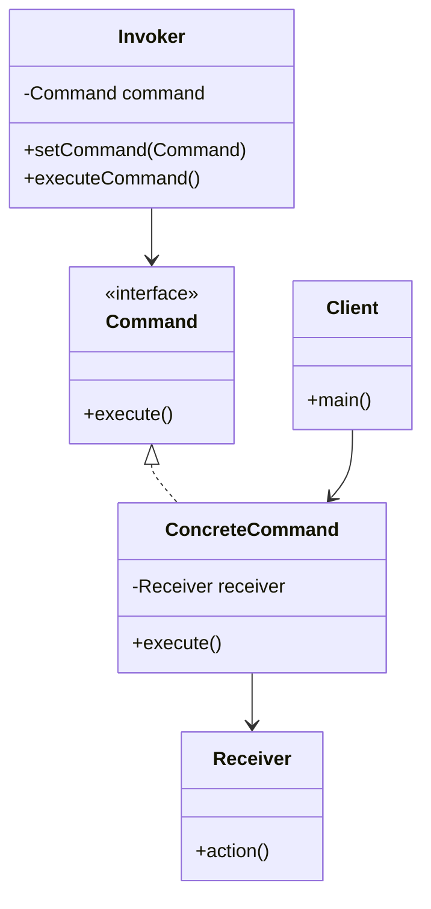
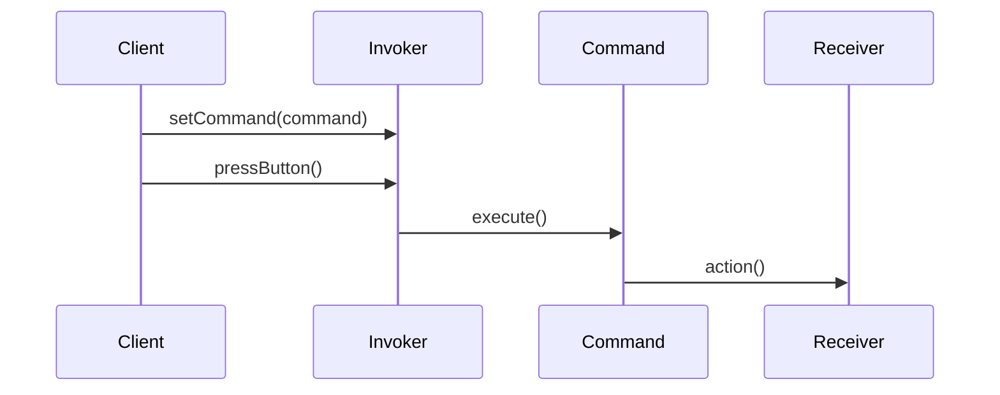

## 6.2 Command Pattern

The Command Pattern is a behavioral design pattern that turns a request into a stand-alone object containing all the information about the request. This transformation allows for parameterization of clients with queues, requests, and operations, as well as providing the ability to log, queue, and undo commands. Let's delve into the Command Pattern, exploring its components, benefits, and implementation in TypeScript.

### Understanding the Command Pattern

**Definition**: The Command Pattern encapsulates a request as an object, thereby allowing for parameterization of clients with queues, requests, and operations. It also provides the ability to log, queue, and undo commands.

**Intent**: The primary intent of the Command Pattern is to decouple the object that invokes the operation from the one that knows how to perform it. This separation allows for greater flexibility and extensibility in the codebase.

**Problem Solved**: In traditional programming, a direct method call ties the caller to the callee, making it difficult to change the method being called without altering the caller. The Command Pattern solves this by encapsulating the method call in a command object, which can be passed around, stored, and executed at a later time.

### Key Components of the Command Pattern

The Command Pattern consists of several key components that work together to encapsulate requests and execute them flexibly:

1. **Command**: An interface that declares an `execute` method. This interface is implemented by all concrete command classes.

2. **ConcreteCommand**: Implements the `Command` interface and defines the binding between a Receiver and an action. It holds the logic for executing the command.

3. **Receiver**: The object that knows how to perform the operations associated with carrying out a request. It contains the actual logic to execute the command.

4. **Invoker**: Asks the command to carry out the request. It stores the command and can execute it at any time.

5. **Client**: Creates ConcreteCommand objects and sets their receivers. It is responsible for creating and configuring the command objects.

### Diagram: Command Pattern Structure

To better understand the relationships and interactions between these components, let's visualize the Command Pattern structure using a class diagram.



**Diagram Explanation**:  
- The `Command` interface is implemented by `ConcreteCommand`, which binds a specific action on the `Receiver`.
- The `Invoker` holds a reference to a `Command` and can execute it.
- The `Client` is responsible for creating and configuring the `ConcreteCommand` and associating it with the `Receiver`.

### Implementing the Command Pattern in TypeScript

Let's implement the Command Pattern in TypeScript to see how these components come together in practice.

#### Step 1: Define the Command Interface

The `Command` interface declares the `execute` method that all concrete commands must implement.

```typescript
// Command.ts
export interface Command {
    execute(): void;
}
```

#### Step 2: Create the Receiver Class

The `Receiver` class contains the business logic for executing the command.

```typescript
// Receiver.ts
export class Light {
    on(): void {
        console.log("The light is on");
    }

    off(): void {
        console.log("The light is off");
    }
}
```

#### Step 3: Implement ConcreteCommand Classes

Concrete commands implement the `Command` interface and define the binding between a `Receiver` and an action.

```typescript
// LightOnCommand.ts
import { Command } from './Command';
import { Light } from './Receiver';

export class LightOnCommand implements Command {
    private light: Light;

    constructor(light: Light) {
        this.light = light;
    }

    execute(): void {
        this.light.on();
    }
}

// LightOffCommand.ts
import { Command } from './Command';
import { Light } from './Receiver';

export class LightOffCommand implements Command {
    private light: Light;

    constructor(light: Light) {
        this.light = light;
    }

    execute(): void {
        this.light.off();
    }
}
```

#### Step 4: Create the Invoker Class

The `Invoker` class is responsible for executing the command.

```typescript
// RemoteControl.ts
import { Command } from './Command';

export class RemoteControl {
    private command: Command;

    setCommand(command: Command): void {
        this.command = command;
    }

    pressButton(): void {
        this.command.execute();
    }
}
```

#### Step 5: Assemble the Components in the Client

The `Client` creates and configures the command objects and sets them on the `Invoker`.

```typescript
// Client.ts
import { Light } from './Receiver';
import { LightOnCommand, LightOffCommand } from './ConcreteCommand';
import { RemoteControl } from './Invoker';

const light = new Light();
const lightOn = new LightOnCommand(light);
const lightOff = new LightOffCommand(light);

const remote = new RemoteControl();

remote.setCommand(lightOn);
remote.pressButton(); // Output: The light is on

remote.setCommand(lightOff);
remote.pressButton(); // Output: The light is off
```

### Extensibility and Flexibility

One of the main advantages of the Command Pattern is its extensibility. New commands can be added without modifying existing code, adhering to the Open/Closed Principle. To add a new command, simply create a new class that implements the `Command` interface and define the desired behavior.

### Visualizing Command Execution Flow

To further illustrate the execution flow of commands, let's use a sequence diagram.



**Diagram Explanation**:  
- The `Client` sets a command on the `Invoker`.
- When the `Invoker`'s button is pressed, it calls the `execute` method on the `Command`.
- The `Command` then calls the appropriate action on the `Receiver`.

### Advanced Concepts and Considerations

#### Undo Functionality

The Command Pattern can be extended to support undo functionality by storing the previous state and providing an `undo` method in the `Command` interface. This is particularly useful in applications like text editors where undo/redo operations are common.

```typescript
// Command.ts
export interface Command {
    execute(): void;
    undo(): void;
}

// LightOnCommand.ts
export class LightOnCommand implements Command {
    private light: Light;

    constructor(light: Light) {
        this.light = light;
    }

    execute(): void {
        this.light.on();
    }

    undo(): void {
        this.light.off();
    }
}
```

#### Command Queuing and Scheduling

Commands can be queued and scheduled for execution at a later time. This is useful in scenarios where operations need to be executed in a specific order or at specific intervals.

#### Command Logging

Commands can be logged for auditing purposes. By storing a history of executed commands, you can track what operations were performed and when.

### Try It Yourself

To deepen your understanding of the Command Pattern, try modifying the code examples:

- **Add a new command**: Implement a `DimLightCommand` that dims the light to a specific level.
- **Implement undo functionality**: Extend the existing commands to support undo operations.
- **Queue commands**: Modify the `RemoteControl` to queue multiple commands and execute them in sequence.

### Knowledge Check

- **What is the primary intent of the Command Pattern?**
- **How does the Command Pattern promote extensibility?**
- **What are the key components of the Command Pattern?**

### Conclusion

The Command Pattern is a powerful tool for encapsulating requests as objects, providing flexibility, extensibility, and the ability to log, queue, and undo operations. By understanding and implementing the Command Pattern in TypeScript, you can create more maintainable and scalable applications.

## Quiz Time!



### What is the primary intent of the Command Pattern?

- [x] To decouple the object that invokes the operation from the one that knows how to perform it.
- [ ] To couple the object that invokes the operation with the one that knows how to perform it.
- [ ] To encapsulate data in a single object.
- [ ] To provide a way to access elements of a collection sequentially.

> **Explanation:** The Command Pattern's primary intent is to decouple the object that invokes the operation from the one that knows how to perform it, allowing for greater flexibility.

### Which component of the Command Pattern knows how to perform the operations associated with carrying out a request?

- [ ] Command
- [ ] Invoker
- [x] Receiver
- [ ] Client

> **Explanation:** The Receiver is the component that knows how to perform the operations associated with carrying out a request.

### What method must all concrete command classes implement?

- [x] execute()
- [ ] perform()
- [ ] run()
- [ ] start()

> **Explanation:** All concrete command classes must implement the `execute()` method as defined by the Command interface.

### How does the Command Pattern promote extensibility?

- [x] By allowing new commands to be added without modifying existing code.
- [ ] By requiring changes to existing code for new commands.
- [ ] By making it difficult to add new commands.
- [ ] By coupling commands tightly with receivers.

> **Explanation:** The Command Pattern promotes extensibility by allowing new commands to be added without modifying existing code, adhering to the Open/Closed Principle.

### In the Command Pattern, what is the role of the Invoker?

- [x] To ask the command to carry out the request.
- [ ] To perform the operations associated with carrying out a request.
- [ ] To create ConcreteCommand objects and set their receivers.
- [ ] To declare an `execute` method.

> **Explanation:** The Invoker's role is to ask the command to carry out the request by calling its `execute` method.

### What additional functionality can be added to the Command Pattern to support undo operations?

- [x] An `undo` method in the Command interface.
- [ ] A `redo` method in the Invoker class.
- [ ] A `cancel` method in the Receiver class.
- [ ] A `rollback` method in the Client class.

> **Explanation:** An `undo` method can be added to the Command interface to support undo operations.

### Which of the following is NOT a benefit of using the Command Pattern?

- [ ] Decoupling the invoker from the receiver.
- [ ] Supporting undo and redo operations.
- [ ] Logging commands for auditing purposes.
- [x] Increasing the complexity of the codebase.

> **Explanation:** The Command Pattern aims to reduce complexity by decoupling components and providing flexible command execution.

### What is the role of the Client in the Command Pattern?

- [ ] To execute commands.
- [ ] To perform actions on the receiver.
- [x] To create ConcreteCommand objects and set their receivers.
- [ ] To log command execution.

> **Explanation:** The Client's role is to create ConcreteCommand objects and set their receivers, configuring the command objects.

### How can commands be executed at a later time in the Command Pattern?

- [x] By queuing and scheduling them.
- [ ] By executing them immediately.
- [ ] By storing them in the receiver.
- [ ] By logging them for future reference.

> **Explanation:** Commands can be queued and scheduled for execution at a later time, allowing for deferred execution.

### True or False: The Command Pattern can be used to log commands for auditing purposes.

- [x] True
- [ ] False

> **Explanation:** True. The Command Pattern can be used to log commands for auditing purposes, providing a history of executed operations.


