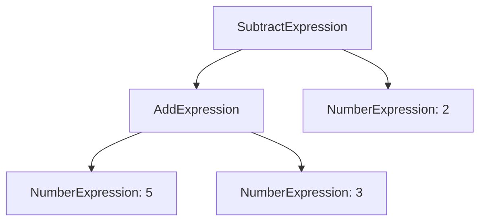

## 6.3.1 Implementing Interpreter in TypeScript

The Interpreter Pattern is a powerful design pattern used to define a grammar for a language and provide an interpreter to process sentences in that language. In this section, we'll delve into how to implement the Interpreter Pattern in TypeScript, focusing on parsing and interpreting expressions. We'll explore a simple language for mathematical expressions, demonstrating the pattern's core concepts and practical applications.

### Introduction to the Interpreter Pattern

The Interpreter Pattern is part of the behavioral design patterns family. It is used to evaluate sentences in a language defined by a grammar. This pattern is particularly useful when you need to interpret expressions or commands in a language, such as mathematical expressions, boolean logic queries, or even simple scripting languages.

### Key Concepts

1. **Abstract Syntax Tree (AST)**: A tree representation of the abstract syntactic structure of source code. Each node of the tree denotes a construct occurring in the source code.
2. **Expression Interfaces and Classes**: Define the grammar of the language. These include `AbstractExpression`, `TerminalExpression`, and `NonTerminalExpression`.
3. **Interpret Method**: Each expression class implements an `interpret` method to evaluate or process the expression.
4. **Client**: Constructs the AST and invokes the interpretation process.

### Building a Simple Mathematical Interpreter

Let's build a simple interpreter for mathematical expressions using the Interpreter Pattern. We'll define a grammar that supports addition and subtraction of integers.

#### Step 1: Define Expression Interfaces and Classes

First, we define the interfaces and classes that represent the expressions in our language.

```typescript
// AbstractExpression interface
interface Expression {
  interpret(context: Map<string, number>): number;
}

// TerminalExpression for numbers
class NumberExpression implements Expression {
  private number: number;

  constructor(number: number) {
    this.number = number;
  }

  interpret(context: Map<string, number>): number {
    return this.number;
  }
}

// NonTerminalExpression for addition
class AddExpression implements Expression {
  private leftOperand: Expression;
  private rightOperand: Expression;

  constructor(left: Expression, right: Expression) {
    this.leftOperand = left;
    this.rightOperand = right;
  }

  interpret(context: Map<string, number>): number {
    return this.leftOperand.interpret(context) + this.rightOperand.interpret(context);
  }
}

// NonTerminalExpression for subtraction
class SubtractExpression implements Expression {
  private leftOperand: Expression;
  private rightOperand: Expression;

  constructor(left: Expression, right: Expression) {
    this.leftOperand = left;
    this.rightOperand = right;
  }

  interpret(context: Map<string, number>): number {
    return this.leftOperand.interpret(context) - this.rightOperand.interpret(context);
  }
}
```

#### Step 2: Implement the Interpret Method

Each class implements the `interpret` method, which processes the expression. Terminal expressions return a constant value, while non-terminal expressions perform operations on their operands.

#### Step 3: Constructing the Abstract Syntax Tree (AST)

The AST represents the structure of the expression. Let's build an AST for the expression `5 + 3 - 2`.

```typescript
// Client code to construct the AST
const context = new Map<string, number>();

const five = new NumberExpression(5);
const three = new NumberExpression(3);
const two = new NumberExpression(2);

const addition = new AddExpression(five, three);
const subtraction = new SubtractExpression(addition, two);

const result = subtraction.interpret(context);
console.log(`Result: ${result}`); // Output: Result: 6
```

### Recursive Interpretation

The interpretation process often involves recursion, especially when dealing with nested expressions. In our example, the `interpret` method of `AddExpression` and `SubtractExpression` recursively calls the `interpret` method of their operands.

### Handling Variables and Constants

In more complex languages, you might need to handle variables. This can be achieved by storing variable values in a context, such as a `Map<string, number>`, which is passed to the `interpret` method.

### TypeScript Considerations

TypeScript's type system provides type safety, which is beneficial when implementing the Interpreter Pattern. Ensure that your expression classes and methods are well-typed to avoid runtime errors.

### Try It Yourself

Experiment with the code by adding new operations, such as multiplication or division. Consider how you might extend the grammar to support variables or more complex expressions.

### Visualizing the Abstract Syntax Tree

To better understand the structure of the AST, let's visualize it using a diagram.



**Figure 1**: Abstract Syntax Tree for the expression `5 + 3 - 2`.

### Further Reading and Resources

- [MDN Web Docs on JavaScript Expressions](https://developer.mozilla.org/en-US/docs/Web/JavaScript/Guide/Expressions_and_Operators)
- [TypeScript Handbook](https://www.typescriptlang.org/docs/handbook/intro.html)

### Knowledge Check

- How does the Interpreter Pattern differ from other behavioral patterns?
- What role does recursion play in the interpretation process?
- How can you extend the interpreter to handle more complex expressions?

### Conclusion

The Interpreter Pattern provides a structured approach to evaluating expressions in a language. By defining a clear grammar and implementing an interpreter, you can build powerful tools for processing and evaluating expressions. Remember, this is just the beginning. As you progress, you'll be able to tackle more complex languages and interpretations. Keep experimenting, stay curious, and enjoy the journey!

## Quiz Time!



### What is the primary purpose of the Interpreter Pattern?

- [x] To evaluate sentences in a language defined by a grammar.
- [ ] To manage the state of an object.
- [ ] To provide a way to access elements of a collection.
- [ ] To define a family of algorithms.

> **Explanation:** The Interpreter Pattern is used to evaluate sentences in a language defined by a grammar.

### Which class in the Interpreter Pattern is responsible for processing terminal expressions?

- [x] TerminalExpression
- [ ] NonTerminalExpression
- [ ] AbstractExpression
- [ ] Client

> **Explanation:** TerminalExpression is responsible for processing terminal expressions, which are the basic elements of the language.

### What is an Abstract Syntax Tree (AST)?

- [x] A tree representation of the abstract syntactic structure of source code.
- [ ] A list of all variables used in a program.
- [ ] A diagram showing the flow of data in a program.
- [ ] A collection of all classes in a program.

> **Explanation:** An AST is a tree representation of the abstract syntactic structure of source code.

### How does recursion play a role in the Interpreter Pattern?

- [x] It is used to evaluate nested expressions.
- [ ] It is used to manage state changes.
- [ ] It is used to iterate over collections.
- [ ] It is used to encapsulate algorithms.

> **Explanation:** Recursion is used to evaluate nested expressions in the Interpreter Pattern.

### What is the role of the Client in the Interpreter Pattern?

- [x] To construct the AST and invoke the interpretation process.
- [ ] To define the grammar of the language.
- [ ] To handle terminal expressions.
- [ ] To manage state transitions.

> **Explanation:** The Client constructs the AST and invokes the interpretation process.

### How can variables be handled in the Interpreter Pattern?

- [x] By storing variable values in a context passed to the interpret method.
- [ ] By hardcoding them into the expressions.
- [ ] By using global variables.
- [ ] By ignoring them.

> **Explanation:** Variables can be handled by storing their values in a context passed to the interpret method.

### What is a key benefit of using TypeScript for implementing the Interpreter Pattern?

- [x] Type safety and error prevention.
- [ ] Faster execution speed.
- [ ] Smaller code size.
- [ ] Easier syntax.

> **Explanation:** TypeScript provides type safety and error prevention, which are beneficial when implementing the Interpreter Pattern.

### What is a TerminalExpression in the context of the Interpreter Pattern?

- [x] An expression that represents a constant value.
- [ ] An expression that performs an operation on other expressions.
- [ ] An expression that defines the grammar.
- [ ] An expression that constructs the AST.

> **Explanation:** A TerminalExpression represents a constant value in the language.

### Which of the following is a NonTerminalExpression?

- [x] AddExpression
- [ ] NumberExpression
- [ ] TerminalExpression
- [ ] Client

> **Explanation:** AddExpression is a NonTerminalExpression, as it performs an operation on other expressions.

### True or False: The Interpreter Pattern is best suited for languages with complex grammars.

- [ ] True
- [x] False

> **Explanation:** The Interpreter Pattern is best suited for simple grammars due to its recursive nature and potential performance issues with complex languages.


