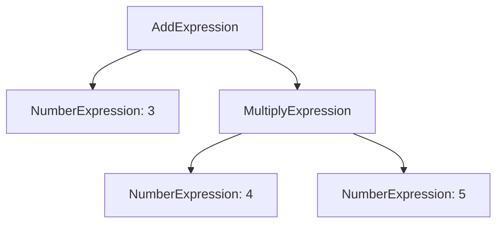

## 6.3.2 Defining Grammars

In this section, we will delve into the process of defining grammars and constructing abstract syntax trees (ASTs) to represent the structure of languages or expressions within the Interpreter Pattern. This is a crucial step in implementing the Interpreter Pattern effectively, as it lays the foundation for parsing and interpreting complex expressions.

### Understanding Formal Grammars

Formal grammars are essential for defining the syntax of a language. They provide a set of rules that describe how sentences in a language are constructed. Grammars are typically composed of:

- **Terminals**: The basic symbols from which strings are formed.
- **Non-terminals**: Symbols that can be replaced by groups of terminals and non-terminals.
- **Production rules**: Rules that define how non-terminals can be transformed into terminals or other non-terminals.
- **Start symbol**: The initial symbol from which parsing begins.

#### Example of a Simple Grammar

Consider a simple arithmetic expression grammar:

- **Terminals**: `+`, `-`, `*`, `/`, `(`, `)`, `number`
- **Non-terminals**: `Expression`, `Term`, `Factor`
- **Production rules**:
  - `Expression -> Term | Expression + Term | Expression - Term`
  - `Term -> Factor | Term * Factor | Term / Factor`
  - `Factor -> number | ( Expression )`
- **Start symbol**: `Expression`

### Representing Grammar Rules in TypeScript

In TypeScript, we can represent grammar rules using classes and interfaces. This allows us to create a structured representation of the grammar that can be used to build an AST.

#### Defining Grammar Classes

Let's define classes for the arithmetic expression grammar:

```typescript
// Base interface for all expressions
interface Expression {
    interpret(): number;
}

// Terminal expression for numbers
class NumberExpression implements Expression {
    constructor(private value: number) {}

    interpret(): number {
        return this.value;
    }
}

// Non-terminal expression for addition
class AddExpression implements Expression {
    constructor(private left: Expression, private right: Expression) {}

    interpret(): number {
        return this.left.interpret() + this.right.interpret();
    }
}

// Non-terminal expression for subtraction
class SubtractExpression implements Expression {
    constructor(private left: Expression, private right: Expression) {}

    interpret(): number {
        return this.left.interpret() - this.right.interpret();
    }
}

// Non-terminal expression for multiplication
class MultiplyExpression implements Expression {
    constructor(private left: Expression, private right: Expression) {}

    interpret(): number {
        return this.left.interpret() * this.right.interpret();
    }
}

// Non-terminal expression for division
class DivideExpression implements Expression {
    constructor(private left: Expression, private right: Expression) {}

    interpret(): number {
        return this.left.interpret() / this.right.interpret();
    }
}
```

### Building an Abstract Syntax Tree (AST)

An AST is a tree representation of the abstract syntactic structure of source code. Each node in the tree denotes a construct occurring in the source code. The AST reflects the hierarchical structure of the grammar.

#### Constructing an AST Manually

To manually construct an AST, you instantiate the appropriate classes and connect them according to the grammar rules.

```typescript
// Example: Constructing the AST for the expression "3 + (4 * 5)"
const expression = new AddExpression(
    new NumberExpression(3),
    new MultiplyExpression(
        new NumberExpression(4),
        new NumberExpression(5)
    )
);

console.log(expression.interpret()); // Outputs: 23
```

### Parsing Input Strings into ASTs

Parsing is the process of analyzing a string of symbols, conforming to the rules of a formal grammar. There are various techniques for parsing, such as recursive descent parsing, which is a top-down parsing approach.

#### Recursive Descent Parsing

Recursive descent parsing involves writing a set of recursive functions, one for each non-terminal in the grammar. These functions process the input string and build the corresponding AST.

```typescript
class Parser {
    private tokens: string[];
    private currentTokenIndex: number = 0;

    constructor(input: string) {
        this.tokens = input.match(/\d+|\+|\-|\*|\/|\\(|\\)/g) || [];
    }

    parseExpression(): Expression {
        let left = this.parseTerm();
        while (this.currentToken() === '+' || this.currentToken() === '-') {
            const operator = this.currentToken();
            this.nextToken();
            const right = this.parseTerm();
            if (operator === '+') {
                left = new AddExpression(left, right);
            } else {
                left = new SubtractExpression(left, right);
            }
        }
        return left;
    }

    parseTerm(): Expression {
        let left = this.parseFactor();
        while (this.currentToken() === '*' || this.currentToken() === '/') {
            const operator = this.currentToken();
            this.nextToken();
            const right = this.parseFactor();
            if (operator === '*') {
                left = new MultiplyExpression(left, right);
            } else {
                left = new DivideExpression(left, right);
            }
        }
        return left;
    }

    parseFactor(): Expression {
        if (this.currentToken() === '(') {
            this.nextToken();
            const expression = this.parseExpression();
            this.nextToken(); // consume ')'
            return expression;
        } else {
            const number = parseInt(this.currentToken(), 10);
            this.nextToken();
            return new NumberExpression(number);
        }
    }

    currentToken(): string {
        return this.tokens[this.currentTokenIndex];
    }

    nextToken(): void {
        this.currentTokenIndex++;
    }
}

// Example usage
const parser = new Parser("3 + (4 * 5)");
const ast = parser.parseExpression();
console.log(ast.interpret()); // Outputs: 23
```

### Visualizing the AST

To better understand how the AST represents the hierarchical structure of the grammar, let's visualize it using a diagram.



**Description**: This diagram illustrates the AST for the expression "3 + (4 * 5)". The root node is an `AddExpression`, which has two children: a `NumberExpression` for `3` and a `MultiplyExpression`. The `MultiplyExpression` further has two children: `NumberExpression` for `4` and `5`.

### Importance of a Well-Defined Grammar

A well-defined grammar is crucial for the effectiveness of the Interpreter Pattern. It ensures that the language or expressions being interpreted are unambiguous and can be consistently parsed into an AST. This allows for reliable interpretation and execution of the language constructs.

### Try It Yourself

To deepen your understanding, try modifying the code examples to include additional operators, such as exponentiation (`^`). Update the grammar, classes, and parser to support this new operator. Experiment with different input expressions to see how the AST changes.

### Knowledge Check

- What are the key components of a formal grammar?
- How do you represent grammar rules using TypeScript classes and interfaces?
- What is the role of an AST in the Interpreter Pattern?
- How does recursive descent parsing work?
- Why is a well-defined grammar important for the Interpreter Pattern?

### Conclusion

Defining grammars and constructing ASTs are foundational steps in implementing the Interpreter Pattern. By understanding these concepts and techniques, you can effectively parse and interpret complex expressions in TypeScript. Remember, this is just the beginning. As you progress, you'll build more sophisticated interpreters for various languages and domains. Keep experimenting, stay curious, and enjoy the journey!

## Quiz Time!



### What are the basic components of a formal grammar?

- [x] Terminals, Non-terminals, Production rules, Start symbol
- [ ] Variables, Constants, Functions, Procedures
- [ ] Classes, Interfaces, Methods, Properties
- [ ] Nodes, Edges, Leaves, Roots

> **Explanation:** A formal grammar consists of terminals, non-terminals, production rules, and a start symbol, which define the syntax of a language.

### How are grammar rules represented in TypeScript?

- [x] Using classes and interfaces
- [ ] Using functions and arrays
- [ ] Using objects and prototypes
- [ ] Using enums and constants

> **Explanation:** Grammar rules are represented using classes and interfaces in TypeScript to create a structured representation of the grammar.

### What is the purpose of an Abstract Syntax Tree (AST)?

- [x] To represent the hierarchical structure of the grammar
- [ ] To store data in a binary format
- [ ] To execute compiled code
- [ ] To manage memory allocation

> **Explanation:** An AST represents the hierarchical structure of the grammar, reflecting the syntactic structure of the source code.

### Which parsing technique involves writing a set of recursive functions?

- [x] Recursive descent parsing
- [ ] Lexical analysis
- [ ] Syntax-directed translation
- [ ] Semantic analysis

> **Explanation:** Recursive descent parsing involves writing a set of recursive functions, one for each non-terminal in the grammar.

### Why is a well-defined grammar important for the Interpreter Pattern?

- [x] It ensures unambiguous and consistent parsing
- [ ] It improves memory efficiency
- [ ] It enhances code readability
- [ ] It speeds up execution time

> **Explanation:** A well-defined grammar ensures that the language or expressions being interpreted are unambiguous and can be consistently parsed into an AST.

### What does the `interpret` method do in the context of the Interpreter Pattern?

- [x] Evaluates the expression represented by the AST
- [ ] Compiles the source code into machine code
- [ ] Optimizes the code for performance
- [ ] Translates the code into a different language

> **Explanation:** The `interpret` method evaluates the expression represented by the AST, executing the logic defined by the grammar.

### How can you modify the example code to include an exponentiation operator?

- [x] Update the grammar, classes, and parser to support the new operator
- [ ] Add a new method to the `Expression` interface
- [ ] Change the `interpret` method to handle exponentiation
- [ ] Use a different parsing technique

> **Explanation:** To include an exponentiation operator, you need to update the grammar, classes, and parser to support this new operator.

### What does the `currentToken` method do in the parser class?

- [x] Returns the current token being processed
- [ ] Advances to the next token
- [ ] Parses the current expression
- [ ] Evaluates the current expression

> **Explanation:** The `currentToken` method returns the current token being processed by the parser.

### What is the role of the `nextToken` method in the parser class?

- [x] Advances to the next token in the input
- [ ] Returns the current token being processed
- [ ] Parses the current expression
- [ ] Evaluates the current expression

> **Explanation:** The `nextToken` method advances to the next token in the input, allowing the parser to process the input string sequentially.

### True or False: An AST is a binary tree representation of source code.

- [ ] True
- [x] False

> **Explanation:** False. An AST is not necessarily a binary tree; it is a tree representation that reflects the hierarchical structure of the grammar, which can have nodes with more than two children.




