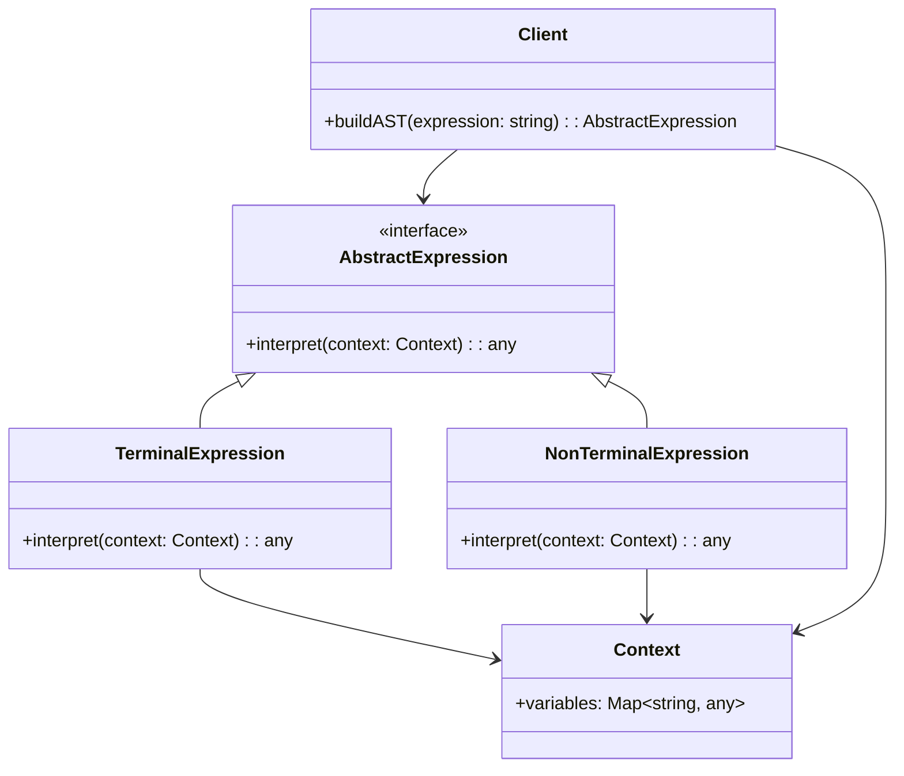
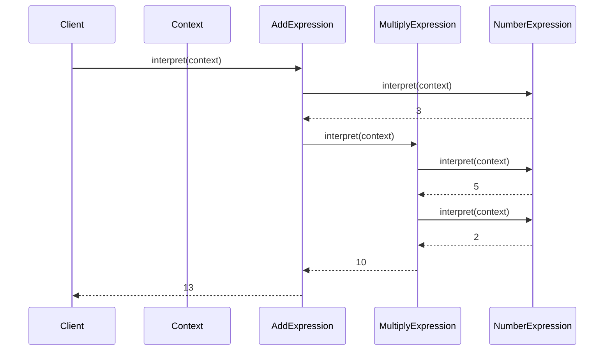

## 6.3 Interpreter Pattern

The Interpreter Pattern is a powerful design pattern used to define a representation for a language's grammar and provide an interpreter to evaluate sentences in that language. This pattern is particularly useful when you need to interpret or evaluate expressions, commands, or sentences in a language, making it a vital tool for language parsing and processing tasks.

### Understanding the Interpreter Pattern

The Interpreter Pattern is part of the behavioral design patterns family. Its primary intent is to interpret sentences in a language by defining a grammar for the language and implementing an interpreter that can evaluate expressions based on this grammar. This pattern is commonly used in scenarios where you need to process and evaluate expressions or commands, such as in scripting languages, mathematical expression evaluators, or even simple command processors.

#### Key Components of the Interpreter Pattern

To effectively implement the Interpreter Pattern, it's essential to understand its key components:

1. **AbstractExpression**: This component declares an `interpret` operation that all concrete expressions must implement. It serves as the base class or interface for all expression types.

2. **TerminalExpression**: This component implements the `interpret` operation for terminal symbols in the grammar. Terminal symbols are the basic building blocks of the language, such as numbers or variables.

3. **NonTerminalExpression**: This component implements the `interpret` operation for non-terminal symbols, which are composed of one or more expressions. Non-terminal symbols represent more complex language constructs, such as operations or commands.

4. **Context**: The Context contains information that is global to the interpreter. It may store variables, constants, or any other data needed during interpretation.

5. **Client**: The Client is responsible for building or parsing the abstract syntax tree (AST) that represents the grammar. It uses the AST to evaluate expressions or commands.

### Problem Solved by the Interpreter Pattern

The Interpreter Pattern addresses the challenge of interpreting or evaluating sentences in a language. It provides a structured approach to defining a language's grammar and implementing an interpreter that can process expressions based on this grammar. This pattern is particularly useful in scenarios where you need to:

- Evaluate mathematical expressions.
- Parse and execute commands in a scripting language.
- Process configuration files or data formats.
- Implement domain-specific languages (DSLs).

By using the Interpreter Pattern, you can create a flexible and extensible solution for interpreting and evaluating expressions, commands, or sentences in a language.

### Visualizing the Interpreter Pattern

To better understand the hierarchical structure of expressions in the Interpreter Pattern, let's visualize it using a class diagram:



In this diagram, we see the relationships between the key components of the Interpreter Pattern. The `AbstractExpression` interface defines the `interpret` method, which is implemented by both `TerminalExpression` and `NonTerminalExpression`. The `Context` provides the necessary information for interpretation, while the `Client` builds the abstract syntax tree (AST) and uses it to evaluate expressions.

### Implementing the Interpreter Pattern in TypeScript

Let's explore how to implement the Interpreter Pattern in TypeScript with a practical example. We'll create a simple arithmetic expression interpreter that can evaluate expressions involving addition and multiplication.

#### Step 1: Define the AbstractExpression Interface

First, we'll define the `AbstractExpression` interface, which declares the `interpret` method:

```typescript
interface AbstractExpression {
    interpret(context: Context): number;
}
```

#### Step 2: Implement TerminalExpression for Numbers

Next, we'll implement the `TerminalExpression` class for numbers, which are terminal symbols in our grammar:

```typescript
class NumberExpression implements AbstractExpression {
    private value: number;

    constructor(value: number) {
        this.value = value;
    }

    interpret(context: Context): number {
        return this.value;
    }
}
```

#### Step 3: Implement NonTerminalExpression for Addition

Now, let's implement the `NonTerminalExpression` class for addition, which is a non-terminal symbol in our grammar:

```typescript
class AddExpression implements AbstractExpression {
    private left: AbstractExpression;
    private right: AbstractExpression;

    constructor(left: AbstractExpression, right: AbstractExpression) {
        this.left = left;
        this.right = right;
    }

    interpret(context: Context): number {
        return this.left.interpret(context) + this.right.interpret(context);
    }
}
```

#### Step 4: Implement NonTerminalExpression for Multiplication

Similarly, we'll implement the `NonTerminalExpression` class for multiplication:

```typescript
class MultiplyExpression implements AbstractExpression {
    private left: AbstractExpression;
    private right: AbstractExpression;

    constructor(left: AbstractExpression, right: AbstractExpression) {
        this.left = left;
        this.right = right;
    }

    interpret(context: Context): number {
        return this.left.interpret(context) * this.right.interpret(context);
    }
}
```

#### Step 5: Define the Context Class

The `Context` class contains information that's global to the interpreter. In this example, it doesn't hold any specific data, but it can be extended to include variables or other necessary information:

```typescript
class Context {
    // Add any global information needed for interpretation
}
```

#### Step 6: Implement the Client to Build the AST

Finally, we'll implement the `Client` class, which builds the abstract syntax tree (AST) and evaluates expressions:

```typescript
class Client {
    static buildAST(expression: string): AbstractExpression {
        // For simplicity, assume the expression is "3 + 5 * 2"
        const number1 = new NumberExpression(3);
        const number2 = new NumberExpression(5);
        const number3 = new NumberExpression(2);

        const multiply = new MultiplyExpression(number2, number3);
        return new AddExpression(number1, multiply);
    }
}

// Usage
const context = new Context();
const expression = Client.buildAST("3 + 5 * 2");
const result = expression.interpret(context);
console.log(`Result: ${result}`); // Output: Result: 13
```

### Try It Yourself

Now that we've implemented a basic arithmetic expression interpreter, let's encourage you to experiment with it. Try modifying the code to support additional operations, such as subtraction or division. You can also extend the `Context` class to include variables and evaluate expressions with variables.

### Advanced Language Parsing Techniques

The Interpreter Pattern can be extended to support more complex language parsing techniques. Here are some advanced concepts to consider:

- **Grammar Representation**: Define a formal grammar for your language using Backus-Naur Form (BNF) or Extended Backus-Naur Form (EBNF). This will help you design the structure of your expressions and commands.

- **Recursive Descent Parsing**: Implement a recursive descent parser to build the abstract syntax tree (AST) from the input expression. This technique is useful for parsing complex expressions with nested structures.

- **Visitor Pattern**: Combine the Interpreter Pattern with the Visitor Pattern to separate the interpretation logic from the expression classes. This allows you to add new operations without modifying existing classes.

- **Error Handling**: Implement error handling mechanisms to gracefully handle syntax errors or invalid expressions. This can include providing meaningful error messages to users.

- **Performance Optimization**: Optimize the interpreter for performance by caching intermediate results or using memoization techniques to avoid redundant calculations.

### Visualizing Complex Expression Evaluation

To further illustrate the evaluation process of complex expressions, let's visualize it using a sequence diagram:



In this sequence diagram, we see the flow of interpretation as the `Client` evaluates the expression "3 + 5 * 2". The `AddExpression` first evaluates its left operand, a `NumberExpression` with the value 3, and then evaluates its right operand, a `MultiplyExpression`. The `MultiplyExpression` evaluates its operands, two `NumberExpression` instances with values 5 and 2, and returns the result to the `AddExpression`, which then returns the final result to the `Client`.

### Practical Applications of the Interpreter Pattern

The Interpreter Pattern has a wide range of practical applications in software development. Here are some examples:

- **Scripting Languages**: Implement interpreters for scripting languages, allowing users to write and execute scripts within your application.

- **Configuration File Parsers**: Create parsers for configuration files, enabling your application to read and apply settings from external files.

- **Mathematical Expression Evaluators**: Develop evaluators for mathematical expressions, supporting complex calculations and operations.

- **Domain-Specific Languages (DSLs)**: Design interpreters for DSLs tailored to specific problem domains, providing users with a powerful and flexible toolset.

- **Command Processors**: Implement command processors that interpret and execute commands, enabling automation and scripting capabilities.

### Knowledge Check

Let's reinforce what we've learned with a few questions:

- What is the primary intent of the Interpreter Pattern?
- How does the Interpreter Pattern solve the problem of interpreting sentences in a language?
- What are the key components of the Interpreter Pattern, and what roles do they play?
- How can the Interpreter Pattern be extended to support more complex language parsing techniques?

### Embrace the Journey

Remember, this is just the beginning of your journey with the Interpreter Pattern. As you continue to explore and experiment with this pattern, you'll discover new ways to apply it to solve complex language parsing and interpretation challenges. Keep experimenting, stay curious, and enjoy the journey!

## Quiz Time!



### What is the primary intent of the Interpreter Pattern?

- [x] To define a representation for a language's grammar and provide an interpreter to evaluate sentences in that language.
- [ ] To optimize the performance of language parsing.
- [ ] To simplify the syntax of a programming language.
- [ ] To provide a graphical representation of language structures.

> **Explanation:** The Interpreter Pattern is designed to define a representation for a language's grammar and provide an interpreter to evaluate sentences in that language.

### Which component of the Interpreter Pattern declares the interpret operation?

- [x] AbstractExpression
- [ ] TerminalExpression
- [ ] NonTerminalExpression
- [ ] Context

> **Explanation:** The AbstractExpression component declares the interpret operation that all concrete expressions must implement.

### What role does the Context component play in the Interpreter Pattern?

- [x] It contains information that is global to the interpreter.
- [ ] It implements the interpret operation for terminal symbols.
- [ ] It builds the abstract syntax tree.
- [ ] It provides error handling for the interpreter.

> **Explanation:** The Context component contains information that is global to the interpreter, such as variables or constants.

### How can the Interpreter Pattern be extended to support more complex language parsing techniques?

- [x] By implementing recursive descent parsing and using the Visitor Pattern.
- [ ] By simplifying the grammar and reducing the number of expressions.
- [ ] By using only terminal expressions in the grammar.
- [ ] By eliminating the Context component.

> **Explanation:** The Interpreter Pattern can be extended by implementing recursive descent parsing and using the Visitor Pattern to separate interpretation logic.

### Which of the following is a practical application of the Interpreter Pattern?

- [x] Scripting languages
- [ ] Database management systems
- [ ] Network protocols
- [ ] User interface design

> **Explanation:** The Interpreter Pattern is commonly used in scripting languages, where it interprets and executes scripts.

### What is the difference between TerminalExpression and NonTerminalExpression in the Interpreter Pattern?

- [x] TerminalExpression implements interpret operations for terminal symbols, while NonTerminalExpression does so for non-terminal symbols.
- [ ] TerminalExpression is used for error handling, while NonTerminalExpression is for parsing.
- [ ] TerminalExpression builds the AST, while NonTerminalExpression evaluates it.
- [ ] TerminalExpression is part of the Context, while NonTerminalExpression is not.

> **Explanation:** TerminalExpression implements interpret operations for terminal symbols, while NonTerminalExpression does so for non-terminal symbols, which are composed of one or more expressions.

### Which pattern can be combined with the Interpreter Pattern to separate interpretation logic from expression classes?

- [x] Visitor Pattern
- [ ] Singleton Pattern
- [ ] Factory Pattern
- [ ] Observer Pattern

> **Explanation:** The Visitor Pattern can be combined with the Interpreter Pattern to separate interpretation logic from expression classes.

### What is the purpose of the Client component in the Interpreter Pattern?

- [x] To build or parse the abstract syntax tree representing the grammar.
- [ ] To implement interpret operations for terminal symbols.
- [ ] To store global information for the interpreter.
- [ ] To handle errors during interpretation.

> **Explanation:** The Client component is responsible for building or parsing the abstract syntax tree representing the grammar.

### How does the Interpreter Pattern help in evaluating mathematical expressions?

- [x] By defining a grammar for expressions and implementing an interpreter to evaluate them.
- [ ] By optimizing the performance of mathematical calculations.
- [ ] By simplifying the syntax of mathematical expressions.
- [ ] By providing a graphical representation of calculations.

> **Explanation:** The Interpreter Pattern helps in evaluating mathematical expressions by defining a grammar for expressions and implementing an interpreter to evaluate them.

### True or False: The Interpreter Pattern is only useful for interpreting mathematical expressions.

- [ ] True
- [x] False

> **Explanation:** False. The Interpreter Pattern is useful for interpreting a wide range of expressions, commands, or sentences in various languages, not just mathematical expressions.


