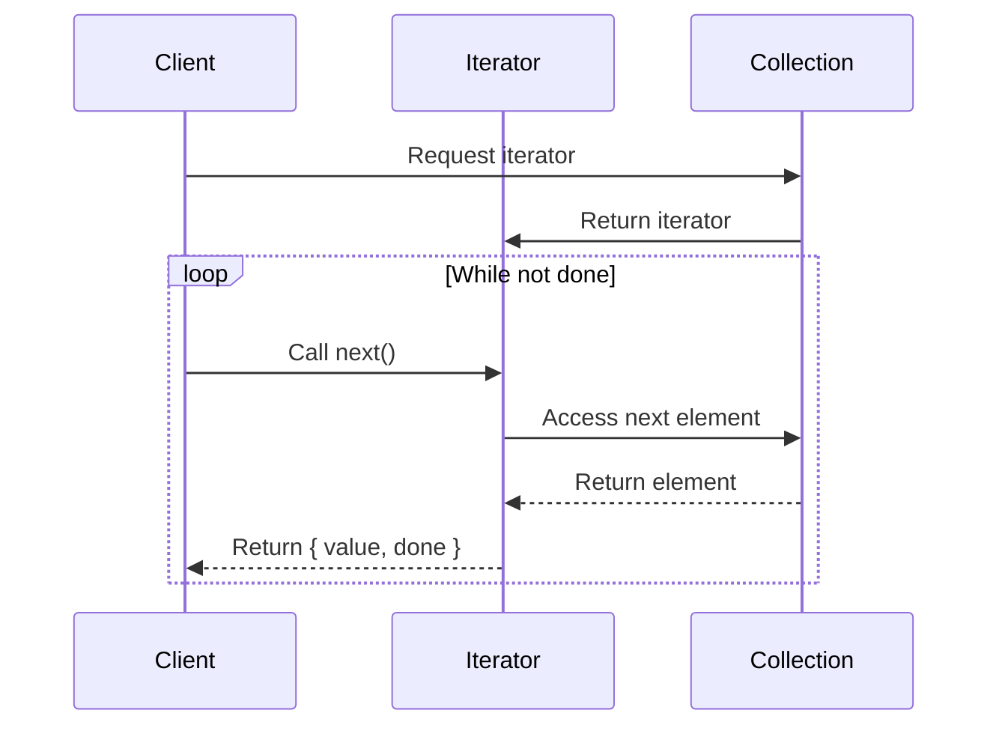

## 6.4.1 Implementing Iterator in TypeScript

In the world of software design patterns, the Iterator Pattern stands out as a powerful tool for navigating through collections of data. In this section, we will delve into the implementation of the Iterator Pattern in TypeScript, leveraging the capabilities of ES6 iterators and generators. Our journey will cover the mechanics of iterators, how to create custom iterators, and the use of generators to streamline the process. By the end, you'll have a solid understanding of how to implement and utilize iterators in your TypeScript projects.

### Understanding ES6 Iterators

Before diving into implementation, let's first understand what iterators are and how they function in JavaScript and TypeScript. An iterator is an object that provides a mechanism to traverse a collection, one element at a time, without exposing the underlying structure of the collection. This is achieved through the `Iterator` protocol, which defines a standard way to produce a sequence of values.

#### The Iterator Protocol

The Iterator Protocol consists of two main components:

1. **The `next()` Method**: This method returns an object with two properties:
   - `value`: The next value in the sequence.
   - `done`: A boolean indicating whether the sequence has been fully traversed.

2. **The Iterable Protocol**: An object is considered iterable if it implements the `[Symbol.iterator]()` method, which returns an iterator.

Here's a simple example of an iterator in TypeScript:

```typescript
class SimpleIterator {
    private current: number = 0;
    private end: number;

    constructor(end: number) {
        this.end = end;
    }

    public next(): { value: number, done: boolean } {
        if (this.current < this.end) {
            return { value: this.current++, done: false };
        } else {
            return { value: this.current, done: true };
        }
    }
}

const iterator = new SimpleIterator(5);
let result = iterator.next();
while (!result.done) {
    console.log(result.value); // Output: 0, 1, 2, 3, 4
    result = iterator.next();
}
```

### Creating a Custom Iterator

To create a custom iterator, we need to implement the `Iterator` protocol by defining the `next()` method. This method should return an object with `value` and `done` properties, as shown in the example above.

#### Making an Object Iterable

To make an object iterable, we need to implement the `[Symbol.iterator]()` method. This method should return an iterator object, which will be used by constructs like the `for...of` loop to traverse the collection.

Here's how we can make a custom object iterable:

```typescript
class IterableCollection {
    private items: number[];

    constructor(items: number[]) {
        this.items = items;
    }

    [Symbol.iterator](): Iterator<number> {
        let index = 0;
        const items = this.items;

        return {
            next(): IteratorResult<number> {
                if (index < items.length) {
                    return { value: items[index++], done: false };
                } else {
                    return { value: null, done: true };
                }
            }
        };
    }
}

const collection = new IterableCollection([10, 20, 30, 40]);
for (const item of collection) {
    console.log(item); // Output: 10, 20, 30, 40
}
```

### Consuming Iterators with `for...of`

The `for...of` loop is a powerful construct in JavaScript and TypeScript that allows us to iterate over iterable objects such as arrays, strings, maps, and sets. When used with custom iterables, it provides a clean and concise way to traverse collections.

In the example above, the `for...of` loop is used to iterate over the `IterableCollection` object. The loop automatically calls the `[Symbol.iterator]()` method to get an iterator and then repeatedly calls the `next()` method to retrieve values until `done` is `true`.

### Simplifying Iterators with Generators

Generators, introduced in ES6, provide a more elegant way to implement iterators. A generator is a special type of function that can pause execution and resume later, allowing us to yield multiple values over time.

#### Using `function*` to Create Generators

A generator function is defined using the `function*` syntax and uses the `yield` keyword to produce values. Here's how we can use a generator to simplify the implementation of an iterator:

```typescript
function* numberGenerator(end: number) {
    for (let i = 0; i < end; i++) {
        yield i;
    }
}

const generator = numberGenerator(5);
for (const value of generator) {
    console.log(value); // Output: 0, 1, 2, 3, 4
}
```

In this example, the generator function `numberGenerator` yields numbers from 0 to `end - 1`. The `for...of` loop can be used directly with the generator to iterate over the values.

### Benefits of Using Iterators

Iterators offer several benefits, including:

- **Encapsulation**: Iterators provide a way to traverse a collection without exposing its internal structure.
- **Flexibility**: They allow us to define custom iteration logic, making it possible to iterate over complex data structures.
- **Simplicity**: Generators simplify the creation of iterators, reducing boilerplate code.

### Type Annotations for Iterators and Generators in TypeScript

TypeScript's type system enhances the use of iterators and generators by providing type annotations. This ensures type safety and helps catch errors at compile time.

#### Annotating Iterators

When implementing the `Iterator` protocol, we can use the `Iterator` and `IteratorResult` interfaces to annotate the types of values returned by the `next()` method:

```typescript
interface IteratorResult<T> {
    value: T;
    done: boolean;
}

interface Iterator<T> {
    next(): IteratorResult<T>;
}
```

#### Annotating Generators

For generators, we can use the `Generator` interface to specify the types of values yielded and returned by the generator function:

```typescript
function* typedGenerator(): Generator<number, void, unknown> {
    yield 1;
    yield 2;
    yield 3;
}

const gen = typedGenerator();
console.log(gen.next().value); // Output: 1
```

### Try It Yourself

Now that we've covered the basics, it's time to experiment with iterators and generators. Try modifying the examples to:

- Create a custom iterator that iterates over a range of numbers with a specific step.
- Implement a generator that yields Fibonacci numbers.
- Make an object iterable using a generator function.

### Visualizing Iterators and Generators

To better understand the flow of iterators and generators, let's visualize how they work:



This diagram illustrates the interaction between a client, an iterator, and a collection. The client requests an iterator from the collection and repeatedly calls `next()` to retrieve elements until the sequence is complete.

### Key Takeaways

- **Iterators** provide a standard way to traverse collections without exposing their internal structure.
- **Generators** simplify the creation of iterators, reducing boilerplate and enhancing readability.
- **TypeScript** enhances iterators and generators with type annotations, ensuring type safety.
- **Experimentation** is key to mastering iterators and generators. Try modifying examples and creating your own custom iterators.

### References and Links

- [MDN Web Docs: Iteration protocols](https://developer.mozilla.org/en-US/docs/Web/JavaScript/Reference/Iteration_protocols)
- [TypeScript Handbook: Iterators and Generators](https://www.typescriptlang.org/docs/handbook/iterators-and-generators.html)
- [Exploring ES6: Iterators and Generators](https://exploringjs.com/es6/ch_iteration.html)

Remember, this is just the beginning. As you progress, you'll build more complex and interactive applications using iterators and generators. Keep experimenting, stay curious, and enjoy the journey!

## Quiz Time!



### What is the primary purpose of the Iterator Pattern?

- [x] To provide a way to access elements of a collection sequentially without exposing the underlying structure.
- [ ] To enhance the performance of data retrieval.
- [ ] To store data in a more efficient manner.
- [ ] To transform data into different formats.

> **Explanation:** The Iterator Pattern is designed to provide a way to access elements of a collection sequentially without exposing the underlying structure.

### Which method must be implemented to create a custom iterator?

- [x] `next()`
- [ ] `previous()`
- [ ] `first()`
- [ ] `last()`

> **Explanation:** The `next()` method is essential for creating a custom iterator as it returns the next value in the sequence and a boolean indicating if the iteration is complete.

### What does the `[Symbol.iterator]()` method return?

- [x] An iterator object
- [ ] A generator function
- [ ] A collection of values
- [ ] A promise

> **Explanation:** The `[Symbol.iterator]()` method returns an iterator object, which is used to traverse the collection.

### How does a generator function differ from a regular function?

- [x] It can pause execution and resume later.
- [ ] It can only return strings.
- [ ] It cannot accept parameters.
- [ ] It executes faster than regular functions.

> **Explanation:** A generator function can pause execution and resume later, allowing it to yield multiple values over time.

### What keyword is used in a generator function to produce values?

- [x] `yield`
- [ ] `return`
- [ ] `break`
- [ ] `continue`

> **Explanation:** The `yield` keyword is used in a generator function to produce values.

### Which loop construct is used to consume iterators in TypeScript?

- [x] `for...of`
- [ ] `for...in`
- [ ] `while`
- [ ] `do...while`

> **Explanation:** The `for...of` loop is used to consume iterators in TypeScript, allowing for clean iteration over iterable objects.

### What are the two main components of the Iterator Protocol?

- [x] `next()` method and `[Symbol.iterator]()` method
- [ ] `get()` method and `set()` method
- [ ] `add()` method and `remove()` method
- [ ] `open()` method and `close()` method

> **Explanation:** The two main components of the Iterator Protocol are the `next()` method and the `[Symbol.iterator]()` method.

### What is the benefit of using type annotations for iterators in TypeScript?

- [x] Ensures type safety and helps catch errors at compile time.
- [ ] Increases the speed of iteration.
- [ ] Reduces the size of the code.
- [ ] Makes the code more colorful.

> **Explanation:** Type annotations ensure type safety and help catch errors at compile time, which is a significant benefit in TypeScript.

### What does the `done` property in the `next()` method's return object signify?

- [x] Whether the iteration is complete.
- [ ] The total number of elements.
- [ ] The current index of iteration.
- [ ] The type of the current element.

> **Explanation:** The `done` property indicates whether the iteration is complete.

### True or False: Generators can be used to simplify the implementation of iterators.

- [x] True
- [ ] False

> **Explanation:** Generators provide a more elegant way to implement iterators by allowing functions to yield multiple values over time, simplifying the process.


