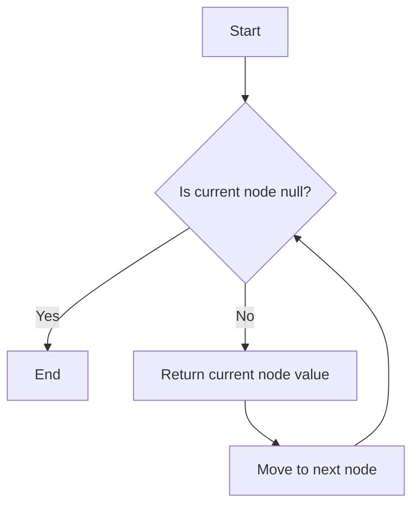

## 6.4.2 Custom Iterators with Iterable Protocol

In this section, we'll delve into the fascinating world of custom iterators in TypeScript, focusing on the implementation of the iterable protocol. This will empower you to make your custom data structures compatible with ES6 iteration constructs, such as `for...of` loops and the spread syntax. By the end of this guide, you'll have a solid understanding of how to create custom iterators, manage state within them, and adhere to best practices for performance and resource management.

### Understanding the Iterable Protocol

The iterable protocol is a fundamental concept in JavaScript and TypeScript that defines how objects can be iterated over. At the heart of this protocol is the `[Symbol.iterator]()` method. This method must be implemented by any object that wants to be iterable.

#### What is the `[Symbol.iterator]()` Method?

The `[Symbol.iterator]()` method is a function that returns an iterator object. This iterator object must conform to the iterator protocol, which requires the implementation of a `next()` method. The `next()` method returns an object with two properties: `value`, which is the current element of the iteration, and `done`, a boolean indicating whether the iteration is complete.

Here's a simple example of an iterable object:

```typescript
class SimpleIterable {
  private items: number[];

  constructor(items: number[]) {
    this.items = items;
  }

  [Symbol.iterator]() {
    let index = 0;
    const items = this.items;

    return {
      next(): IteratorResult<number> {
        if (index < items.length) {
          return { value: items[index++], done: false };
        } else {
          return { value: undefined, done: true };
        }
      }
    };
  }
}

const iterable = new SimpleIterable([1, 2, 3]);
for (const item of iterable) {
  console.log(item); // Outputs 1, 2, 3
}
```

### Creating a Custom Data Structure: A Linked List

To illustrate the power of custom iterators, let's create a linked list. A linked list is a data structure consisting of nodes, where each node contains data and a reference to the next node in the sequence.

#### Defining the Linked List Structure

First, we'll define the basic structure of our linked list:

```typescript
class ListNode<T> {
  value: T;
  next: ListNode<T> | null = null;

  constructor(value: T) {
    this.value = value;
  }
}

class LinkedList<T> {
  head: ListNode<T> | null = null;

  add(value: T): void {
    const newNode = new ListNode(value);
    if (!this.head) {
      this.head = newNode;
    } else {
      let current = this.head;
      while (current.next) {
        current = current.next;
      }
      current.next = newNode;
    }
  }
}
```

### Implementing the `[Symbol.iterator]()` Method

Now that we have our linked list structure, let's implement the `[Symbol.iterator]()` method to make it iterable.

#### Adding the Iterable Protocol

We'll add the `[Symbol.iterator]()` method to our `LinkedList` class. This method will return an iterator that traverses the linked list from the head to the end.

```typescript
class LinkedList<T> {
  head: ListNode<T> | null = null;

  add(value: T): void {
    const newNode = new ListNode(value);
    if (!this.head) {
      this.head = newNode;
    } else {
      let current = this.head;
      while (current.next) {
        current = current.next;
      }
      current.next = newNode;
    }
  }

  [Symbol.iterator](): Iterator<T> {
    let current = this.head;

    return {
      next(): IteratorResult<T> {
        if (current) {
          const value = current.value;
          current = current.next;
          return { value, done: false };
        } else {
          return { value: undefined, done: true };
        }
      }
    };
  }
}
```

#### Using the Custom Iterator

With the iterable protocol implemented, we can now use the `for...of` loop and spread syntax with our linked list:

```typescript
const list = new LinkedList<number>();
list.add(1);
list.add(2);
list.add(3);

for (const value of list) {
  console.log(value); // Outputs 1, 2, 3
}

const array = [...list];
console.log(array); // Outputs [1, 2, 3]
```

### Managing State Within the Iterator

Handling state within an iterator is crucial for managing traversal effectively. In our linked list example, the state is managed by the `current` variable, which keeps track of the current node in the iteration. Each call to `next()` updates this state by moving to the next node.

#### State Management Best Practices

1. **Encapsulation**: Keep the state encapsulated within the iterator to prevent external interference.
2. **Immutability**: Avoid modifying the original data structure during iteration to ensure consistency.
3. **Error Handling**: Implement error handling to manage unexpected states, such as null references.

### Enabling ES6 Iteration Constructs

By implementing the iterable protocol, we enable powerful ES6 iteration constructs for our custom data structures.

#### Using `for...of` Loops

The `for...of` loop is a concise way to iterate over iterable objects. It automatically calls the `[Symbol.iterator]()` method and uses the returned iterator to traverse the elements.

#### Utilizing Spread Syntax

The spread syntax (`...`) allows us to expand iterable objects into individual elements. This is particularly useful for converting custom data structures into arrays or passing their elements as arguments to functions.

### Best Practices for Iterator Performance and Resource Management

When designing custom iterators, consider the following best practices to optimize performance and manage resources effectively:

1. **Lazy Evaluation**: Generate elements on-the-fly rather than precomputing them, which can save memory and improve performance.
2. **Resource Cleanup**: Ensure that resources, such as file handles or network connections, are released when the iteration is complete.
3. **Avoid Side Effects**: Iterators should not modify the underlying data structure or produce side effects, as this can lead to unpredictable behavior.

### Try It Yourself

Experiment with the linked list example by adding more methods, such as `remove()` or `find()`, and ensure they work seamlessly with the iterator. Consider implementing a different data structure, like a binary tree, and make it iterable using the same principles.

### Visualizing the Iteration Process

To better understand how the iteration process works, let's visualize the traversal of our linked list using a flowchart.



**Figure 1**: The flowchart illustrates the iteration process over a linked list, where each node is visited sequentially until the end of the list is reached.

### References and Further Reading

- [MDN Web Docs: Iteration Protocols](https://developer.mozilla.org/en-US/docs/Web/JavaScript/Reference/Iteration_protocols)
- [TypeScript Handbook: Iterators and Generators](https://www.typescriptlang.org/docs/handbook/iterators-and-generators.html)

### Knowledge Check

Before we wrap up, let's reinforce what we've learned:

- What is the purpose of the `[Symbol.iterator]()` method?
- How does the `for...of` loop utilize the iterable protocol?
- What are some best practices for managing state within an iterator?

### Embrace the Journey

Remember, mastering custom iterators is just one step in your journey as a TypeScript expert. Keep experimenting, stay curious, and enjoy the process of building more complex and interactive data structures!

## Quiz Time!



### What is the primary purpose of the `[Symbol.iterator]()` method in TypeScript?

- [x] To define how an object can be iterated over
- [ ] To create a new object instance
- [ ] To sort elements in an array
- [ ] To convert a string to a number

> **Explanation:** The `[Symbol.iterator]()` method is used to define how an object can be iterated over, making it compatible with ES6 iteration constructs like `for...of`.

### Which of the following constructs can be used with custom iterators in TypeScript?

- [x] `for...of` loop
- [x] Spread syntax
- [ ] `for...in` loop
- [ ] `if...else` statement

> **Explanation:** Custom iterators can be used with `for...of` loops and spread syntax, both of which rely on the iterable protocol.

### What is the role of the `next()` method in an iterator?

- [x] To return the next element in the iteration
- [ ] To terminate the iteration
- [ ] To initialize the iteration
- [ ] To sort the elements

> **Explanation:** The `next()` method returns the next element in the iteration, along with a `done` property indicating if the iteration is complete.

### In the linked list example, what does the `current` variable represent?

- [x] The current node being iterated over
- [ ] The head of the list
- [ ] The last node in the list
- [ ] The total number of nodes in the list

> **Explanation:** The `current` variable represents the current node being iterated over, and it is updated as the iteration progresses.

### What should be avoided when designing custom iterators?

- [x] Modifying the underlying data structure
- [ ] Using lazy evaluation
- [ ] Returning an iterator object
- [ ] Implementing the `[Symbol.iterator]()` method

> **Explanation:** Modifying the underlying data structure during iteration should be avoided to prevent unpredictable behavior.

### Which of the following is a best practice for iterator performance?

- [x] Lazy evaluation
- [ ] Precomputing all elements
- [ ] Using global variables
- [ ] Ignoring resource cleanup

> **Explanation:** Lazy evaluation is a best practice for iterator performance, as it generates elements on-the-fly, saving memory and improving efficiency.

### How does the spread syntax work with custom iterators?

- [x] It expands iterable objects into individual elements
- [ ] It compresses elements into a single object
- [ ] It sorts the elements
- [ ] It reverses the order of elements

> **Explanation:** The spread syntax expands iterable objects into individual elements, allowing them to be used in arrays or function arguments.

### What is the significance of the `done` property in the `next()` method's return object?

- [x] It indicates whether the iteration is complete
- [ ] It specifies the current index
- [ ] It holds the value of the current element
- [ ] It initializes the iteration

> **Explanation:** The `done` property indicates whether the iteration is complete, allowing the loop to terminate when all elements have been visited.

### Which of the following is NOT a benefit of implementing custom iterators?

- [ ] Enabling `for...of` loops
- [ ] Allowing spread syntax
- [x] Increasing code complexity
- [ ] Improving code readability

> **Explanation:** Implementing custom iterators should not increase code complexity; instead, it should improve code readability and usability.

### True or False: The `for...in` loop can be used with custom iterators.

- [ ] True
- [x] False

> **Explanation:** The `for...in` loop is used for iterating over object properties, not for iterating over iterable objects. Custom iterators are used with `for...of` loops.


