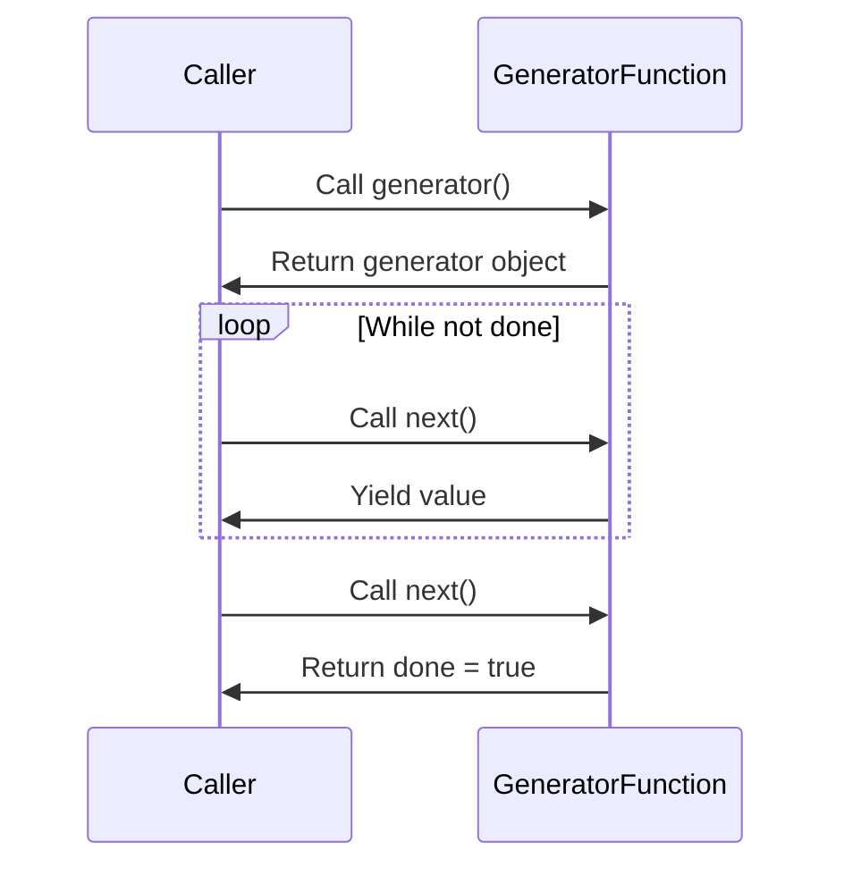

## 6.4.3 Generator Functions

In the realm of software design patterns, the Iterator Pattern is a powerful tool that allows us to traverse collections without exposing their underlying representation. In TypeScript, generator functions provide a streamlined way to implement iterators, offering syntactic sugar and managing state internally. This section delves into the intricacies of generator functions, demonstrating their utility in simplifying the creation of iterators.

### Understanding Generator Functions

Generator functions are a special type of function in JavaScript and TypeScript, denoted by the `function*` syntax. Unlike regular functions, generator functions can pause execution and resume later, making them ideal for creating iterators. They achieve this through the `yield` keyword, which allows them to produce a sequence of values over time.

#### How Generator Functions Work

When a generator function is called, it returns a generator object. This object adheres to both the iterable and iterator protocols, meaning it can be used in a `for...of` loop or with the spread operator. The generator function itself does not execute immediately; instead, execution begins when the generator's `next()` method is called.

Each call to `next()` resumes the function's execution until it encounters a `yield` statement. At this point, the function pauses, and the `yield` expression's value is returned to the caller. The function can then be resumed from where it left off by calling `next()` again.

Here is a simple example of a generator function:

```typescript
function* simpleGenerator() {
  yield 1;
  yield 2;
  yield 3;
}

const generator = simpleGenerator();

console.log(generator.next().value); // Output: 1
console.log(generator.next().value); // Output: 2
console.log(generator.next().value); // Output: 3
console.log(generator.next().done);  // Output: true
```

In this example, the generator function `simpleGenerator` yields three values: 1, 2, and 3. Each call to `next()` retrieves the next value in the sequence, and once all values have been yielded, the `done` property becomes `true`.

### Implementing an Iterator with a Generator Function

To illustrate the power of generator functions, let's implement a custom iterator using a generator function. Consider a scenario where we want to iterate over a range of numbers:

```typescript
function* range(start: number, end: number) {
  for (let i = start; i <= end; i++) {
    yield i;
  }
}

const numberRange = range(1, 5);

for (const num of numberRange) {
  console.log(num); // Output: 1, 2, 3, 4, 5
}
```

In this example, the `range` generator function yields numbers from `start` to `end`. The `for...of` loop consumes the generator, iterating over each yielded value. This approach abstracts the complexity of managing iteration state, making the code cleaner and more maintainable.

### Benefits of Using Generator Functions

Generator functions offer several advantages, particularly in the context of implementing iterators:

1. **Cleaner Code**: By abstracting the iteration logic, generator functions reduce boilerplate code, making implementations more concise and readable.

2. **State Management**: Generators handle state internally, eliminating the need for external state management. This encapsulation simplifies code and reduces the likelihood of errors.

3. **Lazy Evaluation**: Generators yield values on demand, which can improve performance by avoiding unnecessary computations.

4. **Infinite Sequences**: Generators can produce infinite sequences, as they only compute values when requested. This is useful for applications like data streaming or real-time data processing.

5. **TypeScript Integration**: TypeScript's type system enhances generator functions by allowing type annotations, improving code safety and maintainability.

### Type Annotations for Generator Functions

TypeScript allows us to specify types for generator functions, enhancing type safety. We can define the type of values yielded by the generator, as well as the type of values returned by the `next()` method.

Here's an example with type annotations:

```typescript
function* typedGenerator(): Generator<number, void, unknown> {
  yield 1;
  yield 2;
  yield 3;
}

const gen = typedGenerator();

let result = gen.next();
while (!result.done) {
  console.log(result.value); // Output: 1, 2, 3
  result = gen.next();
}
```

In this example, the `typedGenerator` function is annotated with `Generator<number, void, unknown>`. This indicates that the generator yields numbers (`number`), does not return a value (`void`), and does not accept any input (`unknown`).

### Limitations and Considerations

While generator functions offer numerous benefits, there are some limitations and considerations to keep in mind:

1. **Performance**: In some cases, the overhead of managing generator state can impact performance. It's important to evaluate whether a generator is the best choice for performance-critical applications.

2. **Complexity**: For simple iteration tasks, a generator might introduce unnecessary complexity. Consider the problem's requirements before opting for a generator.

3. **Debugging**: Debugging generator functions can be challenging, as the execution flow is non-linear. Familiarize yourself with debugging tools and techniques to effectively troubleshoot generator-based code.

### Try It Yourself

Experiment with the following code snippet by modifying the range or adding additional logic within the generator:

```typescript
function* customRange(start: number, end: number, step: number = 1) {
  for (let i = start; i <= end; i += step) {
    yield i;
  }
}

const rangeWithStep = customRange(0, 10, 2);

for (const num of rangeWithStep) {
  console.log(num); // Output: 0, 2, 4, 6, 8, 10
}
```

Try changing the `step` value or adding conditions to yield only even numbers. This exercise will help solidify your understanding of generator functions and their flexibility.

### Visualizing Generator Execution

To better understand how generator functions work, let's visualize the execution flow using a Mermaid.js sequence diagram:



This diagram illustrates the interaction between the caller and the generator function. The caller initiates the generator and repeatedly calls `next()` to retrieve values until the generator is exhausted.

### Knowledge Check

Before we conclude, let's reinforce your understanding with a few questions:

- What is the primary purpose of a generator function?
- How does the `yield` keyword work within a generator function?
- What are the benefits of using generator functions for implementing iterators?
- How can TypeScript's type system enhance generator functions?
- What are some potential limitations of using generator functions?

### Conclusion

Generator functions in TypeScript provide a powerful mechanism for implementing iterators, offering cleaner code, easier state management, and lazy evaluation. By leveraging TypeScript's type system, we can enhance the safety and maintainability of our generator-based code. While there are some limitations to consider, the benefits often outweigh these concerns, making generator functions a valuable tool in the expert software engineer's toolkit.

Remember, this is just the beginning. As you progress, you'll build more complex and interactive applications using generator functions. Keep experimenting, stay curious, and enjoy the journey!

## Quiz Time!



### What is the primary purpose of a generator function?

- [x] To create iterators that can pause and resume execution
- [ ] To execute code asynchronously
- [ ] To manage memory allocation
- [ ] To handle exceptions

> **Explanation:** Generator functions are designed to create iterators that can pause and resume execution, allowing for lazy evaluation and efficient state management.

### How does the `yield` keyword function within a generator?

- [x] It pauses the function execution and returns a value
- [ ] It ends the function execution permanently
- [ ] It throws an exception
- [ ] It initializes the generator

> **Explanation:** The `yield` keyword pauses the generator function's execution and returns a value to the caller, allowing the function to be resumed later.

### What is a key benefit of using generator functions?

- [x] They simplify state management within iterators
- [ ] They improve network performance
- [ ] They reduce memory usage
- [ ] They enhance security

> **Explanation:** Generator functions simplify state management by encapsulating the iteration logic and maintaining state internally.

### How can TypeScript's type system enhance generator functions?

- [x] By allowing type annotations for yielded values
- [ ] By improving runtime performance
- [ ] By reducing code size
- [ ] By enabling parallel execution

> **Explanation:** TypeScript's type system allows developers to specify type annotations for generator functions, improving code safety and maintainability.

### What is a potential limitation of using generator functions?

- [x] They can introduce performance overhead
- [ ] They cannot handle asynchronous operations
- [ ] They are not compatible with TypeScript
- [ ] They require external libraries

> **Explanation:** Generator functions can introduce performance overhead due to the management of internal state and execution flow.

### Which of the following is true about generator functions?

- [x] They return a generator object when called
- [ ] They execute immediately upon definition
- [ ] They cannot be used in TypeScript
- [ ] They are only used for asynchronous operations

> **Explanation:** When a generator function is called, it returns a generator object that adheres to both the iterable and iterator protocols.

### What is the role of the `next()` method in a generator?

- [x] It resumes the generator function's execution
- [ ] It initializes the generator function
- [ ] It terminates the generator function
- [ ] It throws an error

> **Explanation:** The `next()` method resumes the generator function's execution from where it was last paused, retrieving the next value in the sequence.

### How can you iterate over a generator's values in TypeScript?

- [x] Using a `for...of` loop
- [ ] Using a `while` loop
- [ ] Using a `do...while` loop
- [ ] Using a `switch` statement

> **Explanation:** A `for...of` loop can be used to iterate over the values yielded by a generator, as it adheres to the iterable protocol.

### What does the `done` property indicate in a generator's `next()` result?

- [x] Whether the generator has been exhausted
- [ ] The current value of the generator
- [ ] The initial state of the generator
- [ ] The total number of yielded values

> **Explanation:** The `done` property indicates whether the generator has been exhausted, meaning there are no more values to yield.

### Generator functions can be used to create infinite sequences.

- [x] True
- [ ] False

> **Explanation:** Generator functions can produce infinite sequences by yielding values on demand, making them suitable for applications like data streaming.


