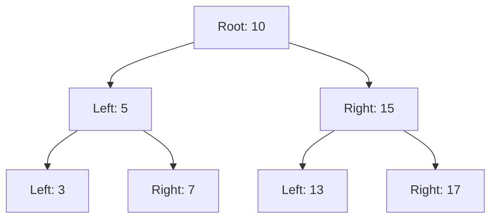

## 6.4.4 Use Cases and Examples

The Iterator Pattern is a powerful design pattern that provides a way to access elements of a collection sequentially without exposing the underlying representation. In TypeScript, this pattern can be implemented using the built-in iterator protocol, which allows us to create custom iterators for various data structures. In this section, we'll explore practical scenarios where the Iterator Pattern can be effectively applied, such as iterating over binary trees, implementing pagination, and creating infinite sequences.

### Iterating Over a Binary Tree

Binary trees are hierarchical data structures that are widely used in computer science for various applications, including search trees and heaps. Traversing a binary tree can be done in several orders, such as in-order, pre-order, and post-order. The Iterator Pattern allows us to encapsulate these traversal algorithms and provide a consistent interface for iterating over the tree.

#### In-Order Traversal

In-order traversal of a binary tree visits the left subtree, the root node, and then the right subtree. This order is particularly useful for binary search trees, as it visits nodes in ascending order.

```typescript
class TreeNode<T> {
    value: T;
    left: TreeNode<T> | null = null;
    right: TreeNode<T> | null = null;

    constructor(value: T) {
        this.value = value;
    }
}

class InOrderIterator<T> implements Iterator<T> {
    private stack: TreeNode<T>[] = [];
    private current: TreeNode<T> | null;

    constructor(root: TreeNode<T> | null) {
        this.current = root;
    }

    next(): IteratorResult<T> {
        while (this.current || this.stack.length > 0) {
            while (this.current) {
                this.stack.push(this.current);
                this.current = this.current.left;
            }
            this.current = this.stack.pop()!;
            const value = this.current.value;
            this.current = this.current.right;
            return { value, done: false };
        }
        return { value: undefined, done: true };
    }
}

// Usage
const root = new TreeNode<number>(10);
root.left = new TreeNode<number>(5);
root.right = new TreeNode<number>(15);

const iterator = new InOrderIterator(root);
let result = iterator.next();
while (!result.done) {
    console.log(result.value);
    result = iterator.next();
}
```

#### Pre-Order and Post-Order Traversals

Similarly, we can implement pre-order and post-order iterators by adjusting the order in which nodes are visited.

### Implementing Pagination

Pagination is a common requirement when dealing with large datasets or API results. The Iterator Pattern can be used to abstract the logic of retrieving and iterating over paginated data.

```typescript
class PaginatedIterator<T> implements Iterator<T> {
    private data: T[];
    private currentIndex: number = 0;
    private pageSize: number;

    constructor(data: T[], pageSize: number) {
        this.data = data;
        this.pageSize = pageSize;
    }

    next(): IteratorResult<T> {
        if (this.currentIndex < this.data.length) {
            const value = this.data[this.currentIndex];
            this.currentIndex++;
            return { value, done: false };
        } else {
            return { value: undefined, done: true };
        }
    }

    reset(): void {
        this.currentIndex = 0;
    }
}

// Usage
const data = Array.from({ length: 100 }, (_, i) => i + 1);
const pageSize = 10;
const iterator = new PaginatedIterator(data, pageSize);

let result = iterator.next();
while (!result.done) {
    console.log(result.value);
    result = iterator.next();
}
```

### Creating Infinite Sequences

Infinite sequences, such as the Fibonacci series, can be elegantly implemented using generators in TypeScript. Generators provide a convenient way to create iterators with complex logic.

```typescript
function* fibonacci(): Generator<number> {
    let [prev, curr] = [0, 1];
    while (true) {
        yield curr;
        [prev, curr] = [curr, prev + curr];
    }
}

// Usage
const fibIterator = fibonacci();
console.log(fibIterator.next().value); // 1
console.log(fibIterator.next().value); // 1
console.log(fibIterator.next().value); // 2
console.log(fibIterator.next().value); // 3
console.log(fibIterator.next().value); // 5
```

### Benefits of the Iterator Pattern

The Iterator Pattern offers several benefits, particularly in terms of abstraction and code readability:

- **Encapsulation**: By encapsulating the traversal logic within iterators, we can change the underlying data structure or traversal algorithm without affecting client code.
- **Consistency**: Iterators provide a consistent interface for accessing elements, making it easier to work with different data structures.
- **Readability**: Using iterators can make code more readable by abstracting complex traversal logic into simple, reusable components.

### Encouragement to Implement Custom Iterators

When working with complex or non-standard collections, consider implementing custom iterators. This approach can greatly enhance the flexibility and maintainability of your code. By defining a clear iteration protocol, you can separate the logic of how elements are accessed from the details of how they are stored.

### Visualizing Iteration Over a Binary Tree

To better understand the concept of iterating over a binary tree, let's visualize the process using a diagram. Below is a representation of an in-order traversal of a binary tree:



In this diagram, the in-order traversal would visit the nodes in the following sequence: 3, 5, 7, 10, 13, 15, 17.

### Try It Yourself

To deepen your understanding of the Iterator Pattern, try modifying the examples provided:

- Implement a pre-order and post-order iterator for the binary tree.
- Extend the `PaginatedIterator` to support fetching additional pages from an API.
- Create a generator for another infinite sequence, such as prime numbers.

### References and Links

For further reading on iterators and generators in TypeScript, consider the following resources:

- [MDN Web Docs: Iterators and Generators](https://developer.mozilla.org/en-US/docs/Web/JavaScript/Guide/Iterators_and_Generators)
- [TypeScript Handbook: Iterators and Generators](https://www.typescriptlang.org/docs/handbook/iterators-and-generators.html)

### Knowledge Check

Before moving on, let's reinforce what we've learned:

- What are the advantages of using the Iterator Pattern?
- How can generators be used to create infinite sequences?
- Why is encapsulating traversal logic within iterators beneficial?

Remember, mastering design patterns like the Iterator Pattern can greatly enhance your ability to write clean, maintainable code. Keep experimenting, stay curious, and enjoy the journey!

## Quiz Time!



### What is the primary benefit of using the Iterator Pattern?

- [x] It provides a way to access elements of a collection sequentially without exposing the underlying representation.
- [ ] It allows for the creation of complex data structures.
- [ ] It simplifies the process of writing recursive functions.
- [ ] It automatically optimizes code performance.

> **Explanation:** The Iterator Pattern abstracts the process of accessing elements, providing a consistent interface without exposing the internal structure of the collection.

### Which traversal order visits the left subtree, the root node, and then the right subtree?

- [x] In-order
- [ ] Pre-order
- [ ] Post-order
- [ ] Level-order

> **Explanation:** In-order traversal visits the left subtree first, then the root node, and finally the right subtree, which is especially useful for binary search trees.

### How can generators be used in TypeScript?

- [x] To create iterators with complex logic
- [ ] To define new data types
- [ ] To optimize memory usage
- [ ] To handle errors in asynchronous code

> **Explanation:** Generators in TypeScript allow for the creation of iterators with complex logic, enabling the generation of sequences on-the-fly.

### What is a practical use case for the PaginatedIterator?

- [x] Iterating over large datasets or API results
- [ ] Sorting an array of numbers
- [ ] Implementing a binary search algorithm
- [ ] Creating a new data structure

> **Explanation:** The PaginatedIterator is useful for iterating over large datasets or API results, allowing for efficient data retrieval and processing.

### Which of the following is an infinite sequence that can be generated using a generator?

- [x] Fibonacci series
- [ ] Binary search tree
- [ ] Linked list
- [ ] Hash table

> **Explanation:** The Fibonacci series is an example of an infinite sequence that can be generated using a generator, producing numbers indefinitely.

### What is the purpose of encapsulating traversal logic within iterators?

- [x] To separate the logic of how elements are accessed from how they are stored
- [ ] To increase the speed of data processing
- [ ] To reduce memory usage
- [ ] To simplify the process of writing recursive functions

> **Explanation:** Encapsulating traversal logic within iterators allows for separation of concerns, making code more modular and maintainable.

### What TypeScript feature allows for the creation of custom iterators?

- [x] The iterator protocol
- [ ] Type aliases
- [ ] Decorators
- [ ] Interfaces

> **Explanation:** The iterator protocol in TypeScript allows for the creation of custom iterators, enabling sequential access to elements in a collection.

### How does the Iterator Pattern improve code readability?

- [x] By abstracting complex traversal logic into simple, reusable components
- [ ] By reducing the number of lines of code
- [ ] By automatically generating documentation
- [ ] By optimizing code performance

> **Explanation:** The Iterator Pattern improves code readability by encapsulating complex traversal logic, making it easier to understand and maintain.

### What is a benefit of using generators for infinite sequences?

- [x] They allow for lazy evaluation, generating values as needed
- [ ] They automatically optimize memory usage
- [ ] They simplify error handling
- [ ] They provide built-in caching mechanisms

> **Explanation:** Generators allow for lazy evaluation, producing values on-the-fly as they are needed, which is ideal for infinite sequences.

### True or False: The Iterator Pattern can only be used with arrays in TypeScript.

- [ ] True
- [x] False

> **Explanation:** False. The Iterator Pattern can be used with any data structure, including custom collections, binary trees, and more, in TypeScript.


