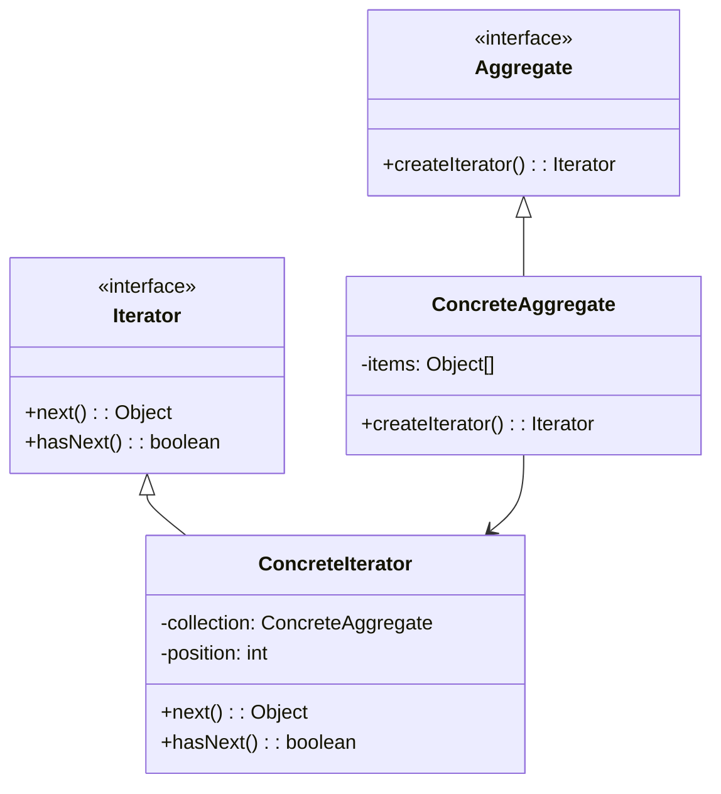

## 6.4 Iterator Pattern

In the realm of software design, the Iterator Pattern stands out as a fundamental solution for traversing collections. This pattern provides a standardized way to access elements of an aggregate object sequentially without exposing its underlying representation. Let's delve into the intricacies of the Iterator Pattern, its components, and how it can be effectively implemented in TypeScript.

### Understanding the Iterator Pattern

The Iterator Pattern is a behavioral design pattern that abstracts the process of traversing a collection of objects. Its primary intent is to allow clients to access elements of a collection without needing to understand the internal structure of the collection. This separation of concerns promotes encapsulation and adheres to the Single Responsibility Principle, ensuring that the collection and the traversal logic are decoupled.

#### Problem Solved by the Iterator Pattern

When dealing with collections, such as arrays, lists, or trees, clients often need to traverse these collections to access or manipulate their elements. Without the Iterator Pattern, clients would need to know the internal structure of the collection to perform traversal, leading to tightly coupled code that is difficult to maintain and extend. The Iterator Pattern addresses this problem by providing a uniform interface for traversal, allowing clients to iterate over collections without being aware of their underlying representation.

### Key Components of the Iterator Pattern

The Iterator Pattern comprises several key components, each playing a crucial role in enabling seamless traversal of collections:

1. **Iterator**: This is an interface that defines the methods for accessing elements in a collection. Common methods include `next()` to retrieve the next element and `hasNext()` to check if there are more elements to iterate over.

2. **ConcreteIterator**: This class implements the Iterator interface for a specific aggregate. It maintains the current position in the traversal and provides the logic for accessing elements sequentially.

3. **Aggregate**: This is an interface that defines methods for creating iterators. It acts as a factory for iterators, allowing clients to obtain an iterator for traversing the collection.

4. **ConcreteAggregate**: This class implements the Aggregate interface and returns an instance of ConcreteIterator. It represents the collection of objects to be iterated over.

### Visualizing the Iterator Pattern

To better understand the relationships between these components, let's visualize the Iterator Pattern using a class diagram:



In this diagram, we see the `Iterator` interface being implemented by `ConcreteIterator`, which is responsible for traversing the `ConcreteAggregate`. The `Aggregate` interface is implemented by `ConcreteAggregate`, which provides a method to create an iterator.

### Implementing the Iterator Pattern in TypeScript

Now that we have a theoretical understanding of the Iterator Pattern, let's implement it in TypeScript. We'll create a simple example where we iterate over a collection of numbers.

#### Step 1: Define the Iterator Interface

First, we define the `Iterator` interface with the necessary methods:

```typescript
interface Iterator<T> {
    next(): T | null;
    hasNext(): boolean;
}
```

This interface uses TypeScript generics to allow for type-safe iteration over any type of collection.

#### Step 2: Implement the ConcreteIterator

Next, we implement the `ConcreteIterator` class, which will handle the traversal logic:

```typescript
class NumberIterator implements Iterator<number> {
    private collection: NumberCollection;
    private position: number = 0;

    constructor(collection: NumberCollection) {
        this.collection = collection;
    }

    public next(): number | null {
        if (this.hasNext()) {
            return this.collection.getItems()[this.position++];
        }
        return null;
    }

    public hasNext(): boolean {
        return this.position < this.collection.getItems().length;
    }
}
```

In this implementation, `NumberIterator` maintains a reference to the `NumberCollection` and a `position` to track the current element.

#### Step 3: Define the Aggregate Interface

Now, we define the `Aggregate` interface, which will be responsible for creating iterators:

```typescript
interface Aggregate<T> {
    createIterator(): Iterator<T>;
}
```

#### Step 4: Implement the ConcreteAggregate

Finally, we implement the `ConcreteAggregate` class, which represents the collection of numbers:

```typescript
class NumberCollection implements Aggregate<number> {
    private items: number[] = [];

    public addItem(item: number): void {
        this.items.push(item);
    }

    public getItems(): number[] {
        return this.items;
    }

    public createIterator(): Iterator<number> {
        return new NumberIterator(this);
    }
}
```

In this implementation, `NumberCollection` provides methods to add items to the collection and to create an iterator for traversing the collection.

### Using the Iterator Pattern

With the components in place, let's see how we can use the Iterator Pattern to traverse a collection of numbers:

```typescript
const collection = new NumberCollection();
collection.addItem(1);
collection.addItem(2);
collection.addItem(3);

const iterator = collection.createIterator();

while (iterator.hasNext()) {
    console.log(iterator.next());
}
```

In this example, we create a `NumberCollection`, add some numbers to it, and then use the iterator to traverse and print each number. The client code is decoupled from the internal structure of the collection, demonstrating the power of the Iterator Pattern.

### Promoting Encapsulation and the Single Responsibility Principle

The Iterator Pattern promotes encapsulation by hiding the internal structure of the collection from the client. Clients interact with the collection through the iterator, which provides a consistent interface for traversal. This separation of concerns adheres to the Single Responsibility Principle, as the collection is responsible for managing its elements, while the iterator handles the traversal logic.

### TypeScript-Specific Features

TypeScript offers several features that enhance the implementation of the Iterator Pattern:

- **Generics**: As demonstrated, generics allow for type-safe iteration over collections of any type.
- **Interfaces**: TypeScript's interface system provides a clear contract for iterators and aggregates, ensuring consistency and type safety.
- **Optional Chaining and Nullish Coalescing**: These features can be used to handle cases where the iterator might return `null`.

### Try It Yourself

To deepen your understanding, try modifying the code examples to iterate over different types of collections, such as strings or custom objects. Experiment with adding additional methods to the iterator, such as `reset()`, to reset the traversal position.

### References and Further Reading

For more information on the Iterator Pattern and its applications, consider exploring the following resources:

- [MDN Web Docs: Iterators and Generators](https://developer.mozilla.org/en-US/docs/Web/JavaScript/Guide/Iterators_and_Generators)
- [Refactoring Guru: Iterator Pattern](https://refactoring.guru/design-patterns/iterator)
- [TypeScript Handbook: Generics](https://www.typescriptlang.org/docs/handbook/2/generics.html)

### Knowledge Check

Before moving on, consider the following questions to test your understanding:

- What problem does the Iterator Pattern solve?
- How does the Iterator Pattern promote encapsulation?
- What are the key components of the Iterator Pattern?
- How can TypeScript's generics enhance the implementation of the Iterator Pattern?

### Embrace the Journey

Remember, mastering design patterns like the Iterator Pattern is a journey. As you continue to explore and implement these patterns, you'll gain a deeper understanding of how to write maintainable and scalable code. Keep experimenting, stay curious, and enjoy the journey!

## Quiz Time!



### What is the primary intent of the Iterator Pattern?

- [x] To provide a way to access elements of a collection sequentially without exposing its underlying representation.
- [ ] To allow multiple threads to access a collection concurrently.
- [ ] To optimize memory usage in collections.
- [ ] To provide a way to sort elements in a collection.

> **Explanation:** The Iterator Pattern's primary intent is to allow clients to access elements of a collection sequentially without needing to understand the internal structure of the collection.

### Which component of the Iterator Pattern is responsible for creating iterators?

- [ ] Iterator
- [ ] ConcreteIterator
- [x] Aggregate
- [ ] ConcreteAggregate

> **Explanation:** The Aggregate interface defines methods for creating iterators, acting as a factory for iterators.

### How does the Iterator Pattern promote encapsulation?

- [x] By hiding the internal structure of the collection from the client.
- [ ] By allowing direct access to the collection's elements.
- [ ] By exposing the collection's internal representation.
- [ ] By providing multiple interfaces for accessing the collection.

> **Explanation:** The Iterator Pattern promotes encapsulation by providing a consistent interface for traversal, hiding the collection's internal structure from the client.

### What is the role of the ConcreteIterator in the Iterator Pattern?

- [ ] To define methods for creating iterators.
- [x] To implement the Iterator interface for a specific aggregate.
- [ ] To represent the collection of objects to be iterated over.
- [ ] To provide a way to sort elements in a collection.

> **Explanation:** The ConcreteIterator class implements the Iterator interface and provides the logic for accessing elements sequentially in a specific aggregate.

### What TypeScript feature enhances type-safe iteration in the Iterator Pattern?

- [ ] Interfaces
- [ ] Optional Chaining
- [x] Generics
- [ ] Nullish Coalescing

> **Explanation:** TypeScript's generics allow for type-safe iteration over collections of any type, enhancing the implementation of the Iterator Pattern.

### Which method in the Iterator interface checks if there are more elements to iterate over?

- [ ] next()
- [x] hasNext()
- [ ] reset()
- [ ] createIterator()

> **Explanation:** The `hasNext()` method checks if there are more elements to iterate over in the collection.

### What is the benefit of using the Iterator Pattern in client code?

- [x] It decouples the client code from the internal structure of the collection.
- [ ] It allows direct access to the collection's elements.
- [ ] It optimizes the performance of the collection.
- [ ] It provides a way to sort elements in a collection.

> **Explanation:** The Iterator Pattern decouples the client code from the internal structure of the collection, allowing for more maintainable and flexible code.

### What is the role of the ConcreteAggregate in the Iterator Pattern?

- [ ] To define methods for creating iterators.
- [ ] To implement the Iterator interface for a specific aggregate.
- [x] To represent the collection of objects to be iterated over.
- [ ] To provide a way to sort elements in a collection.

> **Explanation:** The ConcreteAggregate class implements the Aggregate interface and represents the collection of objects to be iterated over.

### How can the Iterator Pattern adhere to the Single Responsibility Principle?

- [x] By separating the collection management from the traversal logic.
- [ ] By allowing direct access to the collection's elements.
- [ ] By exposing the collection's internal representation.
- [ ] By providing multiple interfaces for accessing the collection.

> **Explanation:** The Iterator Pattern adheres to the Single Responsibility Principle by decoupling the collection management from the traversal logic, ensuring each component has a single responsibility.

### True or False: The Iterator Pattern allows clients to modify the internal structure of a collection.

- [ ] True
- [x] False

> **Explanation:** False. The Iterator Pattern provides a way to access elements of a collection without exposing or modifying its internal structure.


