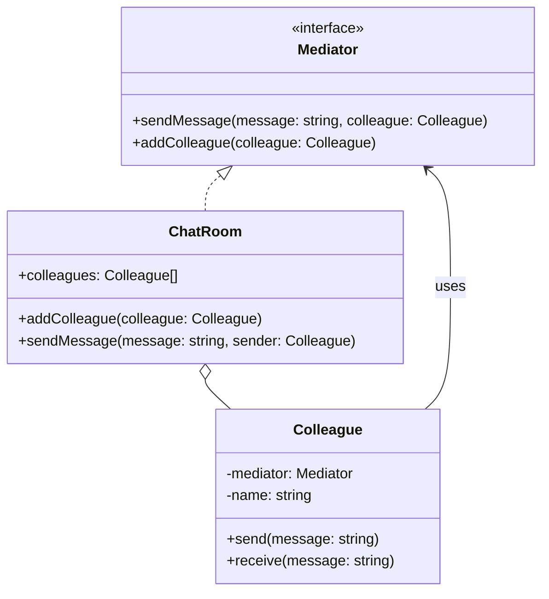

## 6.5.1 Implementing Mediator in TypeScript

The Mediator Pattern is a behavioral design pattern that centralizes complex communications and control logic between objects, promoting loose coupling and enhancing scalability. By introducing a mediator object, we can manage the interactions between various components, known as colleagues, without them needing to communicate directly. This approach simplifies the communication logic and makes the system more maintainable and flexible.

### Understanding the Mediator Pattern

In a typical software system, components often need to communicate with each other. Without a mediator, each component would need to be aware of the others, leading to a tightly coupled system. The Mediator Pattern addresses this by introducing a mediator object that encapsulates the communication logic, allowing components to interact indirectly.

#### Key Components of the Mediator Pattern

1. **Mediator Interface**: Defines the methods for communication between colleagues.
2. **ConcreteMediator**: Implements the mediator interface and coordinates communication between colleague objects.
3. **Colleague Classes**: Represent the components that interact with each other through the mediator.

### Implementing the Mediator Pattern in TypeScript

Let's dive into implementing the Mediator Pattern in TypeScript by creating a simple chat room application where users (colleagues) communicate through a central chat room (mediator).

#### Step 1: Define the Mediator Interface

The mediator interface declares methods for communication between colleague objects.

```typescript
// Mediator interface
interface Mediator {
  sendMessage(message: string, colleague: Colleague): void;
  addColleague(colleague: Colleague): void;
}
```

#### Step 2: Implement the ConcreteMediator Class

The `ConcreteMediator` class implements the `Mediator` interface and manages the communication between colleague objects.

```typescript
// ConcreteMediator class
class ChatRoom implements Mediator {
  private colleagues: Colleague[] = [];

  addColleague(colleague: Colleague): void {
    this.colleagues.push(colleague);
  }

  sendMessage(message: string, sender: Colleague): void {
    this.colleagues.forEach(colleague => {
      if (colleague !== sender) {
        colleague.receive(message);
      }
    });
  }
}
```

#### Step 3: Define the Colleague Classes

Colleague classes represent the components that interact through the mediator. They hold a reference to the mediator and use it to communicate with other colleagues.

```typescript
// Colleague class
class Colleague {
  constructor(private mediator: Mediator, private name: string) {
    this.mediator.addColleague(this);
  }

  send(message: string): void {
    console.log(`${this.name} sends: ${message}`);
    this.mediator.sendMessage(message, this);
  }

  receive(message: string): void {
    console.log(`${this.name} receives: ${message}`);
  }
}
```

#### Step 4: Demonstrate Communication Through the Mediator

Let's create a simple demonstration of how the mediator facilitates communication between colleagues.

```typescript
// Create a chat room (mediator)
const chatRoom = new ChatRoom();

// Create colleagues
const alice = new Colleague(chatRoom, 'Alice');
const bob = new Colleague(chatRoom, 'Bob');
const charlie = new Colleague(chatRoom, 'Charlie');

// Send messages
alice.send('Hello, everyone!');
bob.send('Hi, Alice!');
charlie.send('Hey, folks!');
```

### Handling Different Types of Messages or Events

The mediator can be extended to handle different types of messages or events. For instance, we can modify the `sendMessage` method to include message types or priorities.

```typescript
// Enhanced sendMessage method
sendMessage(message: string, sender: Colleague, type: string = 'text'): void {
  this.colleagues.forEach(colleague => {
    if (colleague !== sender) {
      colleague.receive(`[${type.toUpperCase()}] ${message}`);
    }
  });
}
```

### Promoting Scalability with the Mediator Pattern

One of the key advantages of the Mediator Pattern is its ability to promote scalability. By centralizing the communication logic, we can easily add new colleagues without modifying existing ones. This is particularly useful in large systems where components frequently change or evolve.

#### Adding New Colleagues

To add a new colleague, simply create a new instance of the `Colleague` class and pass the mediator as a parameter. The mediator will automatically manage the communication.

```typescript
// Adding a new colleague
const dave = new Colleague(chatRoom, 'Dave');
dave.send('Hello, I am new here!');
```

### Considerations and Potential Challenges

While the Mediator Pattern offers numerous benefits, it also introduces some challenges that need to be considered:

1. **Increased Complexity**: The mediator can become a complex component if it manages too many interactions or complex logic. It's essential to keep the mediator's responsibilities clear and well-defined.

2. **Performance Impacts**: In systems with a large number of colleagues or frequent interactions, the mediator can become a bottleneck. It's crucial to optimize the mediator's logic and ensure it scales with the system's needs.

3. **Single Point of Failure**: The mediator acts as a central hub for communication. If it fails, the entire communication system can be disrupted. Implementing redundancy or failover mechanisms can mitigate this risk.

### Visualizing the Mediator Pattern

To better understand the Mediator Pattern, let's visualize the interaction between the mediator and colleagues using a class diagram.



### Try It Yourself

Now that we've explored the Mediator Pattern, it's time to experiment with the code. Here are some suggestions to modify the example:

1. **Add a New Message Type**: Extend the `sendMessage` method to handle different message types, such as `image` or `video`.

2. **Implement a Logging Feature**: Add a logging mechanism to the `ChatRoom` class to record all messages sent through the mediator.

3. **Create a Private Messaging System**: Modify the mediator to support private messages between specific colleagues.

### References and Further Reading

- [Mediator Pattern on Wikipedia](https://en.wikipedia.org/wiki/Mediator_pattern)
- [TypeScript Official Documentation](https://www.typescriptlang.org/docs/)
- [MDN Web Docs on Design Patterns](https://developer.mozilla.org/en-US/docs/Web/JavaScript/Guide/Design_Patterns)

### Knowledge Check

Before we conclude, let's reinforce what we've learned with a few questions:

- How does the Mediator Pattern promote loose coupling between components?
- What are some potential challenges of using the Mediator Pattern?
- How can the mediator be optimized to handle a large number of interactions?

### Embrace the Journey

Remember, mastering design patterns is a journey. As you continue to explore and implement patterns, you'll gain a deeper understanding of how to build scalable and maintainable systems. Keep experimenting, stay curious, and enjoy the journey!

## Quiz Time!



### What is the primary role of the Mediator Pattern?

- [x] To centralize communication between components
- [ ] To enhance direct communication between components
- [ ] To eliminate the need for communication between components
- [ ] To increase coupling between components

> **Explanation:** The Mediator Pattern centralizes communication, allowing components to interact indirectly through a mediator.

### How does the Mediator Pattern promote scalability?

- [x] By allowing new colleagues to be added without modifying existing ones
- [ ] By requiring changes to all colleagues when a new one is added
- [ ] By eliminating the need for new colleagues
- [ ] By increasing the complexity of each colleague

> **Explanation:** The Mediator Pattern allows new colleagues to be integrated without altering existing ones, enhancing scalability.

### What is a potential drawback of the Mediator Pattern?

- [x] Increased complexity within the mediator
- [ ] Decreased communication between components
- [ ] Increased coupling between colleagues
- [ ] Elimination of the need for a mediator

> **Explanation:** The mediator can become complex if it handles too many interactions or logic.

### Which component in the Mediator Pattern holds references to colleagues?

- [x] ConcreteMediator
- [ ] Colleague
- [ ] Mediator Interface
- [ ] All of the above

> **Explanation:** The ConcreteMediator holds references to colleagues and manages their interactions.

### What is a potential performance impact of using the Mediator Pattern?

- [x] The mediator can become a bottleneck
- [ ] The mediator eliminates all performance issues
- [ ] The mediator increases the speed of communication
- [ ] The mediator reduces the need for communication

> **Explanation:** The mediator can become a bottleneck if it manages a large number of interactions.

### How can the mediator handle different types of messages?

- [x] By extending the sendMessage method to include message types
- [ ] By eliminating the need for message types
- [ ] By requiring each colleague to handle its own message types
- [ ] By ignoring message types altogether

> **Explanation:** The mediator can handle different message types by extending the sendMessage method.

### What is a single point of failure in the Mediator Pattern?

- [x] The mediator itself
- [ ] Each individual colleague
- [ ] The communication protocol
- [ ] The message format

> **Explanation:** The mediator acts as a central hub, and its failure can disrupt the entire communication system.

### How can redundancy be implemented in the Mediator Pattern?

- [x] By implementing failover mechanisms for the mediator
- [ ] By eliminating the mediator
- [ ] By duplicating each colleague
- [ ] By ignoring redundancy

> **Explanation:** Redundancy can be achieved by implementing failover mechanisms for the mediator.

### What is the benefit of using a mediator in a chat application?

- [x] Simplifies communication logic between users
- [ ] Increases the complexity of user interactions
- [ ] Eliminates the need for user communication
- [ ] Requires each user to manage their own communication

> **Explanation:** The mediator simplifies communication logic by managing interactions between users.

### True or False: The Mediator Pattern increases coupling between components.

- [ ] True
- [x] False

> **Explanation:** The Mediator Pattern reduces coupling by centralizing communication through a mediator.


