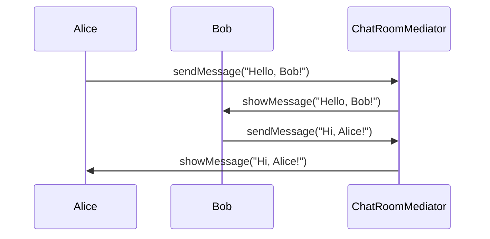

## 6.5.2 Simplifying Object Communication

In the realm of software engineering, managing communication between objects is a critical aspect of designing maintainable and scalable systems. The Mediator Pattern offers a robust solution by centralizing communication logic, thereby reducing dependencies between objects. This section delves into how the Mediator Pattern simplifies object communication, enhances code readability, and improves maintainability in TypeScript applications.

### Understanding the Mediator Pattern

The Mediator Pattern is a behavioral design pattern that encapsulates how a set of objects interact. Instead of objects communicating directly with each other, they communicate through a mediator. This pattern promotes loose coupling by ensuring that objects (often referred to as "colleagues") are not directly dependent on each other, but rather on a central mediator.

#### Key Concepts

- **Colleagues**: These are the objects that need to communicate with each other.
- **Mediator**: An object that encapsulates the communication logic between colleagues.

### Benefits of the Mediator Pattern

1. **Reduced Dependencies**: By centralizing communication, the Mediator Pattern reduces the number of references each object holds. This prevents a complex web of interconnections, making the system easier to manage.

2. **Simplified Maintenance**: With communication logic centralized, adding, removing, or modifying colleagues becomes straightforward. Changes are made in the mediator, minimizing the impact on the rest of the system.

3. **Enhanced Readability**: The pattern improves code readability by clearly defining communication paths and responsibilities.

4. **Improved Scalability**: As the system grows, the mediator can be extended or divided into hierarchical mediators to manage complexity.

### Implementing the Mediator Pattern in TypeScript

Let's explore how to implement the Mediator Pattern in TypeScript with a practical example. Consider a chat application where users (colleagues) send messages to each other through a chat room (mediator).

#### Step 1: Define the Mediator Interface

First, we define an interface for the mediator. This interface will declare methods for sending messages and registering users.

```typescript
interface ChatRoomMediator {
  showMessage(user: User, message: string): void;
  addUser(user: User): void;
}
```

#### Step 2: Implement the Concrete Mediator

Next, we implement the concrete mediator class that encapsulates the communication logic.

```typescript
class ChatRoom implements ChatRoomMediator {
  private users: User[] = [];

  addUser(user: User): void {
    this.users.push(user);
  }

  showMessage(user: User, message: string): void {
    const time = new Date().toLocaleTimeString();
    console.log(`[${time}] ${user.getName()}: ${message}`);
  }
}
```

#### Step 3: Define the Colleague Class

Now, let's define the `User` class, which represents a colleague in our system. Each user will communicate through the `ChatRoom` mediator.

```typescript
class User {
  private name: string;
  private chatRoom: ChatRoomMediator;

  constructor(name: string, chatRoom: ChatRoomMediator) {
    this.name = name;
    this.chatRoom = chatRoom;
  }

  getName(): string {
    return this.name;
  }

  sendMessage(message: string): void {
    this.chatRoom.showMessage(this, message);
  }
}
```

#### Step 4: Demonstrate Communication

Finally, let's demonstrate how users communicate through the chat room.

```typescript
const chatRoom = new ChatRoom();

const user1 = new User("Alice", chatRoom);
const user2 = new User("Bob", chatRoom);

chatRoom.addUser(user1);
chatRoom.addUser(user2);

user1.sendMessage("Hello, Bob!");
user2.sendMessage("Hi, Alice!");
```

### Visualizing the Mediator Pattern

To better understand the flow of communication in the Mediator Pattern, let's visualize it using a sequence diagram.



**Diagram Description**: This sequence diagram illustrates how users Alice and Bob communicate through the `ChatRoomMediator`. Each message is sent to the mediator, which then relays it to the appropriate user.

### Simplifying Object Communication

By using the Mediator Pattern, we have effectively reduced the direct dependencies between users. Each user only knows about the mediator, not other users. This simplification has several advantages:

- **Adding Users**: To add a new user, simply create a new instance of the `User` class and register it with the `ChatRoom`. No changes are needed in existing user classes.
- **Removing Users**: Removing a user is as simple as unregistering it from the `ChatRoom`.
- **Modifying Communication Logic**: Changes to how messages are relayed or logged are made in the `ChatRoom` class, without affecting user classes.

### Strategies for Managing Complexity

As the number of colleagues increases, the mediator itself can become complex. Here are some strategies to manage this complexity:

1. **Divide Responsibilities**: Split the mediator into multiple smaller mediators, each handling a specific aspect of communication.

2. **Hierarchical Mediators**: Use a hierarchy of mediators to manage different levels of communication. For example, a top-level mediator could handle global communication, while lower-level mediators handle specific groups.

3. **Delegate Tasks**: Delegate specific tasks to helper classes or functions to keep the mediator focused on its primary role.

### Try It Yourself

To deepen your understanding, try modifying the code examples:

- **Add a New User**: Create a new user and send messages to existing users.
- **Change Message Format**: Modify the `showMessage` method to include additional information, such as the user's status.
- **Implement Private Messaging**: Extend the mediator to support private messages between users.

### Further Reading

For more information on the Mediator Pattern and its applications, consider exploring these resources:

- [Mediator Pattern on Wikipedia](https://en.wikipedia.org/wiki/Mediator_pattern)
- [Design Patterns: Elements of Reusable Object-Oriented Software](https://en.wikipedia.org/wiki/Design_Patterns) by Erich Gamma et al.

### Knowledge Check

To reinforce your understanding, consider these questions:

- How does the Mediator Pattern reduce dependencies between objects?
- What are the benefits of using a mediator in a communication system?
- How can you manage complexity in a large mediator?

### Embrace the Journey

Remember, mastering design patterns is a journey. As you continue to explore and implement these patterns, you'll gain deeper insights into building robust and maintainable systems. Keep experimenting, stay curious, and enjoy the journey!

## Quiz Time!



### How does the Mediator Pattern reduce dependencies between objects?

- [x] By centralizing communication through a mediator
- [ ] By allowing objects to communicate directly with each other
- [ ] By increasing the number of references each object holds
- [ ] By making all objects independent of each other

> **Explanation:** The Mediator Pattern centralizes communication, reducing direct dependencies between objects.

### What is a key benefit of using the Mediator Pattern?

- [x] Simplified maintenance and scalability
- [ ] Increased complexity in communication
- [ ] Direct communication between objects
- [ ] Reduced need for a central communication point

> **Explanation:** The Mediator Pattern simplifies maintenance and scalability by centralizing communication logic.

### In the Mediator Pattern, what role does the mediator play?

- [x] It encapsulates communication logic between colleagues
- [ ] It acts as a colleague in the communication process
- [ ] It increases dependencies between objects
- [ ] It directly communicates with external systems

> **Explanation:** The mediator encapsulates communication logic, allowing colleagues to communicate indirectly.

### How can you manage complexity in a large mediator?

- [x] By dividing responsibilities and using hierarchical mediators
- [ ] By increasing the number of colleagues
- [ ] By allowing direct communication between objects
- [ ] By removing the mediator entirely

> **Explanation:** Dividing responsibilities and using hierarchical mediators helps manage complexity.

### What is a potential downside of the Mediator Pattern?

- [x] The mediator can become a complex central point
- [ ] It increases direct dependencies between objects
- [ ] It simplifies communication too much
- [ ] It eliminates the need for communication

> **Explanation:** The mediator can become complex if not managed properly, as it centralizes communication.

### How does the Mediator Pattern improve code readability?

- [x] By clearly defining communication paths and responsibilities
- [ ] By hiding communication logic
- [ ] By increasing the number of communication lines
- [ ] By making all objects independent

> **Explanation:** The Mediator Pattern improves readability by defining clear communication paths.

### What is a strategy for keeping the mediator manageable?

- [x] Using helper classes or functions
- [ ] Increasing the number of colleagues
- [ ] Allowing direct communication between objects
- [ ] Removing all communication logic

> **Explanation:** Using helper classes or functions helps keep the mediator focused and manageable.

### How does the Mediator Pattern enhance scalability?

- [x] By allowing easy addition or removal of colleagues
- [ ] By increasing the number of dependencies
- [ ] By making all objects communicate directly
- [ ] By removing the need for communication

> **Explanation:** The Mediator Pattern enhances scalability by simplifying the addition or removal of colleagues.

### What is a common use case for the Mediator Pattern?

- [x] Chat applications
- [ ] Direct communication between sensors
- [ ] Independent object operations
- [ ] Eliminating communication in systems

> **Explanation:** Chat applications often use the Mediator Pattern to manage communication between users.

### True or False: The Mediator Pattern eliminates the need for communication between objects.

- [ ] True
- [x] False

> **Explanation:** The Mediator Pattern centralizes communication but does not eliminate it.


