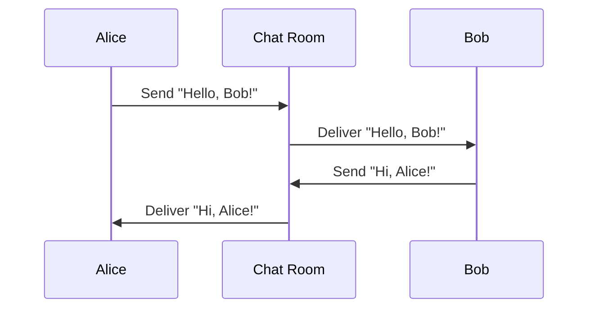

## 6.5.3 Use Cases and Examples

The Mediator Pattern is a powerful design pattern that facilitates communication between objects in a system by introducing a mediator object. This pattern is particularly useful in scenarios where multiple objects interact in complex ways, as it centralizes communication logic and reduces direct dependencies between objects. In this section, we will explore several practical use cases of the Mediator Pattern, including chat systems, GUI applications, and air traffic control systems. We will also discuss the benefits and potential drawbacks of using this pattern.

### Implementing a Chat Room with the Mediator Pattern

One of the classic examples of the Mediator Pattern is a chat room application. In this scenario, the chat room acts as the mediator, handling message distribution among users. Each user communicates with the chat room, which in turn relays messages to other users. This approach simplifies the communication logic by centralizing it within the chat room.

#### Chat Room Example in TypeScript

Let's implement a simple chat room using the Mediator Pattern in TypeScript. We'll define a `ChatRoom` class that serves as the mediator, and a `User` class that represents participants in the chat.

```typescript
// Define the User class
class User {
  private name: string;
  private chatRoom: ChatRoom;

  constructor(name: string, chatRoom: ChatRoom) {
    this.name = name;
    this.chatRoom = chatRoom;
  }

  public send(message: string, to?: User): void {
    this.chatRoom.showMessage(this, message, to);
  }

  public receive(message: string, from: User): void {
    console.log(`${from.getName()} to ${this.name}: ${message}`);
  }

  public getName(): string {
    return this.name;
  }
}

// Define the ChatRoom class
class ChatRoom {
  public showMessage(sender: User, message: string, receiver?: User): void {
    if (receiver) {
      receiver.receive(message, sender);
    } else {
      console.log(`[ChatRoom] ${sender.getName()}: ${message}`);
    }
  }
}

// Usage
const chatRoom = new ChatRoom();
const user1 = new User('Alice', chatRoom);
const user2 = new User('Bob', chatRoom);

user1.send('Hello, Bob!', user2);
user2.send('Hi, Alice!');
```

In this example, the `ChatRoom` class acts as the mediator, managing the communication between `User` instances. Each user sends messages through the chat room, which handles the delivery to the intended recipient or broadcasts it to all users.

### Coordinating Components in a GUI Application

Another common use case for the Mediator Pattern is in graphical user interface (GUI) applications, where it can be used to coordinate interactions between components such as dialog boxes and controls. By using a mediator, you can decouple the components, allowing them to interact without direct references to each other.

#### GUI Application Example in TypeScript

Consider a simple GUI application with a dialog box containing a text field and a button. The mediator will handle the interaction between these components.

```typescript
// Define the Mediator interface
interface DialogMediator {
  notify(sender: Component, event: string): void;
}

// Define the Component class
abstract class Component {
  protected mediator: DialogMediator;

  constructor(mediator: DialogMediator) {
    this.mediator = mediator;
  }

  public setMediator(mediator: DialogMediator): void {
    this.mediator = mediator;
  }
}

// Define the TextField class
class TextField extends Component {
  private text: string = '';

  public setText(text: string): void {
    this.text = text;
    this.mediator.notify(this, 'textChanged');
  }

  public getText(): string {
    return this.text;
  }
}

// Define the Button class
class Button extends Component {
  public click(): void {
    this.mediator.notify(this, 'click');
  }
}

// Define the ConcreteMediator class
class Dialog implements DialogMediator {
  private textField: TextField;
  private button: Button;

  constructor() {
    this.textField = new TextField(this);
    this.button = new Button(this);
  }

  public notify(sender: Component, event: string): void {
    if (sender instanceof TextField && event === 'textChanged') {
      console.log(`Text field changed: ${this.textField.getText()}`);
    } else if (sender instanceof Button && event === 'click') {
      console.log('Button clicked');
    }
  }

  public getTextField(): TextField {
    return this.textField;
  }

  public getButton(): Button {
    return this.button;
  }
}

// Usage
const dialog = new Dialog();
dialog.getTextField().setText('Hello, World!');
dialog.getButton().click();
```

In this example, the `Dialog` class acts as the mediator, coordinating the interactions between the `TextField` and `Button` components. When the text changes or the button is clicked, the mediator is notified and can respond accordingly.

### Managing Interactions in an Air Traffic Control System

The Mediator Pattern is also applicable in more complex systems, such as air traffic control, where it can manage interactions between aircraft. In this context, the mediator ensures that aircraft communicate efficiently and safely, preventing conflicts and coordinating takeoffs and landings.

#### Air Traffic Control Example in TypeScript

Let's implement a simplified air traffic control system using the Mediator Pattern. We'll define an `AirTrafficControl` class as the mediator and an `Aircraft` class to represent individual planes.

```typescript
// Define the Aircraft class
class Aircraft {
  private id: string;
  private atc: AirTrafficControl;

  constructor(id: string, atc: AirTrafficControl) {
    this.id = id;
    this.atc = atc;
  }

  public requestLanding(): void {
    console.log(`${this.id} requesting landing.`);
    this.atc.requestLanding(this);
  }

  public land(): void {
    console.log(`${this.id} landing.`);
  }

  public getId(): string {
    return this.id;
  }
}

// Define the AirTrafficControl class
class AirTrafficControl {
  private queue: Aircraft[] = [];

  public requestLanding(aircraft: Aircraft): void {
    if (this.queue.length === 0) {
      aircraft.land();
    } else {
      console.log(`${aircraft.getId()} added to landing queue.`);
      this.queue.push(aircraft);
    }
  }

  public notifyLandingComplete(): void {
    if (this.queue.length > 0) {
      const nextAircraft = this.queue.shift();
      nextAircraft?.land();
    }
  }
}

// Usage
const atc = new AirTrafficControl();
const aircraft1 = new Aircraft('Flight 101', atc);
const aircraft2 = new Aircraft('Flight 202', atc);

aircraft1.requestLanding();
aircraft2.requestLanding();
atc.notifyLandingComplete();
```

In this example, the `AirTrafficControl` class serves as the mediator, managing landing requests from `Aircraft` instances. The mediator handles the queuing and landing process, ensuring that only one aircraft lands at a time.

### Benefits and Drawbacks of the Mediator Pattern

The Mediator Pattern offers several benefits, including:

- **Simplified Communication**: By centralizing communication logic, the Mediator Pattern reduces the complexity of interactions between objects.
- **Decoupling**: Objects are decoupled from each other, making the system more modular and easier to maintain.
- **Flexibility**: Changes to the interaction logic can be made in the mediator without affecting the objects involved.

However, there are potential drawbacks to consider:

- **Mediator Complexity**: As the mediator takes on more responsibilities, it can become complex and difficult to manage.
- **Potential Bottleneck**: The mediator can become a bottleneck if it handles too many interactions, impacting system performance.
- **God Object Risk**: If not carefully managed, the mediator can evolve into a God Object, centralizing too much control and responsibility.

### When to Use the Mediator Pattern

Consider using the Mediator Pattern when:

- You need to manage complex interactions among multiple objects.
- You want to decouple objects to improve modularity and maintainability.
- You aim to centralize communication logic for easier management and modification.

### Visualizing the Mediator Pattern

To better understand the Mediator Pattern, let's visualize the communication flow in a chat room application.



This sequence diagram illustrates how the chat room mediates communication between users, ensuring messages are delivered to the intended recipients.

### Try It Yourself

Experiment with the provided examples by making the following modifications:

- **Chat Room**: Add a feature to broadcast messages to all users, not just a specific recipient.
- **GUI Application**: Introduce additional components, such as a checkbox, and update the mediator to handle interactions with these new components.
- **Air Traffic Control**: Implement a feature to prioritize certain aircraft in the landing queue based on their fuel levels or emergency status.

### Conclusion

The Mediator Pattern is a versatile design pattern that simplifies communication in complex systems by centralizing interaction logic. It is particularly useful in scenarios such as chat systems, GUI applications, and air traffic control systems. While it offers significant benefits, it is important to manage the complexity of the mediator to avoid potential drawbacks. By understanding and applying the Mediator Pattern, you can design more modular and maintainable systems.

## Quiz Time!



### What is the primary role of the mediator in the Mediator Pattern?

- [x] To centralize communication logic between objects
- [ ] To act as a data storage for objects
- [ ] To replace all direct interactions between objects
- [ ] To handle object creation and destruction

> **Explanation:** The mediator centralizes communication logic, reducing direct dependencies between objects.

### In a chat room application using the Mediator Pattern, what role does the chat room play?

- [x] It acts as the mediator, handling message distribution
- [ ] It stores all messages sent by users
- [ ] It directly communicates with each user
- [ ] It manages user authentication

> **Explanation:** The chat room acts as the mediator, managing message distribution among users.

### What is a potential drawback of using the Mediator Pattern?

- [x] The mediator can become a bottleneck
- [ ] Objects become tightly coupled
- [ ] It increases the number of classes in a system
- [ ] It makes communication more complex

> **Explanation:** The mediator can become a bottleneck if it handles too many interactions, impacting performance.

### How does the Mediator Pattern improve system modularity?

- [x] By decoupling objects from each other
- [ ] By increasing the number of dependencies
- [ ] By centralizing data storage
- [ ] By reducing the number of classes

> **Explanation:** The Mediator Pattern decouples objects, making the system more modular and easier to maintain.

### Which of the following is a common use case for the Mediator Pattern?

- [x] Coordinating components in a GUI application
- [ ] Managing database connections
- [ ] Handling file I/O operations
- [ ] Implementing data encryption

> **Explanation:** The Mediator Pattern is commonly used to coordinate components in GUI applications.

### What is a risk of the mediator becoming a God Object?

- [x] It centralizes too much control and responsibility
- [ ] It reduces system performance
- [ ] It increases system security
- [ ] It simplifies communication logic

> **Explanation:** A God Object centralizes too much control, making the system difficult to manage and maintain.

### How can the Mediator Pattern simplify communication in an air traffic control system?

- [x] By managing interactions between aircraft
- [ ] By storing flight data
- [ ] By controlling aircraft speed
- [ ] By handling weather data

> **Explanation:** The mediator manages interactions between aircraft, ensuring efficient and safe communication.

### What is a benefit of using the Mediator Pattern in a GUI application?

- [x] It decouples components, improving modularity
- [ ] It increases the number of dependencies
- [ ] It simplifies data storage
- [ ] It reduces the number of user interface elements

> **Explanation:** The Mediator Pattern decouples components, making the GUI application more modular and maintainable.

### What should you consider when deciding to use the Mediator Pattern?

- [x] The complexity of interactions among objects
- [ ] The number of objects in the system
- [ ] The amount of data being processed
- [ ] The speed of data transmission

> **Explanation:** Consider the complexity of interactions among objects when deciding to use the Mediator Pattern.

### True or False: The Mediator Pattern always improves system performance.

- [ ] True
- [x] False

> **Explanation:** While the Mediator Pattern simplifies communication, it can become a bottleneck if not managed properly, potentially impacting performance.


