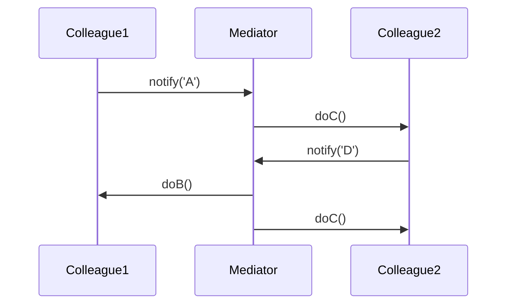

## 6.5 Mediator Pattern

In the world of software engineering, managing complex interactions between objects can become a daunting task. The **Mediator Pattern** provides a structured solution to this problem by defining an object that encapsulates how a set of objects interact. This pattern promotes loose coupling by ensuring that objects do not refer to each other explicitly, thus simplifying the overall system architecture.

### Understanding the Mediator Pattern

The Mediator Pattern is a behavioral design pattern that centralizes complex communications and control logic between related objects. Instead of having objects communicate directly with each other, they communicate through a mediator. This approach reduces the dependencies between communicating objects, making the system more manageable and adaptable to change.

#### Intent of the Mediator Pattern

The primary intent of the Mediator Pattern is to:

- **Reduce Complexity**: By centralizing communication, the pattern reduces the number of connections between objects, leading to a more maintainable codebase.
- **Promote Loose Coupling**: Objects interact through the mediator, which means they are not tightly bound to each other.
- **Facilitate Reusability**: Mediators can be reused across different contexts, allowing for flexible and scalable system design.

### Problems Solved by the Mediator Pattern

In complex systems, objects often need to communicate with each other to perform their tasks. Direct communication between objects can lead to a tightly coupled system, where changes in one object can have a ripple effect on others. This tight coupling makes the system difficult to maintain and extend.

The Mediator Pattern addresses these issues by:

- **Decoupling Object Interactions**: Objects communicate through a mediator, reducing direct dependencies.
- **Simplifying Communication Logic**: The mediator handles the communication logic, making it easier to manage and modify.
- **Enhancing Scalability**: By reducing dependencies, the system can be scaled more easily without affecting existing components.

### Key Components of the Mediator Pattern

The Mediator Pattern consists of three main components:

1. **Mediator**: An interface that defines the communication methods among colleagues.
2. **ConcreteMediator**: Implements the Mediator interface and coordinates communication between colleague objects.
3. **Colleague**: Classes that interact with each other through the Mediator.

#### Mediator Interface

The Mediator interface defines the methods for communication between colleague objects. It acts as a contract that ConcreteMediators must fulfill.

```typescript
// Mediator Interface
interface Mediator {
    notify(sender: Colleague, event: string): void;
}
```

#### ConcreteMediator

The ConcreteMediator implements the Mediator interface and coordinates communication between colleague objects. It contains logic to handle different events and interactions.

```typescript
// ConcreteMediator Class
class ConcreteMediator implements Mediator {
    private colleague1: Colleague1;
    private colleague2: Colleague2;

    constructor(c1: Colleague1, c2: Colleague2) {
        this.colleague1 = c1;
        this.colleague2 = c2;
        this.colleague1.setMediator(this);
        this.colleague2.setMediator(this);
    }

    notify(sender: Colleague, event: string): void {
        if (event === 'A') {
            console.log('Mediator reacts on A and triggers following operations:');
            this.colleague2.doC();
        }
        if (event === 'D') {
            console.log('Mediator reacts on D and triggers following operations:');
            this.colleague1.doB();
            this.colleague2.doC();
        }
    }
}
```

#### Colleague Classes

Colleague classes interact with each other through the Mediator. They hold a reference to the Mediator and use it to communicate with other colleagues.

```typescript
// Colleague Class
abstract class Colleague {
    protected mediator: Mediator;

    setMediator(mediator: Mediator): void {
        this.mediator = mediator;
    }
}

// Concrete Colleague 1
class Colleague1 extends Colleague {
    doA(): void {
        console.log('Colleague1 does A.');
        this.mediator.notify(this, 'A');
    }

    doB(): void {
        console.log('Colleague1 does B.');
    }
}

// Concrete Colleague 2
class Colleague2 extends Colleague {
    doC(): void {
        console.log('Colleague2 does C.');
    }

    doD(): void {
        console.log('Colleague2 does D.');
        this.mediator.notify(this, 'D');
    }
}
```

### How the Mediator Pattern Works

To understand how the Mediator Pattern facilitates communication, let's consider a scenario where we have two colleague objects, `Colleague1` and `Colleague2`. These objects need to interact based on certain events.

The `ConcreteMediator` coordinates these interactions. When `Colleague1` performs action `A`, it notifies the mediator, which then triggers `Colleague2` to perform action `C`. Similarly, when `Colleague2` performs action `D`, it notifies the mediator, which triggers `Colleague1` to perform action `B` and `Colleague2` to perform action `C`.

### Visualizing the Mediator Pattern

To better understand the interactions facilitated by the Mediator Pattern, let's visualize the communication flow using a sequence diagram.



**Diagram Explanation**: This sequence diagram illustrates how `Colleague1` and `Colleague2` interact through the `Mediator`. `Colleague1` notifies the `Mediator` of event `A`, which triggers `Colleague2` to perform action `C`. Similarly, `Colleague2` notifies the `Mediator` of event `D`, prompting `Colleague1` to perform action `B` and `Colleague2` to perform action `C`.

### Promoting Loose Coupling

The Mediator Pattern promotes loose coupling by ensuring that colleague objects do not directly reference each other. Instead, they communicate through the mediator, which reduces dependencies and simplifies the system architecture.

#### Benefits of Loose Coupling

- **Easier Maintenance**: Changes in one colleague do not directly affect others, making the system easier to maintain.
- **Enhanced Flexibility**: New colleague objects can be added without modifying existing ones.
- **Improved Scalability**: The system can handle increased complexity without becoming unwieldy.

### Implementing the Mediator Pattern in TypeScript

Let's implement a practical example of the Mediator Pattern in TypeScript to see how it can be applied in a real-world scenario.

#### Example: Chat Room

Consider a chat room where users can send messages to each other. Instead of each user directly sending messages to others, they communicate through a mediator (the chat room).

```typescript
// Mediator Interface
interface ChatRoomMediator {
    showMessage(user: User, message: string): void;
}

// ConcreteMediator Class
class ChatRoom implements ChatRoomMediator {
    showMessage(user: User, message: string): void {
        const time = new Date().toLocaleTimeString();
        const sender = user.getName();
        console.log(`${time} [${sender}]: ${message}`);
    }
}

// Colleague Class
class User {
    private name: string;
    private chatMediator: ChatRoomMediator;

    constructor(name: string, chatMediator: ChatRoomMediator) {
        this.name = name;
        this.chatMediator = chatMediator;
    }

    getName(): string {
        return this.name;
    }

    send(message: string): void {
        this.chatMediator.showMessage(this, message);
    }
}

// Usage
const mediator = new ChatRoom();

const user1 = new User('Alice', mediator);
const user2 = new User('Bob', mediator);

user1.send('Hello, Bob!');
user2.send('Hi, Alice!');
```

**Code Explanation**: In this example, the `ChatRoom` acts as the mediator, coordinating message exchanges between `User` objects. Each `User` sends messages through the `ChatRoom`, which displays them with a timestamp and sender information.

### Try It Yourself

To deepen your understanding of the Mediator Pattern, try modifying the code example above:

- **Add More Users**: Introduce additional users and observe how the mediator handles their interactions.
- **Implement Private Messages**: Modify the `ChatRoom` to support private messaging between specific users.
- **Log Message History**: Enhance the `ChatRoom` to keep a log of all messages exchanged.

### References and Further Reading

For more information on the Mediator Pattern and its applications, consider exploring the following resources:

- [Mediator Pattern on Refactoring.Guru](https://refactoring.guru/design-patterns/mediator)
- [TypeScript Design Patterns on GitHub](https://github.com/torokmark/design_patterns_in_typescript)

### Knowledge Check

Before moving on, let's reinforce what we've learned:

- **What is the primary intent of the Mediator Pattern?**
- **How does the Mediator Pattern promote loose coupling?**
- **What are the key components of the Mediator Pattern?**

### Embrace the Journey

Remember, mastering design patterns is a journey. As you continue to explore and apply these patterns, you'll gain a deeper understanding of how to build robust and maintainable software systems. Keep experimenting, stay curious, and enjoy the journey!

## Quiz Time!



### What is the primary intent of the Mediator Pattern?

- [x] To reduce complexity by centralizing communication between objects
- [ ] To increase the number of connections between objects
- [ ] To tightly couple objects in a system
- [ ] To eliminate the need for communication between objects

> **Explanation:** The Mediator Pattern aims to reduce complexity by centralizing communication between objects, promoting loose coupling.

### How does the Mediator Pattern promote loose coupling?

- [x] By ensuring objects do not directly reference each other
- [ ] By increasing dependencies between objects
- [ ] By eliminating communication between objects
- [ ] By tightly coupling objects

> **Explanation:** The pattern ensures objects communicate through a mediator, reducing direct dependencies and promoting loose coupling.

### Which component of the Mediator Pattern defines communication methods among colleagues?

- [x] Mediator
- [ ] ConcreteMediator
- [ ] Colleague
- [ ] User

> **Explanation:** The Mediator interface defines communication methods among colleague objects.

### What role does the ConcreteMediator play in the Mediator Pattern?

- [x] It implements the Mediator interface and coordinates communication
- [ ] It acts as a colleague object
- [ ] It eliminates the need for communication
- [ ] It increases dependencies between objects

> **Explanation:** The ConcreteMediator implements the Mediator interface and coordinates communication between colleague objects.

### In the provided chat room example, what role does the ChatRoom play?

- [x] ConcreteMediator
- [ ] Mediator
- [ ] Colleague
- [ ] User

> **Explanation:** The ChatRoom acts as the ConcreteMediator, coordinating message exchanges between User objects.

### How can the Mediator Pattern enhance scalability?

- [x] By reducing dependencies, allowing for easier scaling
- [ ] By increasing the number of connections between objects
- [ ] By tightly coupling objects
- [ ] By eliminating the need for communication

> **Explanation:** By reducing dependencies, the system can handle increased complexity and scale more easily.

### What is a potential modification to the chat room example to enhance functionality?

- [x] Implementing private messages between users
- [ ] Eliminating the ChatRoom mediator
- [ ] Increasing direct communication between users
- [ ] Tightly coupling User objects

> **Explanation:** Implementing private messages can enhance the chat room's functionality by allowing specific user interactions.

### Which of the following is NOT a benefit of the Mediator Pattern?

- [ ] Easier maintenance
- [ ] Enhanced flexibility
- [ ] Improved scalability
- [x] Increased direct dependencies

> **Explanation:** The Mediator Pattern reduces direct dependencies, which is a benefit, not a drawback.

### What is a key advantage of using the Mediator Pattern in complex systems?

- [x] Simplifying communication logic
- [ ] Increasing the number of connections
- [ ] Tightly coupling objects
- [ ] Eliminating communication

> **Explanation:** The Mediator Pattern simplifies communication logic by centralizing it in the mediator.

### True or False: The Mediator Pattern eliminates the need for communication between objects.

- [ ] True
- [x] False

> **Explanation:** The Mediator Pattern does not eliminate communication; it centralizes it to reduce complexity and promote loose coupling.


