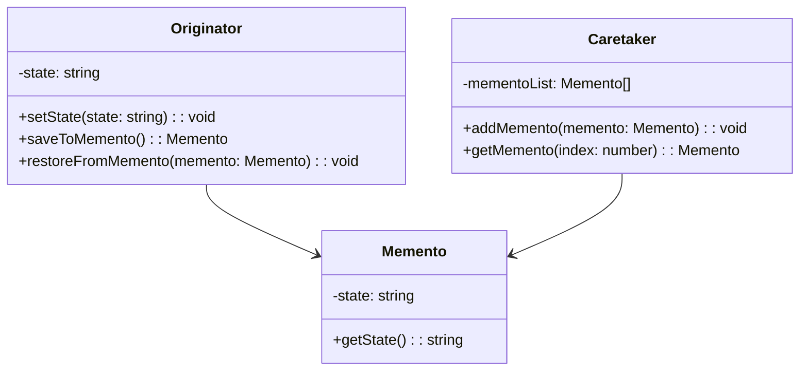

## 6.6.1 Implementing Memento in TypeScript

In this section, we will delve into the Memento Pattern, a behavioral design pattern that allows you to capture and restore an object's state without violating encapsulation. This pattern is particularly useful for implementing features like undo/redo operations. We will explore how to implement the Memento Pattern in TypeScript, leveraging its powerful type system and access modifiers to maintain encapsulation and manage state effectively.

### Understanding the Memento Pattern

The Memento Pattern consists of three primary components:

1. **Originator**: The object whose state we want to save and restore.
2. **Memento**: A snapshot of the Originator's state.
3. **Caretaker**: Manages the history of Mementos and interacts with the Originator to save and restore states.

Let's break down each component and see how they interact with each other.

### Step-by-Step Implementation

#### Step 1: Defining the Memento Class

The `Memento` class is responsible for holding the state of the `Originator`. It is a simple class that stores the state and provides access to it.

```typescript
// Memento.ts
class Memento {
    private state: string;

    constructor(state: string) {
        this.state = state;
    }

    public getState(): string {
        return this.state;
    }
}
```

In this example, the `Memento` class encapsulates the state of the `Originator`. The state is stored as a private member, ensuring that it cannot be modified directly from outside the class.

#### Step 2: Implementing the Originator Class

The `Originator` class is the primary object whose state we want to save and restore. It includes methods to create a memento (snapshot) and restore its state from a memento.

```typescript
// Originator.ts
class Originator {
    private state: string;

    public setState(state: string): void {
        console.log(`Originator: Setting state to ${state}`);
        this.state = state;
    }

    public saveToMemento(): Memento {
        console.log(`Originator: Saving to Memento.`);
        return new Memento(this.state);
    }

    public restoreFromMemento(memento: Memento): void {
        this.state = memento.getState();
        console.log(`Originator: State after restoring from Memento: ${this.state}`);
    }
}
```

The `Originator` class has methods to set its state, save the current state to a `Memento`, and restore its state from a `Memento`. Notice how the `saveToMemento` and `restoreFromMemento` methods interact with the `Memento` class.

#### Step 3: Creating the Caretaker Class

The `Caretaker` class is responsible for managing the history of mementos. It requests mementos from the `Originator` and maintains a history stack to facilitate undo/redo operations.

```typescript
// Caretaker.ts
class Caretaker {
    private mementoList: Memento[] = [];

    public addMemento(memento: Memento): void {
        this.mementoList.push(memento);
    }

    public getMemento(index: number): Memento {
        return this.mementoList[index];
    }
}
```

The `Caretaker` class maintains a list of `Memento` objects. It provides methods to add a new memento to the list and retrieve a memento by index.

### Demonstrating the Memento Pattern

Let's put everything together and demonstrate how the Memento Pattern works in practice.

```typescript
// Main.ts
function main() {
    const originator = new Originator();
    const caretaker = new Caretaker();

    originator.setState("State1");
    caretaker.addMemento(originator.saveToMemento());

    originator.setState("State2");
    caretaker.addMemento(originator.saveToMemento());

    originator.setState("State3");
    console.log("Current State: " + originator.saveToMemento().getState());

    originator.restoreFromMemento(caretaker.getMemento(1));
    console.log("Restored to State: " + originator.saveToMemento().getState());

    originator.restoreFromMemento(caretaker.getMemento(0));
    console.log("Restored to State: " + originator.saveToMemento().getState());
}

main();
```

In this example, we create an `Originator` and a `Caretaker`. We change the state of the `Originator` several times, saving each state to a `Memento` and storing it in the `Caretaker`. We then demonstrate restoring the `Originator` to previous states using the `Caretaker`.

### Managing History and Undo/Redo Operations

The Memento Pattern is often used to implement undo/redo functionality. By maintaining a history stack of mementos, you can easily revert to previous states or redo changes.

```typescript
// EnhancedCaretaker.ts
class EnhancedCaretaker {
    private mementoList: Memento[] = [];
    private currentIndex: number = -1;

    public addMemento(memento: Memento): void {
        // Remove any redo history
        this.mementoList = this.mementoList.slice(0, this.currentIndex + 1);
        this.mementoList.push(memento);
        this.currentIndex++;
    }

    public undo(): Memento | null {
        if (this.currentIndex <= 0) {
            return null;
        }
        this.currentIndex--;
        return this.mementoList[this.currentIndex];
    }

    public redo(): Memento | null {
        if (this.currentIndex >= this.mementoList.length - 1) {
            return null;
        }
        this.currentIndex++;
        return this.mementoList[this.currentIndex];
    }
}
```

The `EnhancedCaretaker` class extends the basic functionality by adding `undo` and `redo` methods. It maintains a `currentIndex` to track the current position in the history stack.

### Handling Deep Copies of State

In some cases, your object's state may be complex, involving nested objects or collections. In such scenarios, you may need to create deep copies of the state to ensure that the memento accurately captures the state at a specific point in time.

TypeScript does not provide built-in deep copy functionality, but you can use libraries like Lodash or implement a custom deep copy function.

```typescript
import _ from 'lodash';

// Deep copy example using Lodash
class ComplexMemento {
    private state: any;

    constructor(state: any) {
        this.state = _.cloneDeep(state);
    }

    public getState(): any {
        return _.cloneDeep(this.state);
    }
}
```

Using Lodash's `cloneDeep` function, you can create deep copies of complex state objects, ensuring that the memento accurately captures the state.

### Maintaining Encapsulation with TypeScript's Access Modifiers

TypeScript's access modifiers (`private`, `public`, `protected`) play a crucial role in maintaining encapsulation when implementing the Memento Pattern. By marking the state as `private` in the `Originator` and `Memento` classes, you prevent external classes from directly accessing or modifying the state.

This encapsulation ensures that the `Originator` is solely responsible for managing its state, and the `Memento` only provides controlled access to the state.

### Try It Yourself

To deepen your understanding of the Memento Pattern, try modifying the code examples:

1. **Add More States**: Extend the `Originator` to manage more complex states, such as objects with multiple properties.
2. **Implement Redo**: Enhance the `Caretaker` to support redo operations, allowing you to move forward in the history stack.
3. **Use Deep Copies**: Experiment with deep copying techniques to handle complex state objects.

### Visualizing the Memento Pattern

Below is a class diagram illustrating the relationships between the `Originator`, `Memento`, and `Caretaker`.



### Key Takeaways

- The Memento Pattern allows you to save and restore an object's state without violating encapsulation.
- TypeScript's access modifiers help maintain encapsulation by restricting direct access to the state.
- The pattern is useful for implementing undo/redo functionality by maintaining a history of mementos.
- Handling complex states may require deep copying to ensure accurate snapshots.

### References and Further Reading

- [MDN Web Docs: Design Patterns](https://developer.mozilla.org/en-US/docs/Web/JavaScript/Guide/Design_Patterns)
- [TypeScript Handbook](https://www.typescriptlang.org/docs/handbook/intro.html)
- [Lodash Documentation](https://lodash.com/docs/4.17.15)

### Embrace the Journey

Remember, mastering design patterns is a journey. As you continue to explore and implement these patterns, you'll gain a deeper understanding of how to write maintainable and scalable code. Keep experimenting, stay curious, and enjoy the journey!

## Quiz Time!



### What is the primary purpose of the Memento Pattern?

- [x] To capture and restore an object's state without violating encapsulation.
- [ ] To manage object creation and lifecycle.
- [ ] To define a one-to-many dependency between objects.
- [ ] To simplify complex subsystems with a unified interface.

> **Explanation:** The Memento Pattern is used to capture and restore an object's state without violating encapsulation.

### Which component of the Memento Pattern is responsible for managing the history of states?

- [ ] Originator
- [x] Caretaker
- [ ] Memento
- [ ] Observer

> **Explanation:** The Caretaker is responsible for managing the history of states by storing and retrieving mementos.

### How does TypeScript help maintain encapsulation in the Memento Pattern?

- [x] By using access modifiers like `private` to restrict access to state.
- [ ] By providing built-in deep copy functionality.
- [ ] By enforcing strict typing rules.
- [ ] By supporting asynchronous operations.

> **Explanation:** TypeScript's access modifiers like `private` help maintain encapsulation by restricting direct access to the state.

### What method does the Originator use to save its current state?

- [ ] restoreFromMemento
- [x] saveToMemento
- [ ] setState
- [ ] getState

> **Explanation:** The `saveToMemento` method is used by the Originator to save its current state to a Memento.

### What is the role of the Memento class in the Memento Pattern?

- [x] To store the state of the Originator.
- [ ] To manage the history of states.
- [ ] To create new instances of objects.
- [ ] To handle communication between objects.

> **Explanation:** The Memento class is responsible for storing the state of the Originator.

### Which library can be used in TypeScript to perform deep copies of objects?

- [ ] React
- [ ] Angular
- [x] Lodash
- [ ] Express

> **Explanation:** Lodash provides a `cloneDeep` function that can be used to perform deep copies of objects.

### What is a common use case for the Memento Pattern?

- [x] Implementing undo/redo functionality.
- [ ] Managing object creation.
- [ ] Simplifying complex interfaces.
- [ ] Handling asynchronous operations.

> **Explanation:** The Memento Pattern is commonly used to implement undo/redo functionality by maintaining a history of states.

### How does the Caretaker interact with the Originator?

- [ ] By directly modifying its state.
- [x] By requesting and storing mementos.
- [ ] By creating new instances of the Originator.
- [ ] By defining new behaviors.

> **Explanation:** The Caretaker interacts with the Originator by requesting and storing mementos to manage state history.

### What is the benefit of using deep copies in the Memento Pattern?

- [x] Ensures accurate snapshots of complex states.
- [ ] Reduces memory usage.
- [ ] Simplifies the codebase.
- [ ] Enhances performance.

> **Explanation:** Deep copies ensure accurate snapshots of complex states, capturing all nested objects and collections.

### True or False: The Memento Pattern violates the encapsulation principle.

- [ ] True
- [x] False

> **Explanation:** False. The Memento Pattern is designed to capture and restore an object's state without violating encapsulation.


