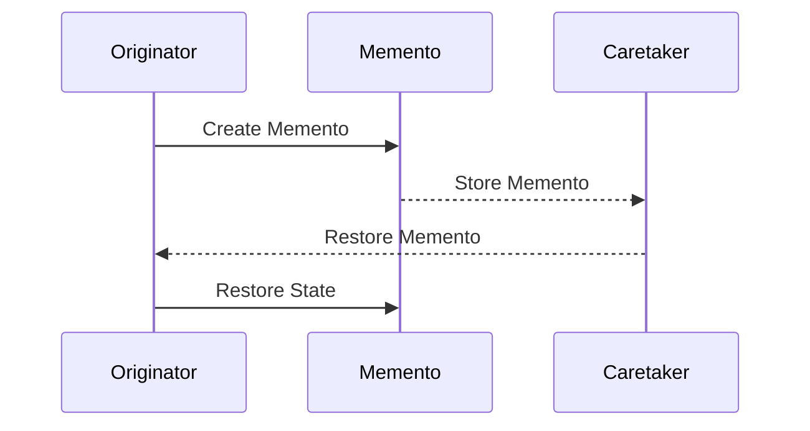

## 6.6.2 State Saving and Restoration with Memento Pattern

In the realm of software design, managing the state of an object is a critical task, especially when it comes to implementing features like undo and redo. The Memento Pattern offers a robust solution for capturing and restoring an object's state without exposing its internal structure. This section delves into the intricacies of the Memento Pattern, exploring how it facilitates state management and undo capabilities in TypeScript applications.

### Understanding the Memento Pattern

The Memento Pattern is a behavioral design pattern that allows you to save and restore the previous state of an object without revealing the details of its implementation. It is particularly useful in scenarios where you need to implement undo/redo functionality, as it enables you to revert an object to a previous state.

#### Key Components of the Memento Pattern

1. **Originator**: The object whose state needs to be saved and restored. It creates a memento containing a snapshot of its current state and can use the memento to restore its state.

2. **Memento**: A representation of the state of the Originator. It is an immutable object that stores the state of the Originator at a particular point in time.

3. **Caretaker**: Manages the mementos. It is responsible for storing and restoring the mementos but does not operate on or examine the contents of the mementos.

### Capturing State Without Exposing Internal Structure

One of the primary advantages of the Memento Pattern is its ability to capture an object's state without exposing its internal structure. This encapsulation is achieved by having the Originator create a Memento object that contains the state information. The Memento is typically a simple object with no methods other than those necessary to store and retrieve the state.

```typescript
// Originator class
class Editor {
  private content: string;

  constructor() {
    this.content = '';
  }

  public type(words: string): void {
    this.content += words;
  }

  public getContent(): string {
    return this.content;
  }

  public save(): EditorMemento {
    return new EditorMemento(this.content);
  }

  public restore(memento: EditorMemento): void {
    this.content = memento.getContent();
  }
}

// Memento class
class EditorMemento {
  private readonly content: string;

  constructor(content: string) {
    this.content = content;
  }

  public getContent(): string {
    return this.content;
  }
}

// Caretaker class
class History {
  private mementos: EditorMemento[] = [];

  public push(memento: EditorMemento): void {
    this.mementos.push(memento);
  }

  public pop(): EditorMemento | undefined {
    return this.mementos.pop();
  }
}
```

In this example, the `Editor` class acts as the Originator, the `EditorMemento` class acts as the Memento, and the `History` class acts as the Caretaker. The `Editor` can save its state to a `EditorMemento` and restore it later.

### Managing Multiple States and History of Mementos

When implementing undo/redo functionality, it's crucial to manage a history of mementos. The Caretaker is responsible for maintaining this history. It stores a stack of mementos, allowing you to push new states and pop old ones as needed.

#### Implementing Undo and Redo Functionality

To implement undo and redo functionality, you need to maintain two stacks: one for undo operations and another for redo operations. When the user performs an action, you save the current state to the undo stack. If the user undoes an action, you pop the state from the undo stack and push it to the redo stack. If the user redoes an action, you pop the state from the redo stack and push it back to the undo stack.

```typescript
class EditorWithUndoRedo {
  private content: string;
  private undoStack: EditorMemento[] = [];
  private redoStack: EditorMemento[] = [];

  constructor() {
    this.content = '';
  }

  public type(words: string): void {
    this.undoStack.push(this.save());
    this.content += words;
    this.redoStack = []; // Clear redo stack on new action
  }

  public getContent(): string {
    return this.content;
  }

  public save(): EditorMemento {
    return new EditorMemento(this.content);
  }

  public restore(memento: EditorMemento): void {
    this.content = memento.getContent();
  }

  public undo(): void {
    if (this.undoStack.length > 0) {
      this.redoStack.push(this.save());
      const memento = this.undoStack.pop();
      if (memento) this.restore(memento);
    }
  }

  public redo(): void {
    if (this.redoStack.length > 0) {
      this.undoStack.push(this.save());
      const memento = this.redoStack.pop();
      if (memento) this.restore(memento);
    }
  }
}
```

In this implementation, the `EditorWithUndoRedo` class maintains two stacks: `undoStack` and `redoStack`. The `type` method saves the current state to the `undoStack` before making changes, and the `undo` and `redo` methods manage the state transitions between the stacks.

### Considerations for Memory Usage

When implementing the Memento Pattern, it's essential to consider the memory usage associated with storing multiple mementos. Each memento represents a snapshot of the object's state, and storing many mementos can consume significant memory.

#### Strategies for Optimizing State Storage

1. **Incremental Changes**: Instead of storing the entire state, store only the changes between states. This approach can significantly reduce memory usage, especially for large objects.

2. **Compression**: Apply compression techniques to reduce the size of the stored state. This can be particularly useful when dealing with large data sets.

3. **Pruning**: Implement a strategy to prune old or unnecessary mementos. For example, you might keep only the last N states or periodically remove older states.

4. **Lazy Loading**: Load mementos only when needed. This approach can help reduce memory usage by keeping only the necessary states in memory.

### Example: Incremental Changes

To implement incremental changes, you can modify the Memento class to store only the differences between states. This approach requires a mechanism to apply these differences when restoring the state.

```typescript
// Incremental Memento class
class IncrementalEditorMemento {
  private readonly changes: string;

  constructor(changes: string) {
    this.changes = changes;
  }

  public getChanges(): string {
    return this.changes;
  }
}

// Modified Editor class
class EditorWithIncrementalChanges {
  private content: string;
  private history: IncrementalEditorMemento[] = [];

  constructor() {
    this.content = '';
  }

  public type(words: string): void {
    const changes = words;
    this.history.push(new IncrementalEditorMemento(changes));
    this.content += changes;
  }

  public getContent(): string {
    return this.content;
  }

  public undo(): void {
    if (this.history.length > 0) {
      const memento = this.history.pop();
      if (memento) {
        const changes = memento.getChanges();
        this.content = this.content.slice(0, -changes.length);
      }
    }
  }
}
```

In this example, the `IncrementalEditorMemento` class stores only the changes made to the content. The `EditorWithIncrementalChanges` class uses these incremental mementos to manage the state efficiently.

### Visualizing the Memento Pattern

To better understand the flow of the Memento Pattern, let's visualize the interactions between the Originator, Memento, and Caretaker using a sequence diagram.



**Diagram Description**: This sequence diagram illustrates the process of creating, storing, and restoring a memento. The Originator creates a Memento, which is stored by the Caretaker. When needed, the Caretaker provides the Memento back to the Originator for state restoration.

### Try It Yourself

To deepen your understanding of the Memento Pattern, try modifying the code examples provided. Here are some suggestions:

- **Add a Redo Stack**: Extend the `EditorWithIncrementalChanges` class to support redo functionality by maintaining a redo stack.
- **Implement Pruning**: Introduce a mechanism to prune old mementos in the `History` class to manage memory usage.
- **Experiment with Compression**: Apply a simple compression algorithm to the memento data to reduce memory usage.

### Knowledge Check

Before we wrap up, let's reinforce the key concepts covered in this section:

- The Memento Pattern enables saving and restoring an object's state without exposing its internal structure.
- The pattern involves three main components: Originator, Memento, and Caretaker.
- Managing multiple states requires maintaining a history of mementos, typically using stacks for undo and redo operations.
- Memory usage can be optimized through strategies like incremental changes, compression, pruning, and lazy loading.

### Embrace the Journey

Remember, mastering design patterns is a journey. The Memento Pattern is just one of many tools in your software design toolkit. As you continue to explore and implement these patterns, you'll develop a deeper understanding of how to create robust, maintainable, and efficient software systems. Keep experimenting, stay curious, and enjoy the journey!

## Quiz Time!



### What is the primary purpose of the Memento Pattern?

- [x] To save and restore an object's state without exposing its internal structure.
- [ ] To manage object creation and lifecycle.
- [ ] To facilitate communication between objects.
- [ ] To decouple an abstraction from its implementation.

> **Explanation:** The Memento Pattern is designed to save and restore an object's state without exposing its internal structure, making it ideal for implementing undo/redo functionality.

### Which component of the Memento Pattern is responsible for storing and restoring mementos?

- [ ] Originator
- [x] Caretaker
- [ ] Memento
- [ ] Observer

> **Explanation:** The Caretaker is responsible for storing and restoring mementos, while the Originator creates and uses them.

### How can memory usage be optimized when storing multiple mementos?

- [x] By storing incremental changes instead of full states.
- [ ] By duplicating mementos.
- [ ] By increasing the size of each memento.
- [ ] By storing mementos in a database.

> **Explanation:** Storing incremental changes instead of full states can significantly reduce memory usage, especially for large objects.

### What is a potential drawback of storing many mementos?

- [ ] Increased processing speed.
- [ ] Improved state management.
- [x] High memory consumption.
- [ ] Simplified code structure.

> **Explanation:** Storing many mementos can lead to high memory consumption, especially if each memento represents a large state.

### Which strategy involves loading mementos only when needed?

- [ ] Incremental Changes
- [ ] Compression
- [ ] Pruning
- [x] Lazy Loading

> **Explanation:** Lazy Loading involves loading mementos only when needed, helping to reduce memory usage by keeping only necessary states in memory.

### What is the role of the Originator in the Memento Pattern?

- [x] To create and restore mementos.
- [ ] To manage the history of mementos.
- [ ] To compress memento data.
- [ ] To prune old mementos.

> **Explanation:** The Originator is responsible for creating mementos to save its state and restoring its state from mementos.

### Which of the following is NOT a component of the Memento Pattern?

- [ ] Originator
- [ ] Memento
- [x] Adapter
- [ ] Caretaker

> **Explanation:** The Adapter is not a component of the Memento Pattern. The pattern consists of the Originator, Memento, and Caretaker.

### What is the benefit of using incremental changes in mementos?

- [x] Reduced memory usage.
- [ ] Increased complexity.
- [ ] Slower state restoration.
- [ ] Larger memento size.

> **Explanation:** Using incremental changes in mementos reduces memory usage by storing only the differences between states.

### True or False: The Memento Pattern exposes the internal structure of the Originator.

- [ ] True
- [x] False

> **Explanation:** False. The Memento Pattern does not expose the internal structure of the Originator, maintaining encapsulation.

### Which of the following is a common use case for the Memento Pattern?

- [x] Implementing undo/redo functionality.
- [ ] Managing network connections.
- [ ] Handling user authentication.
- [ ] Rendering graphics.

> **Explanation:** The Memento Pattern is commonly used for implementing undo/redo functionality by saving and restoring object states.




