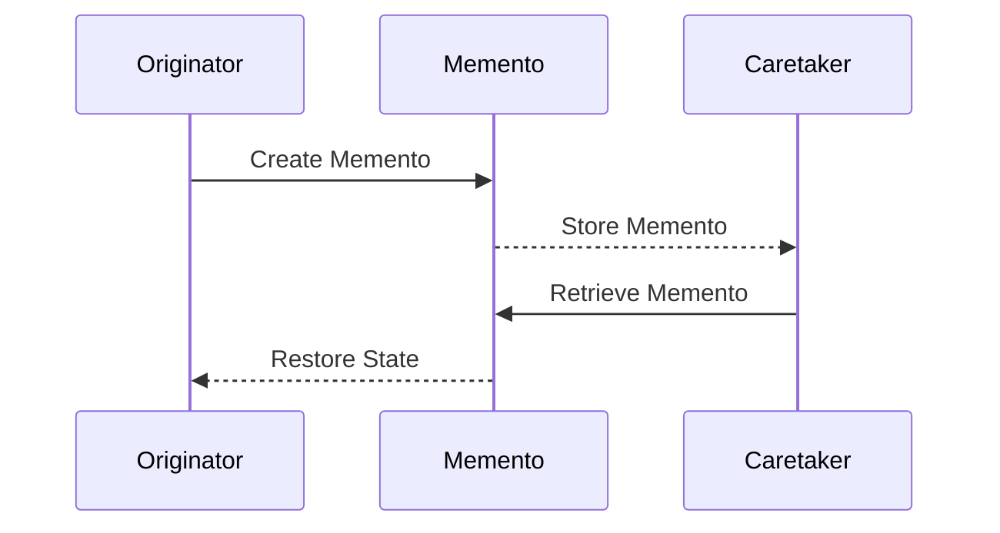

## 6.6.3 Use Cases and Examples

The Memento Pattern is a behavioral design pattern that allows you to capture and externalize an object's internal state so that the object can be restored to this state later without violating encapsulation. This pattern is particularly useful in scenarios where you need to provide undo/redo functionality, manage state transitions, or save checkpoints in applications like games or text editors.

### Understanding the Memento Pattern

Before diving into specific use cases, let's briefly revisit the core components of the Memento Pattern:

1. **Originator**: The object whose state needs to be saved and restored.
2. **Memento**: A representation of the Originator's state at a particular point in time.
3. **Caretaker**: Manages the history of Mementos and is responsible for storing and restoring the Originator's state.

The Memento Pattern is particularly powerful because it allows you to preserve the encapsulation of the Originator. The Memento object is opaque to the Caretaker, which means the Caretaker cannot modify the Originator's state directly.

### Use Case 1: Undo/Redo Functionality in Text Editors

One of the most common applications of the Memento Pattern is implementing undo/redo functionality in text editors or drawing applications. This feature allows users to revert changes and explore different editing paths without losing previous work.

#### Implementation Example

Let's implement a simple text editor in TypeScript that supports undo and redo operations using the Memento Pattern.

```typescript
// The Memento class stores the state of the TextEditor.
class TextEditorMemento {
  constructor(private state: string) {}

  getState(): string {
    return this.state;
  }
}

// The Originator class represents the TextEditor.
class TextEditor {
  private content: string = '';

  write(text: string): void {
    this.content += text;
  }

  save(): TextEditorMemento {
    return new TextEditorMemento(this.content);
  }

  restore(memento: TextEditorMemento): void {
    this.content = memento.getState();
  }

  getContent(): string {
    return this.content;
  }
}

// The Caretaker class manages the history of Mementos.
class Caretaker {
  private mementos: TextEditorMemento[] = [];
  private currentIndex: number = -1;

  addMemento(memento: TextEditorMemento): void {
    this.mementos.splice(this.currentIndex + 1);
    this.mementos.push(memento);
    this.currentIndex++;
  }

  undo(): TextEditorMemento | null {
    if (this.currentIndex <= 0) {
      return null;
    }
    this.currentIndex--;
    return this.mementos[this.currentIndex];
  }

  redo(): TextEditorMemento | null {
    if (this.currentIndex + 1 >= this.mementos.length) {
      return null;
    }
    this.currentIndex++;
    return this.mementos[this.currentIndex];
  }
}

// Usage
const editor = new TextEditor();
const caretaker = new Caretaker();

editor.write('Hello');
caretaker.addMemento(editor.save());

editor.write(' World');
caretaker.addMemento(editor.save());

console.log(editor.getContent()); // Output: Hello World

editor.restore(caretaker.undo());
console.log(editor.getContent()); // Output: Hello

editor.restore(caretaker.redo());
console.log(editor.getContent()); // Output: Hello World
```

In this example, the `TextEditor` class acts as the Originator, the `TextEditorMemento` class represents the Memento, and the `Caretaker` class manages the history of Mementos. This setup allows the text editor to revert to previous states seamlessly.

#### Challenges

- **Memory Usage**: Storing a large number of Mementos can consume significant memory, especially if the state is large. Consider implementing strategies to limit the history size or compress the state.
- **Complex State**: If the state of the Originator is complex, you might need to carefully design the Memento to capture all necessary information without exposing internal details.

### Use Case 2: Saving Checkpoints in Games

In gaming applications, the Memento Pattern can be used to save checkpoints, allowing players to revert to previous states. This is particularly useful in complex games where players might want to retry a level or recover from a mistake.

#### Implementation Example

Let's consider a simple game scenario where a player's position and score are saved as checkpoints.

```typescript
// The Memento class stores the state of the Game.
class GameMemento {
  constructor(private position: string, private score: number) {}

  getPosition(): string {
    return this.position;
  }

  getScore(): number {
    return this.score;
  }
}

// The Originator class represents the Game.
class Game {
  private position: string = 'Start';
  private score: number = 0;

  play(position: string, score: number): void {
    this.position = position;
    this.score = score;
  }

  save(): GameMemento {
    return new GameMemento(this.position, this.score);
  }

  restore(memento: GameMemento): void {
    this.position = memento.getPosition();
    this.score = memento.getScore();
  }

  getStatus(): string {
    return `Position: ${this.position}, Score: ${this.score}`;
  }
}

// The Caretaker class manages the history of Mementos.
class GameCaretaker {
  private mementos: GameMemento[] = [];
  private currentIndex: number = -1;

  addMemento(memento: GameMemento): void {
    this.mementos.splice(this.currentIndex + 1);
    this.mementos.push(memento);
    this.currentIndex++;
  }

  undo(): GameMemento | null {
    if (this.currentIndex <= 0) {
      return null;
    }
    this.currentIndex--;
    return this.mementos[this.currentIndex];
  }

  redo(): GameMemento | null {
    if (this.currentIndex + 1 >= this.mementos.length) {
      return null;
    }
    this.currentIndex++;
    return this.mementos[this.currentIndex];
  }
}

// Usage
const game = new Game();
const gameCaretaker = new GameCaretaker();

game.play('Level 1', 100);
gameCaretaker.addMemento(game.save());

game.play('Level 2', 200);
gameCaretaker.addMemento(game.save());

console.log(game.getStatus()); // Output: Position: Level 2, Score: 200

game.restore(gameCaretaker.undo());
console.log(game.getStatus()); // Output: Position: Level 1, Score: 100

game.restore(gameCaretaker.redo());
console.log(game.getStatus()); // Output: Position: Level 2, Score: 200
```

In this example, the `Game` class acts as the Originator, the `GameMemento` class represents the Memento, and the `GameCaretaker` class manages the history of Mementos. This allows the game to revert to previous checkpoints.

#### Challenges

- **Complex Game State**: Games often have complex states involving multiple objects. Consider using multiple Mementos or a composite Memento to capture the entire game state.
- **Performance**: Frequent state saving and restoring can impact performance. Optimize the Memento creation process to minimize overhead.

### Use Case 3: Managing State Transitions in Workflow Applications

Workflow applications often involve complex state transitions, where the Memento Pattern can be used to manage and revert states as needed. This is particularly useful in applications where users need to backtrack or explore different workflow paths.

#### Implementation Example

Consider a workflow application where tasks can be moved between different states, such as "To Do," "In Progress," and "Completed."

```typescript
// The Memento class stores the state of the Workflow.
class WorkflowMemento {
  constructor(private state: string) {}

  getState(): string {
    return this.state;
  }
}

// The Originator class represents the Workflow.
class Workflow {
  private state: string = 'To Do';

  transitionTo(newState: string): void {
    this.state = newState;
  }

  save(): WorkflowMemento {
    return new WorkflowMemento(this.state);
  }

  restore(memento: WorkflowMemento): void {
    this.state = memento.getState();
  }

  getState(): string {
    return this.state;
  }
}

// The Caretaker class manages the history of Mementos.
class WorkflowCaretaker {
  private mementos: WorkflowMemento[] = [];
  private currentIndex: number = -1;

  addMemento(memento: WorkflowMemento): void {
    this.mementos.splice(this.currentIndex + 1);
    this.mementos.push(memento);
    this.currentIndex++;
  }

  undo(): WorkflowMemento | null {
    if (this.currentIndex <= 0) {
      return null;
    }
    this.currentIndex--;
    return this.mementos[this.currentIndex];
  }

  redo(): WorkflowMemento | null {
    if (this.currentIndex + 1 >= this.mementos.length) {
      return null;
    }
    this.currentIndex++;
    return this.mementos[this.currentIndex];
  }
}

// Usage
const workflow = new Workflow();
const workflowCaretaker = new WorkflowCaretaker();

workflow.transitionTo('In Progress');
workflowCaretaker.addMemento(workflow.save());

workflow.transitionTo('Completed');
workflowCaretaker.addMemento(workflow.save());

console.log(workflow.getState()); // Output: Completed

workflow.restore(workflowCaretaker.undo());
console.log(workflow.getState()); // Output: In Progress

workflow.restore(workflowCaretaker.redo());
console.log(workflow.getState()); // Output: Completed
```

In this example, the `Workflow` class acts as the Originator, the `WorkflowMemento` class represents the Memento, and the `WorkflowCaretaker` class manages the history of Mementos. This setup allows the workflow to revert to previous states seamlessly.

#### Challenges

- **State Complexity**: Workflows can have complex states with multiple dependencies. Ensure that all necessary state information is captured in the Memento.
- **Concurrency**: In multi-user environments, concurrent state changes can complicate Memento management. Consider implementing locking mechanisms or conflict resolution strategies.

### Visualizing the Memento Pattern

To better understand how the Memento Pattern works, let's visualize the interaction between the Originator, Memento, and Caretaker.



**Diagram Description**: This sequence diagram illustrates the interaction between the Originator, Memento, and Caretaker. The Originator creates a Memento to capture its state, which is then stored by the Caretaker. When needed, the Caretaker retrieves the Memento, allowing the Originator to restore its state.

### Try It Yourself

Experiment with the Memento Pattern by modifying the code examples provided:

- **Extend the Text Editor**: Add functionality to track cursor position or selected text, and update the Memento accordingly.
- **Enhance the Game**: Include additional game attributes, such as player health or inventory, and ensure they are captured in the Memento.
- **Complex Workflow**: Implement a more complex workflow with multiple tasks and dependencies, and manage their states using the Memento Pattern.

### Considerations for Using the Memento Pattern

When considering the Memento Pattern for your application, keep the following points in mind:

- **Encapsulation**: The Memento Pattern preserves the encapsulation of the Originator, making it a suitable choice for managing state without exposing internal details.
- **State Size**: Be mindful of the size of the state being captured. Large states can lead to increased memory usage and performance overhead.
- **Complexity**: The Memento Pattern can add complexity to your application, especially when dealing with complex states or concurrent modifications.

### Knowledge Check

- **What is the primary benefit of using the Memento Pattern?**
  - Preserving encapsulation while allowing state rollback.
- **How does the Caretaker interact with the Memento?**
  - The Caretaker stores and retrieves Mementos but does not modify them.
- **What are some challenges associated with the Memento Pattern?**
  - Memory usage, complex state management, and concurrency issues.

### Conclusion

The Memento Pattern is a powerful tool for managing state transitions and providing undo/redo functionality in applications. By preserving encapsulation and allowing state rollback, it enables developers to create flexible and user-friendly applications. As you explore the Memento Pattern, consider its benefits and challenges, and experiment with different implementations to find the best fit for your needs.

## Quiz Time!



### What is the primary purpose of the Memento Pattern?

- [x] To capture and restore an object's state without violating encapsulation.
- [ ] To manage complex object interactions.
- [ ] To provide a simplified interface to a complex subsystem.
- [ ] To decouple an abstraction from its implementation.

> **Explanation:** The Memento Pattern is designed to capture and restore an object's state without exposing its internal details, thus preserving encapsulation.

### In the Memento Pattern, what role does the Caretaker play?

- [x] It stores and retrieves Mementos but does not modify them.
- [ ] It creates and modifies Mementos.
- [ ] It encapsulates the logic for state transitions.
- [ ] It defines the interface for creating Mementos.

> **Explanation:** The Caretaker is responsible for storing and retrieving Mementos, ensuring that the Originator can restore its state when needed.

### Which of the following is a common use case for the Memento Pattern?

- [x] Implementing undo/redo functionality in applications.
- [ ] Managing communication between objects.
- [ ] Providing a simplified interface to a complex system.
- [ ] Decoupling an abstraction from its implementation.

> **Explanation:** The Memento Pattern is commonly used for implementing undo/redo functionality, allowing applications to revert to previous states.

### What challenge might you face when using the Memento Pattern with large state objects?

- [x] Increased memory usage.
- [ ] Difficulty in encapsulating state transitions.
- [ ] Complexity in managing object interactions.
- [ ] Challenges in defining interfaces.

> **Explanation:** Large state objects can lead to increased memory usage when using the Memento Pattern, as each state must be stored separately.

### How does the Memento Pattern preserve encapsulation?

- [x] By keeping the Memento's state private and inaccessible to the Caretaker.
- [ ] By allowing the Caretaker to modify the Memento's state.
- [ ] By exposing the Originator's internal state to the Caretaker.
- [ ] By using public methods to access the Memento's state.

> **Explanation:** The Memento Pattern preserves encapsulation by keeping the Memento's state private, ensuring that the Caretaker cannot modify it.

### What is a potential performance concern when frequently saving and restoring states using the Memento Pattern?

- [x] Overhead from creating and managing multiple Mementos.
- [ ] Increased complexity in object interactions.
- [ ] Difficulty in defining clear interfaces.
- [ ] Challenges in maintaining encapsulation.

> **Explanation:** Frequent saving and restoring of states can lead to performance overhead due to the creation and management of multiple Mementos.

### How can you optimize memory usage when implementing the Memento Pattern?

- [x] Limit the number of stored Mementos or compress the state.
- [ ] Allow the Caretaker to modify the Memento's state.
- [ ] Expose the Originator's internal state to the Caretaker.
- [ ] Use public methods to access the Memento's state.

> **Explanation:** To optimize memory usage, you can limit the number of stored Mementos or compress the state to reduce memory consumption.

### What is a key benefit of using the Memento Pattern in workflow applications?

- [x] It allows for easy state rollback and exploration of different workflow paths.
- [ ] It simplifies communication between workflow components.
- [ ] It provides a simplified interface to complex workflows.
- [ ] It decouples the workflow logic from its implementation.

> **Explanation:** The Memento Pattern allows for easy state rollback and exploration of different workflow paths, making it ideal for workflow applications.

### What should you consider when implementing the Memento Pattern in a multi-user environment?

- [x] Implementing locking mechanisms or conflict resolution strategies.
- [ ] Allowing the Caretaker to modify the Memento's state.
- [ ] Exposing the Originator's internal state to the Caretaker.
- [ ] Using public methods to access the Memento's state.

> **Explanation:** In a multi-user environment, implementing locking mechanisms or conflict resolution strategies can help manage concurrent state changes.

### True or False: The Memento Pattern is only suitable for small, simple state objects.

- [ ] True
- [x] False

> **Explanation:** The Memento Pattern can be used for both small and complex state objects, although it may require additional considerations for large or complex states.



Remember, this is just the beginning. As you progress, you'll build more complex and interactive applications using the Memento Pattern. Keep experimenting, stay curious, and enjoy the journey!
