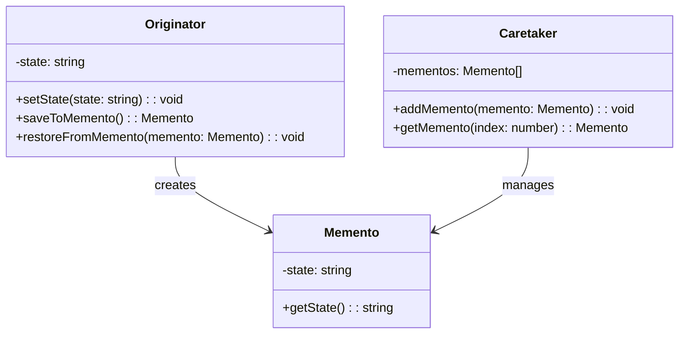

## 6.6 Memento Pattern

The Memento Pattern is a behavioral design pattern that allows you to capture and externalize an object's internal state without violating encapsulation, enabling the object to be restored to this state later. This pattern is particularly useful in implementing features like undo/redo functionality in applications.

### Understanding the Memento Pattern

The Memento Pattern is designed to solve the problem of restoring an object to a previous state without exposing its internal structure. This is achieved by creating a memento object that stores the state of the originator object. The pattern consists of three main components:

- **Memento**: This component stores the internal state of the Originator object. It is designed to be immutable and does not expose its contents to the outside world.
- **Originator**: This is the object whose state needs to be saved and restored. It creates a memento containing a snapshot of its current state and can use a memento to restore its state.
- **Caretaker**: This component manages the memento's lifecycle, such as saving and retrieving mementos, but does not access or modify the memento's content.

### Problem Solved by the Memento Pattern

The Memento Pattern is particularly useful in scenarios where an application needs to provide undo/redo functionality. By capturing the state of an object at various points in time, the application can revert to a previous state when needed. This is essential in applications like text editors, graphic design software, and any other software that requires state management.

### Key Components of the Memento Pattern

Let's delve deeper into the key components of the Memento Pattern and their roles:

#### Memento

The Memento is a simple object that stores the state of the Originator. It is designed to be immutable, meaning once it is created, its state cannot be changed. This ensures that the captured state remains consistent and reliable.

```typescript
// Memento class that stores the state of the Originator
class Memento {
  private readonly state: string;

  constructor(state: string) {
    this.state = state;
  }

  public getState(): string {
    return this.state;
  }
}
```

#### Originator

The Originator is the object whose state needs to be saved and restored. It is responsible for creating a memento that captures its current state and for restoring its state from a memento.

```typescript
// Originator class that creates and restores Mementos
class Originator {
  private state: string;

  public setState(state: string): void {
    console.log(`Originator: Setting state to ${state}`);
    this.state = state;
  }

  public saveToMemento(): Memento {
    console.log(`Originator: Saving to Memento.`);
    return new Memento(this.state);
  }

  public restoreFromMemento(memento: Memento): void {
    this.state = memento.getState();
    console.log(`Originator: State after restoring from Memento: ${this.state}`);
  }
}
```

#### Caretaker

The Caretaker is responsible for managing the mementos. It stores mementos and retrieves them when needed but does not modify the memento's content.

```typescript
// Caretaker class that manages Mementos
class Caretaker {
  private mementos: Memento[] = [];

  public addMemento(memento: Memento): void {
    this.mementos.push(memento);
  }

  public getMemento(index: number): Memento {
    return this.mementos[index];
  }
}
```

### Preserving Encapsulation

One of the key benefits of the Memento Pattern is that it preserves encapsulation. The internal state of the Originator is stored in the Memento, but the Memento does not expose this state to the outside world. This ensures that the Originator's internal state remains private and protected from external modification.

### Visualizing the Memento Pattern

To better understand the relationships between the components of the Memento Pattern, let's visualize it using a class diagram.



### Implementing the Memento Pattern in TypeScript

Let's see how the Memento Pattern can be implemented in TypeScript with a practical example. We'll create a simple text editor that allows users to type text and undo their changes.

```typescript
// Memento class
class TextMemento {
  private readonly text: string;

  constructor(text: string) {
    this.text = text;
  }

  public getText(): string {
    return this.text;
  }
}

// Originator class
class TextEditor {
  private text: string = '';

  public type(words: string): void {
    this.text += words;
  }

  public save(): TextMemento {
    return new TextMemento(this.text);
  }

  public restore(memento: TextMemento): void {
    this.text = memento.getText();
  }

  public getText(): string {
    return this.text;
  }
}

// Caretaker class
class EditorHistory {
  private history: TextMemento[] = [];

  public save(memento: TextMemento): void {
    this.history.push(memento);
  }

  public undo(): TextMemento | undefined {
    return this.history.pop();
  }
}

// Example usage
const editor = new TextEditor();
const history = new EditorHistory();

editor.type('Hello, ');
history.save(editor.save());

editor.type('World!');
history.save(editor.save());

console.log(`Current Text: ${editor.getText()}`); // Output: Hello, World!

editor.restore(history.undo()!);
console.log(`After Undo: ${editor.getText()}`); // Output: Hello, 

editor.restore(history.undo()!);
console.log(`After Undo: ${editor.getText()}`); // Output: 
```

In this example, the `TextEditor` class acts as the Originator, the `TextMemento` class is the Memento, and the `EditorHistory` class is the Caretaker. The text editor allows users to type text and save the state at different points. The history allows users to undo their changes by restoring the state from the mementos.

### Try It Yourself

To better understand the Memento Pattern, try modifying the code examples above. For instance, you can:

- Add a redo functionality to the text editor.
- Implement a more complex state in the Originator, such as text formatting.
- Experiment with different data types for the state stored in the Memento.

### Knowledge Check

Before we wrap up, let's review some key points about the Memento Pattern:

- The Memento Pattern allows you to capture and externalize an object's internal state without violating encapsulation.
- It is useful for implementing undo/redo functionality in applications.
- The pattern consists of three main components: Memento, Originator, and Caretaker.
- The Memento stores the state of the Originator but does not expose it to the outside world.
- The Caretaker manages the mementos but does not access their content.

### Conclusion

The Memento Pattern is a powerful tool for managing object state in applications. By capturing and restoring state, it enables features like undo/redo functionality while preserving encapsulation. As you continue to explore design patterns in TypeScript, remember that the Memento Pattern is just one of many tools available to help you write maintainable and scalable code.

## Quiz Time!



### What is the primary purpose of the Memento Pattern?

- [x] To capture and externalize an object's internal state without violating encapsulation.
- [ ] To provide a way to access elements of a collection sequentially.
- [ ] To define a one-to-many dependency between objects.
- [ ] To allow incompatible interfaces to work together.

> **Explanation:** The Memento Pattern is designed to capture and externalize an object's internal state without violating encapsulation, enabling the object to be restored to this state later.

### Which component of the Memento Pattern is responsible for storing the state of the Originator?

- [x] Memento
- [ ] Originator
- [ ] Caretaker
- [ ] Observer

> **Explanation:** The Memento component is responsible for storing the state of the Originator.

### What role does the Caretaker play in the Memento Pattern?

- [x] It manages the lifecycle of mementos but does not access their content.
- [ ] It creates and restores mementos.
- [ ] It stores the internal state of the Originator.
- [ ] It defines the interface for creating mementos.

> **Explanation:** The Caretaker manages the lifecycle of mementos, such as saving and retrieving them, but does not access or modify their content.

### How does the Memento Pattern preserve encapsulation?

- [x] By keeping the memento's state private and not exposing it to the outside world.
- [ ] By allowing direct access to the Originator's state.
- [ ] By using public methods to modify the memento's state.
- [ ] By storing the state in a global variable.

> **Explanation:** The Memento Pattern preserves encapsulation by keeping the memento's state private and not exposing it to the outside world.

### In the provided TypeScript example, which class acts as the Originator?

- [x] TextEditor
- [ ] TextMemento
- [ ] EditorHistory
- [ ] Caretaker

> **Explanation:** In the provided TypeScript example, the `TextEditor` class acts as the Originator.

### What is a common use case for the Memento Pattern?

- [x] Implementing undo/redo functionality in applications.
- [ ] Managing access to a complex subsystem.
- [ ] Decoupling an abstraction from its implementation.
- [ ] Providing a way to access elements of a collection sequentially.

> **Explanation:** A common use case for the Memento Pattern is implementing undo/redo functionality in applications.

### Which of the following is NOT a component of the Memento Pattern?

- [x] Observer
- [ ] Memento
- [ ] Originator
- [ ] Caretaker

> **Explanation:** The Observer is not a component of the Memento Pattern. The pattern consists of the Memento, Originator, and Caretaker components.

### What is the relationship between the Originator and the Memento in the Memento Pattern?

- [x] The Originator creates and restores Mementos.
- [ ] The Memento creates and restores Originators.
- [ ] The Caretaker creates and restores Mementos.
- [ ] The Memento manages the lifecycle of Originators.

> **Explanation:** In the Memento Pattern, the Originator creates and restores Mementos.

### True or False: The Memento Pattern exposes the internal state of the Originator to the outside world.

- [ ] True
- [x] False

> **Explanation:** False. The Memento Pattern does not expose the internal state of the Originator to the outside world, preserving encapsulation.

### Which pattern is particularly useful for implementing features like undo/redo functionality?

- [x] Memento Pattern
- [ ] Observer Pattern
- [ ] Adapter Pattern
- [ ] Strategy Pattern

> **Explanation:** The Memento Pattern is particularly useful for implementing features like undo/redo functionality.


