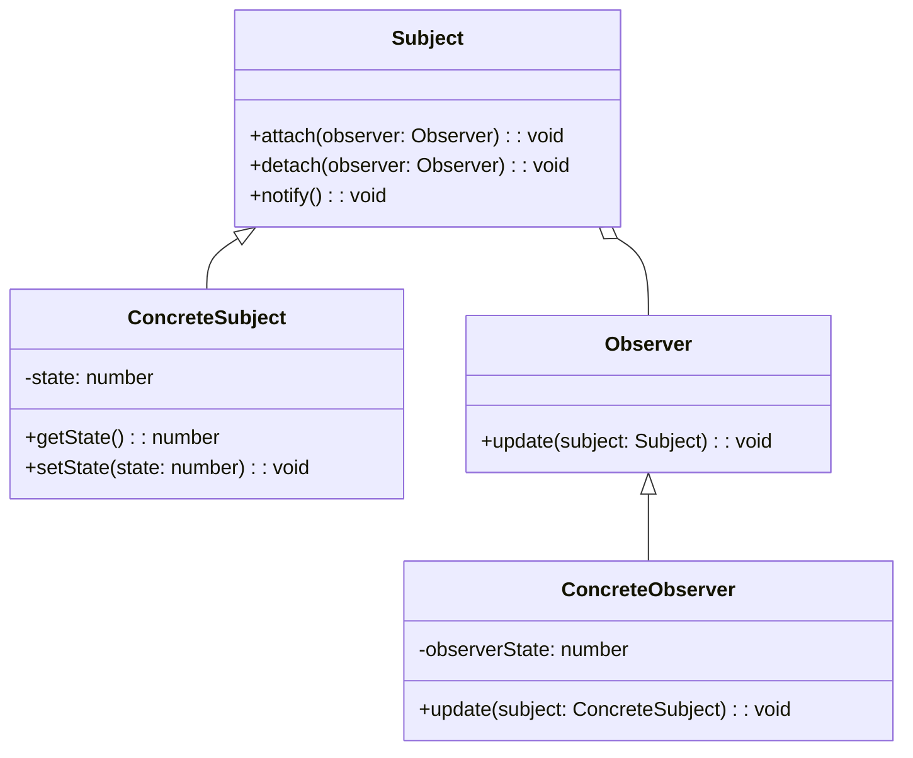

## 6.7.1 Implementing Observer in TypeScript

The Observer pattern is a fundamental behavioral design pattern that defines a one-to-many dependency between objects. When one object changes state, all its dependents are automatically notified and updated. This pattern is particularly useful in scenarios where an object needs to communicate changes to multiple other objects without being tightly coupled to them.

In this section, we'll explore how to implement the Observer pattern in TypeScript. We'll define the necessary interfaces and classes, and demonstrate how TypeScript's type system can help enforce contracts between subjects and observers.

### Understanding the Observer Pattern

Before diving into the implementation, let's break down the key components of the Observer pattern:

1. **Subject**: The subject is an object that holds a list of observers and provides methods to attach, detach, and notify them. It maintains the state that observers are interested in.

2. **Observer**: An observer is an object that gets notified when the subject's state changes. It defines an `update` method that the subject calls to notify the observer of changes.

3. **ConcreteSubject**: This is a specific implementation of the subject. It maintains the state of interest to observers and notifies them when changes occur.

4. **ConcreteObserver**: This is a specific implementation of an observer. It updates its state to reflect changes in the subject.

### Implementing the Observer Pattern in TypeScript

Let's start by defining the `Observer` interface. This interface will declare the `update` method that all observers must implement.

```typescript
// Observer.ts
export interface Observer {
  update(subject: Subject): void;
}
```

The `update` method takes a `Subject` as a parameter, allowing observers to query the subject for its current state.

Next, we'll define the `Subject` class. This class will manage the list of observers and provide methods to attach, detach, and notify them.

```typescript
// Subject.ts
import { Observer } from './Observer';

export class Subject {
  private observers: Observer[] = [];

  public attach(observer: Observer): void {
    const isExist = this.observers.includes(observer);
    if (isExist) {
      return console.log('Observer has been attached already.');
    }
    console.log('Attached an observer.');
    this.observers.push(observer);
  }

  public detach(observer: Observer): void {
    const observerIndex = this.observers.indexOf(observer);
    if (observerIndex === -1) {
      return console.log('Nonexistent observer.');
    }
    this.observers.splice(observerIndex, 1);
    console.log('Detached an observer.');
  }

  public notify(): void {
    console.log('Notifying observers...');
    for (const observer of this.observers) {
      observer.update(this);
    }
  }
}
```

In the `Subject` class, we maintain a private list of observers. The `attach` method adds an observer to the list, while the `detach` method removes it. The `notify` method iterates over the list of observers and calls their `update` method.

Now, let's implement the `ConcreteSubject` class. This class will extend `Subject` and maintain the state that observers are interested in.

```typescript
// ConcreteSubject.ts
import { Subject } from './Subject';

export class ConcreteSubject extends Subject {
  private state: number;

  public getState(): number {
    return this.state;
  }

  public setState(state: number): void {
    this.state = state;
    this.notify();
  }
}
```

The `ConcreteSubject` class maintains a `state` property. When the state changes, it calls the `notify` method to update all observers.

Next, we'll implement the `ConcreteObserver` class. This class will implement the `Observer` interface and update its state based on the subject's state.

```typescript
// ConcreteObserver.ts
import { Observer } from './Observer';
import { ConcreteSubject } from './ConcreteSubject';

export class ConcreteObserver implements Observer {
  private observerState: number;

  public update(subject: ConcreteSubject): void {
    if (subject instanceof ConcreteSubject) {
      this.observerState = subject.getState();
      console.log(`Observer state updated to: ${this.observerState}`);
    }
  }
}
```

In the `ConcreteObserver` class, we implement the `update` method. This method checks if the subject is an instance of `ConcreteSubject` and updates the observer's state accordingly.

### Managing the List of Observers

Managing the list of observers is crucial to ensure that they are notified appropriately. In our implementation, we use an array to store observers. The `attach` method checks if an observer is already in the list before adding it, preventing duplicates. The `detach` method removes an observer if it exists in the list.

### TypeScript's Role in Enforcing Contracts

TypeScript's type system plays a significant role in enforcing contracts between subjects and observers. By defining interfaces and using TypeScript's type checking, we ensure that all observers implement the `update` method. This guarantees that the `notify` method can safely call `update` on each observer.

### Try It Yourself

Now that we've covered the implementation, let's encourage you to experiment with the code. Try modifying the `ConcreteSubject` class to maintain a different type of state, such as a string or an object. Update the `ConcreteObserver` class to handle the new state type and observe how the pattern adapts to different scenarios.

### Visualizing the Observer Pattern

To better understand the relationships between the components of the Observer pattern, let's visualize it using a class diagram.



In this diagram, we see that `ConcreteSubject` extends `Subject`, and `ConcreteObserver` implements `Observer`. The `Subject` class maintains a relationship with `Observer`, indicating that it manages a list of observers.

### Knowledge Check

Let's pause for a moment and reflect on what we've learned. Consider the following questions:

- How does the Observer pattern help decouple objects in a system?
- What role does TypeScript's type system play in implementing the Observer pattern?
- How can you modify the Observer pattern to handle different types of state?

### Summary

In this section, we've explored the implementation of the Observer pattern in TypeScript. We've defined the necessary interfaces and classes, and demonstrated how TypeScript's type system aids in enforcing contracts between subjects and observers. By managing the list of observers and using TypeScript's type checking, we ensure that our implementation is robust and maintainable.

Remember, this is just the beginning. As you progress, you'll find more opportunities to apply the Observer pattern in your projects. Keep experimenting, stay curious, and enjoy the journey!

## Quiz Time!



### What is the primary purpose of the Observer pattern?

- [x] To define a one-to-many dependency between objects
- [ ] To encapsulate a request as an object
- [ ] To provide a simplified interface to a complex subsystem
- [ ] To compose objects into tree structures

> **Explanation:** The Observer pattern defines a one-to-many dependency between objects, allowing them to be notified of changes in another object.

### Which method in the `Subject` class is responsible for notifying observers?

- [ ] attach
- [ ] detach
- [x] notify
- [ ] update

> **Explanation:** The `notify` method in the `Subject` class is responsible for iterating over the list of observers and calling their `update` method.

### What does the `update` method in the `Observer` interface do?

- [ ] It adds an observer to the list.
- [ ] It removes an observer from the list.
- [x] It updates the observer based on the subject's state.
- [ ] It changes the subject's state.

> **Explanation:** The `update` method in the `Observer` interface is called by the subject to notify the observer of changes, allowing the observer to update its state.

### How does TypeScript's type system help in implementing the Observer pattern?

- [x] By enforcing contracts between subjects and observers
- [ ] By providing default implementations for methods
- [ ] By automatically notifying observers
- [ ] By preventing state changes in subjects

> **Explanation:** TypeScript's type system enforces contracts between subjects and observers by ensuring that all observers implement the `update` method.

### What is the role of the `ConcreteSubject` class in the Observer pattern?

- [ ] To define the `update` method
- [x] To maintain state and notify observers upon changes
- [ ] To provide a simplified interface to a complex subsystem
- [ ] To encapsulate a request as an object

> **Explanation:** The `ConcreteSubject` class maintains the state of interest to observers and notifies them when changes occur.

### How can you prevent duplicate observers in the `Subject` class?

- [ ] By using a set instead of an array
- [x] By checking if an observer is already in the list before adding it
- [ ] By removing all observers before adding a new one
- [ ] By using a map to store observers

> **Explanation:** The `attach` method checks if an observer is already in the list before adding it, preventing duplicates.

### What is the relationship between `ConcreteSubject` and `Subject` in the class diagram?

- [x] `ConcreteSubject` extends `Subject`
- [ ] `ConcreteSubject` implements `Subject`
- [ ] `ConcreteSubject` is an instance of `Subject`
- [ ] `ConcreteSubject` is unrelated to `Subject`

> **Explanation:** In the class diagram, `ConcreteSubject` extends `Subject`, indicating that it is a specific implementation of the subject.

### Which of the following is NOT a component of the Observer pattern?

- [ ] Subject
- [ ] Observer
- [x] Command
- [ ] ConcreteObserver

> **Explanation:** The Command pattern is a separate design pattern and is not a component of the Observer pattern.

### What happens when the state of a `ConcreteSubject` changes?

- [ ] Observers are detached.
- [x] Observers are notified.
- [ ] The subject is destroyed.
- [ ] The state is reset to its default value.

> **Explanation:** When the state of a `ConcreteSubject` changes, it calls the `notify` method to update all observers.

### True or False: The Observer pattern is useful for tightly coupling objects.

- [ ] True
- [x] False

> **Explanation:** The Observer pattern is useful for decoupling objects, allowing them to communicate without being tightly coupled.


