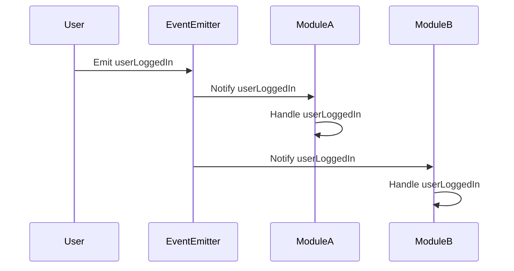

## 6.7.2 Event Handling

In the realm of software engineering, event handling is a crucial aspect of creating responsive and interactive applications. The Observer Pattern serves as the backbone for many event handling systems, allowing objects to subscribe to and receive notifications about changes in other objects. This section delves into the implementation of event handling mechanisms using the Observer Pattern in TypeScript, with practical examples using Node.js `EventEmitter` and custom event listeners.

### Understanding the Observer Pattern

The Observer Pattern is a behavioral design pattern that defines a one-to-many dependency between objects. When one object changes state, all its dependents (observers) are notified and updated automatically. This pattern is particularly useful in event-driven systems where changes in one part of the system need to be propagated to other parts.

#### Key Concepts of the Observer Pattern

- **Subject**: The object that holds the state and notifies observers of changes.
- **Observer**: The object that needs to be informed about changes in the subject.
- **Event**: The change or action that triggers notifications to observers.

### Event Handling in Node.js with EventEmitter

Node.js provides a built-in module called `events` that implements the Observer Pattern through the `EventEmitter` class. This class allows you to create, manage, and handle events efficiently.

#### Using Node.js EventEmitter

Let's explore how to use the `EventEmitter` class to manage events and listeners in a Node.js application.

```typescript
import { EventEmitter } from 'events';

// Create an instance of EventEmitter
const eventEmitter = new EventEmitter();

// Define an event listener
eventEmitter.on('greet', (name: string) => {
  console.log(`Hello, ${name}!`);
});

// Emit the event
eventEmitter.emit('greet', 'Alice');
```

**Explanation**: In this example, we create an instance of `EventEmitter` and define a listener for the `greet` event. When the event is emitted with a name, the listener is triggered, and a greeting message is logged to the console.

#### Creating Custom Events and Listeners

You can create custom events and listeners to suit your application's needs. Here's how you can define and handle custom events in TypeScript.

```typescript
class CustomEmitter extends EventEmitter {
  triggerCustomEvent(data: string) {
    this.emit('customEvent', data);
  }
}

const customEmitter = new CustomEmitter();

// Add a listener for the custom event
customEmitter.on('customEvent', (data: string) => {
  console.log(`Custom event received with data: ${data}`);
});

// Trigger the custom event
customEmitter.triggerCustomEvent('Sample Data');
```

**Explanation**: We extend the `EventEmitter` class to create a `CustomEmitter` that can trigger a `customEvent`. A listener is added to handle this event and log the received data.

### Building Scalable Event-Driven Architectures

The Observer Pattern is instrumental in building scalable event-driven architectures. By decoupling event producers and consumers, you can create systems that are more modular and easier to maintain.

#### Leveraging the Observer Pattern

Consider a scenario where you have multiple modules in an application that need to respond to user actions. Using the Observer Pattern, you can centralize event management and ensure that all modules receive the necessary updates.

```typescript
class UserActionEmitter extends EventEmitter {
  userLoggedIn(userId: string) {
    this.emit('userLoggedIn', userId);
  }

  userLoggedOut(userId: string) {
    this.emit('userLoggedOut', userId);
  }
}

const userActionEmitter = new UserActionEmitter();

// Module A listens for user login events
userActionEmitter.on('userLoggedIn', (userId: string) => {
  console.log(`Module A: User ${userId} logged in.`);
});

// Module B listens for user logout events
userActionEmitter.on('userLoggedOut', (userId: string) => {
  console.log(`Module B: User ${userId} logged out.`);
});

// Simulate user actions
userActionEmitter.userLoggedIn('123');
userActionEmitter.userLoggedOut('123');
```

**Explanation**: In this example, `UserActionEmitter` is used to manage user login and logout events. Different modules can listen to these events and respond accordingly, promoting a clean separation of concerns.

### Memory Management and Preventing Memory Leaks

Event handling systems must be designed with memory management in mind to prevent memory leaks. One common issue is failing to remove event listeners when they are no longer needed.

#### Detaching Observers

To avoid memory leaks, ensure that observers are properly detached when they are no longer required.

```typescript
const handleEvent = (data: string) => {
  console.log(`Handling event with data: ${data}`);
};

// Add the listener
eventEmitter.on('dataEvent', handleEvent);

// Remove the listener when it's no longer needed
eventEmitter.off('dataEvent', handleEvent);
```

**Explanation**: We add a listener for the `dataEvent` and later remove it using the `off` method. This practice helps prevent memory leaks by ensuring that unused listeners are detached.

### Try It Yourself

To deepen your understanding, try modifying the examples above. For instance, create a custom event emitter that handles multiple types of events, or experiment with adding and removing listeners dynamically.

### Visualizing Event Handling

To better understand the flow of events and listeners, let's visualize the interaction using a sequence diagram.



**Description**: This diagram illustrates the sequence of events when a user logs in. The `EventEmitter` notifies both `ModuleA` and `ModuleB`, which handle the `userLoggedIn` event.

### References and Further Reading

- [Node.js EventEmitter Documentation](https://nodejs.org/api/events.html)
- [MDN Web Docs: EventTarget](https://developer.mozilla.org/en-US/docs/Web/API/EventTarget)

### Knowledge Check

- What is the primary role of the Observer Pattern in event handling?
- How can you prevent memory leaks in an event-driven system?
- What are the benefits of using custom events in your application?

### Embrace the Journey

Remember, mastering event handling and the Observer Pattern is a journey. As you progress, you'll build more complex and interactive applications. Keep experimenting, stay curious, and enjoy the journey!

## Quiz Time!



### What is the primary role of the Observer Pattern in event handling?

- [x] To define a one-to-many dependency between objects
- [ ] To encapsulate object creation
- [ ] To provide a simplified interface to a complex subsystem
- [ ] To allow incompatible interfaces to work together

> **Explanation:** The Observer Pattern defines a one-to-many dependency between objects, allowing changes in one object to be notified to all its dependents.

### Which Node.js class implements the Observer Pattern for event handling?

- [x] EventEmitter
- [ ] EventTarget
- [ ] EventDispatcher
- [ ] EventManager

> **Explanation:** The `EventEmitter` class in Node.js implements the Observer Pattern for managing events and listeners.

### How can you prevent memory leaks in an event-driven system?

- [x] By removing event listeners when they are no longer needed
- [ ] By increasing the number of listeners
- [ ] By using global variables for event management
- [ ] By avoiding the use of custom events

> **Explanation:** Removing event listeners when they are no longer needed helps prevent memory leaks in an event-driven system.

### What is a custom event in the context of event handling?

- [x] An event defined by the developer to suit specific application needs
- [ ] An event that is built into the JavaScript language
- [ ] An event that cannot be removed once added
- [ ] An event that automatically triggers on page load

> **Explanation:** A custom event is defined by the developer to suit specific application needs, allowing for tailored event handling.

### Which method is used to remove an event listener in Node.js?

- [x] off
- [ ] removeListener
- [ ] detach
- [ ] unbind

> **Explanation:** The `off` method is used to remove an event listener in Node.js, helping to manage memory effectively.

### True or False: The Observer Pattern can be used to build scalable event-driven architectures.

- [x] True
- [ ] False

> **Explanation:** The Observer Pattern is instrumental in building scalable event-driven architectures by decoupling event producers and consumers.

### What is the purpose of the `emit` method in Node.js EventEmitter?

- [x] To trigger an event and notify all listeners
- [ ] To add a new listener for an event
- [ ] To remove a listener from an event
- [ ] To log event data to the console

> **Explanation:** The `emit` method is used to trigger an event and notify all listeners that are registered for that event.

### Which of the following is a benefit of using the Observer Pattern?

- [x] It promotes a clean separation of concerns
- [ ] It reduces the number of classes in a system
- [ ] It simplifies object creation
- [ ] It eliminates the need for event listeners

> **Explanation:** The Observer Pattern promotes a clean separation of concerns by decoupling event producers and consumers.

### What is the role of a Subject in the Observer Pattern?

- [x] To hold the state and notify observers of changes
- [ ] To listen for changes in other objects
- [ ] To encapsulate object creation
- [ ] To provide a simplified interface to a complex subsystem

> **Explanation:** The Subject holds the state and is responsible for notifying observers of any changes.

### True or False: Custom events can only be used in Node.js applications.

- [ ] True
- [x] False

> **Explanation:** Custom events can be used in both Node.js and browser-based applications to handle specific application needs.


