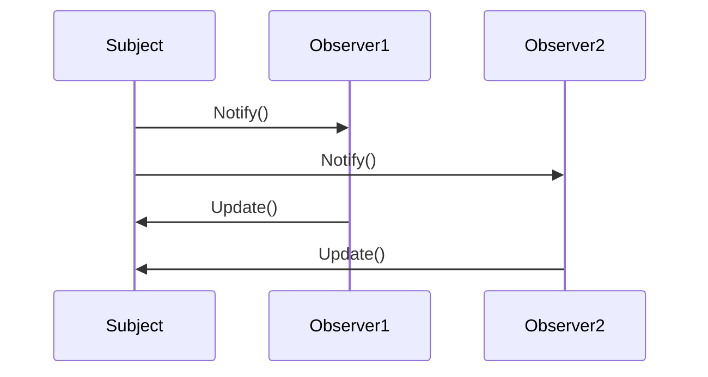

## 6.7.3 Use Cases and Examples

The Observer Pattern is a cornerstone in software design, especially when it comes to creating responsive and decoupled systems. In this section, we will delve into practical scenarios where the Observer Pattern is effectively applied. We'll explore its application in updating UI components, implementing real-time data feeds, and building reactive programming models. By understanding these use cases, you'll gain insights into how the Observer Pattern facilitates responsiveness, scalability, and maintainability in software systems.

### Understanding the Observer Pattern

Before diving into the use cases, let's briefly revisit the core concept of the Observer Pattern. The Observer Pattern defines a one-to-many dependency between objects, allowing one object (the subject) to notify multiple observer objects about changes in its state. This pattern is particularly useful for implementing distributed event-handling systems.

#### Key Components of the Observer Pattern

1. **Subject**: The object that holds the state and notifies observers of changes.
2. **Observer**: The objects that need to be informed about changes in the subject.
3. **ConcreteSubject**: A concrete implementation of the subject.
4. **ConcreteObserver**: A concrete implementation of the observer.

### Use Case 1: Updating UI Components in MVC Architecture

In a Model-View-Controller (MVC) architecture, the Observer Pattern plays a crucial role in keeping the user interface (View) synchronized with the underlying data (Model). Let's explore how this works in practice.

#### Scenario: Real-Time Stock Price Updates

Imagine a stock trading application where users can view real-time stock prices. The stock prices are constantly changing, and the UI needs to reflect these changes immediately.

**Implementation Steps**:

1. **Define the Subject**: The stock price model acts as the subject. It maintains the current stock prices and notifies observers whenever a price update occurs.

2. **Define the Observer**: The UI components that display stock prices act as observers. They register themselves with the stock price model to receive updates.

3. **Notify Observers**: Whenever the stock price model receives new data, it notifies all registered observers, prompting them to update the displayed prices.

Here's a simplified TypeScript implementation:

```typescript
// Subject interface
interface StockPriceSubject {
    registerObserver(observer: StockPriceObserver): void;
    removeObserver(observer: StockPriceObserver): void;
    notifyObservers(): void;
}

// Observer interface
interface StockPriceObserver {
    update(price: number): void;
}

// Concrete Subject
class StockPriceModel implements StockPriceSubject {
    private observers: StockPriceObserver[] = [];
    private price: number = 0;

    registerObserver(observer: StockPriceObserver): void {
        this.observers.push(observer);
    }

    removeObserver(observer: StockPriceObserver): void {
        this.observers = this.observers.filter(obs => obs !== observer);
    }

    notifyObservers(): void {
        for (const observer of this.observers) {
            observer.update(this.price);
        }
    }

    setPrice(price: number): void {
        this.price = price;
        this.notifyObservers();
    }
}

// Concrete Observer
class StockPriceDisplay implements StockPriceObserver {
    update(price: number): void {
        console.log(`Stock Price Updated: ${price}`);
    }
}

// Usage
const stockPriceModel = new StockPriceModel();
const display1 = new StockPriceDisplay();
const display2 = new StockPriceDisplay();

stockPriceModel.registerObserver(display1);
stockPriceModel.registerObserver(display2);

// Simulate price update
stockPriceModel.setPrice(100);
```

#### Benefits

- **Decoupling**: The UI components are decoupled from the data model, allowing for independent development and testing.
- **Scalability**: New observers can be added without modifying the existing codebase.
- **Maintainability**: Changes to the data model do not require changes to the observer logic.

### Use Case 2: Implementing Real-Time Data Feeds

Real-time data feeds are essential in applications such as financial trading platforms, monitoring systems, and social media feeds. The Observer Pattern is ideal for handling these scenarios.

#### Scenario: Real-Time Weather Monitoring

Consider a weather monitoring application that provides real-time updates on weather conditions. Users can subscribe to receive updates on temperature, humidity, and wind speed.

**Implementation Steps**:

1. **Define the Subject**: The weather data provider acts as the subject, broadcasting updates to all registered observers.

2. **Define the Observer**: The observer could be a dashboard or a mobile app that displays the weather information.

3. **Notify Observers**: As new weather data is received, the subject notifies all observers, ensuring they display the latest information.

Here's a TypeScript example:

```typescript
// Subject interface
interface WeatherDataSubject {
    registerObserver(observer: WeatherDataObserver): void;
    removeObserver(observer: WeatherDataObserver): void;
    notifyObservers(): void;
}

// Observer interface
interface WeatherDataObserver {
    update(temperature: number, humidity: number, windSpeed: number): void;
}

// Concrete Subject
class WeatherDataProvider implements WeatherDataSubject {
    private observers: WeatherDataObserver[] = [];
    private temperature: number = 0;
    private humidity: number = 0;
    private windSpeed: number = 0;

    registerObserver(observer: WeatherDataObserver): void {
        this.observers.push(observer);
    }

    removeObserver(observer: WeatherDataObserver): void {
        this.observers = this.observers.filter(obs => obs !== observer);
    }

    notifyObservers(): void {
        for (const observer of this.observers) {
            observer.update(this.temperature, this.humidity, this.windSpeed);
        }
    }

    setWeatherData(temperature: number, humidity: number, windSpeed: number): void {
        this.temperature = temperature;
        this.humidity = humidity;
        this.windSpeed = windSpeed;
        this.notifyObservers();
    }
}

// Concrete Observer
class WeatherDashboard implements WeatherDataObserver {
    update(temperature: number, humidity: number, windSpeed: number): void {
        console.log(`Weather Update - Temperature: ${temperature}, Humidity: ${humidity}, Wind Speed: ${windSpeed}`);
    }
}

// Usage
const weatherProvider = new WeatherDataProvider();
const dashboard = new WeatherDashboard();

weatherProvider.registerObserver(dashboard);

// Simulate weather data update
weatherProvider.setWeatherData(25, 65, 10);
```

#### Benefits

- **Real-Time Updates**: Observers receive updates as soon as new data is available, ensuring timely information delivery.
- **Flexibility**: Observers can be added or removed dynamically, allowing for flexible system configurations.
- **Decoupling**: The data provider and observers are loosely coupled, facilitating independent development.

### Use Case 3: Building Reactive Programming Models

Reactive programming models are designed to automatically propagate changes through a system. The Observer Pattern is a natural fit for such models, enabling efficient state synchronization.

#### Scenario: Reactive Data Binding in Web Applications

In modern web applications, reactive data binding allows UI components to automatically update in response to changes in the underlying data model. This is commonly used in frameworks like Angular and React.

**Implementation Steps**:

1. **Define the Subject**: The data model acts as the subject, holding the state and notifying observers of changes.

2. **Define the Observer**: The UI components act as observers, updating their display based on the current state of the data model.

3. **Notify Observers**: When the data model changes, it notifies all observers, triggering UI updates.

Here's a TypeScript example using a simplified reactive model:

```typescript
// Subject interface
interface ReactiveModelSubject {
    registerObserver(observer: ReactiveModelObserver): void;
    removeObserver(observer: ReactiveModelObserver): void;
    notifyObservers(): void;
}

// Observer interface
interface ReactiveModelObserver {
    update(data: any): void;
}

// Concrete Subject
class ReactiveModel implements ReactiveModelSubject {
    private observers: ReactiveModelObserver[] = [];
    private data: any = {};

    registerObserver(observer: ReactiveModelObserver): void {
        this.observers.push(observer);
    }

    removeObserver(observer: ReactiveModelObserver): void {
        this.observers = this.observers.filter(obs => obs !== observer);
    }

    notifyObservers(): void {
        for (const observer of this.observers) {
            observer.update(this.data);
        }
    }

    setData(data: any): void {
        this.data = data;
        this.notifyObservers();
    }
}

// Concrete Observer
class ReactiveComponent implements ReactiveModelObserver {
    update(data: any): void {
        console.log(`Component Updated with Data: ${JSON.stringify(data)}`);
    }
}

// Usage
const reactiveModel = new ReactiveModel();
const component = new ReactiveComponent();

reactiveModel.registerObserver(component);

// Simulate data change
reactiveModel.setData({ key: 'value' });
```

#### Benefits

- **Automatic Propagation**: Changes in the data model automatically propagate to all observers, reducing the need for manual updates.
- **Decoupling**: The data model and UI components are decoupled, promoting modular design.
- **Scalability**: The system can easily scale by adding more observers without modifying the core logic.

### Visualizing the Observer Pattern

To better understand the flow of the Observer Pattern, let's visualize the interaction between the subject and observers using a sequence diagram.



**Diagram Description**: This sequence diagram illustrates the notification process in the Observer Pattern. The subject notifies each observer, which then updates itself based on the received information.

### Encouraging the Use of the Observer Pattern

When designing systems that require state synchronization across components, consider the Observer Pattern for its ability to:

- **Enhance Responsiveness**: By automatically propagating changes, the Observer Pattern ensures that all parts of the system remain in sync.
- **Improve Scalability**: The pattern allows for easy addition of new observers, making it suitable for growing systems.
- **Facilitate Decoupling**: By decoupling the subject from its observers, the pattern promotes modularity and maintainability.

### Try It Yourself

To deepen your understanding of the Observer Pattern, try modifying the provided examples:

- **Experiment with Different Data Types**: Change the data types in the examples to see how the pattern handles various data structures.
- **Add More Observers**: Implement additional observers to observe how the system scales.
- **Implement Unregistering**: Extend the examples to allow observers to unregister themselves from the subject.

### References and Further Reading

- [MDN Web Docs: Observer Pattern](https://developer.mozilla.org/en-US/docs/Web/JavaScript/Guide/Design_Patterns#observer_pattern)
- [W3Schools: JavaScript Design Patterns](https://www.w3schools.com/js/js_design_patterns.asp)
- [Refactoring Guru: Observer Pattern](https://refactoring.guru/design-patterns/observer)

### Knowledge Check

- **Question**: How does the Observer Pattern facilitate decoupling in software design?
- **Exercise**: Implement a simple chat application using the Observer Pattern to handle message updates.

### Embrace the Journey

Remember, mastering design patterns is a journey. As you explore the Observer Pattern, you'll discover its versatility and power in creating responsive, scalable, and maintainable systems. Keep experimenting, stay curious, and enjoy the process of learning and applying these patterns in your projects.

## Quiz Time!



### What is the primary role of the Observer Pattern in software design?

- [x] To define a one-to-many dependency between objects
- [ ] To encapsulate a request as an object
- [ ] To provide a simplified interface to a complex subsystem
- [ ] To decouple an abstraction from its implementation

> **Explanation:** The Observer Pattern defines a one-to-many dependency between objects, allowing one object to notify multiple observers of changes in its state.

### In an MVC architecture, what component typically acts as the subject in the Observer Pattern?

- [x] Model
- [ ] View
- [ ] Controller
- [ ] Router

> **Explanation:** In MVC architecture, the Model acts as the subject, notifying the View (observers) of any changes in the data.

### How does the Observer Pattern enhance scalability?

- [x] By allowing new observers to be added without modifying existing code
- [ ] By reducing the number of classes in the system
- [ ] By minimizing memory usage
- [ ] By simplifying the user interface

> **Explanation:** The Observer Pattern enhances scalability by enabling new observers to be added without altering the existing codebase, allowing the system to grow easily.

### What is a key benefit of using the Observer Pattern in real-time data feeds?

- [x] Real-time updates to observers
- [ ] Simplified data storage
- [ ] Reduced network traffic
- [ ] Enhanced security

> **Explanation:** The Observer Pattern ensures that observers receive real-time updates as soon as new data is available, making it ideal for real-time data feeds.

### Which of the following is NOT a benefit of the Observer Pattern?

- [ ] Decoupling components
- [ ] Enhancing responsiveness
- [ ] Improving scalability
- [x] Reducing code complexity

> **Explanation:** While the Observer Pattern offers many benefits, it can sometimes increase code complexity due to the need to manage multiple observers and notifications.

### In the Observer Pattern, what is the role of the ConcreteObserver?

- [x] To update its state based on changes in the subject
- [ ] To manage the list of observers
- [ ] To encapsulate the core logic of the application
- [ ] To provide a user interface

> **Explanation:** The ConcreteObserver updates its state based on notifications received from the subject, reflecting changes in the subject's state.

### How does the Observer Pattern facilitate decoupling between components?

- [x] By allowing subjects and observers to interact without knowing each other's details
- [ ] By reducing the number of classes in the system
- [ ] By minimizing memory usage
- [ ] By simplifying the user interface

> **Explanation:** The Observer Pattern facilitates decoupling by enabling subjects and observers to communicate without requiring detailed knowledge of each other's implementation.

### What is a common use case for the Observer Pattern in web applications?

- [x] Reactive data binding
- [ ] Data encryption
- [ ] User authentication
- [ ] File compression

> **Explanation:** Reactive data binding in web applications is a common use case for the Observer Pattern, allowing UI components to automatically update in response to changes in the data model.

### In the provided TypeScript example, what method is used to notify observers of changes?

- [x] notifyObservers()
- [ ] updateObservers()
- [ ] refreshObservers()
- [ ] alertObservers()

> **Explanation:** The `notifyObservers()` method is used to inform all registered observers of changes in the subject's state.

### True or False: The Observer Pattern is only suitable for small-scale applications.

- [ ] True
- [x] False

> **Explanation:** False. The Observer Pattern is suitable for both small-scale and large-scale applications, as it enhances scalability and maintainability by decoupling components.


